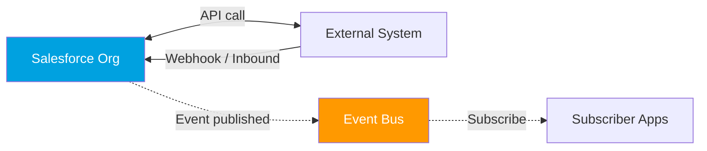
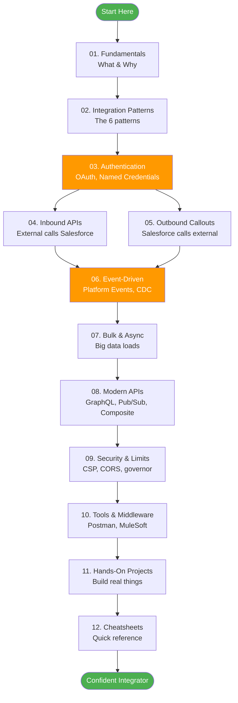
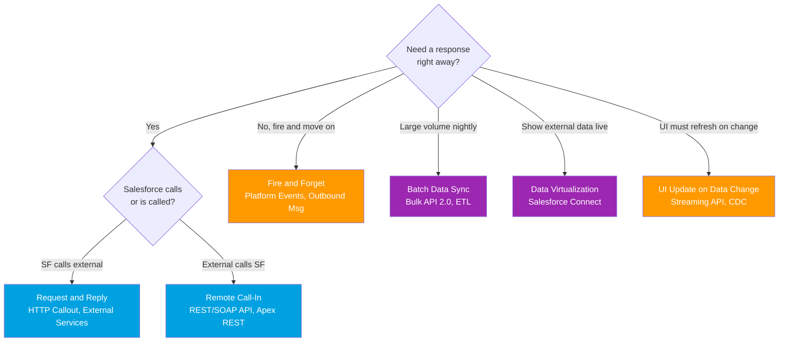
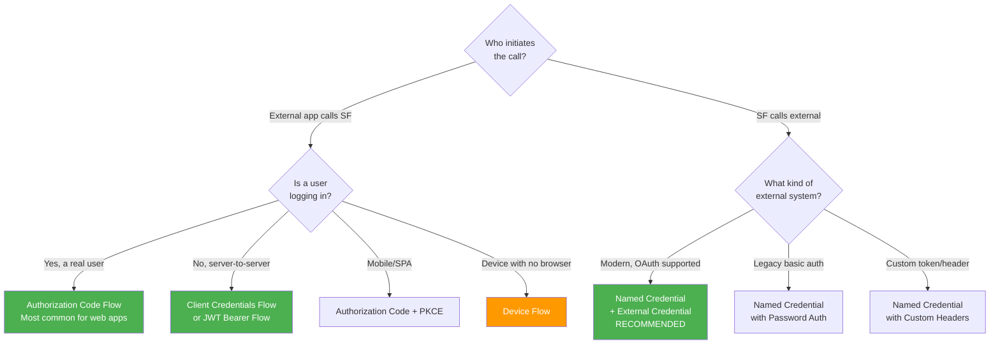
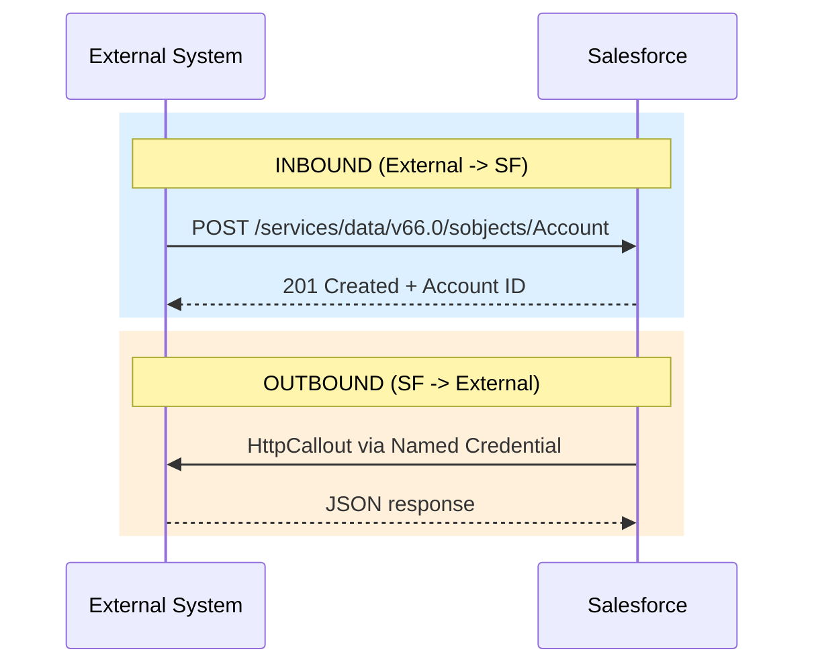
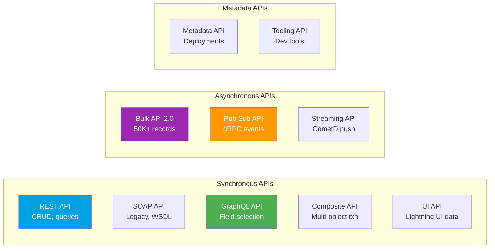
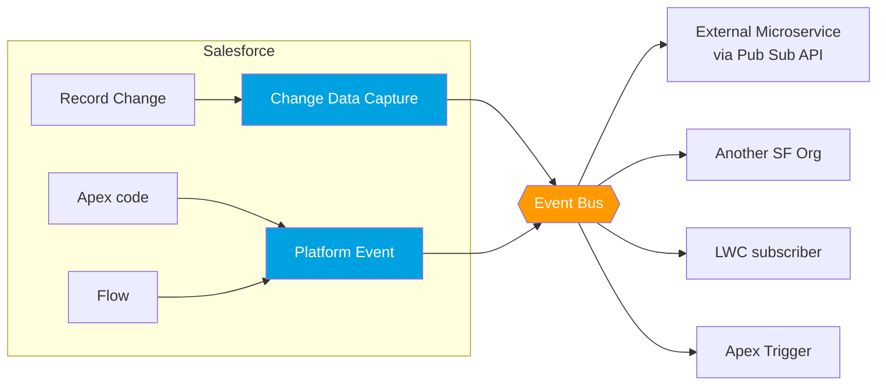

# Salesforce Integration: Learning Roadmap (Spring '26)

**Goal**: Learn Salesforce Integration from zero to confident. Visual-first, no jargon dumps.
**Approach**: Walk through folders `01` to `13` in order. Each module is a small, focused topic.
**API version reference**: v66.0 (Spring '26).

> ✅ **Vault complete (June 2026)** — all **13 modules** are fully built: ~114 topic files, each module with a README index and a self-contained **HTML handbook** (renders every diagram; open in a browser, or Print → Save as PDF). Jump to any module from the [Module Handbooks](#module-handbooks-all-complete) table below, or open the single [**Complete Vault Handbook**](Salesforce-Integration-COMPLETE-Handbook.html) for everything in one file.

---

## The Big Picture (Read This First)

Integration just means **two systems talking to each other**. Salesforce is one system. The "other" can be SAP, a payment gateway, a custom website, another Salesforce org, etc.

Three core questions every integration must answer:

1. **Who is talking?** (Salesforce -> outside, or outside -> Salesforce, or both)
2. **How do they prove identity?** (Authentication)
3. **What style of conversation?** (Pattern + API)



---

## Learning Roadmap (Recommended Order)



---

## The 6 Integration Patterns (Spring '26 Official)

Pick a pattern based on **what you need**: real-time? batch? one-way? two-way?



| Pattern | Direction | Sync/Async | Real-world Example |
|---|---|---|---|
| **Request & Reply** | SF -> External | Sync | Get credit score from a bank API |
| **Fire & Forget** | SF -> External | Async | Notify ERP that order was placed |
| **Batch Data Sync** | Both ways | Async, scheduled | Nightly sync of all Accounts |
| **Remote Call-In** | External -> SF | Sync/Async | Website creates Lead in SF |
| **Data Virtualization** | SF reads External | Real-time | Show SAP invoices in SF without copying |
| **UI Update on Change** | SF -> Subscribers | Async push | LWC refreshes when record changes |

---

## Authentication Flow Picker

This is **the most confusing area** for beginners. Use this tree:



**Rule of thumb**: For outbound, **always use Named Credentials**. Never hardcode passwords or tokens in Apex.

---

## Inbound vs Outbound (Visual)



---

## Salesforce API Landscape (Pick the Right Tool)



**When to use what**:

- Single record or small query: **REST API**
- 50,000+ records at once: **Bulk API 2.0**
- Need only specific fields, complex nested data: **GraphQL API**
- Real-time event streaming, low latency: **Pub/Sub API** (replaces Streaming API for new builds)
- Multi-step atomic transaction: **Composite API**
- Building external Lightning-like UI: **UI API**
- CI/CD, deployments: **Metadata API**

---

## Event-Driven Integration (Modern Way)



| Mechanism | What it is | When to use |
|---|---|---|
| **Platform Events** | Custom events you define and publish | You want to **announce a business event** (e.g., "OrderShipped") |
| **Change Data Capture (CDC)** | Auto-generated event when ANY record changes | You want to **mirror data** to another system |
| **Outbound Messages** | Workflow/Flow sends SOAP XML to a URL | Legacy. Avoid for new builds. Use Platform Events |
| **Streaming API (PushTopic)** | Legacy SOQL-based push | Legacy. Use CDC or Pub/Sub |

---

## Folder Structure (What's In This Repo)

```
Salesforce-Integration-Learning/
├── 00-START-HERE.md              <- you are here
├── 01-Fundamentals/              <- vocab, mental model
├── 02-Integration-Patterns/      <- the 6 patterns deep dives
├── 03-Authentication/            <- OAuth flows, Named Credentials
├── 04-Inbound-APIs/              <- REST, SOAP, Apex REST, Apex SOAP
├── 05-Outbound-Callouts/         <- HttpRequest, External Services
├── 06-Event-Driven/              <- Platform Events, CDC, Pub/Sub
├── 07-Bulk-Async/                <- Bulk API 2.0, Batch Apex
├── 08-Modern-APIs/               <- GraphQL, Composite, UI API
├── 09-Security-Limits/           <- CSP, CORS, mTLS, governor limits
├── 10-Tools-Middleware/          <- Postman, Workbench, MuleSoft
├── 11-Hands-On-Projects/         <- 12 end-to-end builds
├── 12-Cheatsheets/               <- 10 one-page references
└── 13-Whats-New-2026/            <- retirements, Agentforce/MCP, MuleSoft
```

Each folder has its own `README.md` index plus a combined `Salesforce-*-Handbook.html`. **All modules are now complete** — use the handbook table below to jump in.

---

## Module Handbooks (all complete)

Each module: a **README** (index, decision tree, comparison table) and a one-file **HTML handbook** that renders every diagram.

| Module | Covers | Open |
|---|---|---|
| [01 Fundamentals](01-Fundamentals/README.md) | What/why, vocabulary, REST/SOAP, JSON/XML, sync/async, the 3 layers | [Handbook](01-Fundamentals/Salesforce-Integration-Fundamentals-Handbook.html) |
| [02 Integration Patterns](02-Integration-Patterns/README.md) | The 6 official patterns + picker | [Handbook](02-Integration-Patterns/Salesforce-Integration-Patterns-Handbook.html) |
| [03 Authentication](03-Authentication/README.md) | 11 OAuth flows, Connected vs ECA, Named Creds, SSO, sessions | [Handbook](03-Authentication/Salesforce-Authentication-Handbook.html) |
| [04 Inbound APIs](04-Inbound-APIs/README.md) | REST, SOAP, Apex REST/SOAP, Composite, Connect, UI API | [Handbook](04-Inbound-APIs/Salesforce-Inbound-APIs-Handbook.html) |
| [05 Outbound Callouts](05-Outbound-Callouts/README.md) | HTTP callouts, Named Creds, External Services, async, Continuation, limits | [Handbook](05-Outbound-Callouts/Salesforce-Outbound-Callouts-Handbook.html) |
| [06 Event-Driven](06-Event-Driven/README.md) | Platform Events, CDC, Pub/Sub, replay | [Handbook](06-Event-Driven/Salesforce-Event-Driven-Handbook.html) |
| [07 Bulk & Async](07-Bulk-Async/README.md) | Bulk API 2.0, Batch, Queueable, @future, Scheduled, limits | [Handbook](07-Bulk-Async/Salesforce-Bulk-Async-Handbook.html) |
| [08 Modern APIs](08-Modern-APIs/README.md) | GraphQL, sObject Collections, Data Cloud, API landscape | [Handbook](08-Modern-APIs/Salesforce-Modern-APIs-Handbook.html) |
| [09 Security & Limits](09-Security-Limits/README.md) | CORS/CSP, auth & access, FLS/sharing, mTLS/Shield, governor limits | [Handbook](09-Security-Limits/Salesforce-Security-Limits-Handbook.html) |
| [10 Tools & Middleware](10-Tools-Middleware/README.md) | Postman, Workbench, CLI, Data Loader, testing helpers, MuleSoft | [Handbook](10-Tools-Middleware/Salesforce-Tools-Middleware-Handbook.html) |
| [11 Hands-On Projects](11-Hands-On-Projects/README.md) | 12 end-to-end build guides | [Handbook](11-Hands-On-Projects/Salesforce-Hands-On-Projects-Handbook.html) |
| [12 Cheatsheets](12-Cheatsheets/README.md) | 10 quick-reference cards | [Handbook](12-Cheatsheets/Salesforce-Cheatsheets-Handbook.html) |
| [13 What's New 2026](13-Whats-New-2026/README.md) | Retirements timeline, Agentforce/MCP, MuleSoft 2026, platform additions | [Handbook](13-Whats-New-2026/Salesforce-Whats-New-2026-Handbook.html) |

**Everything in one file:** [Complete Vault Handbook](Salesforce-Integration-COMPLETE-Handbook.html) (all 13 modules, all diagrams).

---

## Suggested Pace

- **Week 1**: Module 01 + 02 (Fundamentals + Patterns)
- **Week 2**: Module 03 (Authentication — slow down here)
- **Week 3**: Module 04 + 05 (Inbound + Outbound)
- **Week 4**: Module 06 (Event-Driven)
- **Week 5**: Module 07 + 08 (Bulk + Modern APIs)
- **Week 6**: Module 09 + 10 (Security + Tools)
- **Week 7-8**: Module 11 (Projects)

---

## How To Use This With Me

When ready for a topic, just say:
> "Teach me **Module 03 - OAuth Authorization Code Flow**"

I will:
1. Explain the concept in plain English.
2. Draw a sequence diagram or flowchart.
3. Show a working code example (Apex / config).
4. Give you a small exercise.
5. Quiz you to confirm understanding.

---

## Sources (Verified June 2026)

- [Integration Patterns and Practices v66.0 Spring '26 (Official PDF)](https://resources.docs.salesforce.com/latest/latest/en-us/sfdc/pdf/integration_patterns_and_practices.pdf)
- [Salesforce Architect: Integration Patterns](https://architect.salesforce.com/docs/architect/fundamentals/guide/integration-patterns.html)
- [Pub/Sub API Official Docs](https://developer.salesforce.com/docs/platform/pub-sub-api/guide/intro.html)
- [Named Credentials Auth Protocols](https://help.salesforce.com/s/articleView?id=xcloud.nc_auth_protocols.htm)
- [Trailhead - API Basics](https://trailhead.salesforce.com/content/learn/modules/api_basics/api_basics_overview)
- [Change Data Capture Developer Guide Spring '26](https://resources.docs.salesforce.com/latest/latest/en-us/sfdc/pdf/salesforce_change_data_capture.pdf)
