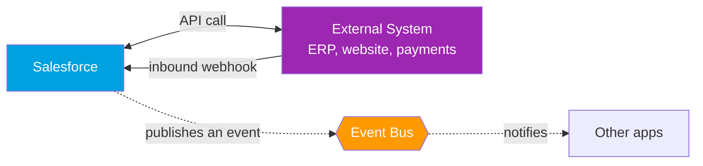
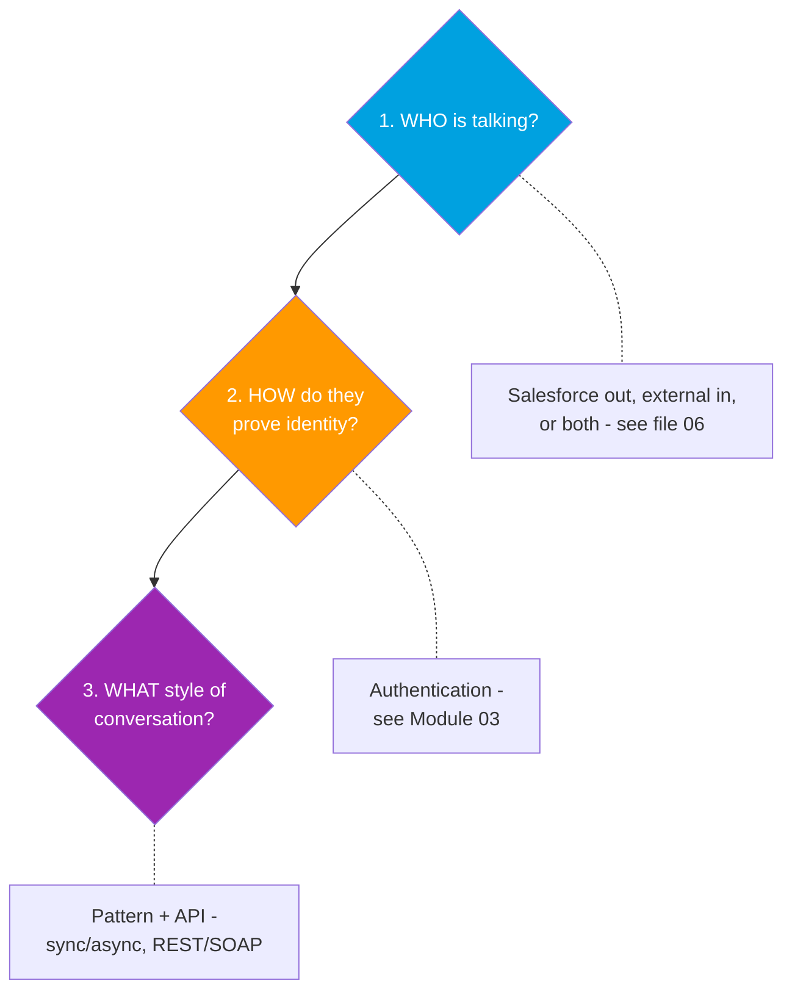

# 01 - What Integration Is (and Why Salesforce Needs It)

> **One-liner**: Integration is just **two systems talking to each other** so data and actions flow between them instead of being re-typed by hand.
> **Why it matters**: Salesforce is almost never the only system a business runs. Its value multiplies when it shares data with the website, the ERP, the payment gateway, the data warehouse, and the phone system.
> **Goal of this file**: Be able to explain integration to a non-technical person in **one minute**.

This is Module 01. No deep code yet, just the mental model and vocabulary. Each later file builds on the picture drawn here.

---

## 1. The idea in plain English

Picture two people who speak different languages trying to do business. They need three things: a **way to reach each other** (a phone line), a **shared language** (so the words mean the same thing), and **proof of who they are** (so neither gets scammed). Software systems are exactly the same. Salesforce and an external system each store their own data in their own shapes. Integration is the agreed-upon phone call between them.

Without integration, a human becomes the integration: someone exports a CSV from the website, opens Salesforce, and re-types 200 leads. That is slow, error-prone, and always out of date. **An integration replaces that human with an automatic, reliable connection.**

---

## 2. Why integrate Salesforce? (the business drivers)

Every integration exists to serve one of a few goals. In an interview, name the driver, not just the tech.

| Driver | What it means | Real example |
|---|---|---|
| **Single source of truth** | One trusted place for a piece of data, synced everywhere. | Customer address lives in SAP, mirrored into Salesforce so reps see it. |
| **Automation** | Remove manual re-keying between systems. | A web form creates a Lead in Salesforce automatically. |
| **Real-time experience** | Show fresh data or react instantly. | A rep sees live order status from the ERP inside the Account page. |
| **Reach / capability** | Use a service Salesforce does not provide. | Call a credit-scoring API or a payment gateway. |
| **Scale / offload** | Move heavy work to the right system. | Push millions of records to a data warehouse nightly for analytics. |

---

## 3. The shape of every integration (3 questions)

Before choosing any API or auth method, answer these three questions. The rest of this vault is just detailed answers to them.

1. **Who is talking?** Salesforce calling out, an external system calling in, or both. (See [06-inbound-vs-outbound.md](06-inbound-vs-outbound.md).)
2. **How do they prove identity?** The authentication layer. (Whole of Module 03.)
3. **What style of conversation?** Real-time or batch, request/reply or fire-and-forget, REST or SOAP. (Files [03](03-rest-vs-soap.md), [05](05-synchronous-vs-asynchronous.md), [07](07-push-pull-and-webhooks.md).)

---

## 4. How it shows up in Salesforce

Concrete examples you can name in an interview:

- **Website → Salesforce**: a "Contact Us" form posts to the Salesforce **REST API** and creates a Lead. (Inbound, request/reply.)
- **Salesforce → Payment gateway**: Apex makes an **HTTP callout** through a Named Credential to charge a card. (Outbound, request/reply.)
- **Salesforce → ERP**: when an Opportunity closes, Salesforce **publishes a Platform Event** that the ERP subscribes to. (Outbound, fire-and-forget.)
- **Nightly sync**: an ETL tool loads 2 million records via **Bulk API 2.0**. (Batch, async.)
- **Live data**: an Account page shows SAP invoices through **Salesforce Connect** without copying them. (Data virtualization.)

> **Platform note**: Salesforce is **API-first** — almost everything you can do in the UI, you can do through an API. That is why integration is a first-class skill, not an afterthought.

---

## 5. Common confusions and interview traps

| Confusion | The clarification |
|---|---|
| "Integration = API." | An API is one *tool* for integration. Integration is the broader goal; it can also use events, files, or middleware. |
| "It's all real-time." | Most enterprise integration is **batch/async**. Real-time is a deliberate choice with trade-offs. |
| "Salesforce just stores data." | Salesforce is a **platform**: it exposes APIs, runs code (Apex), and publishes events. See [10-salesforce-as-a-platform.md](10-salesforce-as-a-platform.md). |
| "More integration is better." | Each connection adds coupling and failure points. Integrate with a clear driver, not by default. |

---

## 6. Interview Q&A

**Q: Explain integration to a non-technical stakeholder.**
A: It is an automatic, reliable connection that lets two systems share data and trigger actions, so people don't have to copy information between them by hand.

**Q: Why would a company integrate Salesforce instead of just using it standalone?**
A: To keep one source of truth across systems, automate manual work, give users real-time data, reach capabilities Salesforce lacks (payments, scoring), and offload heavy processing. The driver should be a business need, not the technology.

**Q: What are the first questions you ask when scoping an integration?**
A: Who initiates (inbound vs outbound), how identity is proven (auth), and the conversation style (real-time vs batch, request/reply vs event). Those three decisions drive the API and pattern choice.

**Q: Is integration always real-time?**
A: No. Much of it is scheduled batch or asynchronous events. Real-time adds cost and tighter coupling, so you choose it only when the use case truly needs a fresh response.

**Talking point to explain it to anyone**: "It's the difference between emailing a coworker a spreadsheet to retype, versus the two apps just texting each other automatically."

---

## 7. Key terms

API, endpoint, payload, request/response, inbound/outbound, synchronous/asynchronous, webhook, middleware — all defined in [02-core-vocabulary.md](02-core-vocabulary.md) and the [README glossary](README.md).

---

## Sources (Verified June 2026)

- [Integration Patterns and Practices (v66.0, Spring '26) — Salesforce Architect](https://architect.salesforce.com/docs/architect/fundamentals/guide/integration-patterns.html)
- [Platform Multitenant Architecture — Salesforce Architect](https://architect.salesforce.com/docs/architect/fundamentals/guide/platform-multitenant-architecture.html)
- [Salesforce Developers — API overview](https://developer.salesforce.com/docs/apis)

---

*Next: [02-core-vocabulary.md](02-core-vocabulary.md) — the words you must know before anything else makes sense.*
