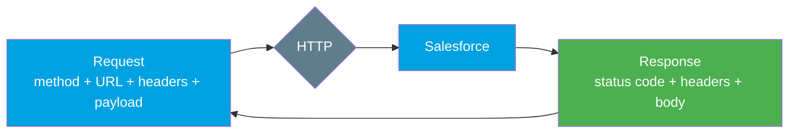
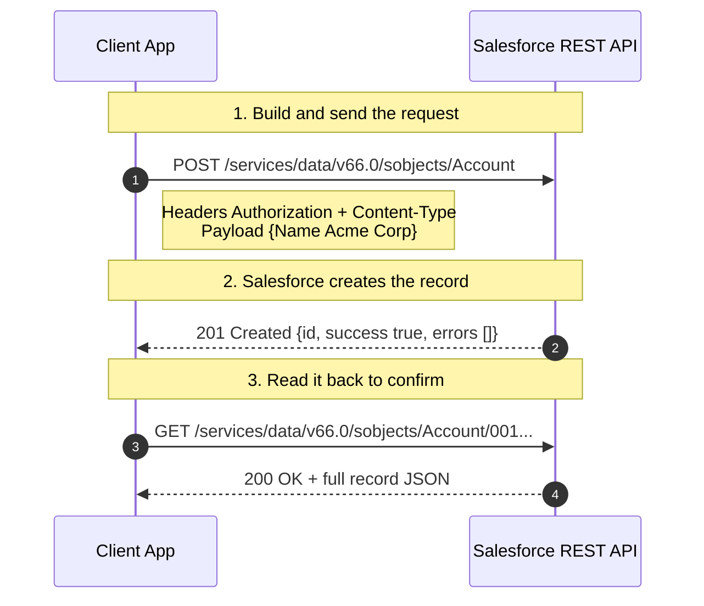

# 02 - Core Vocabulary (The Words You Must Know)

> **One-liner**: Eight or nine words — **API, endpoint, request, response, payload, methods, headers, status codes** — unlock almost every integration conversation.
> **Why it matters**: Every later topic (REST, SOAP, auth, events) reuses these terms. Get them wrong in an interview and the rest sounds shaky.
> **Goal of this file**: Read one real Salesforce REST call and name every part of it.

New here? Start with [01-what-and-why-of-integration.md](01-what-and-why-of-integration.md) for the big picture.

---

## 1. The idea in plain English

Think of ordering at a **restaurant**. You don't walk into the kitchen and cook. You talk to a **waiter** through a fixed routine: you give an order (a **request**), the kitchen does the work, and the waiter brings back a plate (a **response**). The menu tells you what you're allowed to ask for. You never touch the stove.

An **API** is that waiter. It is the agreed set of things one system will do for another, and the exact way to ask. You send a request to a specific address, the system does the work, and it sends a response back. Everything below is just naming the parts of that exchange.



---

## 2. The vocabulary, one term at a time

| Term | Plain meaning | Restaurant analogy |
|---|---|---|
| **API** (Application Programming Interface) | The contract: what you can ask a system to do, and how. | The waiter + the menu. |
| **Endpoint** | The specific URL you send a request to. One API has many endpoints. | The exact table/counter you order from. |
| **Base URL / Instance URL** | The root address of the server. In Salesforce it is your **My Domain** instance host. Endpoints hang off it. | The restaurant's street address. |
| **Request** | The message you send asking for something. | Placing your order. |
| **Response** | The message that comes back. | The plate the waiter returns. |
| **Payload (body)** | The actual data carried in a request or response. Often JSON. | The food on the plate (or the order written on the ticket). |
| **HTTP method (verb)** | The kind of action you want: read, create, update, delete. | "I'd like to order / change / cancel." |
| **Headers** | Metadata about the message: who you are, what format you're sending. | Notes to the kitchen: allergies, who's paying. |
| **Status code** | A 3-digit number saying how the request went. | "Order's up" vs "We're out of that" vs "Kitchen's on fire." |

> **Endpoint vs Base URL**: the **base URL** is `https://MyDomainName.my.salesforce.com`. The **endpoint** is the full path you hit, e.g. `https://MyDomainName.my.salesforce.com/services/data/v66.0/sobjects/Account`. Salesforce returns your base URL as `instance_url` when you authenticate.

---

## 3. HTTP methods (what each verb does in REST)

REST maps the four basic data operations (often called **CRUD** — Create, Read, Update, Delete) onto HTTP verbs. Memorize this table.

| Method | Means | CRUD | Salesforce REST example |
|---|---|---|---|
| **GET** | Read. Never changes data (it is **safe** and **idempotent**). | Read | `GET /sobjects/Account/001...` retrieves one Account. |
| **POST** | Create a new resource. **Not** idempotent — call it twice, get two records. | Create | `POST /sobjects/Account` creates an Account. |
| **PATCH** | Partial update — change only the fields you send. | Update | `PATCH /sobjects/Account/001...` updates a field. |
| **PUT** | Full replace / upsert of a resource. Salesforce uses it for **upsert by external ID**. | Update/Upsert | `PUT /sobjects/Account/ExtId__c/12345`. |
| **DELETE** | Remove the resource. | Delete | `DELETE /sobjects/Account/001...` deletes the Account. |

> **Interview note**: Salesforce updates use **PATCH**, not PUT. PUT in the Salesforce REST API is reserved for **upsert by external ID** (create-or-update). Mixing these up is a common slip. **Idempotent** means repeating the same call leaves the system in the same state — GET, PATCH, PUT, and DELETE are idempotent; POST is not.

---

## 4. Headers (the two that matter most)

Headers are `Name: Value` lines that travel with the request. For integrations, two are non-negotiable:

| Header | Purpose | Example value |
|---|---|---|
| **Authorization** | Proves who you are. Carries the access token. | `Authorization: Bearer 00D5g...!AQEA...` |
| **Content-Type** | Tells the server the format of your **payload**. | `Content-Type: application/json` |
| **Accept** | Tells the server the format you want **back**. | `Accept: application/json` |

> **Bearer token**: "Bearer" means *whoever holds this token gets access*, like cash. That is why tokens live in a header over HTTPS and are guarded like passwords. The token itself comes from Module 03 (authentication).

---

## 5. HTTP status codes (the three families)

The first digit tells you the family. Learn the family first, then the common members.

| Family | Meaning | Common members you must know |
|---|---|---|
| **2xx — Success** | The request worked. | **200 OK** (read/update succeeded), **201 Created** (new record made), **204 No Content** (success, nothing to return — e.g. after DELETE). |
| **4xx — Client error** | *You* sent something wrong. Fix the request; don't retry blindly. | **400 Bad Request** (malformed body/field), **401 Unauthorized** (missing/expired token), **403 Forbidden** (no permission, or API limit exceeded), **404 Not Found** (bad endpoint or deleted record), **415 Unsupported Media Type** (wrong/missing `Content-Type`). |
| **5xx — Server error** | The *server* failed. Often safe to retry with backoff. | **500 Internal Server Error**, **503 Service Unavailable** (overloaded / maintenance). |

> **The mental rule**: 2xx = "great." 4xx = "your fault." 5xx = "their fault." In Salesforce, an expired session shows up as **401 INVALID_SESSION_ID**, and hitting your daily API limit shows up as **403 REQUEST_LIMIT_EXCEEDED**.

---

## 6. A real Salesforce request and response

Putting every term together. Here we **create an Account** via the REST API (API version **v66.0**, Spring '26).

**The request** (POST = create):

```http
POST /services/data/v66.0/sobjects/Account HTTP/1.1
Host: MyDomainName.my.salesforce.com
Authorization: Bearer 00D5g000004...!AQEAQ...
Content-Type: application/json

{
  "Name": "Acme Corp",
  "Industry": "Technology",
  "NumberOfEmployees": 250
}
```

- **Method** = `POST` (create). **Endpoint** = `/services/data/v66.0/sobjects/Account`.
- **Headers** = `Authorization` (the token) and `Content-Type` (the payload is JSON).
- **Payload** = the JSON object with the field values.

**The response** — status **201 Created**:

```json
{
  "id": "001gK000004xZpQQAU",
  "success": true,
  "errors": []
}
```

- **Status code** `201` = a new record was created.
- **Payload** = the new record's `id`, a `success` flag, and an empty `errors` array.



---

## 7. How it shows up in Salesforce

- The **base URL** is your **My Domain** instance (e.g. `acme.my.salesforce.com`), returned as `instance_url` after login.
- Almost every data endpoint sits under `/services/data/vXX.X/`. The `vXX.X` is the **API version** — **v66.0** is Spring '26.
- `Authorization: Bearer <token>` is on nearly every call; the token is a temporary **Session ID**.
- A **201** means a record was created; the response gives you its 15- or 18-character **record Id**.
- A **401** mid-session almost always means the token expired — refresh it. A **403** often means a **permission** problem or an **API limit**.

---

## 8. Common confusions and interview traps

| Confusion | The clarification |
|---|---|
| "Endpoint and base URL are the same." | Base URL is the root host; the endpoint is the full path you call. |
| "Use PUT to update a record." | In Salesforce REST, **PATCH** updates; **PUT** is upsert by external ID. |
| "401 and 403 are the same." | **401** = not authenticated (bad/expired token). **403** = authenticated but not allowed (permission or limit). |
| "POST is idempotent." | No. Two identical POSTs create two records. GET/PUT/PATCH/DELETE are idempotent. |
| "Content-Type and Accept are interchangeable." | `Content-Type` describes what you **send**; `Accept` describes what you want **back**. |
| "A 200 always means data changed." | 200 just means success. A GET returns 200 and changes nothing. |

---

## 9. Interview Q&A

**Q: What is an API, in one sentence?**
A: A contract that defines what one system can ask another to do, and exactly how to ask — like a waiter taking a structured order to the kitchen and bringing back the plate.

**Q: Difference between an endpoint and a base URL?**
A: The base (instance) URL is the server's root address, like `https://acme.my.salesforce.com`. An endpoint is the full path you actually call, like `.../services/data/v66.0/sobjects/Account`. One base URL exposes many endpoints.

**Q: Which HTTP method updates a record in Salesforce REST, and what's the trap?**
A: **PATCH** for a partial field update. The trap is assuming PUT — in the Salesforce REST API, PUT is used for **upsert by external ID**, not a normal update.

**Q: A call returns 401. What does it mean and what do you do?**
A: The request isn't authenticated — usually an expired or missing access token (`INVALID_SESSION_ID`). You get a fresh token (refresh flow) and retry. A 403, by contrast, means you're authenticated but lack permission or hit an API limit.

**Q: What's in an HTTP request versus a response?**
A: A request has a method, an endpoint URL, headers (auth, content type), and an optional payload/body. A response has a status code, headers, and a body. The status code's first digit tells you the outcome family: 2xx success, 4xx client error, 5xx server error.

**Q: What does `Authorization: Bearer` mean?**
A: It carries an access token where possession equals access. The server trusts whoever presents a valid token, so it must travel over HTTPS and be protected like a password.

**Talking point to explain it to anyone**: "It's a restaurant order. You ask the waiter (the API) for something specific (the endpoint), hand over your details and your order (headers and payload), and get back a plate with a note saying how it went (the response and its status code)."

---

## 10. Key terms

API, endpoint, base/instance URL, request/response, payload, HTTP methods, headers, status codes — cross-referenced in the [README glossary](README.md). Next we use them to compare the two API styles.

---

## Sources (Verified June 2026)

- [REST API Developer Guide — Create a Record (v66.0)](https://developer.salesforce.com/docs/atlas.en-us.api_rest.meta/api_rest/dome_sobject_create.htm)
- [REST API Developer Guide — Working with Records (HTTP methods)](https://developer.salesforce.com/docs/atlas.en-us.api_rest.meta/api_rest/using_resources_working_with_records.htm)
- [Salesforce Developers — API overview](https://developer.salesforce.com/docs/apis)
- [HTTP response status codes — MDN](https://developer.mozilla.org/en-US/docs/Web/HTTP/Status)
- [HTTP request methods — MDN](https://developer.mozilla.org/en-US/docs/Web/HTTP/Methods)

---

*Next: [03-rest-vs-soap.md](03-rest-vs-soap.md) — the two API styles, and why new Salesforce builds favor REST.*
