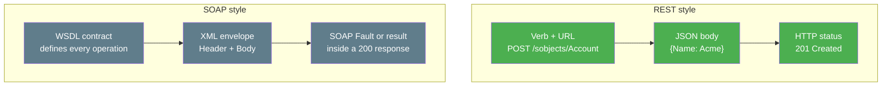

# 03 - REST vs SOAP (The Two API Styles)

> **One-liner**: REST and SOAP are two ways to build a web API — REST is lightweight and resource-based, SOAP is a strict, contract-driven XML protocol.
> **The core difference**: **REST** uses plain HTTP verbs on resources and usually speaks **JSON**; **SOAP** wraps every message in a rigid **XML envelope** defined by a **WSDL** contract.
> **Why it matters**: Salesforce ships both. New builds default to REST, but SOAP is still everywhere in older integrations — and one big SOAP auth change is landing in 2026-2027.

Need the words first? See [02-core-vocabulary.md](02-core-vocabulary.md).

---

## 1. The idea in plain English

Two ways to send a parcel.

**REST** is like **standard post**. You write the address on the box (the URL), drop it in (a verb like GET or POST), and the system knows what to do. Light, flexible, everyone supports it.

**SOAP** is like **registered mail with a notarized form**. Every parcel must go inside a specific envelope, with a strictly formatted form attached (the XML envelope), and a master rulebook (the **WSDL**) defines exactly what every field must look like. More ceremony, but the contract is ironclad and machine-readable — tools can auto-generate client code from the WSDL.

Neither is "better" everywhere. SOAP is a **protocol** with built-in rules; REST is an **architectural style** that leans on HTTP itself.

---

## 2. The core difference, side by side

| Dimension | REST | SOAP |
|---|---|---|
| **What it is** | Architectural style over HTTP. | Strict messaging protocol (XML). |
| **Data format** | Usually **JSON** (can do XML). | **XML only**, wrapped in a SOAP envelope. |
| **Contract** | Optional/loose (OpenAPI is nice-to-have). | **Mandatory WSDL** — a machine-readable contract. |
| **Transport** | HTTP/HTTPS, uses verbs (GET/POST/PATCH/DELETE). | Usually HTTP, but transport-agnostic; almost always **POST**. |
| **Verbosity** | Compact. Less overhead per call. | Verbose — envelope + namespaces add weight. |
| **Error handling** | HTTP **status codes** (200/201/4xx/5xx) + JSON error body. | A **SOAP Fault** element inside a 200-wrapped envelope. |
| **Tooling / codegen** | Hand-rolled or OpenAPI generators. | Strong: import the WSDL, auto-generate a typed client. |
| **State / standards** | Stateless, minimal. | Rich WS-* standards (WS-Security, etc.). |
| **Best fit** | Web/mobile, microservices, modern integrations. | Legacy enterprise, formal contracts, strict typing. |

> **One-line interview answer**: "REST is lightweight, resource-and-verb based, and usually JSON. SOAP is a heavier XML protocol with a strict WSDL contract and built-in standards. New work goes REST; SOAP lives on in mature enterprise systems."

---

## 3. The same call in both styles

**REST — create an Account** (compact, JSON, verb in the method):

```http
POST /services/data/v66.0/sobjects/Account
Content-Type: application/json

{ "Name": "Acme Corp" }
```

**SOAP — create an Account** (envelope, namespaces, everything is XML):

```xml
<soapenv:Envelope xmlns:soapenv="http://schemas.xmlsoap.org/soap/envelope/"
                  xmlns:urn="urn:partner.soap.sforce.com">
  <soapenv:Header>
    <urn:SessionHeader><urn:sessionId>00D...!AQ...</urn:sessionId></urn:SessionHeader>
  </soapenv:Header>
  <soapenv:Body>
    <urn:create>
      <urn:sObjects xsi:type="Account">
        <Name>Acme Corp</Name>
      </urn:sObjects>
    </urn:create>
  </soapenv:Body>
</soapenv:Envelope>
```

Same outcome, very different weight. Note SOAP carries the session in a `SessionHeader` *inside the envelope*, while REST carries it in the `Authorization` HTTP header.



---

## 4. How it shows up in Salesforce

Salesforce exposes both, and you should be able to name them:

| API | Style | Format | Typical use |
|---|---|---|---|
| **REST API** | REST | JSON (XML optional) | The **modern default** for most app and mobile integration. |
| **SOAP API** | SOAP | XML + WSDL | Mature, fully supported; common in older middleware and tools that import a WSDL. |
| **Bulk API 2.0** | REST | CSV/JSON | Large data loads (millions of records). |
| **Metadata API** | SOAP | XML + WSDL | Deploy/retrieve metadata (config), used by tooling. |

Salesforce publishes two WSDLs for the SOAP API: the **Enterprise WSDL** (strongly typed to one org's schema) and the **Partner WSDL** (loosely typed, works across orgs). **New builds favor REST** for its simplicity and lighter footprint.

> **Platform note**: this is *which style to call Salesforce with*. It is separate from authentication (Module 03) and from data format (next file). A SOAP API call still needs a session; a REST call still needs a bearer token.

---

## 5. CURRENT and important — SOAP API `login()` is being retired

This is a live, exam-worthy change. Say it precisely:

- The **SOAP API `login()` call** (the old way of trading username + password for a session) is **being retired in Summer '27** for SOAP API versions **31.0 through 64.0**. After that release, those `login()` calls stop working and every dependent integration fails to authenticate.
- `login()` is **not available in API version 65.0 and later** at all.
- From the **Summer '26** release, in **newly created orgs** the SOAP `login()` call is **disabled by default**; an admin must enable it, and once enabled, users need the new **"Use Any API Auth"** user permission to authenticate this way.
- Salesforce's guidance: **migrate to OAuth** — **Web Server flow**, **JWT Bearer flow**, or **Client Credentials flow** — configured through **External Client Apps**, well before the cutoff.

| What | Detail |
|---|---|
| **What's retiring** | SOAP API `login()` in versions 31.0-64.0 |
| **When** | **Summer '27** (the SOAP API itself is not being removed — only the `login()` auth call) |
| **Already gone** | `login()` absent in **v65.0+** |
| **New control (Summer '26)** | Disabled by default in new orgs; **Use Any API Auth** permission required |
| **Migrate to** | OAuth via External Client Apps: Web Server, JWT Bearer, or Client Credentials |

> **Interview gold**: "SOAP isn't dying — the SOAP `login()` *authentication* call is. Salesforce is pushing everyone onto OAuth and External Client Apps. If I owned a legacy SOAP integration that calls `login()`, I'd plan a migration to JWT Bearer or Client Credentials before Summer '27." See Module 03 for those flows.

---

## 6. When to use which

| Choose REST when... | Choose SOAP when... |
|---|---|
| Building web/mobile/microservice integrations. | Integrating with older middleware that imports a WSDL. |
| You want compact JSON and minimal overhead. | You need a strict, machine-readable contract and strong typing. |
| You're starting something new in Salesforce. | You must use a Salesforce API that is SOAP-only (e.g. parts of Metadata API). |
| You want easy debugging (curl, Postman). | The existing system already speaks SOAP and rewriting isn't worth it. |

**Common confusions and traps**

| Confusion | The clarification |
|---|---|
| "SOAP is dead in Salesforce." | The SOAP **API** is fully supported. Only the SOAP **`login()` auth call** is being retired (Summer '27). |
| "REST always uses JSON, SOAP always uses XML." | SOAP is XML-only; REST *usually* JSON but can return XML. The format is a separate choice — see [04-json-vs-xml.md](04-json-vs-xml.md). |
| "SOAP errors come back as HTTP 500." | A SOAP **Fault** is typically returned inside a **200** envelope; you parse the body, not just the status. |
| "REST has no contract." | It can (OpenAPI), but it's optional. SOAP's WSDL is mandatory. |

---

## 7. Interview Q&A

**Q: What's the core difference between REST and SOAP?**
A: REST is a lightweight architectural style that uses HTTP verbs on resources and usually returns JSON. SOAP is a strict protocol where every message is an XML envelope defined by a mandatory WSDL contract. REST is lighter and dominant for new work; SOAP offers a rigid, strongly typed contract favored in legacy enterprise systems.

**Q: Which does Salesforce recommend for new integrations, and why?**
A: REST. It's simpler, less verbose, JSON-friendly, easy to test and debug, and fits web/mobile and microservice patterns. SOAP remains supported for existing systems and WSDL-based tooling.

**Q: How does error handling differ?**
A: REST uses HTTP status codes (201, 400, 401, 500) plus a JSON error body. SOAP returns a SOAP Fault element, usually inside an HTTP 200 response, so you must parse the envelope rather than rely on the status code alone.

**Q: What's the SOAP `login()` retirement about?**
A: The SOAP API `login()` call — username/password for a session — is being retired in Summer '27 for API versions 31.0-64.0 and is already absent in v65.0+. From Summer '26 it's disabled by default in new orgs and gated by the "Use Any API Auth" permission. Salesforce wants migration to OAuth (Web Server, JWT Bearer, or Client Credentials) via External Client Apps. The SOAP API itself stays; only that auth call goes away.

**Q: When would you still pick SOAP today?**
A: When integrating with middleware or partners that consume a WSDL, when a strict typed contract is required, or when the only Salesforce API for the job is SOAP-based (parts of Metadata API). Otherwise REST.

**Talking point to explain it to anyone**: "REST is standard post — write the address, drop it in. SOAP is registered mail with a notarized form: more paperwork, but the contract is airtight."

---

## 8. Key terms

REST, SOAP, WSDL, envelope, SOAP Fault, JSON, XML, OAuth — see [02-core-vocabulary.md](02-core-vocabulary.md) and the [README glossary](README.md). Auth flows live in Module 03.

---

## Sources (Verified June 2026)

- [Platform SOAP API login() Retirement — Salesforce Help](https://help.salesforce.com/s/articleView?id=005132110&type=1)
- [SOAP API login() Call in Versions 31.0-64.0 Is Being Retired — Release Notes](https://help.salesforce.com/s/articleView?id=release-notes.rn_api_upcoming_retirement_258rn.htm&type=5)
- [SOAP API End-of-Life Policy — SOAP API Developer Guide](https://developer.salesforce.com/docs/atlas.en-us.api.meta/api/api_eol_soap.htm)
- [Which API Do I Use? — Salesforce Help](https://help.salesforce.com/s/articleView?id=sf.integrate_what_is_api.htm&type=5)
- [REST API Developer Guide — Introduction](https://developer.salesforce.com/docs/atlas.en-us.api_rest.meta/api_rest/intro_what_is_rest_api.htm)

---

*Next: [04-json-vs-xml.md](04-json-vs-xml.md) — the two data formats these APIs carry.*
