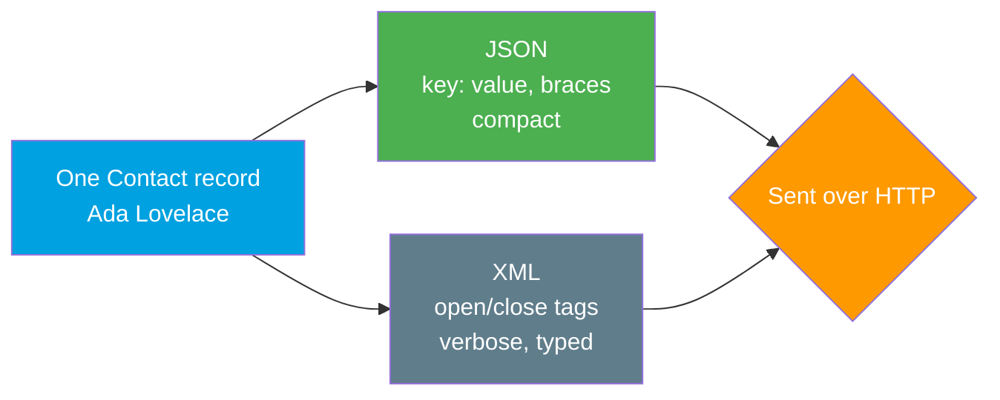

# 04 - JSON vs XML (The Two Data Formats)

> **One-liner**: JSON and XML are two ways to write structured data as text so two systems can exchange it.
> **The core difference**: **JSON** is compact key/value data, native to web/JavaScript; **XML** is verbose tag-based markup with namespaces, attributes, and schemas.
> **Why it matters**: REST and most modern Salesforce APIs speak **JSON**; SOAP API and Metadata API speak **XML**. Knowing which goes where avoids a lot of confusion.

Coming from the API styles? See [03-rest-vs-soap.md](03-rest-vs-soap.md). New words live in [02-core-vocabulary.md](02-core-vocabulary.md).

---

## 1. The idea in plain English

Both are just **text that carries structured data** — a way to write down "this record has these fields with these values" so another program can read it back exactly.

**JSON** (JavaScript Object Notation) is like a **packing list**: short labels and values, `Name: Acme`, with curly braces grouping things. Minimal punctuation, easy for a human to skim and for a browser to parse.

**XML** (eXtensible Markup Language) is like a **legal form**: every field is wrapped in an opening and closing tag, `<Name>Acme</Name>`, and you can attach extra notes (attributes), declare which rulebook applies (namespaces), and validate against a schema. More words on the page, but very explicit.

Neither is "the data" — they are two **spellings** of the same data. A record is a record; JSON and XML are just how you write it down on the wire.

---

## 2. The same record in both formats

A single **Contact** — first name, last name, email, and whether they're active — written both ways.

**JSON:**

```json
{
  "FirstName": "Ada",
  "LastName": "Lovelace",
  "Email": "ada@example.com",
  "IsActive": true
}
```

**XML:**

```xml
<Contact>
  <FirstName>Ada</FirstName>
  <LastName>Lovelace</LastName>
  <Email>ada@example.com</Email>
  <IsActive>true</IsActive>
</Contact>
```

Same four fields. JSON is **~80 characters lighter** here, and the structure is implied by braces and quotes rather than repeated tags. XML repeats every field name twice (open and close) but can carry extra metadata JSON cannot express as cleanly.



---

## 3. The core difference, side by side

| Dimension | JSON | XML |
|---|---|---|
| **Shape** | Key/value pairs, arrays, nested objects. | Nested elements wrapped in tags. |
| **Verbosity** | Compact — no closing tags. | Verbose — every element opens and closes. |
| **Data types** | Native: string, number, boolean, null, array, object. | Everything is text; types come from a schema (XSD). |
| **Attributes** | No attributes — only keys and values. | Supports **attributes** (`<tag id="1">`) and elements. |
| **Namespaces** | None (keys are plain). | **Namespaces** prevent name clashes across vocabularies. |
| **Schema / validation** | JSON Schema (optional). | **XSD / DTD** — mature, strict validation. |
| **Comments** | Not allowed in standard JSON. | Allowed (`<!-- ... -->`). |
| **Readability** | Easy for web developers; maps to objects. | Explicit but heavier to read. |
| **Native home** | JavaScript / web / REST. | Enterprise, config, SOAP, documents. |

> **One-line interview answer**: "JSON is compact key/value data that maps straight to objects and dominates REST and the web. XML is verbose tag-based markup with namespaces, attributes, and strong schema validation — the language of SOAP, Metadata API, and config files."

---

## 4. How it shows up in Salesforce

The mapping is clean and worth memorizing:

| Salesforce API / artifact | Format | Why |
|---|---|---|
| **REST API** | **JSON** (XML optional) | Modern default; lightweight for apps and mobile. |
| **Bulk API 2.0** | **JSON** / CSV | Large data loads. |
| **Connect (Chatter) REST API** | **JSON** | Web/feed data. |
| **SOAP API** | **XML** | Every message is a SOAP envelope (XML). |
| **Metadata API** | **XML** | Component definitions; `package.xml` and `*-meta.xml` files are XML. |
| **Tooling API** | **JSON** or XML | Developer tooling; commonly JSON over REST. |

So in practice: when you call the **REST API** you send and receive **JSON**; when you deploy metadata or call the **SOAP API**, you're in **XML**. Every Salesforce metadata file on disk (`CustomObject`, `Flow`, `ApexClass` meta) is XML.

> **Platform note**: a `package.xml` manifest for a Metadata API deploy is pure XML with namespaces. A record returned from `GET /services/data/v66.0/sobjects/Contact/003...` is JSON. Same platform, two formats, chosen by the API.

---

## 5. When to use which

| Reach for JSON when... | Reach for XML when... |
|---|---|
| Calling or building a **REST** API. | Calling the **SOAP** API or **Metadata API**. |
| Talking to web or mobile front ends. | A system or partner requires a strict **schema (XSD)**. |
| You want compact payloads and fast parsing. | You need **namespaces** or **attributes** to model the data. |
| Working in JavaScript/Apex with simple objects. | Authoring Salesforce **config/metadata** files. |

**Common confusions and traps**

| Confusion | The clarification |
|---|---|
| "JSON is better than XML." | Neither is better universally. JSON is lighter; XML is richer (namespaces, attributes, validation). Pick per use case. |
| "REST can only return JSON." | REST *usually* uses JSON but the Salesforce REST API can return XML if you set the `Accept` header. |
| "The format determines the API style." | No. Format (JSON/XML) and style (REST/SOAP) are separate choices. SOAP is always XML; REST is usually JSON. |
| "XML attributes and elements are the same." | Attributes (`id="1"`) live on a tag; elements are nested nodes. JSON has neither — only keys. |
| "Metadata API uses JSON." | Metadata API is **XML** (so are the `*-meta.xml` files in your repo). |

---

## 6. Interview Q&A

**Q: What's the core difference between JSON and XML?**
A: JSON is a compact key/value format with native data types that maps directly to objects — dominant in REST and the web. XML is verbose, tag-based markup that supports namespaces, attributes, and strict schema validation — the language of SOAP and config. They're two spellings of the same structured data.

**Q: In Salesforce, which APIs use which format?**
A: REST API, Bulk API 2.0, and Connect API use JSON. SOAP API and Metadata API use XML. Tooling API is typically JSON. As a rule: REST means JSON, SOAP and metadata mean XML.

**Q: Can the Salesforce REST API return XML?**
A: Yes. JSON is the default, but you can request XML via the `Accept` header. The point is that format and API style are independent choices — REST just defaults to the lighter format.

**Q: Why is JSON usually preferred for new web integrations?**
A: It's compact, parses natively in JavaScript and most languages, maps cleanly to objects, and has less overhead than XML's open/close tags. That makes it faster and simpler for app and mobile work.

**Q: When does XML still win?**
A: When you need namespaces to avoid name clashes, attributes to attach metadata, comments, or rigorous XSD validation — and whenever you're in SOAP, Metadata API, or Salesforce config files, which are XML by design.

**Talking point to explain it to anyone**: "JSON is a packing list — short labels and values. XML is a legal form — every field wrapped in a labeled box, with room for stamps and rules. Same information, different amount of paperwork."

---

## 7. Key terms

JSON, XML, key/value, tag/element, attribute, namespace, schema (XSD/JSON Schema), envelope — see [02-core-vocabulary.md](02-core-vocabulary.md) and the [README glossary](README.md). API styles are in [03-rest-vs-soap.md](03-rest-vs-soap.md).

---

## Sources (Verified June 2026)

- [REST API Developer Guide — Introduction (JSON default)](https://developer.salesforce.com/docs/atlas.en-us.api_rest.meta/api_rest/intro_what_is_rest_api.htm)
- [Metadata API Developer Guide — Introduction (XML)](https://developer.salesforce.com/docs/atlas.en-us.api_meta.meta/api_meta/meta_intro.htm)
- [SOAP API Developer Guide — Introduction (XML/WSDL)](https://developer.salesforce.com/docs/atlas.en-us.api.meta/api/sforce_api_quickstart_intro.htm)
- [JSON — MDN Web Docs](https://developer.mozilla.org/en-US/docs/Learn/JavaScript/Objects/JSON)
- [XML introduction — MDN Web Docs](https://developer.mozilla.org/en-US/docs/Web/XML/XML_introduction)

---

*Next: [05-synchronous-vs-asynchronous.md](05-synchronous-vs-asynchronous.md) — request/reply now vs fire-and-forget later.*
