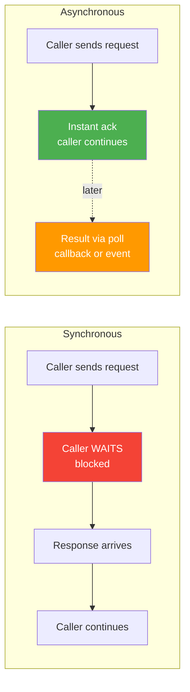
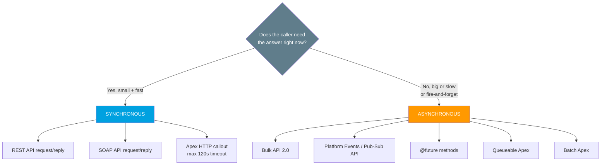

# 05 - Synchronous vs Asynchronous

> **One-liner**: **Synchronous** = the caller **waits** for the answer before doing anything else. **Asynchronous** = the caller **fires the request and moves on**, getting the result later via a poll, callback, or event.
> **Why it matters**: This single choice decides your user experience, your throughput, and how you handle failure. Pick wrong and you either freeze a screen for 30 seconds or lose track of work that finished in the background.
> **Core difference in one line**: Sync **blocks** and gives you an immediate answer. Async **doesn't block** and hands you the answer later.

New here? Skim [01-what-and-why-of-integration.md](01-what-and-why-of-integration.md) first for the big picture.

---

## 1. The idea in plain English

Imagine ordering food two ways.

**Synchronous** is a **phone call to a busy hotline**. You dial, you stay on the line, you cannot do anything else, and you hang up only once you have your answer. Fast when the other side answers quickly. Painful when they put you on hold.

**Asynchronous** is **texting the restaurant**. You send "one large pizza," put your phone in your pocket, and go water the plants. A while later a text pings back: "Ready for pickup." You were never stuck waiting.

In software, **synchronous** means the calling code pauses on that line until a response arrives. **Asynchronous** means the call returns instantly with a "got it, I'll handle it," and the real result shows up later through a callback, a status you poll, or an event you subscribe to.

---

## 2. The core difference + side-by-side comparison

The whole distinction is **does the caller block and wait?** Everything else flows from that.

| Dimension | Synchronous | Asynchronous |
|---|---|---|
| **Blocking** | Caller is **blocked** until the response returns. | Caller is **not blocked**, continues immediately. |
| **When you get the result** | **Now**, in the same call. | **Later**, via poll, callback, or event. |
| **Latency felt by user** | You feel the full round-trip time. | You feel almost nothing up front. |
| **Error handling** | Simple. Success or failure returns on the spot, in one place. | Harder. You must track job status, retries, and out-of-band failures. |
| **Throughput / volume** | Limited. One slow call ties up a connection and a timeout budget. | High. Work is queued and processed in bulk in the background. |
| **User experience** | Great for instant answers, bad if the work is slow. | Great for big or slow jobs, needs a "we'll notify you" pattern. |
| **Coupling** | Tighter. Both systems must be up at the same moment. | Looser. The receiver can be busy or briefly down. |
| **Best for** | Small, fast request/reply where the user needs the answer immediately. | Large volumes, slow work, or fire-and-forget notifications. |

---

## 3. A concrete example

**Charging a credit card (synchronous).** A user clicks "Pay." Your code calls the payment gateway and **waits** for "approved" or "declined" before it can show the next screen. The user must know the outcome **right now**, so blocking is the correct design. The cost: if the gateway is slow, the user stares at a spinner.

**Loading 2 million records into a warehouse (asynchronous).** An ETL tool submits a job, gets back a **job id** instantly, and walks away. Salesforce processes the records in the background. The tool checks back later, or gets notified, when the job completes. Nobody could sit and wait 40 minutes on a single open connection, so async is the only sane choice.

---

## 4. How it shows up in Salesforce

Salesforce draws this line very clearly. Know which side each tool sits on.

**Synchronous in Salesforce:**

- **REST API** and **SOAP API** request/reply. You call, you wait, you get rows back in the same response. Best for a handful of records.
- **Apex HTTP callouts** (outbound). A callout blocks the running transaction. Each callout can run up to a **120-second timeout** (default 10s, set with `setTimeout`), and a single transaction allows up to **100 callouts**. Synchronous callout response size is capped at **6 MB**.

**Asynchronous in Salesforce:**

- **Bulk API 2.0**. You submit a job, get a **job id**, and poll for completion. Built for thousands to millions of records, processed in the background. (REST/SOAP, by contrast, are tuned for real-time small batches.)
- **Platform Events** and the **Pub/Sub API**. Publish an event and move on. Subscribers receive it later over a streaming channel. Pure fire-and-forget.
- **`@future` methods**. Mark an Apex method `@future` and it runs later in its own background context. The classic way to make a callout from a trigger without blocking.
- **Queueable Apex**. Like `@future` but with chaining and a job id you can monitor. The modern default for background work.
- **Batch Apex**. Processes large data sets in chunks asynchronously, ideal for nightly jobs.

> **Async callouts get more room.** Asynchronous Apex allows a larger callout response (**12 MB** vs 6 MB for synchronous). Another reason heavy work belongs in the background.

> **Why a trigger uses `@future` for callouts.** You cannot make a synchronous callout in the same transaction that has uncommitted DML, and you do not want a user's save to block on a slow external system. So you defer the callout to an async method.

---

## 5. When to use which + common confusions

| Confusion / trap | The clarification |
|---|---|
| "Async is always better." | No. If the user needs the answer to continue (a payment, a validation), sync is correct. Async needs extra machinery to track results. |
| "Synchronous means fast." | Sync means **immediate and blocking**, not fast. A slow sync call is the worst case: you wait *and* you are stuck. |
| "Bulk API is just a faster REST API." | Different model entirely. Bulk API 2.0 is **asynchronous job-based**. REST/SOAP are **synchronous request/reply**. |
| "Platform Events return a result." | No. Publishing an event is fire-and-forget. There is no synchronous response payload. |
| "A callout can run as long as I want." | A synchronous Apex callout is capped at **120 seconds**. Long work must go async (Queueable, Batch, or a polling pattern). |
| "Async means no errors to handle." | Async has *more* failure modes: the job can fail after you walked away. You must monitor status and design retries. |

**Rule of thumb**: small + fast + user-needs-it-now → **synchronous**. Big + slow + fire-and-forget → **asynchronous**.

---

## 6. Interview Q&A

**Q: Explain synchronous vs asynchronous.**
A: Synchronous means the caller blocks and waits for the response before continuing. Asynchronous means the caller sends the request, gets an immediate acknowledgement, keeps working, and receives the real result later through a poll, callback, or event.

**Q: Give a Salesforce example of each.**
A: Synchronous: a REST API query or an Apex HTTP callout to charge a card, where the transaction waits for the response. Asynchronous: Bulk API 2.0 loading millions of records, or publishing a Platform Event that subscribers pick up later.

**Q: Why can't a trigger just make a synchronous callout directly?**
A: A callout is not allowed in a transaction with pending uncommitted DML, and you do not want the user's save blocked on a slow external system. So you defer it with `@future` or Queueable Apex, which run asynchronously.

**Q: A callout to a slow partner API keeps timing out. What do you change?**
A: A synchronous callout maxes out at 120 seconds. Move the work to an asynchronous pattern. Queueable Apex, Batch Apex, or a job-and-poll design, so the user is not blocked and you control retries.

**Q: When would you choose synchronous even though async scales better?**
A: When the caller cannot continue without the answer. Payments, real-time validations, and "show me this record now" lookups all need a synchronous response.

**Q: What is the trade-off you accept by going asynchronous?**
A: Looser coupling and higher throughput in exchange for more complex result handling. You no longer get a single success/fail in one place. You must track job status, handle out-of-band failures, and design retries and notifications.

**Talking point to explain it to anyone**: "Synchronous is a phone call. You wait on the line for the answer. Asynchronous is a text message. You send it and get on with your day until a reply pings back."

---

## 7. Key terms

Synchronous, asynchronous, blocking, callback, polling, callout, timeout, fire-and-forget, job id, throughput, latency — all defined in [02-core-vocabulary.md](02-core-vocabulary.md) and the [README glossary](README.md).

---

## Sources (Verified June 2026)

- [Bulk API 2.0 — Salesforce Developers (v66.0, Spring '26)](https://developer.salesforce.com/docs/atlas.en-us.api_asynch.meta/api_asynch/bulk_api_2_0.htm)
- [Asynchronous Processing — Salesforce Architects Decision Guide](https://architect.salesforce.com/decision-guides/async-processing)
- [Callout Limits and Limitations — Apex Developer Guide](https://developer.salesforce.com/docs/atlas.en-us.apexcode.meta/apexcode/apex_callouts_timeouts.htm)
- [Pub/Sub API — Salesforce Developers](https://developer.salesforce.com/docs/platform/pub-sub-api/overview)
- [Future Methods — Apex Developer Guide](https://developer.salesforce.com/docs/atlas.en-us.apexcode.meta/apexcode/apex_invoking_future_methods.htm)

---

*Next: [06-inbound-vs-outbound.md](06-inbound-vs-outbound.md) — which direction is the call going, into Salesforce or out of it?*
