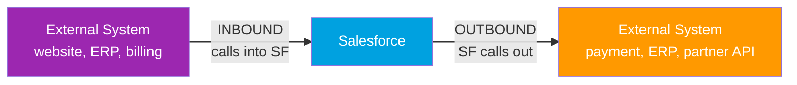
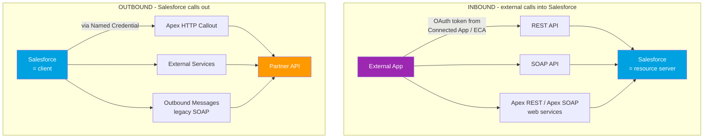

# 06 - Inbound vs Outbound

> **One-liner**: **Inbound** = an external system calls **into** Salesforce. **Outbound** = Salesforce calls **out** to an external system. The direction is always measured **relative to Salesforce**.
> **Why it matters**: Direction decides who authenticates whom, which APIs and tools you reach for, and which side is the "client" and which is the "server." Get the direction right and the auth and tooling fall into place.
> **Core difference in one line**: Inbound, **someone calls Salesforce**. Outbound, **Salesforce calls someone**.

New here? Read [01-what-and-why-of-integration.md](01-what-and-why-of-integration.md) and [05-synchronous-vs-asynchronous.md](05-synchronous-vs-asynchronous.md) first.

---

## 1. The idea in plain English

Stand inside Salesforce and watch the front door.

**Inbound** is **someone knocking on your door**. A delivery driver (an external app) shows up, proves who they are, and hands you a package or asks for one. Salesforce is the **host**. It must check the visitor's ID before letting them in.

**Outbound** is **you leaving the house to visit someone else**. Salesforce walks out, knocks on the partner's door, and proves *its own* identity to *them*. Now Salesforce is the **visitor**.

The only thing that flips is **who initiates the call**. The same business integration often has both directions: the website calls in to create a lead (inbound), and later Salesforce calls out to a billing system when a deal closes (outbound).

---

## 2. The core difference + side-by-side comparison

| Dimension | Inbound | Outbound |
|---|---|---|
| **Who initiates** | The **external system** starts the call. | **Salesforce** starts the call. |
| **Salesforce's role** | **Server** / resource server. It receives. | **Client**. It sends. |
| **Who must authenticate** | The **external app** proves its identity to Salesforce. | **Salesforce** proves its identity to the external system. |
| **Where credentials live** | In a **Connected App / External Client App** (Salesforce side) that the external app uses to get a token. | In a **Named Credential + External Credential** (Salesforce side) that stores how to log in to the partner. |
| **Typical tools** | REST API, SOAP API, Apex REST / Apex SOAP web services. | Apex HTTP callouts, Named Credentials, External Services, Outbound Messages (legacy). |
| **Direction of data** | Data usually flows **into** Salesforce (or is read out by the caller). | Data usually flows **out to** the partner. |
| **Auth module** | Salesforce is the **resource server** (see [Module 03](../03-Authentication/01-authentication-fundamentals.md)). | Salesforce is the **OAuth client** using a Named Credential. |

> **Memory hook**: Follow the arrow. If the arrow points **at** Salesforce, it is **inbound**. If it points **away**, it is **outbound**.

---

## 3. A concrete example

**Inbound: a web form creates a Lead.** A "Contact Us" page on the company website POSTs to the Salesforce **REST API**. The website app first authenticates using a **Connected App** and an OAuth token, then calls `POST /services/data/v66.0/sobjects/Lead`. Salesforce is the **server** here. It checks the token, then creates the record. The external app had to prove it was allowed in.

**Outbound: Salesforce charges a card.** When an Opportunity closes, Apex makes an **HTTP callout** through a **Named Credential** to the payment gateway. Salesforce is now the **client**. The Named Credential holds the endpoint and the credentials Salesforce uses to authenticate **to the gateway**. Salesforce is the visitor proving who it is.

Same company, both directions, completely different auth setup on each side.

---

## 4. How it shows up in Salesforce

**Inbound (Salesforce is the destination):**

- **REST API** and **SOAP API**. The standard front doors for external apps to create, read, update, and delete records.
- **Apex REST** (`@RestResource`) and **Apex SOAP** web services (`webservice` keyword). Custom endpoints you build in Apex when the standard APIs are not enough, exposing your own URLs and logic.
- Every inbound caller must **authenticate first**. The external app is registered as a **Connected App** or **External Client App**, and uses **OAuth** to get an access token. (See [Module 03](../03-Authentication/01-authentication-fundamentals.md).)

**Outbound (Salesforce is the source):**

- **Apex HTTP callouts**. Apex code that sends an HTTP request to an external endpoint.
- **Named Credentials** (with **External Credentials**). The recommended way to store the endpoint URL and authentication so callout code never hardcodes secrets. Salesforce handles the token for you.
- **External Services**. Point Salesforce at an external API's schema and it generates invocable actions you can call from Flow, no code.
- **Outbound Messages** (legacy). A workflow/Flow action that sends a **SOAP message** to an endpoint when a record changes. A single message can carry up to **100 notifications**. Mature but dated, covered more in [07-push-pull-and-webhooks.md](07-push-pull-and-webhooks.md).

> **The auth tie, stated plainly:**
> - **Inbound → Salesforce is the resource server.** The external app holds the credentials and proves itself to Salesforce. Your job is to register the app and grant the right scopes.
> - **Outbound → Salesforce is the client.** Salesforce holds the credentials (in a Named Credential) and proves itself to the partner. Your job is to configure the Named/External Credential.

---

## 5. When to use which + common confusions

| Confusion / trap | The clarification |
|---|---|
| "Inbound vs outbound describes the data direction." | No. It describes **who initiates the call**, relative to Salesforce. Data can flow either way within one call. |
| "An Outbound Message is inbound because it sends data out... wait." | It is **outbound**: Salesforce initiates and pushes a SOAP message out. The name matches the direction for once. |
| "Salesforce always authenticates the same way." | Direction flips the auth. Inbound, the external app authenticates to Salesforce. Outbound, Salesforce authenticates to the partner. |
| "Apex callouts are inbound because they are in Salesforce code." | The code lives in Salesforce, but it **calls out**, so it is **outbound**. Salesforce is the client. |
| "Named Credentials are for inbound auth." | No. Named Credentials are for **outbound** callouts, storing how Salesforce logs in to the partner. Inbound uses Connected Apps / ECAs. |
| "REST API is outbound." | The Salesforce REST API is an **inbound** door. External apps call it. Salesforce calling *another system's* REST API is the outbound case, done via Apex callout. |

**Rule of thumb**: ask "who picked up the phone and dialed?" If it was the external system, **inbound**. If it was Salesforce, **outbound**.

---

## 6. Interview Q&A

**Q: Define inbound and outbound integration in Salesforce.**
A: Inbound means an external system initiates a call into Salesforce. Salesforce is the server. Outbound means Salesforce initiates a call out to an external system. Salesforce is the client. Direction is measured relative to Salesforce.

**Q: For an inbound integration, who authenticates to whom, and how?**
A: The external app authenticates to Salesforce. It is registered as a Connected App or External Client App and uses OAuth to obtain an access token, which it sends as a bearer token on each API call. Salesforce acts as the resource server.

**Q: For an outbound callout, where do the credentials live?**
A: In a Named Credential paired with an External Credential on the Salesforce side. They store the endpoint and how Salesforce authenticates to the partner, so Apex callout code never hardcodes URLs or secrets.

**Q: Name the inbound tools and the outbound tools.**
A: Inbound: REST API, SOAP API, Apex REST, Apex SOAP web services. Outbound: Apex HTTP callouts, Named Credentials, External Services, and the legacy Outbound Messages.

**Q: A partner needs to push order updates into Salesforce. Inbound or outbound, and what do you set up?**
A: Inbound. The partner calls the Salesforce REST API (or a custom Apex REST endpoint). You register their app as a Connected App or External Client App, grant the `api` scope, and they authenticate via OAuth.

**Q: Salesforce needs to notify an ERP when an Opportunity closes. Inbound or outbound?**
A: Outbound. Salesforce initiates. Options include an Apex HTTP callout through a Named Credential, an External Services action, or a legacy Outbound Message. For event-style delivery you might publish a Platform Event the ERP subscribes to.

**Talking point to explain it to anyone**: "Inbound is someone knocking on Salesforce's door. Outbound is Salesforce leaving the house to knock on someone else's. Whoever knocks has to prove who they are."

---

## 7. Key terms

Inbound, outbound, client, server, resource server, Connected App, External Client App, Named Credential, External Credential, Apex REST, callout — all defined in [02-core-vocabulary.md](02-core-vocabulary.md) and the [README glossary](README.md). Auth roles are detailed in [Module 03 fundamentals](../03-Authentication/01-authentication-fundamentals.md).

---

## Sources (Verified June 2026)

- [Integration Patterns and Practices (v66.0, Spring '26) — Salesforce Architect](https://architect.salesforce.com/docs/architect/fundamentals/guide/integration-patterns.html)
- [REST API Developer Guide — Salesforce Developers](https://developer.salesforce.com/docs/atlas.en-us.api_rest.meta/api_rest/intro_rest.htm)
- [Named Credentials as Callout Endpoints — Apex Developer Guide](https://developer.salesforce.com/docs/atlas.en-us.apexcode.meta/apexcode/apex_callouts_named_credentials.htm)
- [Outbound Messaging — SOAP API Developer Guide](https://developer.salesforce.com/docs/atlas.en-us.api.meta/api/sforce_api_om_outboundmessaging.htm)
- [Authorize Apps with OAuth — Salesforce Help](https://help.salesforce.com/s/articleView?id=xcloud.remoteaccess_authenticate.htm&type=5)

---

*Next: [07-push-pull-and-webhooks.md](07-push-pull-and-webhooks.md) — does the consumer ask for data, or does the producer push it the moment it changes?*
