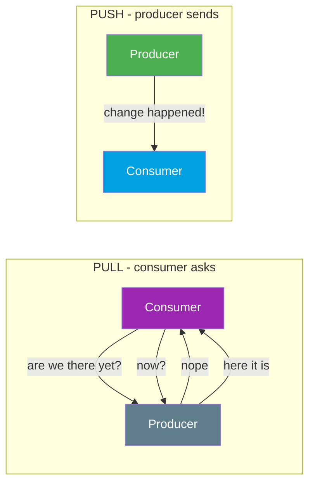
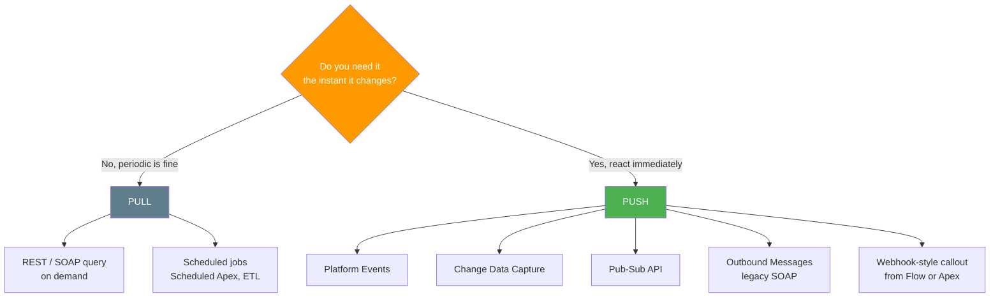

# 07 - Push, Pull, and Webhooks

> **One-liner**: **Pull** = the consumer asks for data when it wants it. **Push** = the producer sends data the moment something changes. A **webhook** is a push: an HTTP callback the producer fires to a URL the consumer registered in advance.
> **Why it matters**: This is the difference between data that is always a little stale and burns resources, versus data that arrives the instant it changes. Most "why is my integration so slow / so chatty" problems trace back to choosing pull where push belonged.
> **Core difference in one line**: Pull, **you go fetch it**. Push, **it comes to you**.

New here? Read [01-what-and-why-of-integration.md](01-what-and-why-of-integration.md), then [05](05-synchronous-vs-asynchronous.md) and [06](06-inbound-vs-outbound.md).

---

## 1. The idea in plain English

Think about how you find out the news.

**Pull** is **refreshing a news website**. Nothing reaches you until you go and ask. To stay current you have to keep hitting refresh, over and over, even when nothing has changed. Most of those refreshes are wasted, and between refreshes your view is out of date.

**Push** is a **breaking-news alert on your phone**. You signed up once, then you do nothing. The moment something happens, the alert lands. No wasted checks, no lag.

A **webhook** is the breaking-news alert formalized for software. The consumer says, "here is my URL, call it when X happens." The producer keeps that URL and fires an HTTP request to it the instant X happens. The consumer waits passively and reacts.

Polling (pull) is **wasteful and laggy**: most polls return "nothing new," and real changes wait until the next poll. Push is **efficient and fresh**: a message is sent only when there is something to say, and it arrives immediately.

---

## 2. The core difference + side-by-side comparison

| Dimension | Pull (polling) | Push (incl. webhooks) |
|---|---|---|
| **Who initiates** | The **consumer** asks. | The **producer** sends. |
| **Data freshness** | Stale between polls. Lag = polling interval. | Fresh. Arrives the moment it changes. |
| **Efficiency** | Wasteful. Most polls return nothing new. | Efficient. Traffic only when there is real news. |
| **Load pattern** | Constant, whether or not data changed. | Spiky. Matches the rate of actual change. |
| **Complexity** | Simple to build. Just call on a timer. | More moving parts. Endpoints, retries, ordering, security. |
| **Failure handling** | Easy. Missed a poll? Just poll again. | Harder. If the consumer is down, the push can be missed. Needs retry / replay. |
| **Best for** | Infrequent needs, batch syncs, simple jobs. | Real-time reactions, event-driven systems, instant updates. |

> **The trade-off in one line**: pull is **simple but laggy and chatty**. Push is **fresh and lean but needs more plumbing** (a live endpoint, retries, and security).

---

## 3. A concrete example

**Pull: nightly inventory sync.** A reporting tool calls the Salesforce REST API once a night to fetch the day's orders. Freshness does not matter. Yesterday's data is fine in the morning. A scheduled pull is simple and perfectly adequate.

**Push: notify shipping the instant an order is paid.** The moment an Opportunity flips to "Paid," the warehouse needs to know **now**, not at the next nightly poll. Salesforce publishes a **Platform Event** (or fires a callout to the warehouse's webhook URL). The warehouse reacts within seconds. Polling here would mean either an unacceptable delay or hammering the API every few seconds just in case.

---

## 4. How it shows up in Salesforce

Salesforce supports both, and importantly **does not use the word "webhook"** in its product names. It achieves the same outcome with **events** (consumers subscribe) and **callouts** (Salesforce fires an HTTP request to a registered URL).

**Pull in Salesforce (the consumer asks):**

- **REST / SOAP query**. An external system runs a SOQL query or GET request whenever it wants the current data.
- **Scheduled jobs**. Scheduled Apex or an external ETL tool polls on a timer (every night, every hour) to fetch what changed.

**Push in Salesforce (the producer sends):**

- **Platform Events**. Salesforce publishes a custom event. Subscribers receive it over a streaming channel. The event-driven backbone.
- **Change Data Capture (CDC)**. Salesforce automatically publishes an event whenever records are created, updated, deleted, or undeleted, carrying the changed fields. No code to publish.
- **Pub/Sub API**. The modern, unified, **gRPC-based** API to publish and subscribe to Platform Events, CDC, and real-time event-monitoring events. It uses binary **Avro** payloads over HTTP/2 and is the recommended subscriber interface.
- **Outbound Messages** (legacy). A workflow/Flow action that **pushes a SOAP message** to a registered endpoint URL when a record changes, up to **100 notifications** per message. This is the closest classic Salesforce feature to a webhook.
- **Webhook-style callouts from Flow or Apex**. To call an *external* webhook, Salesforce fires an **HTTP callout** (from a record-triggered Flow or Apex) to the URL the partner gave you. Salesforce is the producer pushing out.

> **Webhook, the Salesforce way**: a webhook is just "producer fires HTTP to a URL the consumer registered." Salesforce does the **inbound** side by *being* an endpoint (an Apex REST resource an external producer calls) and the **outbound** side by *firing* a callout or publishing an event. The mechanism has a different name, but the pattern is identical.

> **Why push beats polling for freshness.** Polling every 5 minutes means data is up to 5 minutes stale and you make 288 calls a day even on quiet days. A push delivers in seconds and sends nothing when nothing changed. Push trades that efficiency for needing a reliable listener.

---

## 5. When to use which + common confusions

| Confusion / trap | The clarification |
|---|---|
| "Salesforce has webhooks." | Not by that name. It uses **Platform Events / CDC / Pub-Sub API** (subscribe) and **callouts / Outbound Messages** (fire to a URL) to get the same result. |
| "Push is always better than pull." | Push is fresher and leaner, but needs a live, secured, retry-capable listener. For a nightly batch, a simple pull is the right call. |
| "Polling is real-time if I poll fast enough." | Fast polling fakes real-time at the cost of huge wasted load and still has lag. True push is event-driven and immediate. |
| "CDC is something I have to code to publish." | No. CDC publishes change events **automatically** when records change. You only write the subscriber. |
| "Platform Events are synchronous request/reply." | No. They are **push / fire-and-forget**. Publish and move on. The subscriber gets it later. See [05](05-synchronous-vs-asynchronous.md). |
| "Outbound Messages are modern." | They work and are reliable, but they are **legacy** (SOAP, tied to workflow). New designs prefer Platform Events, CDC, and Pub/Sub API. |
| "Pub/Sub API is a database query API." | No. It is the streaming **publish/subscribe** interface for events (Platform Events, CDC), gRPC-based, not for SOQL queries. |

**Rule of thumb**: need it the instant it changes → **push** (events / callouts). Periodic or on-demand is fine → **pull** (query / scheduled job).

---

## 6. Interview Q&A

**Q: Explain push vs pull.**
A: Pull means the consumer asks the producer for data when it wants it, often by polling on a timer. Push means the producer sends data to the consumer the moment something changes. Pull is simple but laggy and wasteful. Push is fresh and efficient but needs more infrastructure.

**Q: What is a webhook?**
A: A webhook is a push delivered over HTTP. The consumer registers a URL with the producer in advance, and the producer fires an HTTP request to that URL whenever the relevant event happens. It is a callback rather than something the consumer polls for.

**Q: Does Salesforce have webhooks?**
A: Not under that name. Salesforce achieves the same push pattern with Platform Events, Change Data Capture, and the Pub/Sub API for subscribers, and with HTTP callouts or legacy Outbound Messages when Salesforce fires to an external URL.

**Q: When would you poll instead of using events?**
A: When freshness is not critical and simplicity matters, such as a nightly or hourly batch sync, or when the external system cannot host a reliable listener endpoint. A scheduled pull is easy to build and easy to recover.

**Q: What is the downside of polling, and how does push fix it?**
A: Polling is laggy (data is stale between polls) and wasteful (most polls return nothing new, yet still consume API calls). Push fixes both by sending a message only when something changes, and delivering it within seconds.

**Q: Compare Outbound Messages with Platform Events.**
A: Both push data out, but Outbound Messages are legacy. They send a SOAP message to one endpoint, tied to workflow or Flow. Platform Events are the modern event bus. Many subscribers, richer payloads, and consumed over the Pub/Sub API. New designs favor Platform Events and CDC.

**Talking point to explain it to anyone**: "Pull is refreshing a website to see if anything changed. Push is a notification that pings you the instant it does. A webhook is just that notification, but for two apps."

---

## 7. Key terms

Push, pull, polling, webhook, callback, event, publish/subscribe, Platform Event, Change Data Capture, Pub/Sub API, Outbound Message, streaming — all defined in [02-core-vocabulary.md](02-core-vocabulary.md) and the [README glossary](README.md).

---

## Sources (Verified June 2026)

- [Pub/Sub API — Salesforce Developers](https://developer.salesforce.com/docs/platform/pub-sub-api/overview)
- [Platform Events Developer Guide — Salesforce Developers](https://developer.salesforce.com/docs/atlas.en-us.platform_events.meta/platform_events/platform_events_intro.htm)
- [Change Data Capture Developer Guide — Salesforce Developers](https://developer.salesforce.com/docs/atlas.en-us.change_data_capture.meta/change_data_capture/cdc_intro.htm)
- [Outbound Messaging — SOAP API Developer Guide](https://developer.salesforce.com/docs/atlas.en-us.api.meta/api/sforce_api_om_outboundmessaging.htm)
- [Subscribe to Platform Events with Pub/Sub API — Salesforce Developers](https://developer.salesforce.com/docs/atlas.en-us.platform_events.meta/platform_events/platform_events_subscribe_pubsub_api.htm)

---

*Next: [08-middleware-and-esb.md](08-middleware-and-esb.md) — the broker in the middle that connects many systems without point-to-point spaghetti.*
