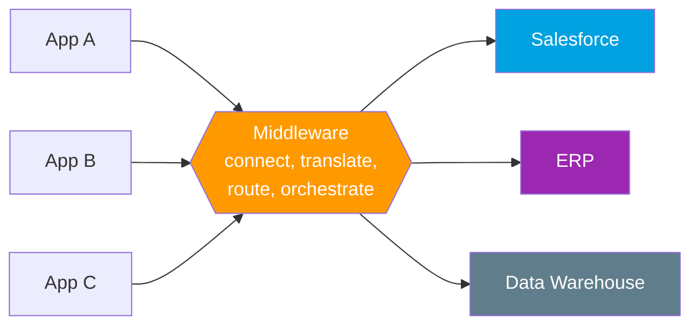
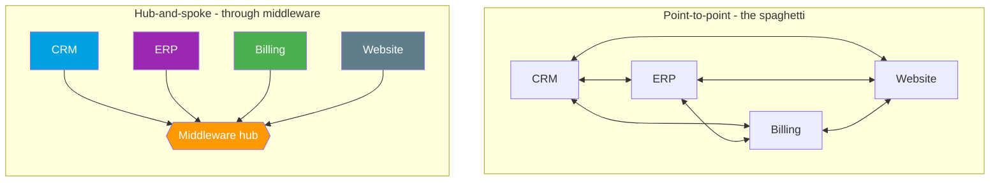
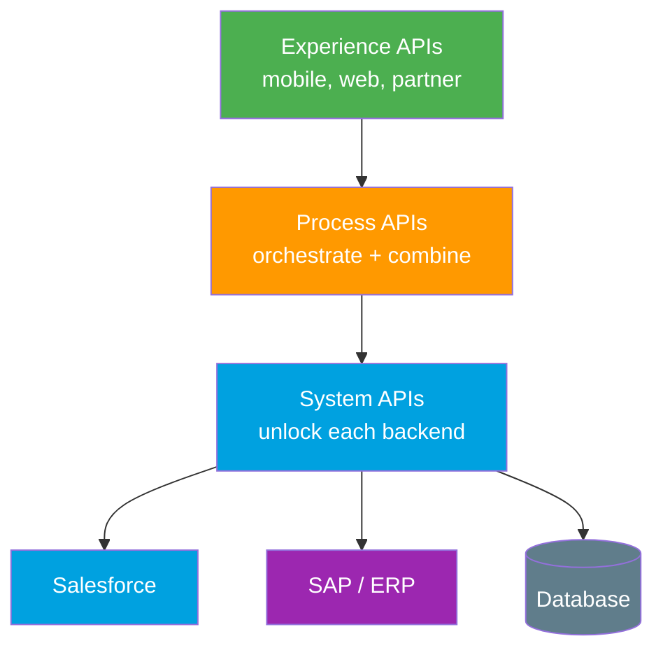

# 08 - Middleware and the ESB (the glue layer)

> **One-liner**: **Middleware** is software that sits *between* two systems and connects, translates, routes, and orchestrates the traffic between them.
> **Why it matters**: As soon as you have more than a couple of systems, wiring them directly to each other becomes a tangle. Middleware is the hub that keeps it clean, and **MuleSoft** (owned by Salesforce) is the name you must know.

New here? Read [01-what-and-why-of-integration.md](01-what-and-why-of-integration.md) first for the big picture.

---

## 1. The idea in plain English

Imagine an office where everyone needs to talk to everyone else. If each person runs their own phone wire to every other person, you get a wall of spaghetti. Add one new hire and you have to run a wire from them to *everybody*. Now picture a **switchboard** in the middle instead. Everyone plugs into the switchboard once, and it routes calls, translates languages, and keeps a log. Adding a new hire means **one** wire to the switchboard.

**Middleware is that switchboard for software.** It is the layer in the middle that:

- **Connects** systems that speak different protocols.
- **Translates** data from one format or shape into another.
- **Routes** a message to the right destination based on rules.
- **Orchestrates** multi-step flows ("call A, then B, then write to C").
- **Throttles** traffic so a slow system is not overwhelmed.

Without it, every system talks directly to every other system. That works for one or two links. It collapses at scale.

---

## 2. Point-to-point vs a middleware hub

This is the single most important picture in this file. The same six systems, two ways of wiring them.

In point-to-point, N systems can need up to **N x (N-1) / 2** connections. Six systems means up to 15 brittle links, each with its own auth, format, and error handling. In hub-and-spoke, each system connects **once** to the hub. The hub absorbs the change. Add a seventh system and you add one spoke, not six new wires.

---

## 3. ESB vs iPaaS (old hub vs new hub)

There are two generations of the "hub" idea. Interviewers like to hear that you know the difference and the direction of travel.

| | **ESB (Enterprise Service Bus)** | **iPaaS (Integration Platform as a Service)** |
|---|---|---|
| **Era** | 2000s, the classic enterprise hub | 2010s onward, the cloud-native hub |
| **Where it runs** | Usually **on-premises**, you host and patch it | **Cloud**, the vendor hosts and operates it |
| **Shape** | Heavy, central **bus** all traffic flows through | Lighter, often a mesh of managed **connectors** and APIs |
| **Scaling** | You buy and rack more hardware | Elastic, you turn a dial |
| **Cost model** | Big upfront license plus ops staff | Subscription, pay for what you use |
| **Strength** | Deep protocol support, mature in legacy estates | Fast to stand up, pre-built connectors, API management |
| **Examples** | TIBCO, IBM Integration Bus, older MuleSoft on-prem | **MuleSoft Anypoint Platform**, Boomi, Workato |

**Plain version**: an **ESB** is a heavy switchboard you buy, install, and run in your own server room. An **iPaaS** is the same idea rented as a cloud service, so you skip the hardware and get a library of ready-made plugs.

> **Note**: the line blurs in practice. Modern MuleSoft can run in the cloud, on-prem, or hybrid. The clean exam answer is "ESB = older, heavy, often on-prem hub; iPaaS = modern, cloud, subscription hub."

---

## 4. MuleSoft - the name to know

**MuleSoft** makes the **Anypoint Platform**, the leading **iPaaS**. Salesforce **acquired MuleSoft in 2018**, so when an interviewer asks "how does Salesforce do enterprise integration at scale?", MuleSoft is the headline answer.

What to remember:

- **API-led connectivity** is MuleSoft's signature methodology. MuleSoft pioneered the idea. Instead of one-off integrations, you build **reusable, purposeful APIs** in three tiers and compose them:
  - **System APIs** unlock a backend (Salesforce, SAP, a database).
  - **Process APIs** combine and orchestrate data across systems.
  - **Experience APIs** shape that data for a specific channel (mobile, web, partner).
- **Anypoint Platform** bundles iPaaS **and** full lifecycle **API management** (design, deploy, secure, monitor) in one place.
- It sells reuse as the win: build the "Customer" System API once, reuse it everywhere, instead of re-integrating Salesforce for every project.

> **Platform note**: from inside Salesforce you can directly invoke MuleSoft APIs and flows, which is why the two are pitched as one connected stack. You do **not** need MuleSoft for every integration. A single Apex callout to one API needs no middleware at all.

---

## 5. When you need middleware (and when you don't)

| Reach for middleware when... | Direct point-to-point is fine when... |
|---|---|
| You have **many systems** to connect, not two. | You have **one or two** simple connections. |
| Systems need **data transformation** between formats or shapes. | Both sides already speak the same format. |
| You need **orchestration** across several steps or systems. | It is a single request to a single endpoint. |
| You must **throttle or buffer** to protect a slow downstream. | Volume is low and steady. |
| You are **bridging protocols** (e.g. HTTP to a message queue, SOAP to REST). | Both sides speak the same protocol. |
| You want **central logging, monitoring, and reuse**. | The link is one-off and unlikely to grow. |

**Rule of thumb**: middleware buys you decoupling and reuse at the cost of another system to run and pay for. Justify it with the **number of connections and the need to transform or orchestrate**, not because it sounds enterprise-grade.

---

## 6. Interview Q&A

**Q: What is middleware?**
A: Software that sits between two or more systems and connects, translates, routes, and orchestrates the data flowing between them. It is the switchboard in the middle instead of a wire between every pair of systems.

**Q: Point-to-point vs hub-and-spoke. Why does it matter?**
A: Point-to-point connects every system directly, so connections grow roughly with the square of the number of systems and become brittle spaghetti. A middleware hub has each system connect once to the center, so adding a system adds one spoke. It trades direct simplicity for decoupling and reuse.

**Q: ESB vs iPaaS?**
A: An ESB is the older, heavy, often on-premises enterprise bus you host yourself. An iPaaS is the modern cloud version, delivered as a subscription with pre-built connectors and API management. MuleSoft's Anypoint Platform is the leading iPaaS.

**Q: What is MuleSoft and how does it relate to Salesforce?**
A: MuleSoft makes the Anypoint Platform, the leading iPaaS, and is known for API-led connectivity. Salesforce acquired it in 2018, so it is Salesforce's enterprise integration and API management offering. You can invoke MuleSoft APIs directly from Salesforce.

**Q: When would you NOT use middleware?**
A: When you have only one or two simple connections, both sides speak the same protocol and format, and there is no orchestration or throttling needed. A single Apex callout to one REST API does not need a hub. Adding middleware there is overhead with no payoff.

**Talking point to explain it to anyone**: "It is the difference between everyone in the office running a phone wire to everyone else, versus everyone plugging into one switchboard in the middle that routes and translates the calls."

---

## 7. Key terms

Middleware, ESB, iPaaS, MuleSoft, Anypoint Platform, API-led connectivity, hub-and-spoke, point-to-point, orchestration, throttling, protocol bridging - defined in [02-core-vocabulary.md](02-core-vocabulary.md) and the [README glossary](README.md).

---

## Sources (Verified June 2026)

- [What is MuleSoft? - Salesforce](https://www.salesforce.com/mulesoft/what-is-mulesoft/)
- [MuleSoft Anypoint Platform - Salesforce](https://www.salesforce.com/mulesoft/anypoint-platform/)
- [Integration Patterns and Practices (v66.0, Spring '26) - Salesforce Architect](https://architect.salesforce.com/docs/architect/fundamentals/guide/integration-patterns.html)

---

*Next: [09-three-layers-transport-format-auth.md](09-three-layers-transport-format-auth.md) - the single mental model that every integration is built from.*
