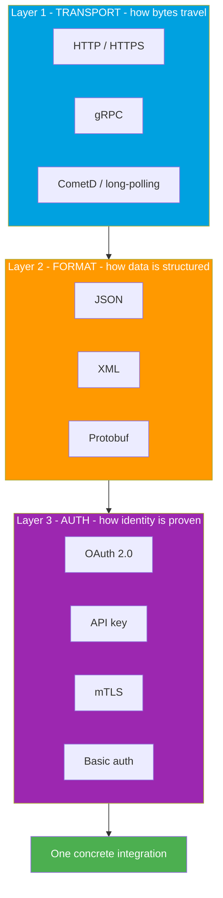

# 09 - The Three Layers: Transport, Format, Auth

> **One-liner**: **Every** integration is built from three layers - how the bytes **travel** (transport), how the data is **structured** (format), and how identity is **proven** (auth).
> **Why it matters**: This is the capstone mental model of Module 01. Once you see it, choosing an integration becomes "pick one from each layer," and any Salesforce API stops being a mystery.

New here? Read [01-what-and-why-of-integration.md](01-what-and-why-of-integration.md) first.

---

## 1. The idea in plain English

Think about **mailing a letter**. Three things must be true for it to work:

1. **A way to travel** - the postal road, a truck, a plane. *(Transport)*
2. **A language inside the envelope** - English, French, a shared alphabet. *(Format)*
3. **Proof of who sent it** - a return address, a signature, a wax seal. *(Auth)*

Change any one and the other two still apply. You can send English by truck or by plane. You can sign a letter written in any language. The three concerns are **independent**, and you choose one option for each.

**Software integration is identical.** Every single integration, no matter the vendor, answers the same three questions:

- **TRANSPORT** - how do the bytes physically move between the two systems?
- **FORMAT** - how is the data inside structured so both sides understand it?
- **AUTH** - how does the caller prove it is allowed to do this?

Choosing an integration = picking one option from each layer. For example:

> **A Salesforce REST API call = HTTPS (transport) + JSON (format) + OAuth 2.0 Bearer token (auth).**

That one sentence is the whole module in a nutshell.

---

## 2. The three layers (the signature visual)



Read it top to bottom: **pick a transport, pick a format, pick an auth method**, and the combination *is* your integration. Different Salesforce APIs simply make different picks.

---

## 3. The three layers, one at a time

### Transport - how the bytes travel
The pipe the data flows through.

| Option | What it is | Where you see it |
|---|---|---|
| **HTTP / HTTPS** | The web's request/response protocol. HTTPS is HTTP wrapped in TLS encryption. | Nearly all Salesforce APIs. The default. |
| **gRPC** | A fast binary protocol over HTTP/2, great for streaming. | Salesforce **Pub/Sub API**. |
| **CometD / long-polling** | A technique to push events over HTTP by holding the connection open. | Salesforce **Streaming API**, PushTopics, generic events. |

### Format - how the data is structured
The shape of the payload once it arrives. (Deep dive in [04-json-vs-xml.md](04-json-vs-xml.md).)

| Option | What it is | Where you see it |
|---|---|---|
| **JSON** | Lightweight, human-readable key/value text. The modern default. | REST API, Bulk API 2.0. |
| **XML** | Verbose, tag-based, strongly typed via schema. | SOAP API. |
| **Protobuf** | Compact binary format defined by a schema. Small and fast. | Pub/Sub API (paired with gRPC). |

### Auth - how identity is proven
The proof the caller is allowed in. (Whole of [Module 03](../03-Authentication/01-authentication-fundamentals.md).)

| Option | What it is | Where you see it |
|---|---|---|
| **OAuth 2.0** | Token-based authorization. A short-lived **Bearer** token unlocks the API. | The standard for Salesforce APIs. |
| **API key** | A single shared secret string passed on each call. | Common on simple third-party APIs. |
| **mTLS** | Both client and server present certificates. Mutual proof. | High-security B2B links, some Named Credential setups. |
| **Basic auth** | Username and password base64-encoded. Weakest. Avoid. | Legacy systems only. |

---

## 4. A concrete example

A web form on your company site needs to create a Lead in Salesforce. Walk the three layers:

1. **Transport** - the form posts over **HTTPS** so the data is encrypted in transit.
2. **Format** - the body is **JSON**: `{ "LastName": "Khan", "Company": "Acme" }`.
3. **Auth** - the server attaches an **OAuth 2.0 Bearer token** in the `Authorization` header.

Put together, the call is:

```
POST https://MyDomainName.my.salesforce.com/services/data/v66.0/sobjects/Lead
Authorization: Bearer 00D...!AQ...
Content-Type: application/json

{ "LastName": "Khan", "Company": "Acme" }
```

`POST ... HTTPS` is the **transport**. `Content-Type: application/json` and the body are the **format**. `Authorization: Bearer ...` is the **auth**. Three layers, one request.

---

## 5. How it shows up in Salesforce (the mapping table)

This table is worth memorizing. Name any Salesforce API and you can recite its three layers.

| Salesforce API | Transport | Format | Typical Auth | Best for |
|---|---|---|---|---|
| **REST API** | HTTPS | JSON (XML optional) | OAuth 2.0 Bearer | Most modern integrations, single/small record ops |
| **SOAP API** | HTTPS | XML | OAuth 2.0 Bearer or Session ID | Legacy clients, strongly typed contracts (WSDL) |
| **Bulk API 2.0** | HTTPS | JSON / CSV | OAuth 2.0 Bearer | Large data loads, asynchronous batches |
| **Pub/Sub API** | gRPC over HTTP/2 | Protobuf | OAuth 2.0 Bearer | Event streaming, publish and subscribe |
| **Streaming API** | CometD / long-polling over HTTPS | JSON | OAuth 2.0 Bearer | Pushing change/platform events to subscribers |

> **Pattern to notice**: the **auth layer is almost always OAuth 2.0** across Salesforce. What really differs between APIs is the **transport** and **format**. That is why Module 03 (auth) is largely shared across every API, while transport and format are what you pick per use case.

---

## 6. Common confusions and interview traps

| Confusion | The clarification |
|---|---|
| "REST vs SOAP is the whole choice." | REST vs SOAP bundles a transport and format choice. The three-layer model breaks it into separate decisions, which is clearer. See [03-rest-vs-soap.md](03-rest-vs-soap.md). |
| "JSON is a protocol." | JSON is a **format**, not a transport. It travels *over* HTTP. Mixing the layers is a classic slip. |
| "HTTPS is the security, so I'm done." | HTTPS secures the **transport** (encryption in transit). It does not prove **who** is calling. You still need an auth layer. |
| "OAuth is encryption." | OAuth is **auth** (proving identity and permission). Encryption is the transport's job (TLS). Different layers. |
| "Pub/Sub API is just REST." | No. It uses **gRPC + Protobuf**, a different transport and format from REST's HTTPS + JSON. |

---

## 7. Interview Q&A

**Q: Give me a single mental model for any integration.**
A: Three independent layers. Transport is how the bytes travel (HTTP/HTTPS, gRPC, CometD). Format is how the data is structured (JSON, XML, Protobuf). Auth is how identity is proven (OAuth 2.0, API key, mTLS, Basic). Every integration picks one from each.

**Q: Break a Salesforce REST call into the three layers.**
A: Transport is HTTPS, format is JSON, auth is an OAuth 2.0 Bearer token in the Authorization header. Change the transport or format and you have a different API, but the auth layer stays OAuth in nearly all cases.

**Q: How does Pub/Sub API differ from REST API in this model?**
A: Same auth layer (OAuth 2.0), but a different transport and format. Pub/Sub uses gRPC over HTTP/2 with Protobuf, which is binary and efficient for streaming, whereas REST uses HTTPS with JSON.

**Q: HTTPS already encrypts the call. Why do I still need OAuth?**
A: Different layers solving different problems. HTTPS (transport) protects the data in transit so it cannot be read or tampered with. OAuth (auth) proves the caller is who they claim and is allowed to do this. Encryption is not identity.

**Q: Where does this model send you next when designing an integration?**
A: Transport choice points you at which API to use, format is detailed in the data formats file, and auth is the whole of Module 03. The model turns one big decision into three smaller, well-scoped ones.

**Talking point to explain it to anyone**: "It is like mailing a letter. You need a way to travel, a language inside, and proof of who sent it. Software picks one of each, and that combination is the integration."

---

## 8. Key terms

Transport, format, auth, HTTP/HTTPS, gRPC, CometD, long-polling, JSON, XML, Protobuf, OAuth 2.0, Bearer token, API key, mTLS, Basic auth - defined in [02-core-vocabulary.md](02-core-vocabulary.md) and the [README glossary](README.md). Auth detail lives in [Module 03](../03-Authentication/01-authentication-fundamentals.md). Format detail lives in [04-json-vs-xml.md](04-json-vs-xml.md).

---

## Sources (Verified June 2026)

- [Which API Do I Use? - Salesforce Help](https://help.salesforce.com/s/articleView?id=sf.integrate_what_is_api.htm&type=5)
- [REST API Developer Guide (v66.0, Spring '26) - Salesforce Developers](https://developer.salesforce.com/docs/atlas.en-us.api_rest.meta/api_rest/intro_what_is_rest_api.htm)
- [Pub/Sub API Documentation - Salesforce Developers](https://developer.salesforce.com/docs/platform/pub-sub-api/overview)
- [SOAP API Developer Guide - Salesforce Developers](https://developer.salesforce.com/docs/atlas.en-us.api.meta/api/sforce_api_quickstart_intro.htm)

---

*Next: [10-salesforce-as-a-platform.md](10-salesforce-as-a-platform.md) - why "platform" changes how you design every integration.*
