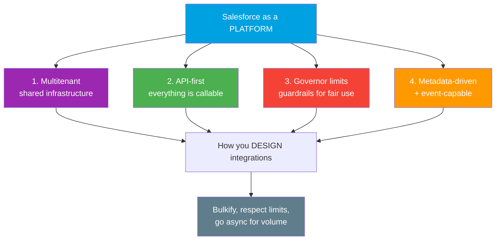
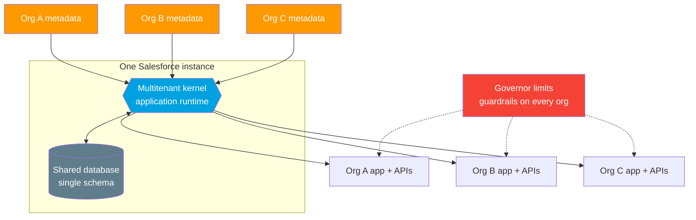
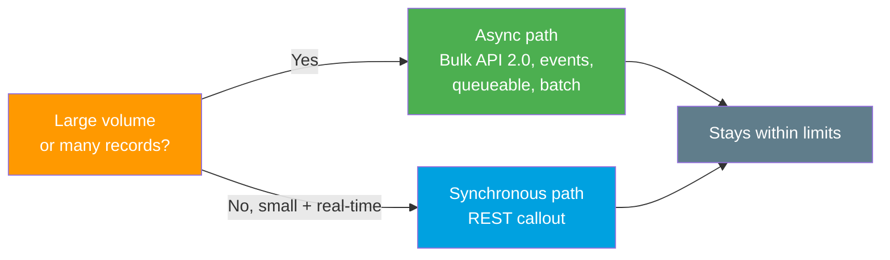

# 10 - Salesforce as a Platform (why it changes integration)

> **One-liner**: Salesforce is not just an app you log into. It is a **multitenant, metadata-driven platform** with APIs on everything and strict limits, and those four traits shape how you must design every integration.
> **Why it matters**: If you design an integration as if Salesforce were a private server you own, you will hit runtime errors in production. Understanding the platform is what separates a junior from a senior integration engineer.

This is the final file of Module 01. It ties the whole module together.

---

## 1. The idea in plain English

A regular app is like a **single house** you own. You control the wiring, you can run the dishwasher and the dryer at the same time, nobody else is affected.

Salesforce is like an **apartment building**. Many tenants share the same plumbing, the same electrical supply, the same elevators. To keep it fair and safe, the building has **rules**: don't run every appliance at once, don't hog the elevator, quiet hours apply. The building manager (Salesforce) enforces those rules automatically, and if you break them, the power to your unit trips.

That apartment building is **multitenancy**, and the rules are **governor limits**. Once you internalize that you are a tenant sharing infrastructure, every design decision in this module makes sense.

---

## 2. The four traits that matter

### 1. Multitenant
Many customers share the same infrastructure. A **single instance** of Salesforce runs a **shared multitenant database** and a **multitenant kernel** (the application runtime). The kernel reads each tenant's **metadata** and serves up an app that behaves like it is yours alone. This is why your org feels private even though you share servers with thousands of others.

### 2. API-first
Nearly everything you can do in the Salesforce UI is also available through an **API**. Creating records, running queries, deploying metadata, subscribing to events - all callable programmatically. This is *why* integration is a first-class skill on this platform and not an afterthought.

### 3. Governor limits
Because resources are shared, Salesforce **strictly enforces limits** so no single tenant can starve the others. Exceed a limit and you get a **runtime error**, not a slow response. Limits are the guardrails of multitenancy. (Detailed below.)

### 4. Metadata-driven and event-capable
Your objects, fields, validation rules, and logic are stored as **metadata** that the kernel materializes at runtime. The platform is also **event-capable**: it can publish and subscribe to events (Platform Events, Change Data Capture), enabling real-time, decoupled integration.

---

## 3. The metadata-driven kernel serving many orgs

One kernel, one shared database, but each org's **metadata** makes it behave like its own application. The **governor limits** wrap every org as guardrails, keeping one tenant from hurting the rest.

---

## 4. Governor limits (the ones that bite integrations)

These exist purely because the platform is shared. Know that they exist and roughly what they cap. Exact numbers vary by edition and change across releases, so describe them rather than memorizing figures unless you have checked the current docs.

| Limit | What it caps | Why it matters for integration |
|---|---|---|
| **Total API requests per 24 hours** | A daily **allocation** of API calls for the whole org. For paid editions it starts in the low hundreds of thousands and scales with the licenses you own. It is a soft limit meant for bursts, not for planning normal volume on. | A chatty integration that makes a call per record can blow the daily allocation. Batch your calls. |
| **Concurrent long-running requests** | The number of synchronous API/Apex requests that can run at once **once a request exceeds about 5 seconds**. The org-wide cap is small (single digits to low tens). | Several slow synchronous callouts at once can lock out other traffic. Keep calls fast or go async. |
| **Callouts per transaction** | The number of HTTP callouts a single Apex transaction may make, plus a cap on total callout time per transaction. | You cannot loop over thousands of records firing one callout each. Aggregate or move to async/batch. |
| **Callout timeout** | How long a single callout may wait, with a configurable default and a hard maximum. | A hung external service will not hang forever. Set sensible timeouts and handle failures. |
| **Per-transaction Apex limits** | SOQL queries, DML statements, CPU time, and heap per transaction. | Inbound integrations that trigger Apex must be **bulkified** to survive a 200-record batch. |

> **Important**: treat the precise allocation numbers as "look it up for the current release and edition." The interview-safe move is to **describe** the limit and the design response, not to quote a figure you might get wrong. (Verified ranges are in Sources below.)

---

## 5. Why this changes how you design integrations

This is the payoff of the whole module. Because Salesforce is a shared platform with limits, three habits are mandatory:

| Habit | What it means | Driven by |
|---|---|---|
| **Bulkify** | Process records in **sets**, not one at a time. One query and one DML for 200 records, never 200 of each. | Per-transaction SOQL/DML limits |
| **Respect API allocations** | Count your calls. Use composite or batch endpoints to do more per request. Monitor daily usage. | Daily API request allocation |
| **Go async for volume** | For large data, use **Bulk API 2.0**, Platform Events, future/queueable Apex, or batch jobs instead of synchronous calls. | Concurrent + callout + timeout limits |

**One sentence to carry forward**: on a shared platform you design for *fairness and scale*, which in practice means bulkify, count your API calls, and prefer async for anything large.

---

## 6. Common confusions and interview traps

| Confusion | The clarification |
|---|---|
| "Limits are bugs / Salesforce being stingy." | Limits are the **price of multitenancy**. They guarantee one tenant cannot degrade everyone else. Design within them, do not fight them. |
| "I'll just retry until it works." | Hitting a limit throws a **runtime error**. Blind retries make it worse. Fix the design (bulkify, async) instead. |
| "Metadata-driven just means customizable." | It is deeper: the **kernel materializes your app from metadata at runtime**, which is what lets one instance serve many distinct orgs. |
| "API-first is marketing." | It is literal. Almost every UI action has an API equivalent, which is exactly why integration is so central to the platform. |
| "Governor limits only matter for Apex." | They also cap **API usage** (daily allocation, concurrency, callouts). Inbound and outbound integrations both feel them. |

---

## 7. Interview Q&A

**Q: What does it mean that Salesforce is a platform, not just an app?**
A: It is multitenant (many customers share one infrastructure), metadata-driven (a kernel builds each org's app from metadata at runtime), API-first (nearly everything in the UI is also callable through an API), and event-capable. Those traits, plus enforced limits, shape every integration you build on it.

**Q: What is multitenancy and why should an integration engineer care?**
A: Many customers share the same database and application kernel, isolated by metadata. You care because shared resources mean enforced governor limits. You must bulkify, watch your API allocation, and design for fairness, since you are not the only tenant.

**Q: What are governor limits and why do they exist?**
A: Runtime caps on resources like API calls per day, concurrent long-running requests, callouts per transaction, and per-transaction SOQL/DML/CPU. They exist because the platform is shared, so no single tenant can monopolize resources. Exceeding one throws a runtime error.

**Q: How do platform limits change your integration design?**
A: Three ways. Bulkify so logic handles record sets, not singletons. Respect the daily API allocation by batching calls and using composite endpoints. Go asynchronous for large volume using Bulk API 2.0, Platform Events, or async Apex, rather than many synchronous calls.

**Q: A nightly job needs to load two million records. How do you approach it given the platform?**
A: Not record-by-record through the REST API, which would burn the daily allocation and hit concurrency limits. Use Bulk API 2.0, which is asynchronous and built for large volumes, processing data in server-side batches that respect the shared-platform constraints.

**Talking point to explain it to anyone**: "Salesforce is an apartment building, not a private house. Everyone shares the plumbing, so there are house rules. Design your integration like a good neighbor: don't run every appliance at once, and do the big laundry loads off-peak."

---

## 8. Key terms

Platform, multitenant, metadata-driven, kernel, API-first, governor limits, API request allocation, concurrent requests, bulkify, asynchronous, Platform Events, Bulk API 2.0 - defined in [02-core-vocabulary.md](02-core-vocabulary.md) and the [README glossary](README.md).

---

## Sources (Verified June 2026)

- [Platform Multitenant Architecture - Salesforce Architect](https://architect.salesforce.com/docs/architect/fundamentals/guide/platform-multitenant-architecture.html)
- [API Request Limits and Allocations - Salesforce Developer Limits Quick Reference](https://developer.salesforce.com/docs/atlas.en-us.salesforce_app_limits_cheatsheet.meta/salesforce_app_limits_cheatsheet/salesforce_app_limits_platform_api.htm)
- [Execution Governors and Limits - Apex Developer Guide](https://developer.salesforce.com/docs/atlas.en-us.apexcode.meta/apexcode/apex_gov_limits.htm)
- [Callout Limits and Limitations - Apex Developer Guide](https://developer.salesforce.com/docs/atlas.en-us.apexcode.meta/apexcode/apex_callouts_timeouts.htm)
- [API Limits and Monitoring Your API Usage - Salesforce Developers Blog](https://developer.salesforce.com/blogs/2024/11/api-limits-and-monitoring-your-api-usage)

---

*Next: back to the [README.md](README.md) module index. From here, the natural continuation is **Module 02 - Integration Patterns**, where these fundamentals turn into concrete design choices (request/reply, fire-and-forget, batch, data virtualization, and more).*
