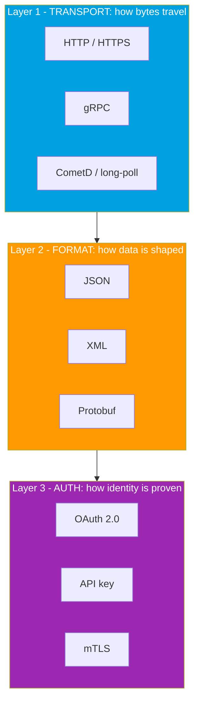
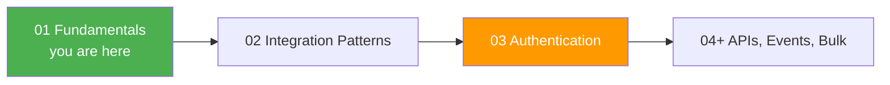

# Module 01 - Fundamentals

> **Goal**: Build the mental model. Just vocabulary and pictures, so every later module makes sense.
> **API version**: v66.0 (Spring '26). **Outcome**: you can explain integration to a non-technical person in **one minute** and define every core term without hesitating.

This module is the foundation for the whole vault. Read the files in order (01 → 10), or jump to a concept via the map below. Everything later (Authentication, APIs, Events, Bulk) assumes the words and ideas defined here.

---

## How to use this module

1. Start with **[01-what-and-why-of-integration.md](01-what-and-why-of-integration.md)** for the big picture and the three questions every integration answers.
2. Lock in the vocabulary with **[02-core-vocabulary.md](02-core-vocabulary.md)**, then work through the "vs" files (they are short and high-yield).
3. Finish with **[09](09-three-layers-transport-format-auth.md)** (the capstone model) and **[10](10-salesforce-as-a-platform.md)** (why Salesforce is special).
4. Use the **glossary table** below as your quick-reference cheat sheet.

---

## Map of this module

| # | File | What it covers |
|---|---|---|
| 01 | [what-and-why-of-integration](01-what-and-why-of-integration.md) | What integration is, why integrate Salesforce, the 3 questions |
| 02 | [core-vocabulary](02-core-vocabulary.md) | API, endpoint, payload, request/response, HTTP methods, status codes |
| 03 | [rest-vs-soap](03-rest-vs-soap.md) | The two API styles + the SOAP `login()` retirement |
| 04 | [json-vs-xml](04-json-vs-xml.md) | The two data formats, side by side |
| 05 | [synchronous-vs-asynchronous](05-synchronous-vs-asynchronous.md) | Wait-for-it vs fire-and-continue |
| 06 | [inbound-vs-outbound](06-inbound-vs-outbound.md) | Who calls whom, relative to Salesforce |
| 07 | [push-pull-and-webhooks](07-push-pull-and-webhooks.md) | How data moves, and what a webhook is |
| 08 | [middleware-and-esb](08-middleware-and-esb.md) | The glue layer: ESB vs iPaaS / MuleSoft |
| 09 | [three-layers-transport-format-auth](09-three-layers-transport-format-auth.md) | The capstone model behind every integration |
| 10 | [salesforce-as-a-platform](10-salesforce-as-a-platform.md) | Multitenant, API-first, governor limits |

---

## The one model that ties it all together

Every integration is just **one choice from each of three layers**. Pin this picture and the rest is detail.

Example: a **Salesforce REST API call = HTTPS + JSON + OAuth 2.0 Bearer token**. Full detail in [09-three-layers-transport-format-auth.md](09-three-layers-transport-format-auth.md).

---

## Vocabulary quick-reference (glossary)

| Term | One-line meaning |
|---|---|
| **API** | A contract that lets one system request data or actions from another. |
| **Endpoint** | The specific URL an API request is sent to. |
| **Instance / Base URL** | Your org's host, e.g. `https://MyDomain.my.salesforce.com`. |
| **Request / Response** | The message you send, and the answer you get back. |
| **Payload** | The body of a request or response (the actual data). |
| **Header** | Metadata on a request, e.g. `Authorization`, `Content-Type`. |
| **HTTP method** | The verb: GET (read), POST (create), PATCH/PUT (update), DELETE (remove). |
| **Status code** | Result of a call: 2xx success, 4xx your fault, 5xx server fault. |
| **REST** | Lightweight, resource-based API style, usually JSON. The modern default. |
| **SOAP** | Strict XML-envelope API style with a WSDL contract. Mature, heavier. |
| **JSON** | Compact key/value data format, native to the web. |
| **XML** | Verbose tag-based data format, used by SOAP and Metadata. |
| **Synchronous** | The caller waits for the response before continuing. |
| **Asynchronous** | The caller fires the request and continues; result comes later. |
| **Inbound** | An external system calls **into** Salesforce. |
| **Outbound** | Salesforce calls **out** to an external system. |
| **Pull** | The consumer asks for data when it wants it (polling). |
| **Push** | The producer sends data the moment something changes. |
| **Webhook** | An HTTP callback fired to a registered URL (a push). |
| **Middleware** | Software between systems that connects, translates, and routes. |
| **ESB / iPaaS** | Old on-prem hub (ESB) vs modern cloud integration platform (iPaaS, e.g. MuleSoft). |
| **Multitenant** | Many customers share infrastructure; metadata makes each org unique. |
| **Governor limit** | A cap Salesforce enforces so no tenant hogs shared resources. |
| **API allocation** | Your org's quota of API calls per rolling 24 hours. |

---

## What changed worth knowing (2025-2026)

- **SOAP API `login()` is retiring** in **Summer '27** (not available in API v65.0+, disabled by default in new orgs). Migrate API authentication to **OAuth** via External Client Apps. Detail in [03-rest-vs-soap.md](03-rest-vs-soap.md) and Module 03.
- **REST + JSON** is the default for new builds; SOAP + XML is legacy-but-supported.
- For real-time event push, **Pub/Sub API** is the modern choice over older Streaming API.

---

## Where this leads

After this module you have the vocabulary. **Module 02 (Integration Patterns)** teaches when to use each style, and **Module 03 (Authentication)** is already built out in full.

---

## Sources (Verified June 2026)

- [Integration Patterns and Practices (v66.0) — Salesforce Architect](https://architect.salesforce.com/docs/architect/fundamentals/guide/integration-patterns.html)
- [Platform Multitenant Architecture — Salesforce Architect](https://architect.salesforce.com/docs/architect/fundamentals/guide/platform-multitenant-architecture.html)
- [SOAP API login() Retirement — Salesforce Help](https://help.salesforce.com/s/articleView?id=005132110&type=1)
- [Salesforce Developers — API documentation](https://developer.salesforce.com/docs/apis)

*Each topic file has its own Sources section with the specific official docs.*
