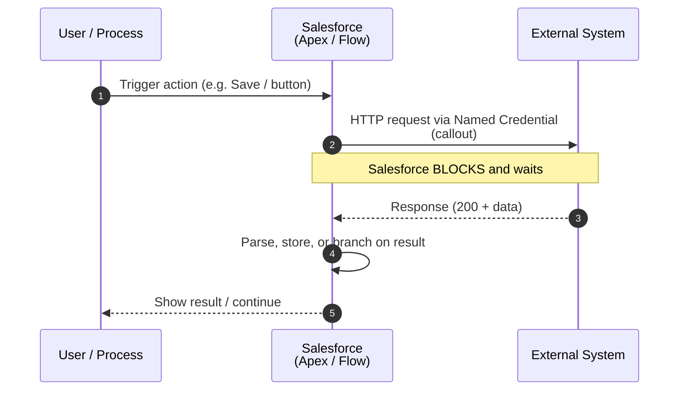

# 01 - Request and Reply

> **One-liner**: Salesforce calls an external system, **waits** for the answer, and uses it right away.
> **Direction**: Salesforce → External (outbound). **Timing**: Synchronous. **Volume**: Low, one record/transaction at a time.
> **Use when**: A user or process needs an **immediate response** before continuing.

This is Module 02, the integration patterns. New to the vocabulary (sync/async, inbound/outbound)? See [Module 01](../01-Fundamentals/README.md). For the auth behind callouts, see [Module 03](../03-Authentication/README.md).

---

## 1. The idea in plain English

Request and Reply is a **phone call**. You dial, you ask your question, and you **stay on the line** until the other person answers. You cannot continue your day until you hear back. If they do not pick up, or take too long, your whole call fails.

In Salesforce terms: Apex (or Flow) makes an **HTTP callout** to an external service, the user or transaction **blocks** until the response arrives, and the result is shown or saved immediately. Think of a rep clicking "Check Credit Score" and seeing the score appear two seconds later. That round-trip, in-the-moment answer is the whole pattern.

---

## 2. When to use it (and when not)

| ✅ Use it when | ❌ Avoid / use something else |
|---|---|
| You need the response **right now** to continue (validate, enrich, display). | You do not need an answer back → [02-fire-and-forget.md](02-fire-and-forget.md). |
| The work is **one record / small** and the external system is **fast**. | High volume or bulk loads → [03-batch-data-synchronization.md](03-batch-data-synchronization.md). |
| A **user is waiting** at the screen, or a process must branch on the result. | The external call is **slow/long-running** (risk of timeout). |

**Real-world examples**: real-time **credit check** during loan creation, **address validation** on a form, fetching live **inventory/price** before quoting, a **payment authorization** call.

---

## 3. How it works (sequence diagram)



**Walkthrough**

1. A user action or process kicks off the transaction.
2. Apex or Flow makes an outbound **HTTP callout** (through a Named Credential, so no hardcoded secrets).
3. Salesforce **waits synchronously** for the reply. The transaction is paused.
4. The external system returns data.
5. Salesforce parses it and acts (saves a field, makes a decision).
6. Control returns to the user with the result.

---

## 4. How it shows up in Salesforce (the tech)

| Tool | What it is | Use it for |
|---|---|---|
| **Apex HTTP callout** | `HttpRequest`/`Http` classes calling a REST endpoint via `callout:NamedCredential`. | Custom logic, full control over request/response. |
| **External Services** | Declarative import of an OpenAPI spec; generates invocable actions for Flow. | Low-code request/reply from Flow, no Apex. |
| **Flow HTTP Callout** | Declarative callout action configured in Flow. | Admin-built real-time calls. |
| **Apex SOAP callout** | Generated stub from a WSDL. | Legacy SOAP services. |

Minimal Apex shape (note the **Named Credential**, never a hardcoded URL or token):

```apex
HttpRequest req = new HttpRequest();
req.setEndpoint('callout:Credit_Service/score?ssn=' + ssn);
req.setMethod('GET');
req.setTimeout(120000); // max 120s
HttpResponse res = new Http().send(req);
if (res.getStatusCode() == 200) {
    Map<String,Object> body = (Map<String,Object>) JSON.deserializeUntyped(res.getBody());
    // use body, save to record
}
```

> **Auth**: outbound callouts authenticate with a **Named Credential + External Credential**. See [Module 03 - Named Credentials](../03-Authentication/14-named-credentials-and-external-credentials.md).

---

## 5. Design considerations and gotchas

| Consideration | Why it matters | What to do |
|---|---|---|
| **Callout timeout** | Max **120 seconds** per callout; default 10s. A slow service kills the transaction. | Keep services fast. Set a sensible `setTimeout`. If slow, switch to async. |
| **Callouts per transaction** | Max **100** callouts per Apex transaction. | Batch logic; do not loop callouts per record. |
| **No callouts after DML (uncommitted)** | You cannot call out after a pending DML in the same transaction. | Call out first, or use async (`@future(callout=true)`, Queueable). |
| **User is blocked** | Synchronous means the user waits. | Only use for genuinely fast calls. |
| **Error handling** | The external system may be down or slow. | Handle non-200 codes, timeouts, and retries gracefully. |
| **Idempotency** | A retry could double-charge or double-create. | Make requests safe to repeat where possible. |

---

## 6. Interview Q&A

**Q: What is the Request and Reply pattern?**
A: Salesforce calls an external system synchronously and waits for the response before continuing. It is for real-time, low-volume calls where you need the answer immediately, like a credit check at the point of sale.

**Q: How do you implement it in Salesforce?**
A: An Apex HTTP callout (or Flow HTTP Callout / External Services for low-code), authenticated through a Named Credential. The transaction blocks until the response returns.

**Q: What are the main limits to watch?**
A: 120-second max callout timeout, 100 callouts per transaction, and you cannot make a callout after uncommitted DML. If the service is slow or volume is high, move to async or batch instead.

**Q: How is this different from Fire and Forget?**
A: Request and Reply **waits** for and uses the response. Fire and Forget sends a message and moves on without waiting. Use Reply when the result drives the next step, Forget when it does not.

**Q: The external API takes 5 minutes. Now what?**
A: Do not hold a synchronous transaction. Switch to an asynchronous approach: queue the work (Queueable/`@future`) or redesign as Fire and Forget with a callback, so the user is not blocked and you avoid the timeout.

**Talking point to explain it to anyone**: "It's a phone call. You ask, you wait on the line, you get your answer, then you act on it."

---

## 7. Key terms

HTTP callout, Named Credential, synchronous, timeout, idempotency, External Services - defined in [Module 01 vocabulary](../01-Fundamentals/02-core-vocabulary.md) and the [README](README.md).

---

## Sources (Verified June 2026)

- [Request and Reply - Integration Patterns and Practices (v66.0)](https://developer.salesforce.com/docs/atlas.en-us.integration_patterns_and_practices.meta/integration_patterns_and_practices/integ_pat_request_and_reply.htm)
- [Pattern Selection Guide - Salesforce Developers](https://developer.salesforce.com/docs/atlas.en-us.integration_patterns_and_practices.meta/integration_patterns_and_practices/integ_pat_selection_guide.htm)
- [Apex Callouts - Apex Developer Guide](https://developer.salesforce.com/docs/atlas.en-us.apexcode.meta/apexcode/apex_callouts.htm)

---

*Next: [02-fire-and-forget.md](02-fire-and-forget.md) - when Salesforce sends a message and does not wait for a reply.*
