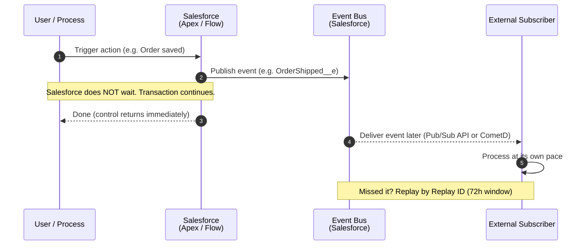

# 02 - Fire and Forget

> **One-liner**: Salesforce announces that something happened and **moves on**. It does not wait for a reply.
> **Direction**: Salesforce → External (outbound). **Timing**: Asynchronous. **Volume**: Many small events, near real time.
> **Use when**: You need to **broadcast a business event** ("OrderShipped") and you do not need an answer back.

This is Module 02, the integration patterns. New to the vocabulary (sync/async, inbound/outbound, pub/sub)? See [Module 01](../01-Fundamentals/README.md). For the auth behind callouts and event subscribers, see [Module 03](../03-Authentication/README.md).

---

## 1. The idea in plain English

Fire and Forget is **posting a letter**. You write it, drop it in the mailbox, and walk away. You trust the postal service to deliver it. You do **not** stand at the box waiting for the recipient to read it and reply. Your day continues immediately.

In Salesforce terms: a process **publishes an event** (or sends a one-way message) describing something that just happened, then the transaction continues without blocking. One or more external subscribers pick the message up **later** and do their own work. The publisher and subscriber are **loosely coupled** — neither has to be online at the same time, and the publisher does not care who is listening or what they do with it.

Contrast this with [Request and Reply](01-request-and-reply.md), which is a phone call you stay on the line for. Here, you hang up before anyone answers.

---

## 2. When to use it (and when not)

| ✅ Use it when | ❌ Avoid / use something else |
|---|---|
| You are **announcing a fact** ("Order shipped", "Case closed") and need no answer. | You need the response to continue → [01-request-and-reply.md](01-request-and-reply.md). |
| You want **loose coupling** — the subscriber can be down and catch up later. | You are moving **large data sets** on a schedule → [03-batch-data-synchronization.md](03-batch-data-synchronization.md). |
| **Multiple** systems may want the same event (fan-out to many subscribers). | You need a **guaranteed, transactional** round-trip with rollback. |
| The receiving system handles its own queuing, retry, and errors. | The user is waiting at the screen for a result. |

**Real-world examples**: publish **OrderShipped** so a logistics app and a notification service both react; emit **LeadConverted** for a marketing platform; send a legacy ERP a one-way **AccountUpdated** notice via Outbound Message; fan a **PaymentReceived** event out to several downstream systems.

---

## 3. How it works (sequence diagram)



**Walkthrough**

1. A user action or backend process completes some work.
2. Salesforce **publishes a platform event** to the event bus (or sends a one-way Outbound Message).
3. Salesforce **does not block** — control returns to the user/process right away.
4. The transaction finishes normally.
5. The event bus delivers the message to each external subscriber **asynchronously**, on their schedule.
6. Each subscriber processes independently and owns its own error handling.
7. If a subscriber was offline, it can **replay** missed events by Replay ID within the retention window.

---

## 4. How it shows up in Salesforce (the tech)

The official guide gives Fire and Forget **two main implementation options**: the modern event-driven approach (**Platform Events**) and the legacy declarative approach (**Outbound Messages**).

| Tool | What it is | Use it for |
|---|---|---|
| **Platform Events** (recommended) | Publish/subscribe events on the Salesforce event bus. Publish from Apex, Flow, or API. Subscribe via **Pub/Sub API** (gRPC/HTTP/2, Avro) or **CometD**. | The modern, loosely-coupled, fan-out approach. Multiple subscribers, replay support. |
| **Outbound Messages** (legacy) | A declarative **SOAP** message sent to a fixed endpoint, fired from Flow (or legacy Workflow). Salesforce auto-**retries** on failure. | Simple point-to-point notify to one endpoint, no code. Older orgs/integrations. |
| **Change Data Capture (CDC)** | A built-in stream of record-change events (create/update/delete/undelete) on the same bus. | Broadcasting **data changes** without defining custom events. |
| **Apex callout (async)** | A one-way `@future(callout=true)` or Queueable callout via `callout:NamedCredential`. | Fire-and-forget HTTP notify where an event channel is overkill. |

**Publish a Platform Event from Apex** (no hardcoded endpoint — subscribers connect to the bus):

```apex
// OrderShipped__e is a Platform Event with custom fields
OrderShipped__e evt = new OrderShipped__e(
    OrderId__c   = order.Id,
    TrackingNo__c = trackingNumber,
    ShippedAt__c = System.now()
);
Database.SaveResult sr = EventBus.publish(evt);
if (!sr.isSuccess()) {
    for (Database.Error err : sr.getErrors()) {
        System.debug('Publish failed: ' + err.getMessage());
    }
}
```

For an **async one-way HTTP notify** instead of an event, the outbound callout still goes through a Named Credential — never a hardcoded URL or secret:

```apex
@future(callout=true)
public static void notifyExternal(Id orderId) {
    HttpRequest req = new HttpRequest();
    req.setEndpoint('callout:Logistics_API/v1/shipped');
    req.setMethod('POST');
    req.setHeader('Content-Type', 'application/json');
    req.setBody(JSON.serialize(new Map<String,Object>{ 'orderId' => orderId }));
    new Http().send(req); // fire it; we do not act on the response
}
```

> **Auth**: Outbound callouts use a **Named Credential + External Credential**. External subscribers to events authenticate to the Pub/Sub/Streaming API via OAuth. See [Module 03 - Named Credentials](../03-Authentication/14-named-credentials-and-external-credentials.md) and [Module 03 README](../03-Authentication/README.md).

---

## 5. Design considerations and gotchas

| Consideration | Why it matters | What to do |
|---|---|---|
| **No immediate response** | You give up the answer by design. The publisher learns nothing about downstream success. | Only use when you truly do not need the result. Add an optional **callback** if the remote must report back. |
| **Delivery guarantees differ** | **Platform Events** publish to the bus **once** with **no Salesforce-side retry** — the subscriber must replay. **Outbound Messages** **auto-retry** with backoff for up to ~24h. | Pick the option that matches your durability need. For events, build replay-by-Replay-ID into the subscriber. |
| **Events are not transactional on delivery** | A published platform event **cannot be rolled back** within the transaction once committed. | Publish **after** your DML succeeds. Do not assume publish = subscriber processed. |
| **Replay window** | High-volume event messages are retained **72 hours (3 days)**. Miss it and it is gone. | Subscribers must track the **Replay ID** of the last processed event and resume from it. |
| **Publishing / delivery limits** | Orgs have **hourly publishing** and **daily event delivery** allocations (by license). A fan-out to many subscribers multiplies the delivery count. | Watch the allocations in the Platform Events Developer Guide. Avoid needless fan-out. |
| **Outbound Message expiry** | An unacknowledged Outbound Message is retried then **expires** (kept ~24h, failed list cleared after 7 days). | Make the endpoint highly available and acknowledge promptly. Monitor the failed-messages list. |
| **Idempotency** | Retries and replays can deliver the **same event more than once** (at-least-once semantics). | Subscribers must **dedupe** using the Replay ID or a business key. Make processing safe to repeat. |
| **Eventual consistency** | Subscribers process later, so the two systems are briefly out of sync. | Design downstream logic to tolerate a short lag. Do not expect instant consistency. |

---

## 6. Interview Q&A

**Q: What is the Fire and Forget pattern?**
A: Salesforce publishes a message or event about something that happened and continues without waiting for a reply. It is asynchronous, loosely coupled, and used to broadcast business events like "OrderShipped" where you do not need an answer back.

**Q: What are the two main ways to implement it in Salesforce?**
A: The modern, recommended way is **Platform Events** — publish from Apex/Flow/API and let external subscribers consume via the Pub/Sub API or CometD. The legacy way is **Outbound Messages** — a declarative SOAP message sent from Flow to a fixed endpoint, with automatic retry.

**Q: How is delivery guaranteed for each?**
A: They differ. Outbound Messages **retry automatically** with backoff for about 24 hours until acknowledged. Platform Events publish to the bus **once with no Salesforce-side retry**; durability comes from the **72-hour replay window** — the subscriber resumes from its last Replay ID. Both are effectively **at-least-once**, so subscribers must be idempotent.

**Q: How does this differ from Request and Reply?**
A: Request and Reply is synchronous — Salesforce waits for and uses the response. Fire and Forget sends and moves on. Use Reply when the result drives the next step; use Forget when announcing a fact to one or many systems.

**Q: A subscriber was down for an hour. Did it lose the events?**
A: Not if it acts within the retention window. Platform Events keep high-volume messages for **72 hours**; the subscriber replays from the **Replay ID** of the last event it processed. Outbound Messages retry until acknowledged or until they expire (~24h).

**Talking point to explain it to anyone**: "It's posting a letter. You drop it in the box and walk away — you trust it gets there, you don't wait for a reply."

---

## 7. Key terms

Platform Events, event bus, Pub/Sub API, CometD, Replay ID, Outbound Message, Change Data Capture, idempotency, eventual consistency, at-least-once delivery - defined in [Module 01 vocabulary](../01-Fundamentals/02-core-vocabulary.md) and the [README](README.md). Deeper dive in [Module 06 - Event-Driven](../06-Event-Driven/README.md).

---

## Sources (Verified June 2026)

- [Remote Process Invocation - Fire and Forget (Integration Patterns, v66.0)](https://developer.salesforce.com/docs/atlas.en-us.integration_patterns_and_practices.meta/integration_patterns_and_practices/integ_pat_remote_process_invocation_fire_forget.htm)
- [Platform Events Developer Guide](https://developer.salesforce.com/docs/atlas.en-us.platform_events.meta/platform_events/platform_events_intro.htm)
- [Platform Event Allocations](https://developer.salesforce.com/docs/atlas.en-us.platform_events.meta/platform_events/platform_event_limits.htm)
- [Considerations for Outbound Messages - Salesforce Help](https://help.salesforce.com/s/articleView?id=platform.workflow_om_considerations.htm&type=5)
- [Pub/Sub API - Event Message Durability](https://developer.salesforce.com/docs/platform/pub-sub-api/guide/event-message-durability.html)

---

*Next: [03-batch-data-synchronization.md](03-batch-data-synchronization.md) - moving large data sets on a schedule, both directions, off-peak.*
