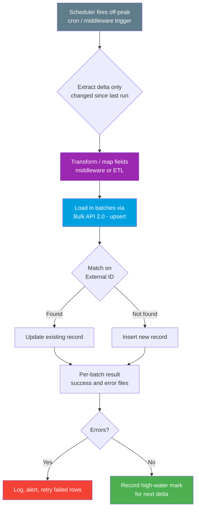

# 03 - Batch Data Synchronization

> **One-liner**: Move **large volumes** of data between Salesforce and another system on a **schedule**, usually overnight.
> **Direction**: Both ways (Salesforce → External and External → Salesforce). **Timing**: Scheduled / batch. **Volume**: HIGH, off-peak.
> **Use when**: You need a **nightly sync** of big datasets between Salesforce and an ERP or data warehouse.

This is Module 02, the integration patterns. New to the vocabulary (sync/async, ETL, upsert, External ID)? See [Module 01](../01-Fundamentals/README.md). For the auth a middleware tool uses to reach Salesforce, see [Module 03](../03-Authentication/README.md).

---

## 1. The idea in plain English

Batch Data Synchronization is the **overnight delivery truck**. You do not send a courier for every single parcel (that would be one-at-a-time Request and Reply). Instead, you let parcels pile up all day, then a big truck runs **once at night** when the roads are empty and hauls everything in one trip. It is slow per parcel but extremely efficient for **volume**.

In Salesforce terms: a **scheduled job** extracts or loads **thousands to millions of records** in batches, typically during **off-peak hours** so it does not compete with daytime users or burn the daily API budget. The goal is to keep two systems **in agreement** — Salesforce and an ERP, a data warehouse, or a billing platform — without hammering them in real time.

Contrast this with [Fire and Forget](02-fire-and-forget.md) (one small event at a time) and [Request and Reply](01-request-and-reply.md) (one synchronous round-trip). Batch is the heavyweight for **bulk**.

---

## 2. When to use it (and when not)

| ✅ Use it when | ❌ Avoid / use something else |
|---|---|
| You sync **large datasets** (tens of thousands+ records) on a recurring schedule. | You need **real-time** freshness within seconds → events or [01-request-and-reply.md](01-request-and-reply.md). |
| **Latency is acceptable** — nightly or hourly is fine. | A single record must update the instant it changes → [02-fire-and-forget.md](02-fire-and-forget.md) / CDC. |
| You can run **off-peak** to protect daytime performance and API limits. | The volume is tiny (a handful of records) — batch is overkill. |
| Source and target each have a **stable unique key** (External ID) to match on. | There is no reliable key to dedupe against — fix that first. |

**Real-world examples**: nightly **ERP → Salesforce** product/price catalog refresh; hourly **Salesforce → data warehouse** export of closed opportunities for BI; daily **account/contact reconciliation** with a master data system; bulk **migration** during a go-live.

---

## 3. How it works (flowchart)



**Walkthrough**

1. A scheduler (cron, middleware, or a Salesforce scheduled job) kicks off the run **during off-peak hours**.
2. **Delta sync**: extract only records that **changed since the last run** (using a timestamp or high-water mark), not the whole table.
3. A middleware/ETL layer **transforms and maps** fields between the two data models.
4. The data is loaded asynchronously in **batches via Bulk API 2.0**.
5. The load uses **upsert keyed on an External ID** so each row either updates a match or inserts a new record.
6. Bulk API returns **per-batch success and error** results.
7. Failed rows are **logged, alerted on, and retried**; the run records a new **high-water mark** for the next delta.

---

## 4. How it shows up in Salesforce (the tech)

| Tool | What it is | Use it for |
|---|---|---|
| **Bulk API 2.0** | REST-based async API to insert/upsert/update/delete/query **large** datasets. Salesforce chunks the job into batches for you. | The core engine for high-volume load and extract. |
| **ETL / middleware** | MuleSoft, Informatica, Talend, Jitterbit, etc. Handle scheduling, transformation, connectivity, retries. | Orchestrating the sync, mapping data models, error handling. |
| **Scheduled Apex / Flow** | `Schedulable` Apex or a scheduled Flow inside Salesforce. | Triggering exports/processing from the Salesforce side. |
| **Bulk API 2.0 Query** | Async extract of large query results. | Pulling big result sets **out** of Salesforce to a warehouse. |
| **Data Loader / SF CLI** | Command-line / desktop tools that sit on Bulk API. | Scriptable scheduled loads, admin one-offs. |

**Upsert by External ID** is the heart of safe batch sync. The External ID column lets the same job both match-and-update and insert, with no duplicates. A Bulk API 2.0 ingest job specifies it like this:

```json
POST /services/data/v66.0/jobs/ingest
{
  "object": "Account",
  "operation": "upsert",
  "externalIdFieldName": "ERP_Id__c",
  "contentType": "CSV"
}
```

Then upload the CSV (keep each file within Salesforce's recommended size), close the job, and poll for results. Conceptually:

```bash
# 1. Create the job (above)  ->  returns a jobId and contentUrl
# 2. PUT the CSV data to the contentUrl
# 3. PATCH the job state to "UploadComplete"
# 4. GET .../jobs/ingest/{jobId}            -> watch state = JobComplete
# 5. GET .../successfulResults  and  .../failedResults
```

A scheduled Apex job to **trigger** an export or downstream processing (the callout itself uses a Named Credential, never a hardcoded secret):

```apex
global class NightlySyncJob implements Schedulable {
    global void execute(SchedulableContext ctx) {
        // enqueue work; outbound calls go through callout:Warehouse_API
        System.enqueueJob(new ExportClosedOppsQueueable());
    }
}
// Schedule: System.schedule('Nightly Sync', '0 0 2 * * ?', new NightlySyncJob());
```

> **Auth**: A middleware tool authenticates to Salesforce as a system integration user, typically via **OAuth 2.0 JWT Bearer** or **Client Credentials** (no interactive login). See [Module 03 - JWT Bearer](../03-Authentication/04-jwt-bearer-flow.md) and the [Module 03 README](../03-Authentication/README.md).

---

## 5. Design considerations and gotchas

| Consideration | Why it matters | What to do |
|---|---|---|
| **Off-peak scheduling** | Daytime batch loads slow users and chew the **24-hour API allocation** (Enterprise starts at 100,000 requests/24h and scales with licenses). | Run at night/low-traffic windows. Stagger jobs so they do not overlap. |
| **Delta sync, not full sync** | Re-syncing every row nightly wastes API capacity and processing time. | Extract only records changed since the last run using a **timestamp / high-water mark**. |
| **Upsert with External ID** | Without a stable key you create **duplicates** and break cross-system links. | Define an indexed, unique **External ID** on the object and upsert on it. |
| **Per-batch error handling** | A bad row should not fail the whole load. Bulk API isolates failures per batch. | Read **success and error result files**, log failures, retry only failed rows. |
| **Idempotency** | A re-run after a partial failure must not double-insert. | Upsert (not insert) + External ID makes re-runs **safe to repeat**. |
| **Bulk vs governor limits** | Bulk API is async and high-throughput, but triggers/flows on the records still run and hit Apex governor limits per batch. | Bulkify all automation. Consider disabling heavy triggers during migration loads. |
| **Ordering and dependencies** | Loading children before parents (lookups) fails. | Load in dependency order (parents first), or use External IDs on lookups so order matters less. |
| **Monitoring & alerting** | A silent overnight failure is discovered too late. | Alert on job failure and on error-row thresholds. Track run duration and record counts. |

---

## 6. Interview Q&A

**Q: What is the Batch Data Synchronization pattern?**
A: Moving large volumes of data between Salesforce and another system on a schedule, usually overnight, to keep them in agreement. It is asynchronous, high-volume, and latency-tolerant — the opposite of a real-time call.

**Q: Which Salesforce technology do you use, and why?**
A: **Bulk API 2.0**, because it is built for asynchronous high-volume load and extract and chunks the work into batches automatically. Usually orchestrated by **ETL/middleware** (MuleSoft, Informatica) that handles scheduling, transformation, and retries.

**Q: How do you avoid creating duplicates?**
A: **Upsert keyed on an External ID** — a stable, unique key shared with the source system. Each row updates a match or inserts if none exists. This also makes the job idempotent, so a re-run after a partial failure is safe.

**Q: What is delta sync and why does it matter?**
A: Only extracting and loading records that **changed since the last run**, tracked with a timestamp or high-water mark, instead of the whole dataset. It dramatically cuts API usage, runtime, and load on both systems.

**Q: Why run off-peak, and what limit are you protecting?**
A: To avoid slowing daytime users and to protect the **24-hour rolling API request allocation** (Enterprise Edition starts around 100,000 and scales with licenses). Off-peak windows leave headroom and reduce contention.

**Talking point to explain it to anyone**: "It's the overnight delivery truck. Parcels pile up all day, then one big truck hauls them all at night when the roads are empty."

---

## 7. Key terms

Bulk API 2.0, ETL, middleware, upsert, External ID, delta sync, high-water mark, idempotency, off-peak, API allocation - defined in [Module 01 vocabulary](../01-Fundamentals/02-core-vocabulary.md) and the [README](README.md). Deeper dive in [Module 07 - Bulk and Async](../07-Bulk-Async/README.md).

---

## Sources (Verified June 2026)

- [Batch Data Synchronization (Integration Patterns, v66.0)](https://developer.salesforce.com/docs/atlas.en-us.integration_patterns_and_practices.meta/integration_patterns_and_practices/integ_pat_batch_data_synchronization.htm)
- [Bulk API 2.0 - Developer Guide](https://developer.salesforce.com/docs/atlas.en-us.api_asynch.meta/api_asynch/bulk_api_2_0.htm)
- [Upsert Records (Bulk API 2.0, External ID)](https://developer.salesforce.com/docs/atlas.en-us.api_asynch.meta/api_asynch/bulk_api_2_0_upsert.htm)
- [API Request Limits and Allocations - Quick Reference](https://developer.salesforce.com/docs/atlas.en-us.salesforce_app_limits_cheatsheet.meta/salesforce_app_limits_cheatsheet/salesforce_app_limits_platform_api.htm)

---

*Next: [04-remote-call-in.md](04-remote-call-in.md) - when an external system calls into Salesforce to create, read, or update data.*
