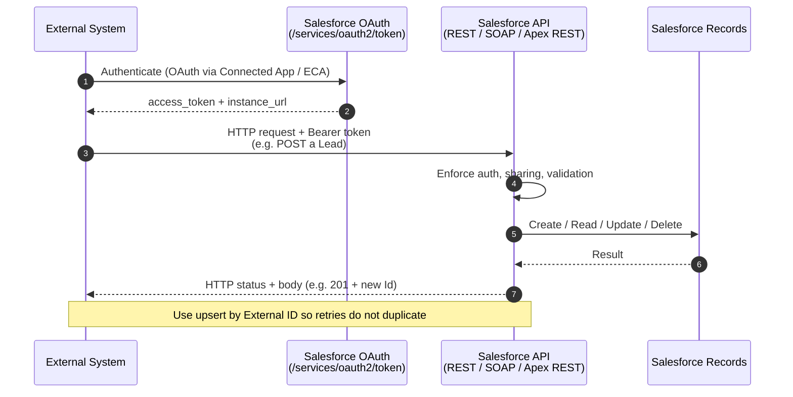

# 04 - Remote Call-In

> **One-liner**: An **external system calls into Salesforce** to create, read, update, or delete data. Salesforce is the listener.
> **Direction**: External → Salesforce (inbound). **Timing**: Synchronous or asynchronous. **Volume**: One record to bulk.
> **Use when**: A website creates a Lead in Salesforce, or an ERP pushes order updates into Salesforce.

This is Module 02, the integration patterns. New to the vocabulary (inbound/outbound, REST/SOAP, idempotency)? See [Module 01](../01-Fundamentals/README.md). The external app must **authenticate first** — see [Module 03](../03-Authentication/README.md).

---

## 1. The idea in plain English

Remote Call-In flips the direction. In the earlier patterns **Salesforce** picked up the phone and dialed out. Here, Salesforce is the **shop with a front counter**, and an **outside customer walks in** to do business. The external system is the caller; Salesforce exposes a **counter (an API)** and serves the request — looking up a record, creating one, updating one.

In Salesforce terms: an external app sends an **HTTP/SOAP request** to a Salesforce API endpoint to perform CRUD on records. Salesforce authenticates the caller, runs the operation **under that caller's permissions and sharing**, and returns a response. This is the backbone of "a form on our website creates a Lead" or "our ERP keeps Orders in sync by pushing changes."

Because someone else is calling **you**, the two big themes are **security** (who is allowed in, and to do what) and **resilience** (handling retries without creating duplicates).

---

## 2. When to use it (and when not)

| ✅ Use it when | ❌ Avoid / use something else |
|---|---|
| An **external system needs to push or pull** Salesforce data on its own schedule. | Salesforce needs to call out and use a reply → [01-request-and-reply.md](01-request-and-reply.md). |
| The caller drives the timing (a web form submit, an ERP event). | Salesforce announces an event outward → [02-fire-and-forget.md](02-fire-and-forget.md). |
| You want **standard CRUD** (REST/SOAP) or a **custom contract** (Apex REST). | Massive scheduled loads you control → [03-batch-data-synchronization.md](03-batch-data-synchronization.md) (Bulk API). |
| You need **multi-object** or transactional inbound logic. | The external data should stay external and be read live → [05-data-virtualization.md](05-data-virtualization.md). |

**Real-world examples**: a marketing **website form creates a Lead**; an **ERP updates Orders** in Salesforce when they ship; a partner portal **reads Account status** via REST; a mobile app does CRUD through a custom **Apex REST** endpoint; a billing system **bulk-loads invoices** via Bulk API.

---

## 3. How it works (sequence diagram)



**Walkthrough**

1. The external app **authenticates** to Salesforce with OAuth, using credentials from a **Connected App / External Client App**.
2. Salesforce returns an **access token** and the **instance URL** to call.
3. The app sends the actual request (e.g. create a Lead) with `Authorization: Bearer <token>`.
4. Salesforce enforces **authentication, the user's sharing/permissions, and validation rules**.
5. The CRUD operation runs against the database.
6. Salesforce returns the result.
7. The app receives an HTTP **status code and body** (e.g. `201 Created` with the new record Id). Using **upsert by External ID** keeps retries from creating duplicates.

---

## 4. How it shows up in Salesforce (the tech)

Inbound calls use either a **standard API** (no code) or a **custom endpoint** (Apex). Pick the simplest that meets the contract.

| Tool | What it is | Use it for |
|---|---|---|
| **REST API** | Standard RESTful CRUD over JSON/XML on sObjects. | Most modern inbound integrations. Single-record CRUD, queries. |
| **SOAP API** | Standard XML/WSDL CRUD. **Synchronous**. | SOAP-based callers, legacy enterprise systems. |
| **Apex REST** | Custom endpoint via `@RestResource(urlMapping=...)` at `/services/apexrest/`. | Custom request/response shape, multi-object or pre/post logic. |
| **Apex SOAP web service** | Custom SOAP service via the `webservice` keyword. | Custom SOAP contract for legacy callers. |
| **Composite API** | Bundle several REST calls (or related records) into one request. | Reduce round-trips, multi-step inbound operations. |
| **Bulk API (2.0)** | Async high-volume inbound load. | Large inbound data sets (see [03-batch-data-synchronization.md](03-batch-data-synchronization.md)). |

A custom inbound endpoint with **Apex REST**. Note the **upsert by External ID** for idempotency and the explicit **status code**:

```apex
@RestResource(urlMapping='/v1/orders/*')
global with sharing class OrderInboundService {

    @HttpPost
    global static String upsertOrder(String externalId, Decimal amount) {
        RestResponse res = RestContext.response;
        try {
            Order__c o = new Order__c(ERP_Id__c = externalId, Amount__c = amount);
            // Upsert on the External ID field -> safe to retry, no duplicates
            upsert o ERP_Id__c;
            res.statusCode = 200;            // 201 if you detect a fresh insert
            return o.Id;
        } catch (Exception e) {
            res.statusCode = 400;            // return a meaningful error code
            return 'ERROR: ' + e.getMessage();
        }
    }
}
```

The classic **Apex SOAP web service** equivalent uses the `webservice` keyword:

```apex
global with sharing class OrderSoapService {
    webservice static Id upsertOrder(String externalId, Decimal amount) {
        Order__c o = new Order__c(ERP_Id__c = externalId, Amount__c = amount);
        upsert o ERP_Id__c;
        return o.Id;
    }
}
```

> **Auth (read this)**: the external caller authenticates with a **Connected App / External Client App + OAuth**. For server-to-server use **JWT Bearer** or **Client Credentials**; for user context use the **Web Server flow**. Salesforce runs the operation under that user's profile, permission sets, and sharing rules — so grant **least privilege**. Full detail in [Module 03 README](../03-Authentication/README.md).
>
> **Heads up - SOAP `login()` retirement**: the legacy SOAP API `login()` call (API versions 31.0-64.0) is being **retired in Summer '27**. Inbound auth is moving to OAuth (Web Server, JWT Bearer, or Client Credentials). From Summer '26, new orgs also require a **Use Any API Auth** permission to use SOAP `login()`. Plan inbound integrations on **OAuth**, not `login()`.

---

## 5. Design considerations and gotchas

| Consideration | Why it matters | What to do |
|---|---|---|
| **API request limits** | Inbound calls count against the org's **24-hour rolling allocation** (Enterprise starts ~100,000 and scales with licenses), shared with all other API traffic. | Use **Composite/Bulk** to reduce call count. Monitor usage. Rate-limit chatty callers. |
| **Idempotency** | The caller may retry on timeout and create **duplicates**. | Expose **upsert by External ID**, or dedupe on a business key. Make endpoints safe to call twice. |
| **Security & least privilege** | Operations run as the **integration user** with that user's sharing and permissions. Over-permissioned users are a breach risk. | Use a dedicated integration user with **minimum** profile/permission sets. Restrict object/field access. |
| **Authentication method** | Username-password and SOAP `login()` are legacy and **being retired**. | Use **OAuth** (JWT Bearer / Client Credentials for system, Web Server for user). See Module 03. |
| **Bulkification** | A loop doing one DML per record blows Apex governor limits under load. | Bulkify Apex REST logic. Accept and process **collections**, not one record per call. |
| **Proper status codes** | Callers branch on HTTP status; returning 200 for an error breaks their retry logic. | Return correct codes: **201** create, **200** update, **400** bad input, **401** auth, **409** conflict. |
| **Validation & automation** | Inbound writes still fire validation rules, triggers, and flows. | Account for them. Return clear errors when a validation rule blocks the write. |
| **Sync vs async** | SOAP API and Apex SOAP services are **synchronous**; long work blocks the caller. | For heavy work, accept the request fast and process async (Queueable / Platform Event), or use Bulk API. |

---

## 6. Interview Q&A

**Q: What is the Remote Call-In pattern?**
A: An external system calls **into** Salesforce to create, read, update, or delete data. Salesforce is the listener exposing an API. It is inbound — the opposite of Request and Reply, where Salesforce calls out.

**Q: What are the main technologies for inbound calls?**
A: Standard **REST API** and **SOAP API** for CRUD, **Apex REST** (`@RestResource`) and **Apex SOAP web services** (`webservice` keyword) for custom endpoints, **Composite API** to bundle calls, and **Bulk API** for high volume.

**Q: How does the external app authenticate?**
A: Through a **Connected App / External Client App** using **OAuth** — JWT Bearer or Client Credentials for server-to-server, Web Server flow for user context. Salesforce then runs the operation under that user's permissions and sharing. Grant least privilege. (The old SOAP `login()` is retiring in Summer '27.)

**Q: How do you stop a retried call from creating duplicates?**
A: Make the endpoint **idempotent** — expose **upsert keyed on an External ID** instead of insert, or dedupe on a business key. A repeated call then updates the same record rather than creating a second one.

**Q: REST API vs Apex REST — when do you build a custom endpoint?**
A: Use the **standard REST API** when plain sObject CRUD is enough — no code. Build **Apex REST** when you need a custom request/response shape, multi-object or transactional logic, or pre/post processing the standard API cannot express.

**Talking point to explain it to anyone**: "It's a shop counter. Outside customers walk in to our store (Salesforce) and do business — we check who they are, serve the request, and hand back a receipt."

---

## 7. Key terms

REST API, SOAP API, Apex REST, `@RestResource`, `webservice` keyword, Composite API, Bulk API, Connected App, External Client App, OAuth, idempotency, least privilege, status codes - defined in [Module 01 vocabulary](../01-Fundamentals/02-core-vocabulary.md) and the [README](README.md). Deeper dive in [Module 04 - Inbound APIs](../04-Inbound-APIs/README.md).

---

## Sources (Verified June 2026)

- [Remote Call-In (Integration Patterns, v66.0)](https://developer.salesforce.com/docs/atlas.en-us.integration_patterns_and_practices.meta/integration_patterns_and_practices/integ_pat_remote_call_in.htm)
- [Exposing Apex Classes as REST Web Services](https://developer.salesforce.com/docs/atlas.en-us.apexcode.meta/apexcode/apex_rest.htm)
- [Platform SOAP API login() Retirement (Summer '27) - Salesforce Help](https://help.salesforce.com/s/articleView?id=005132110&type=1)
- [API Request Limits and Allocations - Quick Reference](https://developer.salesforce.com/docs/atlas.en-us.salesforce_app_limits_cheatsheet.meta/salesforce_app_limits_cheatsheet/salesforce_app_limits_platform_api.htm)

---

*Next: [05-data-virtualization.md](05-data-virtualization.md) - reading and writing external data live, without copying it into Salesforce.*
