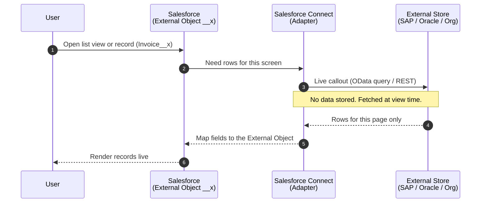

# 05 - Data Virtualization

> **One-liner**: Salesforce reads external data **live, on demand**, and never stores a copy.
> **Direction**: Salesforce → External (outbound, read at view time). **Timing**: Synchronous, per view. **Volume**: One list/record at a time, but it can front a huge external store.
> **Use when**: You need to **see** external data inside Salesforce without **copying** it.

This is Module 02, the integration patterns. New to the vocabulary (sync/async, callout)? See [Module 01](../01-Fundamentals/README.md). For the auth behind the callout, see [Module 03](../03-Authentication/README.md).

---

## 1. The idea in plain English

Data Virtualization is a **window**, not a **warehouse**. Instead of trucking boxes of data into your house and stacking them in the garage, you cut a window in the wall and look at the warehouse next door. The goods stay where they are. You just see them when you glance through the glass.

In Salesforce terms: you define an **External Object** that looks and feels like a normal object (records, list views, detail pages, even some relationships), but the rows live in **SAP, an Oracle archive, or another Salesforce org**. When a user opens the list view, Salesforce makes a **live callout** to the source, fetches the rows for that screen, and shows them. Close the tab and nothing is stored. This is the opposite of [Batch Data Synchronization](03-batch-data-synchronization.md), which **copies** data on a schedule.

---

## 2. When to use it (and when not)

| ✅ Use it when | ❌ Avoid / use something else |
|---|---|
| Data must stay in the **system of record** (compliance, size, licensing). | You need it offline, in reports at scale, or in heavy automation → copy it via [03-batch-data-synchronization.md](03-batch-data-synchronization.md). |
| The dataset is **huge** or rarely viewed. Copying it is wasteful. | You need fast, complex SOQL, roll-ups, or triggers on the data. |
| Users need a **real-time view** but Salesforce is not the owner. | The source is **slow or often down**. Every view becomes a failed callout. |
| You want a record **detail page** that stitches Salesforce + external fields. | You only need one value once → just do a [01-request-and-reply.md](01-request-and-reply.md) callout. |

**Real-world examples**: show **SAP invoices** on the Account page, browse a **billions-of-rows order archive** that was offloaded from the production DB, surface **inventory** from an ERP, or read records from **another Salesforce org** without an ETL job.

---

## 3. How it works (sequence diagram)



**Walkthrough**

1. A user opens an External Object list view, report, or detail page.
2. Salesforce hands the request to **Salesforce Connect** and the configured **adapter**.
3. The adapter issues a **live callout** to the source (an **OData query** for the OData adapter, a REST call for cross-org/Apex).
4. The source returns **only the rows for that screen** (paged).
5. Salesforce maps the response onto the External Object's fields.
6. The records render. Nothing is persisted. The next view triggers a **fresh callout**.

---

## 4. How it shows up in Salesforce (the tech)

External data is exposed through **Salesforce Connect** plus an **External Data Source** and its **External Objects** (API names end in **`__x`**, vs `__c` for custom objects). You pick an **adapter** based on the source.

| Tool | What it is | Use it for |
|---|---|---|
| **OData 2.0 / 4.0 / 4.01 adapter** | Salesforce Connect speaks the **OData** REST protocol to any OData-compliant endpoint. | SAP, Microsoft, and middleware that publish an OData service. |
| **Cross-Org adapter** | Connects to **another Salesforce org** via the Lightning Platform REST API. | Org-to-org data sharing, point and click. |
| **Apex Connector Framework** | Custom adapter you write in Apex by extending `DataSource.Connection` and `DataSource.Provider`. | Any non-OData source (legacy DB, custom REST, web service). |
| **External Object (`__x`)** | The metadata shell. Fields, page layouts, list views, search. | The thing users actually see and click. |

Shape of a **custom adapter** (the framework calls `query` when a user views records):

```apex
global class ArchiveProvider extends DataSource.Provider {
    override global List<DataSource.Capability> getCapabilities() {
        return new List<DataSource.Capability>{ DataSource.Capability.ROW_QUERY };
    }
    override global List<DataSource.AuthenticationCapability> getAuthenticationCapabilities() {
        return new List<DataSource.AuthenticationCapability>{
            DataSource.AuthenticationCapability.ANONYMOUS
        };
    }
    override global DataSource.Connection getConnection(DataSource.ConnectionParams p) {
        return new ArchiveConnection(); // extends DataSource.Connection, implements query()
    }
}
```

> **Auth**: the OData and cross-org adapters authenticate with a **Named Credential + External Credential**, the same plumbing as any callout. See [Module 03 - Named Credentials](../03-Authentication/14-named-credentials-and-external-credentials.md).

---

## 5. Design considerations and gotchas

| Consideration | Why it matters | What to do |
|---|---|---|
| **Every view is a callout** | A list view, report, or detail page each triggers a live request. Slow source = slow page. | Keep the source fast. Page results. Don't put External Objects on hot, high-traffic screens. |
| **Callout limits** | OData callouts are capped (about **10,000 per hour** on Enterprise/Performance/Unlimited; higher on premium). | Watch volume. Aggressive list views or reports burn the allowance. |
| **No triggers on `__x`** | External Objects **do not support standard Apex triggers**, so you cannot react to a change in the source object directly. | For change reactions, use the push pattern → [06-ui-update-based-on-data-changes.md](06-ui-update-based-on-data-changes.md). |
| **Limited feature set** | **No formula fields, no roll-up summaries.** Reporting and relationships are limited (only **indirect** and **external lookups**). | Confirm each feature before you design. Treat External Objects as a read-mostly view, not a full object. |
| **Availability depends on the source** | If the external system is down, the records simply do not load. | Plan for graceful failure. The source's uptime becomes your uptime. |
| **OData requirement** | The OData adapter needs an **OData 2.0 / 4.0 / 4.01** compliant endpoint. | If the source is not OData, use the **Apex Connector Framework** instead. |
| **Writes are limited** | Some adapters support writable External Objects, many do not. | Verify create/update support per adapter before promising edits. |

---

## 6. Interview Q&A

**Q: What is the Data Virtualization pattern?**
A: Salesforce displays external data **live** without storing a copy. You define an External Object backed by Salesforce Connect, and Salesforce queries the source on demand when a user views a record or list. It is a window onto the data, not a warehouse copy.

**Q: How do you implement it in Salesforce?**
A: **Salesforce Connect** with an **External Data Source** and **External Objects** (`__x`). Choose an adapter: the **OData adapter** for OData endpoints, the **Cross-Org adapter** for another Salesforce org, or a custom adapter via the **Apex Connector Framework** for anything else.

**Q: When would you copy the data instead (Batch Sync) rather than virtualize it?**
A: When you need it offline, in large-scale reports, in heavy automation, or with fast complex SOQL and roll-ups. Virtualize when the data must stay in the source, is huge, or is rarely viewed. Copy when Salesforce needs to own and work it.

**Q: What are the main limitations of External Objects?**
A: No standard triggers, no formula fields, no roll-up summaries, limited reporting, and only indirect or external lookup relationships. Each view is a callout subject to limits, and availability tracks the source system's uptime.

**Q: The source is slow and the Account page now takes 8 seconds. What do you do?**
A: Don't virtualize on a hot page. Move the External Object off the critical path (a related list users open deliberately, or a separate tab), page the results, cache where allowed, or switch to a scheduled **Batch Sync** copy if the page must be fast.

**Talking point to explain it to anyone**: "It's a window into the warehouse next door. You see the goods live through the glass, but you never haul them into your own garage."

---

## 7. Key terms

Salesforce Connect, External Object (`__x`), External Data Source, OData, Cross-Org adapter, Apex Connector Framework, callout - defined in [Module 01 vocabulary](../01-Fundamentals/02-core-vocabulary.md) and the [README](README.md).

---

## Sources (Verified June 2026)

- [Data Virtualization - Integration Patterns and Practices (v66.0, Spring '26)](https://developer.salesforce.com/docs/atlas.en-us.integration_patterns_and_practices.meta/integration_patterns_and_practices/integ_pat_data_virtualization.htm)
- [OData Adapters for Salesforce Connect - Salesforce Help](https://help.salesforce.com/s/articleView?id=sf.odata_adapter_about.htm&type=5)
- [Get Started with the Apex Connector Framework - Apex Developer Guide](https://developer.salesforce.com/docs/atlas.en-us.apexcode.meta/apexcode/apex_connector_start.htm)
- [Salesforce Platform Features Supported by Salesforce Connect - Salesforce Help](https://help.salesforce.com/s/articleView?id=platform.platform_connect_considerations.htm&type=5)
- [General Limits for Salesforce Connect - Salesforce Help](https://help.salesforce.com/s/articleView?id=platform.platform_connect_general_limits.htm&type=5)

---

*Next: [06-ui-update-based-on-data-changes.md](06-ui-update-based-on-data-changes.md) - when the UI must refresh the instant data changes.*
