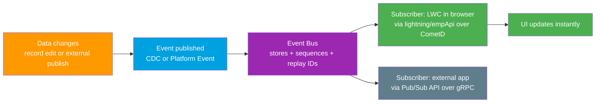

# 06 - UI Update Based on Data Changes

> **One-liner**: When data changes, an **event is pushed** so the Salesforce UI refreshes **the instant** it happens.
> **Direction**: Bidirectional (change inside or outside Salesforce → UI). **Timing**: Asynchronous push, near real-time. **Volume**: Stream of small events over an event bus.
> **Use when**: A dashboard or LWC must **auto-refresh** the moment a record changes, with no polling.

This is Module 02, the final integration pattern. New to the vocabulary (async, event bus, push)? See [Module 01](../01-Fundamentals/README.md). For the auth behind external subscribers, see [Module 03](../03-Authentication/README.md).

---

## 1. The idea in plain English

Old way: you keep **refreshing your inbox** to see if mail arrived. That is **polling**. Wasteful, slow, and you still miss things between refreshes.

New way: a **notification pops** the second the mail lands. You did nothing. The mail came to you.

That is this pattern. Instead of a component asking "anything new?" every few seconds, the data change **publishes an event** to a shared **event bus**, and any **subscriber** that cares gets pushed the news immediately. In Salesforce, a Lightning Web Component sitting in the browser subscribes to that stream and updates the screen the moment an event arrives. The change can originate **inside** Salesforce (a record edit) or **outside** it (an external system publishes an event), and the UI reacts either way.

---

## 2. When to use it (and when not)

| ✅ Use it when | ❌ Avoid / use something else |
|---|---|
| A screen must reflect a change **as it happens** (live dashboard, agent console). | You need the answer **right now in the same transaction** → [01-request-and-reply.md](01-request-and-reply.md). |
| You want to **stop polling** the server on a timer. | You only need a one-off send with no listener → [02-fire-and-forget.md](02-fire-and-forget.md). |
| Many subscribers care about **the same change** (fan-out). | You need guaranteed in-order, transactional delivery into a single system. |
| The trigger lives **outside** Salesforce and must reach the UI. | The data lives elsewhere and you only need to **view** it → [05-data-virtualization.md](05-data-virtualization.md). |

**Real-world examples**: a **support console** that flashes when a case is reassigned, a **sales dashboard** that updates as opportunities close, an **order tracker** that moves when a warehouse system publishes a shipment event, a **bid screen** in an auction app.

---

## 3. How it works (flowchart)



**Walkthrough**

1. A record changes in Salesforce, or an external system decides something happened.
2. An event is **published**. Use **Change Data Capture (CDC)** for record changes, or a custom **Platform Event** for business signals.
3. The event lands on the **event bus**, which stores and sequences it and tags each with a **replay ID**.
4. Subscribers receive a **push**. Inside the Salesforce UI, an **LWC** subscribes via **`lightning/empApi`** over **CometD**. Outside Salesforce, services subscribe via the **Pub/Sub API**.
5. The LWC handler updates component state and the **screen refreshes** with no user action.

---

## 4. How it shows up in Salesforce (the tech)

Two halves: **publish** the change as an event, then **subscribe** to it. The subscriber differs depending on whether it is the **Salesforce UI** or an **external system**.

| Tool | What it is | Use it for |
|---|---|---|
| **Change Data Capture (CDC)** | Salesforce auto-publishes a change event when a record is created, updated, deleted, or undeleted. | "React when this record changes." No code to publish. |
| **Platform Events** | Custom, schema-defined events you publish from Apex, Flow, or an API. | Custom business signals, "OrderShipped," "BidPlaced." |
| **Pub/Sub API** | The **modern** unified interface. **gRPC + HTTP/2**, payloads in **Apache Avro**. Subscribe to Platform Events, CDC, and monitoring events through one API. | **External** subscribers and publishers. The preferred choice today. |
| **`lightning/empApi`** | LWC module to subscribe **inside the browser** over a shared **CometD** connection. | A component in the **Salesforce UI** that must live-update. |
| **Streaming API (legacy)** | **PushTopic** and **generic events** over CometD. Salesforce no longer enhances these. | Older integrations only. Prefer Pub/Sub API / Platform Events. |

Minimal LWC subscriber (note `empApi` is **desktop-only**, **API 44.0+**, and works on the **main window** only):

```javascript
import { subscribe, unsubscribe, onError } from 'lightning/empApi';

const CHANNEL = '/data/CaseChangeEvent'; // CDC channel for Case

connectedCallback() {
    subscribe(CHANNEL, -1, (event) => {
        // event.data.payload holds the change. Refresh the UI.
        this.refreshFromEvent(event);
    }).then((sub) => { this.subscription = sub; });

    onError((err) => console.error('Streaming error', err));
}

disconnectedCallback() {
    unsubscribe(this.subscription, () => {});
}
```

The `-1` is a **replay option**: `-1` = only new events from now, `-2` = all events still in the retention window, or a specific **replay ID** to resume exactly where you left off after a disconnect.

> **Auth**: external subscribers using the **Pub/Sub API** authenticate with OAuth (e.g. the JWT Bearer or Client Credentials flow). See [Module 03](../03-Authentication/README.md). The in-browser `empApi` rides the logged-in user's session, so no extra auth.

---

## 5. Design considerations and gotchas

| Consideration | Why it matters | What to do |
|---|---|---|
| **It is async push, not request/reply** | The UI reacts **after** the fact. There is no return value to the caller. | Use it to **notify**, not to fetch a value you need synchronously. |
| **The client must subscribe** | No subscriber means the event is delivered to no one. Events are not stored forever. | Subscribe on component load. Reconnect and **replay** on disconnect. |
| **Retention / replay window** | Standard-volume events are retained about **24 hours**; high-volume events and the **Pub/Sub API** stream about **72 hours**. | Persist the last **replay ID** and resume from it. Past the window, events are gone. |
| **Delivery limits** | There are caps on event publishing and delivery (per the org's allocation). | Don't fire an event per row in a tight loop. Design coarse-grained events. |
| **`empApi` is UI-side only** | Desktop browsers, main window, API 44.0+. Not for server-to-server. | Use the **Pub/Sub API** for external/back-end subscribers. |
| **Pub/Sub API for external, empApi for internal** | They solve different ends of the same bus. | External app or middleware → **Pub/Sub API**. Component in the Salesforce UI → **`lightning/empApi`**. |
| **CDC object enablement** | CDC must be **enabled per object**, and orgs have a base allocation of selectable objects. | Enable only the objects you need. Buy more allocation if required. |
| **Ordering and duplicates** | Events can in rare cases be redelivered. | Make handlers **idempotent** and use the replay ID / event UUID to dedupe. |

---

## 6. Interview Q&A

**Q: What is the UI Update Based on Data Changes pattern?**
A: When data changes, an event is **pushed** over an event bus and subscribers react in near real time, so the UI refreshes the instant the change happens instead of polling on a timer. The change can come from inside Salesforce (CDC) or outside it (a Platform Event published by another system).

**Q: How does a Lightning Web Component get live updates?**
A: It imports the **`lightning/empApi`** module and calls `subscribe` on a streaming channel (a Platform Event or a CDC channel) over a shared **CometD** connection. When an event arrives, the callback fires and the component updates its state. It is desktop-only, API 44.0+, main window only.

**Q: Pub/Sub API vs the legacy Streaming API. Why does the modern one win?**
A: Pub/Sub API is **gRPC over HTTP/2** with **Avro** binary payloads and **one unified interface** to publish and subscribe across Platform Events, CDC, and monitoring events, with flow control and a 72-hour replay window. The legacy Streaming API (PushTopic, generic events over CometD) is no longer enhanced. Use Pub/Sub API for external clients, `empApi` inside the UI.

**Q: What is a replay ID and why does it matter?**
A: Every event on the bus gets a **replay ID** marking its position in the stream. If a subscriber disconnects, it reconnects and asks to **replay from the last ID it saw**, so it catches the events it missed instead of losing them, as long as they are still inside the retention window (about 24 to 72 hours).

**Q: CDC or Platform Events? When do you choose which?**
A: **CDC** when you want to react to **record changes** with no publishing code, it auto-fires on create/update/delete/undelete. **Platform Events** when you need a **custom business signal** with your own schema, published deliberately from Apex, Flow, or an external system.

**Talking point to explain it to anyone**: "Stop hitting refresh on your inbox. This is the notification that pops the second mail arrives. The change comes to you."

---

## 7. Key terms

Change Data Capture, Platform Event, event bus, Pub/Sub API, `lightning/empApi`, CometD, replay ID, retention window - defined in [Module 01 vocabulary](../01-Fundamentals/02-core-vocabulary.md) and the [README](README.md).

---

## Sources (Verified June 2026)

- [UI Update Based on Data Changes - Integration Patterns and Practices (v66.0, Spring '26)](https://developer.salesforce.com/docs/atlas.en-us.integration_patterns_and_practices.meta/integration_patterns_and_practices/integ_pat_ui_update_data_changes.htm)
- [Pub/Sub API - Get Started - Salesforce Developers](https://developer.salesforce.com/docs/platform/pub-sub-api/guide/intro.html)
- [lightning/empApi - Lightning Component Library](https://developer.salesforce.com/docs/component-library/bundle/lightning-emp-api/documentation)
- [Change Data Capture Developer Guide - Salesforce Developers](https://developer.salesforce.com/docs/atlas.en-us.change_data_capture.meta/change_data_capture/cdc_intro.htm)
- [Message Durability - Streaming API Developer Guide](https://developer.salesforce.com/docs/atlas.en-us.api_streaming.meta/api_streaming/using_streaming_api_durability.htm)

---

*Next: back to the [README.md](README.md) for the full pattern map. From here, continue to [Module 03 - Authentication](../03-Authentication/README.md) (already built, the auth behind every callout and external subscriber) and then Module 04 to keep going.*
