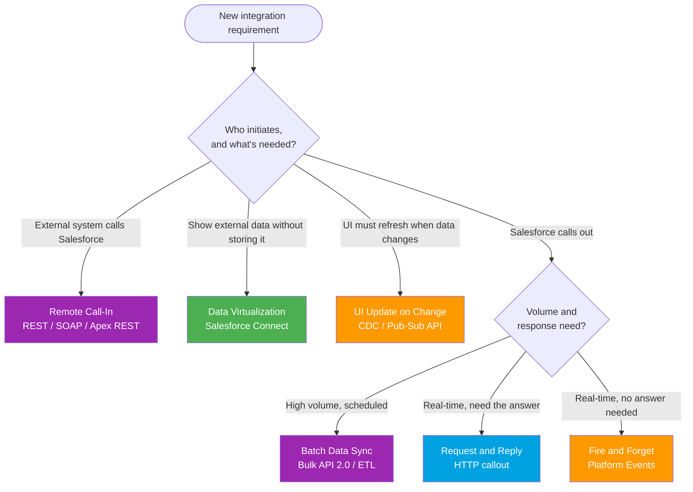

# Module 02 - Integration Patterns

> **Goal**: Memorize the **6 official Salesforce integration patterns** and know exactly *when* to use which.
> **API version**: v66.0 (Spring '26). **Outcome**: given any integration requirement, point at one pattern and justify it in a sentence.

A **pattern** is a named, reusable answer to a recurring integration problem. Salesforce's official *Integration Patterns and Practices* guide defines six. Master these and you can scope any integration before touching code. New to the vocabulary (sync/async, inbound/outbound, push/pull)? Read [Module 01](../01-Fundamentals/README.md) first.

---

## How to use this module

1. Read the patterns in order (01 → 06). Each is short and built the same way.
2. Use the **decision tree** and **comparison table** below as your interview cram sheet.
3. For the auth behind any callout or inbound call, see [Module 03 - Authentication](../03-Authentication/README.md).

---

## Map of this module

| # | Pattern | Direction | Timing |
|---|---|---|---|
| 01 | [request-and-reply](01-request-and-reply.md) | Salesforce → External | Synchronous |
| 02 | [fire-and-forget](02-fire-and-forget.md) | Salesforce → External | Asynchronous |
| 03 | [batch-data-synchronization](03-batch-data-synchronization.md) | Both ways | Scheduled / async |
| 04 | [remote-call-in](04-remote-call-in.md) | External → Salesforce | Sync or async |
| 05 | [data-virtualization](05-data-virtualization.md) | Salesforce reads External | Real-time read |
| 06 | [ui-update-based-on-data-changes](06-ui-update-based-on-data-changes.md) | Salesforce → subscribers | Async push |

---

## Which pattern? (decision tree)

---

## The master comparison table (memorize this)

| Pattern | Direction | Timing | Volume | Salesforce tech | Use when |
|---|---|---|---|---|---|
| **Request & Reply** (01) | SF → External | Sync | Low | HTTP callout, External Services | You need the answer **now** to continue. |
| **Fire & Forget** (02) | SF → External | Async | Low-Med | Platform Events, Outbound Messages | You announce an event and **don't wait**. |
| **Batch Data Sync** (03) | Both ways | Scheduled | High | Bulk API 2.0, ETL/MuleSoft | **Large** volumes on a schedule. |
| **Remote Call-In** (04) | External → SF | Sync/Async | Any | REST/SOAP API, Apex REST | An **external system** drives the CRUD. |
| **Data Virtualization** (05) | SF reads External | Real-time read | Low-Med | Salesforce Connect (OData) | **View** external data without copying it. |
| **UI Update on Change** (06) | SF → subscribers | Async push | Med | CDC, Pub/Sub API, empApi | UI must **auto-refresh** on a change. |

---

## Scenario → pattern (quick mapping)

| Requirement | Pattern |
|---|---|
| "Check a credit score before saving the loan." | **Request & Reply** |
| "Tell the ERP an order shipped." | **Fire & Forget** |
| "Sync 2M accounts from SAP every night." | **Batch Data Sync** |
| "Our website must create Leads in Salesforce." | **Remote Call-In** |
| "Show SAP invoices on the Account, don't store them." | **Data Virtualization** |
| "The agent console must update the moment a case changes." | **UI Update on Change** |

---

## Interview rapid-fire

**Q: Request & Reply vs Fire & Forget?**
→ Reply **waits** for and uses the response (sync). Forget sends and **moves on** (async). Choose by whether the result drives the next step.

**Q: A partner wants to push orders into Salesforce. Which pattern and tech?**
→ **Remote Call-In** via the REST API (or Apex REST for custom logic), authenticated with a Connected App / External Client App + OAuth.

**Q: 5 million records nightly. Which pattern?**
→ **Batch Data Sync** with **Bulk API 2.0**, upserting by External ID, scheduled off-peak. Never loop synchronous callouts.

**Q: Show live external data without storing it?**
→ **Data Virtualization** with **Salesforce Connect** (External Objects over OData). Each view triggers a callout, so mind performance.

**Q: Make an LWC refresh instantly when a record changes?**
→ **UI Update on Change** using **Change Data Capture** / **Pub/Sub API**, with the LWC subscribing via `lightning/empApi`.

---

## Sources (Verified June 2026)

- [Integration Patterns and Practices (v66.0, Spring '26) — Salesforce Developers](https://developer.salesforce.com/docs/atlas.en-us.integration_patterns_and_practices.meta/integration_patterns_and_practices/integ_pat_intro_overview.htm)
- [Pattern Selection Guide — Salesforce Developers](https://developer.salesforce.com/docs/atlas.en-us.integration_patterns_and_practices.meta/integration_patterns_and_practices/integ_pat_selection_guide.htm)
- [Pattern Summary — Salesforce Developers](https://developer.salesforce.com/docs/atlas.en-us.integration_patterns_and_practices.meta/integration_patterns_and_practices/integ_pat_pat_summary.htm)

*Each pattern file has its own Sources section with the specific official doc.*
