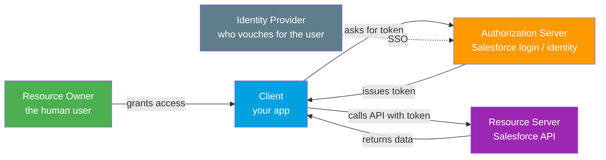
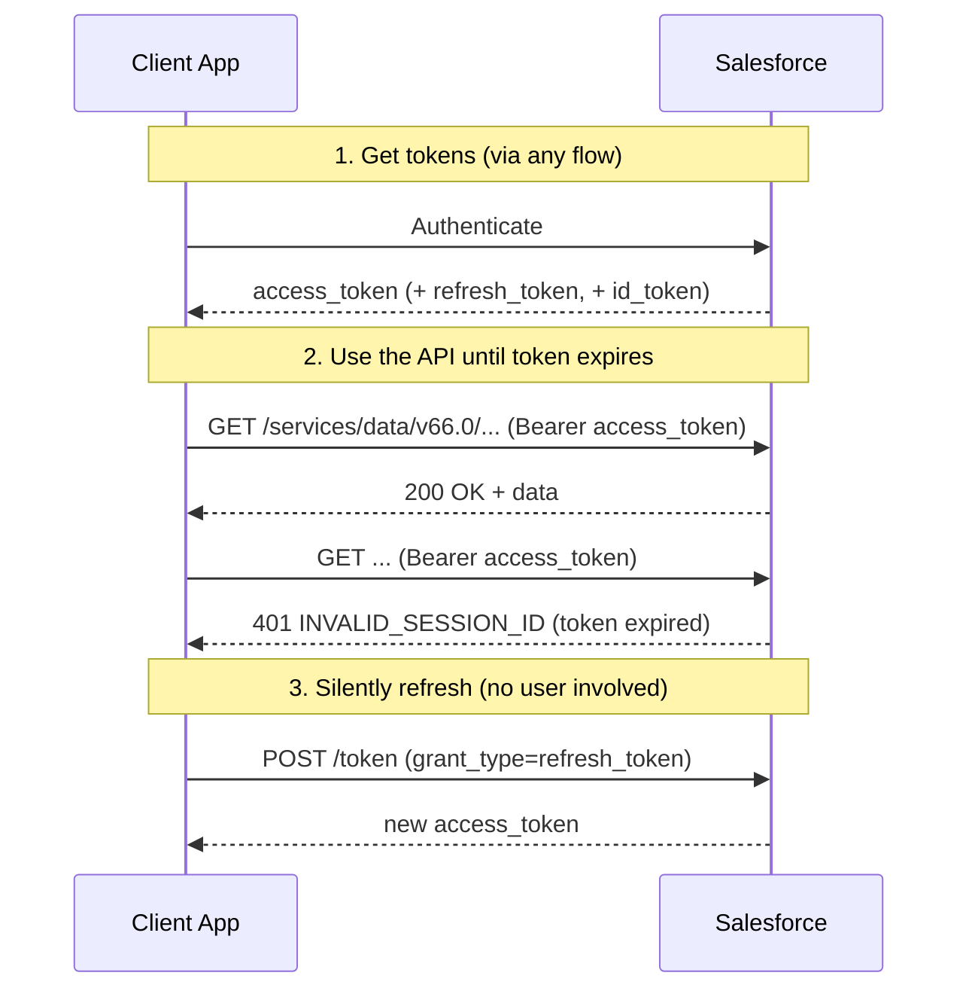
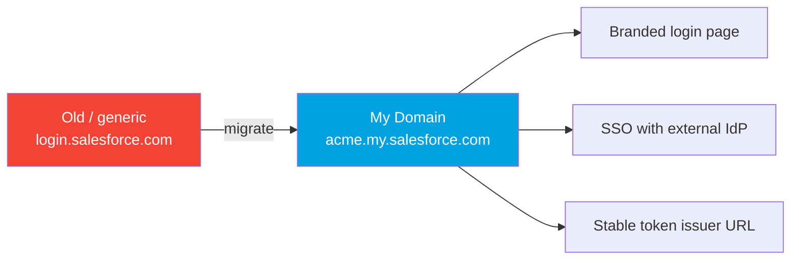

# 01 - Authentication Fundamentals (Read This First)

> **Goal**: Build the mental model that makes every OAuth flow click. If you understand the actors, tokens, scopes, and endpoints here, the 11 flows are just different ways of getting the same access token.
> **API version**: v66.0 (Spring '26). **Login host**: always your **My Domain** (`https://MyDomainName.my.salesforce.com`).

This is the shared vocabulary for Module 03. Every flow file links back here instead of re-explaining tokens and scopes.

---

## 1. AuthN vs AuthZ (the distinction interviewers test first)

Two different questions, two different words people lazily merge into "auth":

| Term | Question it answers | Salesforce example |
|---|---|---|
| **Authentication (AuthN)** | *Who are you?* | You log in to Salesforce with username + password + MFA. |
| **Authorization (AuthZ)** | *What are you allowed to do?* | A connected app is granted the `api` scope, so it can call the REST API but not manage users. |

**One-line answer for an interview**: "Authentication proves identity; authorization grants permission. OAuth 2.0 is primarily an **authorization** framework. OpenID Connect is the thin **authentication** layer added on top of OAuth, and in Salesforce it shows up as the **ID token** and the `openid` scope."

---

## 2. The cast of characters (the 5 roles)

Every flow is a conversation between these roles. Learn the roles once and you can read any sequence diagram.

| Role | OAuth name | In Salesforce, this is... |
|---|---|---|
| The human | **Resource Owner** | The Salesforce user whose data is accessed. |
| The app | **Client** | Your web app, mobile app, backend service, or middleware. Registered as a **Connected App** or **External Client App**. |
| The bouncer | **Authorization Server** | Salesforce identity service at `/services/oauth2/*`. Issues tokens. |
| The vault | **Resource Server** | The Salesforce API (`/services/data/...`) that the token unlocks. |
| The voucher | **Identity Provider (IdP)** | Whoever authenticates the user — Salesforce itself, or an external IdP (Okta, Entra ID, Google) via SSO. |

> **Note**: In Salesforce the Authorization Server and Resource Server are the *same platform*, just different endpoints. That is why your access token works against the API immediately, with no extra exchange.

---

## 3. The three tokens (know these cold)

99% of "what does this flow return?" questions come down to these three strings.

| Token | What it is | Format | Typical lifetime | Sent how |
|---|---|---|---|---|
| **Access token** | The key that unlocks the API. Equivalent to a temporary **Session ID**. | Opaque string (e.g. `00D...!AQ...`) | Until the session timeout (default **2 hours** of inactivity; set by the org's session settings) | `Authorization: Bearer <token>` header |
| **Refresh token** | A long-lived token used to silently get a *new* access token when the old one expires. | Opaque string | Until revoked or it hits a Connected App expiration policy (can be indefinite) | `POST /token` with `grant_type=refresh_token` |
| **ID token** | An **OpenID Connect** JWT that *describes the user* (name, user id, org id). Proof of authentication. | Signed **JWT** (3 base64 parts) | Short-lived, validated immediately | Returned only when `openid` scope is requested |

> **Interview trap**: "Does the JWT Bearer flow return a refresh token?" **No.** Certificate-based machine flows (JWT Bearer, Client Credentials) return an **access token only** — there is no user session to keep alive, so you just re-run the flow to get a fresh token. See [04-jwt-bearer-flow.md](04-jwt-bearer-flow.md) and [05-client-credentials-flow.md](05-client-credentials-flow.md).

---

## 4. Scopes (what the token is allowed to touch)

A **scope** is a permission string you request when getting a token. Salesforce only grants scopes the Connected App / External Client App has been configured to allow.

| Scope | Grants access to | Notes |
|---|---|---|
| `api` | REST, SOAP, Bulk, and other data APIs | The workhorse scope for integrations. |
| `web` | Lets the access token be used in a browser (`frontdoor.jsp`) | Often paired with `api`. |
| `full` | Everything the user can do | **Does NOT include `refresh_token`** — you must add that separately. |
| `refresh_token` / `offline_access` | Issues a **refresh token** for long-lived access | Two names, same effect. Required for "stay logged in." |
| `openid` | Returns an **ID token** (OpenID Connect) | Needed for SSO / login-with-Salesforce. |
| `id` | Access to the **Identity URL** (user info endpoint) | Returns profile details. |
| `chatter_api` | Connect (Chatter) REST API only | Narrow scope. |
| `custom_permissions` | Returns the user's custom permissions in the response | |
| `wave_api` | CRM Analytics (Tableau/Wave) REST API | |
| `eclair_api` | Einstein/Analytics charting | |
| `lightning` | Lightning Experience access | |
| `content` | Files/Content REST API | |
| `pardot_api` | Account Engagement (Pardot) API | |

**Least privilege rule**: request only what you need. For a typical server integration, `api refresh_token` is enough. Asking for `full` on a backend job is a red flag in a security review.

> **Gotcha**: Even when you request `full`, you still must explicitly request `refresh_token` (or `offline_access`) to get a refresh token. This catches people constantly.

---

## 5. The OAuth 2.0 endpoints (one base, five doors)

All endpoints live under your **My Domain** host. Replace `MyDomainName` with your org's My Domain. (You *can* still see `login.salesforce.com` in old docs, but My Domain is the correct, future-proof host and is mandatory for many flows.)

Base: `https://MyDomainName.my.salesforce.com/services/oauth2/`

| Endpoint | Path | Purpose |
|---|---|---|
| **Authorize** | `/services/oauth2/authorize` | Where you send the *user's browser* to log in and consent. Start of interactive flows. |
| **Token** | `/services/oauth2/token` | Where the *app* exchanges a code/assertion/credentials for an access token. The workhorse. |
| **Revoke** | `/services/oauth2/revoke` | Invalidate an access or refresh token (logout / kill switch). |
| **Introspect** | `/services/oauth2/introspect` | Ask "is this token still valid?" and get its metadata (RFC 7662). Used by resource servers. |
| **UserInfo** | `/services/oauth2/userinfo` | OpenID Connect endpoint that returns the user's profile for a valid token. |

> **Test vs prod**: sandboxes use `https://MyDomainName--SandboxName.sandbox.my.salesforce.com`. The legacy `test.salesforce.com` host maps to sandboxes; `login.salesforce.com` to production. Prefer My Domain everywhere.

---

## 6. My Domain — why every flow says "use your My Domain"

**My Domain** is your org's unique login subdomain (e.g. `acme.my.salesforce.com`). Since Spring '23 it is mandatory for all production orgs. It matters for auth because:

1. It is the **issuer** of your tokens — external IdPs and partners pin to it.
2. **Enhanced Domains** changed the URL format; old hardcoded `*.salesforce.com` hostnames break. Always build URLs from My Domain.
3. SSO, branded login pages, and many newer flows (Client Credentials, Auth Code & Credentials) **require** My Domain.

---

## 7. The container: Connected App vs External Client App

Every OAuth flow needs a registered app definition that holds the **client id** (a.k.a. consumer key), **client secret** (consumer secret), allowed scopes, callback URL, and which flows are enabled.

- **Connected App** — the original container (2013+). Being phased out for *new* creation: Salesforce disabled creating new Connected Apps by default starting **Winter '26 / Spring '26**.
- **External Client App (ECA)** — the next generation (GA 2024+). Separates **developer** OAuth config from **admin** policy, is built for 2GP packaging, and is the go-forward choice.

Full comparison, including which flows each supports, is in **[13-connected-apps-vs-external-client-apps.md](13-connected-apps-vs-external-client-apps.md)**. For now: *the app is the door; the flow is how you walk through it.*

---

## 8. What changed in 2025-2026 (say this and you sound current)

Interviewers reward candidates who know the platform is moving. The three headlines:

| Change | What it means | Status |
|---|---|---|
| **Username-Password flow retiring** | The flow that passes raw username+password is being killed. Blocked by default for orgs created Summer '23+, full retirement targeted for **Winter '27**. | Migrate to **Client Credentials** (server-to-server) or **Web Server + PKCE** (user login). See [07-username-password-flow.md](07-username-password-flow.md). |
| **External Client Apps replace Connected Apps** | New Connected App creation disabled by default (**Winter '26 / Spring '26**); ECAs are the modern container. | Build new integrations on **ECAs**. See [13](13-connected-apps-vs-external-client-apps.md). |
| **Client Credentials is the new server default** | The recommended passwordless server-to-server flow, replacing Username-Password. | Run-as user + secret. See [05-client-credentials-flow.md](05-client-credentials-flow.md). |

---

## 9. grant_type cheat table (map flow → token request)

When you POST to `/services/oauth2/token`, the `grant_type` parameter tells Salesforce which flow you're running. Memorize this table and you can identify any flow from a raw HTTP request.

| Flow | `grant_type` (or `response_type`) | Returns refresh token? |
|---|---|---|
| Web Server (Authorization Code) | `authorization_code` | Yes |
| Refresh Token | `refresh_token` | reuses it |
| JWT Bearer | `urn:ietf:params:oauth:grant-type:jwt-bearer` | No |
| SAML Bearer | `urn:ietf:params:oauth:grant-type:saml2-bearer` | No |
| SAML Assertion | `urn:oasis:names:tc:SAML:2.0:profiles:SSO:browser` | No |
| Client Credentials | `client_credentials` | No |
| Device | `device` (after `response_type=device_code`) | Yes |
| Username-Password (legacy) | `password` | No |
| User-Agent (legacy) | `response_type=token` (browser) | Optional |
| Asset Token | `urn:ietf:params:oauth:grant-type:token-exchange` | n/a (asset token) |

---

## 10. Glossary (quick definitions)

- **Bearer token** — any token where *possession = access*. Whoever holds it can use it, so it must be protected like a password.
- **Consumer Key / Client ID** — public identifier of your app.
- **Consumer Secret / Client Secret** — private password of your app. Confidential clients can keep it; public clients (mobile, SPA) cannot.
- **Confidential client** — an app that can store a secret safely (a backend server).
- **Public client** — an app that cannot keep a secret (mobile app, single-page app). Uses **PKCE** instead.
- **PKCE** ("pixie") — Proof Key for Code Exchange. Adds a one-time `code_verifier`/`code_challenge` pair so an intercepted auth code is useless. See [02-web-server-flow.md](02-web-server-flow.md).
- **Callback URL / Redirect URI** — where Salesforce sends the browser back after login. Must match the app config exactly.
- **JWT** — JSON Web Token. A signed, self-contained token: `header.payload.signature`, base64url-encoded.
- **Assertion** — a signed statement (JWT or SAML) that the token endpoint trusts in place of interactive login.
- **Identity URL** — a Salesforce URL unique to each user that returns profile info; delivered with the access token.
- **Named Principal vs Per-User** — whether *one shared identity* or *each user's own identity* is used for an outbound callout. See [14-named-credentials-and-external-credentials.md](14-named-credentials-and-external-credentials.md).
- **frontdoor.jsp** — Salesforce URL that turns a valid access token into a browser UI session (needs `web` scope).

---

## Sources (Verified June 2026)

- [OAuth Tokens and Scopes — Salesforce Help](https://help.salesforce.com/s/articleView?id=sf.remoteaccess_oauth_tokens_scopes.htm&type=5)
- [Authorize Apps with OAuth — Salesforce Help](https://help.salesforce.com/s/articleView?id=xcloud.remoteaccess_authenticate.htm&type=5)
- [OAuth Endpoints — Salesforce Help](https://help.salesforce.com/s/articleView?id=sf.remoteaccess_oauth_endpoints.htm&type=5)
- [OpenID Connect Token Introspection Endpoint — Salesforce Help](https://help.salesforce.com/s/articleView?id=xcloud.remoteaccess_oidc_token_introspection_endpoint.htm&type=5)
- [External Client Apps and Connected Apps — Salesforce Help](https://help.salesforce.com/s/articleView?id=xcloud.external_integrations.htm&type=5)
- [Retirement of OAuth 2.0 Username-Password Flow — Release Notes](https://help.salesforce.com/s/articleView?id=release-notes.rn_security_unpw_flow_retirement.htm&type=5)
- [My Domain — Salesforce Help](https://help.salesforce.com/s/articleView?id=sf.domain_name_overview.htm&type=5)

---

*Next: [02-web-server-flow.md](02-web-server-flow.md) — the most common flow, used whenever a real user logs in to a web app.*
