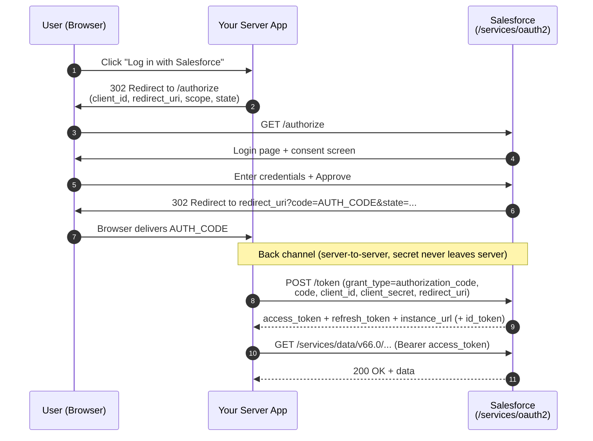
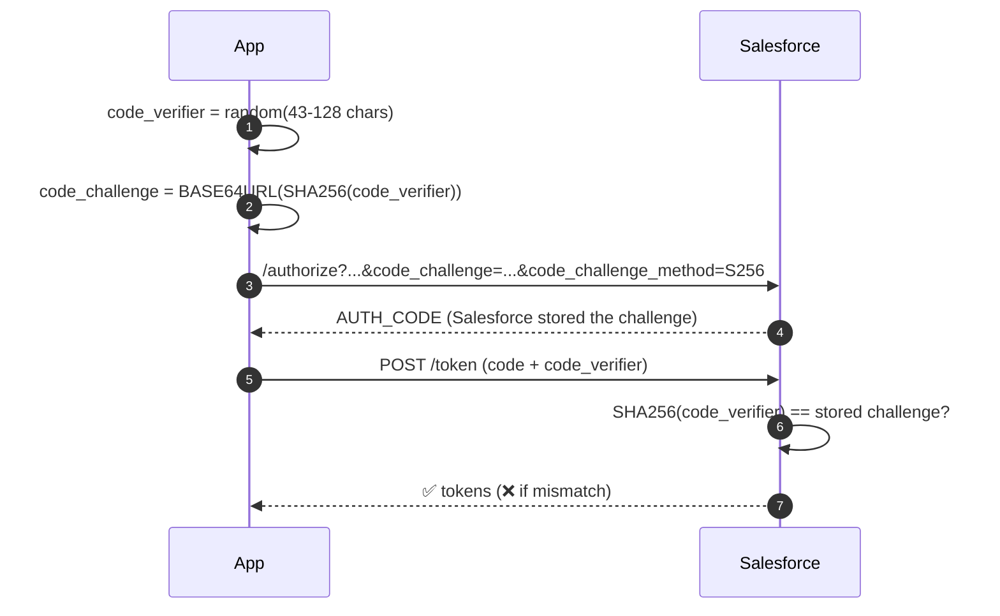

# 02 - Web Server Flow (Authorization Code) + PKCE

> **One-liner**: A real user clicks "Log in with Salesforce," approves access, and your **backend server** exchanges a short-lived code for tokens.
> **Use when**: A web app with a server backend acts *on behalf of a logged-in user*.
> **Grant type**: `authorization_code` · **Status**: ✅ Recommended (the gold standard for user login).
> **Tokens returned**: Access token **+ refresh token** (+ ID token if `openid`).

New here? Read [01-authentication-fundamentals.md](01-authentication-fundamentals.md) first for tokens, scopes, and endpoints.

---

## 1. The idea in plain English

Think of a **hotel**. You (the user) show your ID at the front desk (Salesforce login). The desk doesn't hand your passport to the bellhop — it gives the bellhop (your app) a **key card** (access token) that opens only certain doors (scopes), for a limited time.

The clever part: the front desk first gives a **claim ticket** (authorization code) to the user's browser, and your *server* quietly trades that ticket for the real key card over a back channel. The browser never sees the access token, and the server proves its identity with a secret. That two-step "code then token" exchange is what makes this the most secure interactive flow.

---

## 2. When to use it (and when not)

| ✅ Use it when | ❌ Avoid / use something else |
|---|---|
| You have a **server backend** that can keep a client secret safe. | Pure single-page app or mobile app with no backend → still use this flow **but add PKCE** and treat as a public client. |
| A **human user** logs in and the app acts as that user. | No user involved (cron job, ETL) → use [05-client-credentials-flow.md](05-client-credentials-flow.md) or [04-jwt-bearer-flow.md](04-jwt-bearer-flow.md). |
| You need **long-lived access** (refresh token) without re-prompting. | Device with no browser/keyboard → use [06-device-flow.md](06-device-flow.md). |

**Real-world examples**: a customer portal built in Node/Java that reads the user's Salesforce records; a marketing tool where each user connects their own Salesforce; "Log in with Salesforce" on a third-party SaaS.

---

## 3. How it works (sequence diagram)



**Walkthrough**

1-2. App sends the user's browser to the **authorize** endpoint with its `client_id`, the `redirect_uri`, requested `scope`, and a random `state` (CSRF guard).
3-5. Salesforce authenticates the user (password, MFA, or SSO) and shows a one-time consent screen.
6-7. Salesforce redirects the browser back to your `redirect_uri` with a short-lived **authorization code** (valid ~15 min, single use).
8. Your **server** (not the browser) POSTs the code plus its `client_secret` to the **token** endpoint.
9. Salesforce returns the **access token**, a **refresh token**, and `instance_url`.
10-11. Your app calls the API with `Authorization: Bearer <access_token>`.

---

## 4. PKCE — the mandatory upgrade for public clients

**PKCE** (Proof Key for Code Exchange, say "pixie", RFC 7636) defends against someone stealing the authorization code in transit. The app generates a random secret per login and proves it owns that secret when redeeming the code.



**Why it matters**: a stolen code is useless without the matching `code_verifier`, which never left the app. Salesforce **recommends PKCE for all clients** and it is effectively required for mobile/SPA. Add two params to the authorize request (`code_challenge`, `code_challenge_method=S256`) and one to the token request (`code_verifier`).

---

## 5. The actual requests & responses

**Step 1 — send the browser here (authorize):**

```
https://MyDomainName.my.salesforce.com/services/oauth2/authorize
  ?response_type=code
  &client_id=3MVG9...CONSUMER_KEY
  &redirect_uri=https://app.example.com/oauth/callback
  &scope=api%20refresh_token%20openid
  &state=xyz123
  &code_challenge=Psd... (PKCE)
  &code_challenge_method=S256
```

**Step 2 — Salesforce redirects back:**

```
https://app.example.com/oauth/callback?code=aPrx...AUTH_CODE&state=xyz123
```

**Step 3 — exchange the code (token), server-side:**

```bash
curl https://MyDomainName.my.salesforce.com/services/oauth2/token \
  -d grant_type=authorization_code \
  -d code=aPrx...AUTH_CODE \
  -d client_id=3MVG9...CONSUMER_KEY \
  -d client_secret=ABCD...CONSUMER_SECRET \
  -d redirect_uri=https://app.example.com/oauth/callback \
  -d code_verifier=THE_ORIGINAL_RANDOM_STRING
```

**Step 4 — the token response:**

```json
{
  "access_token": "00D5g000004...!AQEAQ...",
  "refresh_token": "5Aep861...l4Lo",
  "signature": "k0r...=",
  "scope": "api refresh_token openid",
  "id_token": "eyJraWQiOiI...",
  "instance_url": "https://MyDomainName.my.salesforce.com",
  "id": "https://login.salesforce.com/id/00D.../005...",
  "token_type": "Bearer",
  "issued_at": "1718700000000"
}
```

**Connected App / ECA setup checklist**

1. Create a Connected App (or **External Client App** — preferred). Enable **OAuth Settings**.
2. Set the **Callback URL** to exactly your `redirect_uri`.
3. Select scopes (e.g. `Access and manage your data (api)`, `Perform requests at any time (refresh_token, offline_access)`).
4. Keep **"Require Proof Key for Code Exchange (PKCE)"** checked.
5. Copy the **Consumer Key** (client_id) and **Consumer Secret** (client_secret).
6. Optionally set IP relaxation, refresh-token policy, and permitted users.

> **Salesforce as the client (outbound)**: when *Salesforce itself* needs to call an external API on behalf of each user, you don't hand-code this flow — you configure a **Named Credential** with an **External Credential** of type *"OAuth 2.0 — Authorization Code"* (Browser Flow). Salesforce runs steps 1-9 for you. See [14-named-credentials-and-external-credentials.md](14-named-credentials-and-external-credentials.md).

---

## 6. Security pitfalls & gotchas

| Pitfall | Why it bites | Fix |
|---|---|---|
| Skipping `state` | CSRF: attacker injects their own code. | Generate a random `state`, store it in the session, verify on callback. |
| No PKCE on mobile/SPA | Public clients can't hide a secret; codes can be intercepted. | Always send `code_challenge` / `code_verifier`. |
| Redeeming the code in the browser | Exposes the client secret and tokens to JavaScript. | Exchange the code **on the server only**. |
| Loose `redirect_uri` | Open-redirect token theft. | Register the exact callback; Salesforce matches it strictly. |
| Requesting `full` "to be safe" | Over-privileged token. | Request least privilege (`api refresh_token`). |
| Storing tokens in localStorage | XSS steals them. | Store server-side or in httpOnly cookies. |
| Forgetting `refresh_token` scope | Access token dies in ~2h, user re-prompted. | Add `refresh_token`/`offline_access` scope. |

---

## 7. Interview Q&A

**Q: Walk me through the Authorization Code flow.**
A: App redirects the user's browser to `/authorize`; user logs in and consents; Salesforce returns a short-lived auth code to the registered callback; the app's *server* exchanges that code plus its client secret at `/token` for an access token and refresh token; the app calls the API with the bearer token. The browser never sees the access token.

**Q: Why two steps — code then token? Why not return the token directly?**
A: Returning the token directly (the old **User-Agent / implicit** flow) exposes it in the browser URL/history where it can leak. The code-then-token split keeps the access token on a secure back channel, authenticated by the client secret.

**Q: What is PKCE and what attack does it stop?**
A: Proof Key for Code Exchange. The app sends a hashed `code_challenge` up front and the raw `code_verifier` at redemption. It stops **authorization-code interception** — a stolen code is useless without the verifier. Required for public clients, recommended for all.

**Q: Difference between this and Client Credentials / JWT Bearer?**
A: Web Server flow is **user-context** (acts as the logged-in user, returns a refresh token). Client Credentials and JWT Bearer are **system-context** (no user, no refresh token), for backend integrations.

**Q: The access token expired mid-session. What happens?**
A: API returns `401 INVALID_SESSION_ID`. The app silently calls `/token` with `grant_type=refresh_token` to get a new access token — no user interaction. See [08-refresh-token-flow.md](08-refresh-token-flow.md).

**Talking point to explain it to anyone**: "It's a coat check. You show ID once, get a claim ticket, and your app swaps the ticket for a key that opens just the doors it needs, for a while."

---

## 8. Key terms

`authorization_code` · `state` · `code_challenge` / `code_verifier` · `redirect_uri` · confidential vs public client — all defined in [01-authentication-fundamentals.md](01-authentication-fundamentals.md#10-glossary-quick-definitions).

---

## Sources (Verified June 2026)

- [OAuth 2.0 Web Server Flow for Web App Integration — Salesforce Help](https://help.salesforce.com/s/articleView?id=xcloud.remoteaccess_oauth_web_server_flow.htm&type=5)
- [Implement the OAuth 2.0 Web Server Flow — Trailhead](https://trailhead.salesforce.com/content/learn/projects/build-integrations-with-external-client-apps/implement-the-oauth-20-web-server-flow)
- [OAuth Tokens and Scopes — Salesforce Help](https://help.salesforce.com/s/articleView?id=sf.remoteaccess_oauth_tokens_scopes.htm&type=5)
- [PKCE (RFC 7636)](https://datatracker.ietf.org/doc/html/rfc7636)

---

*Next: [03-user-agent-flow.md](03-user-agent-flow.md) — the older browser-only flow this one replaced.*
