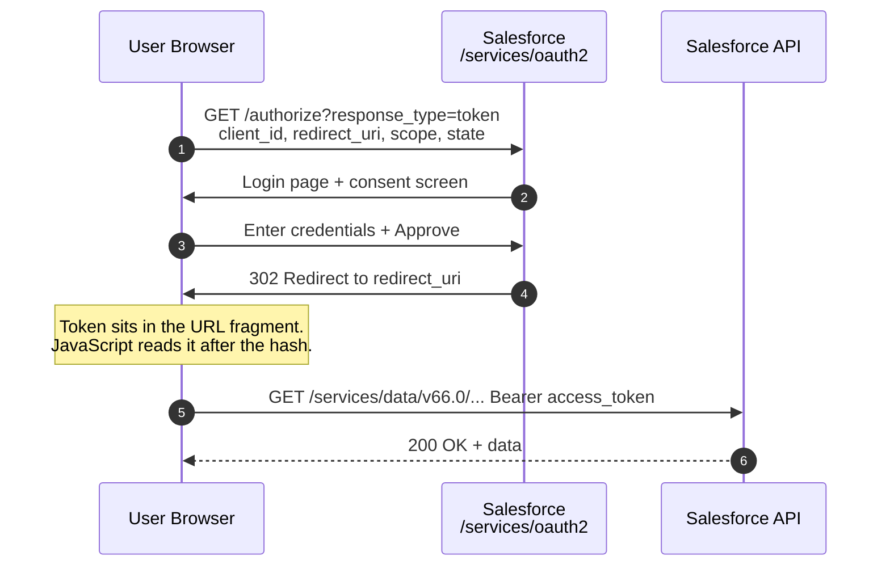

# 03 - User-Agent Flow (Browser Implicit-Style)

> **One-liner**: A browser-based app sends the user to Salesforce to log in, and the **access token comes straight back in the URL fragment** (`#access_token=...`) for the browser to read.
> **Use when**: (Historically) a mobile, desktop, or JavaScript app with **no server backend** to keep a secret. Today, prefer the Web Server flow + PKCE instead.
> **Grant type**: `response_type=token` (OAuth 2.0 implicit grant) · **Status**: ⚠️ Legacy — Salesforce recommends **[02-web-server-flow.md](02-web-server-flow.md) + PKCE** instead.
> **Tokens returned**: Access token (+ optional refresh token) delivered in the URL fragment. **No client secret used** (public client).

New here? Read [01-authentication-fundamentals.md](01-authentication-fundamentals.md) first for tokens, scopes, and endpoints.

---

## 1. The idea in plain English

Imagine a **valet stand that hands the car key directly to whoever is standing at the booth**. The user walks up (their browser), proves who they are, and Salesforce tosses the key (access token) straight back onto the counter where the browser can grab it. There is no back office, no second handshake, no secret password the app whispers to prove it is trustworthy.

That speed is also the weakness. Because the token lands **in the browser's address bar** (after the `#`), it can leak into browser history, server logs, and `Referer` headers. The newer [Web Server flow](02-web-server-flow.md) fixes this by handing over a one-time **claim ticket** (auth code) instead and swapping it for the real token on a private back channel. That is why Salesforce now steers everyone to Web Server + PKCE.

---

## 2. When to use it (and when not)

| ✅ Historically used when | ❌ Avoid / use something else |
|---|---|
| A **public client** (mobile, desktop, SPA) had **no backend** to hold a secret. | You have any server at all → use [02-web-server-flow.md](02-web-server-flow.md). |
| You needed the token **inside the browser/device** quickly. | A modern mobile or single-page app → use **Web Server flow + PKCE** (public-client mode). |
| Quick demos and legacy integrations already built on it. | No browser/keyboard (smart TV, CLI) → use [06-device-flow.md](06-device-flow.md). |

**Reality check**: Salesforce Mobile SDK used this flow through version **10.2**, then switched its default to the **Web Server flow with PKCE in Mobile SDK 11.0**. Salesforce explicitly calls the user-agent flow **insecure** and recommends blocking it for new integrations. Treat any new request to use it as a red flag in a design review.

**Real-world examples (legacy)**: an old single-page dashboard that read Salesforce data directly from JavaScript; an early native mobile app before PKCE existed; a quick internal tool that grabbed a token in the browser.

---

## 3. How it works (sequence diagram)



**Walkthrough**

1. The app sends the user's browser to the **authorize** endpoint with `response_type=token`, its `client_id`, the `redirect_uri`, requested `scope`, and a random `state` (CSRF guard).
2-3. Salesforce authenticates the user (password, MFA, or SSO) and shows the consent screen.
4. Salesforce redirects the browser back to the `redirect_uri` with the **access token in the URL fragment** (after `#`), not as a query parameter. The fragment is never sent to a server, so it stays in the browser.
5. The app's JavaScript reads the token from `window.location.hash`. Best practice: immediately call `window.location.replace()` to strip the token out of browser history.
6-7. The app calls the API directly with `Authorization: Bearer <access_token>`.

> **Why the fragment (`#`) and not a query (`?`)**: the part of a URL after `#` is **never transmitted to the web server** and is omitted from `Referer` headers. Salesforce deliberately uses the fragment so the token is not leaked to your callback server or to downstream sites. It still ends up exposed to the browser and any script on the page, which is the core security problem.

---

## 4. The actual requests & responses

**Step 1 — send the browser here (authorize):**

```
https://MyDomainName.my.salesforce.com/services/oauth2/authorize
  ?response_type=token
  &client_id=3MVG9...CONSUMER_KEY
  &redirect_uri=https://app.example.com/oauth/callback
  &scope=api%20web
  &state=xyz123
```

**Step 2 — Salesforce redirects back with the token in the fragment:**

```
https://app.example.com/oauth/callback#access_token=00D5g000004...!AQEAQ...
  &instance_url=https%3A%2F%2FMyDomainName.my.salesforce.com
  &id=https%3A%2F%2Flogin.salesforce.com%2Fid%2F00D...%2F005...
  &issued_at=1718700000000
  &signature=k0r...%3D
  &scope=api+web
  &token_type=Bearer
  &state=xyz123
```

There is **no curl token exchange step** here. Unlike the Web Server flow, the app does not POST to `/services/oauth2/token`. The token is already in the redirect. The browser parses the fragment client-side:

```javascript
// Read the access token from the URL fragment
const params = new URLSearchParams(window.location.hash.substring(1));
const accessToken = params.get('access_token');
const instanceUrl = params.get('instance_url');

// Immediately remove the token from history (recommended by Salesforce)
window.location.replace('/app-home');
```

**Connected App / ECA setup checklist**

1. Create a Connected App (or **External Client App**). Enable **OAuth Settings**.
2. Set the **Callback URL** to exactly your `redirect_uri`.
3. Select scopes. For the user-agent flow you typically need `api` and `web`. Add `refresh_token` / `offline_access` only if you intend to receive a refresh token (and accept that storing it in a browser is risky).
4. Because this is a public client, the **Consumer Secret is not sent**. Do not embed it in client code.
5. Strongly consider enabling **"Require Proof Key for Code Exchange (PKCE)"** and migrating to the [Web Server flow](02-web-server-flow.md) instead.

> **Hybrid alternative**: Salesforce also documents a **Hybrid User-Agent Token flow**, which starts like the user-agent flow but returns an authorization code you can exchange for a refresh token on a back channel. It exists specifically to give browser apps a safer path to long-lived access. If you are stuck on a browser-only architecture, evaluate it before the raw user-agent flow.

---

## 5. Security pitfalls & gotchas

| Pitfall | Why it bites | Fix |
|---|---|---|
| **Token in the URL fragment** | Leaks into browser history, bookmarks, and shoulder-surfing. | Call `window.location.replace()` immediately; better, move to [Web Server flow + PKCE](02-web-server-flow.md). |
| **No back channel** | The token is exposed to every script on the page; XSS = full token theft. | Avoid this flow for sensitive data; harden against XSS; use httpOnly server-side sessions instead. |
| **Skipping `state`** | CSRF: an attacker can splice in their own response. | Generate a random `state`, store it, verify it on return. |
| **Embedding the client secret** | Public clients cannot hide a secret; it would be extractable from the binary or JS. | The flow deliberately omits the secret. Never ship one client-side. |
| **Requesting `full`** | Over-privileged token exposed in the browser. | Request least privilege (`api web`). |
| **Storing the token in localStorage** | Persists the bearer token where XSS can read it. | Keep it in memory only, or switch to a server-backed flow. |

---

## 6. Interview Q&A

**Q: What is the User-Agent flow and how does it differ from the Web Server flow?**
A: It is the OAuth 2.0 **implicit** grant (`response_type=token`). Salesforce returns the **access token directly in the redirect URL fragment** to the browser. The Web Server flow instead returns a one-time **authorization code** that the server exchanges for tokens on a back channel. User-Agent skips that second step, so it is simpler but less secure.

**Q: Why is the token returned in the fragment (`#`) instead of a query string (`?`)?**
A: The fragment is **never sent to the server** and is excluded from `Referer` headers, so it does not leak to your callback host or downstream sites. It is still visible to the browser and page scripts, which is why the flow is discouraged.

**Q: Why does Salesforce now discourage this flow?**
A: The token is exposed in the browser URL, history, and to any script on the page. There is no back channel and no client secret, so a stolen token is immediately usable. Salesforce recommends **Web Server flow + PKCE**, and Mobile SDK switched its default to that in **version 11.0**.

**Q: Does the User-Agent flow use a client secret?**
A: No. It is a **public client** flow. Client executables and browser code cannot keep a secret safely, so the flow is designed without one. Anyone shipping a secret in client code has a vulnerability.

**Q: A mobile app needs to log a user in today. Should it use the User-Agent flow?**
A: No. Use the **Web Server flow in public-client mode with PKCE**. It gives the same "no secret" benefit but keeps the token off the URL and protects the code exchange with a one-time verifier.

**Talking point to explain it to anyone**: "It is like a valet who hands the car key straight to whoever is at the booth. Fast, but anyone watching the counter can grab the key. The newer flow gives you a claim ticket instead and fetches the key in the back office."

---

## 7. Key terms

`response_type=token` · implicit grant · URL fragment · public client · `state` · PKCE — all defined in [01-authentication-fundamentals.md](01-authentication-fundamentals.md#10-glossary-quick-definitions).

---

## Sources (Verified June 2026)

- [OAuth 2.0 User-Agent Flow for Desktop or Mobile App Integration — Salesforce Help](https://help.salesforce.com/s/articleView?id=xcloud.remoteaccess_oauth_user_agent_flow.htm&type=5)
- [OAuth 2.0 User-Agent Flow — Mobile SDK Development Guide](https://developer.salesforce.com/docs/platform/mobile-sdk/guide/oauth-useragent-flow.html)
- [OAuth 2.0 Hybrid User-Agent Token Flow for Web Session Management — Salesforce Help](https://help.salesforce.com/s/articleView?id=sf.remoteaccess_oauth_hybrid_app_token_flow.htm&type=5)
- [Block Authorization Flows to Improve Security — Salesforce Help](https://help.salesforce.com/s/articleView?id=xcloud.remoteaccess_disable_username_password_flow.htm&type=5)
- [OAuth 2.0 Implicit Grant (RFC 6749 §4.2)](https://datatracker.ietf.org/doc/html/rfc6749#section-4.2)

---

*Next: [04-jwt-bearer-flow.md](04-jwt-bearer-flow.md) — the certificate-signed server-to-server flow that needs no user and no password.*
