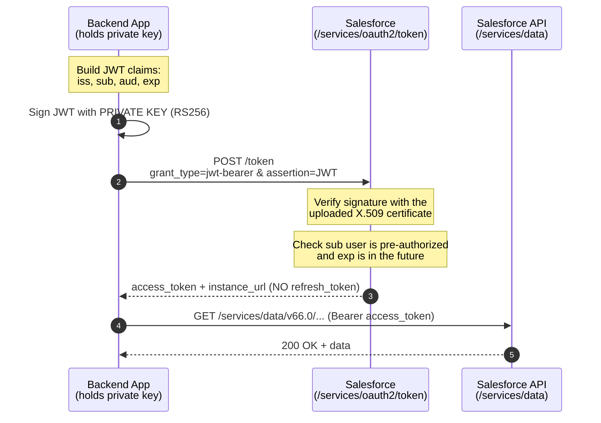

# 04 - JWT Bearer Token Flow

> **One-liner**: A backend app proves its identity with a **private key** (no password, no browser) by signing a short-lived JWT that Salesforce verifies against an uploaded certificate.
> **Use when**: Server-to-server / CI-CD where a trusted backend acts as a **pre-authorized user** with zero human interaction.
> **Grant type**: `urn:ietf:params:oauth:grant-type:jwt-bearer` · **Status**: ✅ Recommended (the classic machine flow; great when you can manage a key pair).
> **Tokens returned**: Access token **only**. **No refresh token** (you just re-sign a new JWT).

New here? Read [01-authentication-fundamentals.md](01-authentication-fundamentals.md) first for tokens, scopes, and endpoints.

---

## 1. The idea in plain English

Think of a **wax seal on a letter**. Long ago, a noble pressed a signet ring into hot wax. Anyone holding the matching seal-stamp on file could look at the wax and say "yes, this really came from that noble." Nobody had to mail the ring itself.

Here your app is the noble. The **private key** is the signet ring. The **X.509 certificate** uploaded to the Connected App is the seal-stamp Salesforce keeps on file. Each time the app wants a token, it writes a tiny note (the **JWT**) that says "I am app X, acting as user Y, and this note is valid for the next 3 minutes," then presses its private-key ring into it. Salesforce checks the seal against the certificate, sees the user was already pre-approved, and hands back an **access token**. The private key never leaves your server. There is no password to steal and no browser to redirect.

---

## 2. When to use it (and when not)

| ✅ Use it when | ❌ Avoid / use something else |
|---|---|
| A **backend service or daemon** needs API access with no user present. | A real user logs in interactively → use [02-web-server-flow.md](02-web-server-flow.md). |
| **CI/CD** pipelines authorize an org headlessly (the Salesforce CLI uses this). | You want the integration to run as a **dedicated service identity, not a named human** → consider [05-client-credentials-flow.md](05-client-credentials-flow.md). |
| You can **securely store a private key** and rotate certificates. | The client cannot protect a key file (browser, SPA) → public-client flows with PKCE. |
| You must impersonate a **specific Salesforce user** (the `sub`) who is pre-authorized. | A device with no key management → use [06-device-flow.md](06-device-flow.md). |

**Real-world examples**: a nightly Java/Node ETL job syncing an ERP into Salesforce; a Jenkins/GitHub Actions pipeline running `sf project deploy`; a middleware tier that acts as one fixed integration user across all calls.

> **Interview trap**: "Does JWT Bearer return a refresh token?" **No.** There is no user session to keep alive, so when the access token expires you simply sign a fresh JWT and ask again. Same answer for Client Credentials.

---

## 3. How it works (sequence diagram)



**Walkthrough**

1-2. The app assembles the **JWT claims** and signs the token with its **private key** using **RS256**.
3. The app POSTs to the **token endpoint** with `grant_type=urn:ietf:params:oauth:grant-type:jwt-bearer` and the JWT in the `assertion` parameter.
4-5. Salesforce verifies the signature against the **X.509 certificate** stored on the Connected App / External Client App, confirms the `sub` user is **pre-authorized**, and checks that `exp` is still in the future.
6. Salesforce returns an **access token** and `instance_url`. No refresh token is issued.
7-8. The app calls the API with `Authorization: Bearer <access_token>`.

---

## 4. The JWT — header, claims, signature

A JWT is three base64url parts joined by dots: `header.payload.signature`.

**Header** (algorithm is fixed to RS256):

```json
{ "alg": "RS256" }
```

**Claims (payload)** — the four that matter:

| Claim | Meaning | What to put |
|---|---|---|
| `iss` | **Issuer** | Your app's **Consumer Key / client_id** (the `3MVG9...` value). |
| `sub` | **Subject** | The **run-as username** the token acts as (e.g. `integration@acme.com`). |
| `aud` | **Audience** | The login host: `https://login.salesforce.com` (prod), `https://test.salesforce.com` (sandbox), or your **My Domain** URL. |
| `exp` | **Expiration** | A Unix timestamp **a few minutes ahead** (3-5 min). Salesforce rejects long-lived JWTs. |

Sample claims set:

```json
{
  "iss": "3MVG9...CONSUMER_KEY",
  "sub": "integration@acme.com",
  "aud": "https://login.salesforce.com",
  "exp": 1718700300
}
```

> **Notes**: You **cannot request scopes** in this flow. Scopes come from the app's **Permitted Users** policy and the org's API Access Control settings. The `jti` (JWT ID) claim is **optional**, but if you include it Salesforce checks it has not been seen before, which blocks **replay attacks**. Keep `exp` short (the platform's own External Credentials default is **2 minutes**, and signed JWTs are typically set to **3-5 minutes**).

---

## 5. The actual requests & responses

**Step 1 — generate a key pair and self-signed certificate (OpenSSL):**

```bash
# 2048-bit RSA private key (keep this secret, never commit it)
openssl genrsa -out server.key 2048

# Certificate signing request
openssl req -new -key server.key -out server.csr

# Self-signed X.509 certificate, valid 1 year (upload server.crt to Salesforce)
openssl x509 -req -sha256 -days 365 -in server.csr -signkey server.key -out server.crt
```

`server.key` = the **private key** your app signs with. `server.crt` = the **public certificate** (must be **≤ 4 KB**) you upload to the Connected App.

**Step 2 — Connected App / ECA setup checklist:**

1. Create a Connected App (or **External Client App** — preferred). Enable **OAuth Settings**.
2. Check **"Use digital signatures"** and upload `server.crt`.
3. Select OAuth scopes (e.g. `api`, `refresh_token` is irrelevant here). A callback URL is required by the form but unused by this flow.
4. Copy the **Consumer Key** (this becomes `iss` / `client_id`).
5. Under the app's policies, set **Permitted Users = "Admin approved users are pre-authorized"** and assign the run-as user via a **profile or permission set**. This is what makes the `sub` user allowed.

**Step 3 — exchange the signed JWT for a token:**

```bash
curl https://MyDomainName.my.salesforce.com/services/oauth2/token \
  -d grant_type=urn:ietf:params:oauth:grant-type:jwt-bearer \
  -d assertion=eyJhbGciOiJSUzI1NiJ9.eyJpc3MiOiIzTVZHOS4uLiJ9.SIGNATURE
```

**Step 4 — the token response (no refresh token):**

```json
{
  "access_token": "00D5g000004...!AQEAQ...",
  "scope": "api",
  "instance_url": "https://MyDomainName.my.salesforce.com",
  "id": "https://login.salesforce.com/id/00D.../005...",
  "token_type": "Bearer"
}
```

**Step 5 — the Salesforce CLI does all of this for you** (the CLI's `org login jwt` *is* the JWT Bearer flow):

```bash
sf org login jwt \
  --client-id 3MVG9...CONSUMER_KEY \
  --jwt-key-file ./server.key \
  --username integration@acme.com \
  --instance-url https://MyDomainName.my.salesforce.com \
  --alias ci-org --set-default
```

`--client-id` (the consumer key), `--jwt-key-file` (your `server.key`), and `--username` (the run-as user) are **required**. Use `--instance-url` for My Domain or a sandbox host. This is the standard way to authorize an org in **CI/CD** where no browser is available.

> **Salesforce as the client (outbound)**: when *Salesforce itself* calls an external system using a JWT, you don't hand-sign tokens — you configure a **Named Credential** with an **External Credential** of type *"OAuth 2.0 — JWT Bearer"* and edit the JWT claims (`iss`, `sub`, `aud`, `exp`) in the UI. See [14-named-credentials-and-external-credentials.md](14-named-credentials-and-external-credentials.md).

---

## 6. Security pitfalls & gotchas

| Pitfall | Why it bites | Fix |
|---|---|---|
| Committing `server.key` to git | The private key **is** the credential. Anyone with it can mint tokens as the `sub` user. | Store in a secrets manager / CI secret; never in source control. |
| `sub` user not pre-authorized | Token request fails with `invalid_grant: user hasn't approved this consumer`. | Set **Permitted Users = admin pre-authorized** and assign the user via profile/permission set. |
| `exp` too far in the future | Salesforce rejects JWTs whose expiry is not a short window ahead. | Set `exp` to **now + 3-5 min** (UTC seconds). |
| Wrong `aud` for the environment | Sandbox JWTs signed with `login.salesforce.com` fail. | Use `test.salesforce.com` (or the sandbox My Domain) for sandboxes, `login.salesforce.com` for prod. |
| Over-privileged run-as user | The token inherits all the `sub` user's permissions. | Use a dedicated **integration user** scoped by permission sets (least privilege). |
| Expecting a refresh token | There isn't one; code that waits for `refresh_token` hangs. | On `401`, just sign a **new JWT** and re-request. |
| Reusing the same JWT repeatedly | Replay risk if intercepted. | Optionally add a unique `jti` per request; always use HTTPS. |

---

## 7. Interview Q&A

**Q: Walk me through the JWT Bearer flow.**
A: The app builds a JWT with claims `iss` (client_id), `sub` (run-as username), `aud` (login host), and a short `exp`, signs it with its **private key** (RS256), and POSTs it to `/services/oauth2/token` as the `assertion` with `grant_type=urn:ietf:params:oauth:grant-type:jwt-bearer`. Salesforce verifies the signature against the **uploaded X.509 certificate**, confirms the `sub` user is pre-authorized, and returns an **access token only**.

**Q: Why no refresh token?**
A: There is no interactive user session to keep alive. The app already holds the private key, so getting a fresh access token is as cheap as signing a new JWT. Refresh tokens exist to avoid re-prompting a human — irrelevant here.

**Q: How does Salesforce trust the JWT without a password?**
A: Asymmetric crypto. The app signs with the **private key**; Salesforce holds only the matching **public certificate**. A valid signature proves the holder of the private key produced it, and the `sub` user was pre-approved on the Connected App.

**Q: What does each claim do, and what is `aud`?**
A: `iss` = your Consumer Key, `sub` = the user to run as, `exp` = short expiry, and `aud` = the **intended recipient**, i.e. the Salesforce login host (`login`/`test`/My Domain). A mismatched `aud` is the most common reason the flow fails between sandbox and prod.

**Q: JWT Bearer vs Client Credentials — when do you pick which?**
A: Both are passwordless server-to-server with no refresh token. **JWT Bearer** uses a **key pair** and impersonates a **named `sub` user** (and powers the CLI). **Client Credentials** uses a **client secret** and a configured **run-as user** with no JWT to build. If you already manage certificates or use the CLI, JWT; if you want the simplest secret-based setup, Client Credentials. See [05-client-credentials-flow.md](05-client-credentials-flow.md).

**Q: How does `sf org login jwt` relate to this flow?**
A: It *is* this flow. You pass `--client-id`, `--jwt-key-file`, and `--username`; the CLI signs the JWT and exchanges it. It is the standard headless auth for CI/CD.

**Talking point to explain it to anyone**: "It's a wax seal. Your server presses its private-key ring into a short note, Salesforce checks the seal against the stamp it has on file, and lets it in. No password ever travels."

---

## 8. Key terms

`urn:ietf:params:oauth:grant-type:jwt-bearer` · JWT (`header.payload.signature`) · assertion · `iss` / `sub` / `aud` / `exp` · X.509 certificate · private key · pre-authorized user · confidential client — all defined in [01-authentication-fundamentals.md](01-authentication-fundamentals.md#10-glossary-quick-definitions).

---

## Sources (Verified June 2026)

- [OAuth 2.0 JWT Bearer Flow for Server-to-Server Integration — Salesforce Help](https://help.salesforce.com/s/articleView?id=xcloud.remoteaccess_oauth_jwt_flow.htm&type=5)
- [Authorize an Org Using the JWT Flow — Salesforce DX Developer Guide](https://developer.salesforce.com/docs/atlas.en-us.sfdx_dev.meta/sfdx_dev/sfdx_dev_auth_jwt_flow.htm)
- [org login jwt — Salesforce CLI Command Reference](https://developer.salesforce.com/docs/platform/salesforce-cli-reference/guide/cli_reference_org_login_jwt.html)
- [Create a Private Key and Self-Signed Digital Certificate — Salesforce DX Developer Guide](https://developer.salesforce.com/docs/atlas.en-us.sfdx_dev.meta/sfdx_dev/sfdx_dev_auth_key_and_cert.htm)
- [OAuth 2.0 Bearer Flow JWT Claims — Named Credentials Reference](https://developer.salesforce.com/docs/platform/named-credentials/references/named-credentials-reference/jwt-claims.html)

---

*Next: [05-client-credentials-flow.md](05-client-credentials-flow.md) — the secret-based server-to-server flow that runs as a fixed integration user.*
