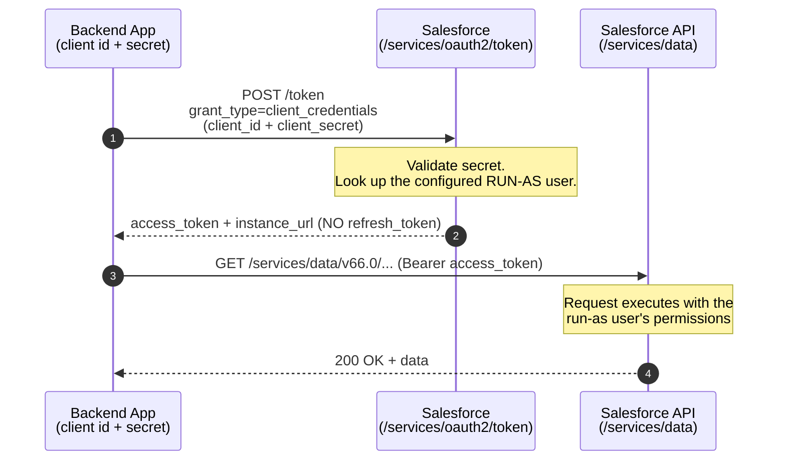

# 05 - Client Credentials Flow

> **One-liner**: A backend app trades **only its client id + secret** for an access token that runs as a pre-configured **integration user** — no JWT, no user login.
> **Use when**: Server-to-server integration with no user context that always runs as the **same fixed identity**.
> **Grant type**: `client_credentials` · **Status**: ✅ Recommended (the modern replacement for the retiring Username-Password flow).
> **Tokens returned**: Access token **only**. **No refresh token**, no user login.

New here? Read [01-authentication-fundamentals.md](01-authentication-fundamentals.md) first for tokens, scopes, and endpoints.

---

## 1. The idea in plain English

Think of a **vending-machine service key**. A maintenance company isn't a *person* — it's a company. But the machine still needs to know "who" opened it. So the building gives the company one **master key** tied to a single named contractor account on file. Any technician using that key acts as that one contractor, with exactly the access that contractor was granted. No personal logins, no passwords passed around — just the key, and a fixed identity behind it.

Here your app presents its **client id + client secret** (the master key). Salesforce maps the request to the **run-as integration user** you configured on the Connected App (the contractor on file) and hands back an **access token** that has precisely that user's permissions. There is no human, no browser, and no JWT to build — it is the simplest passwordless server-to-server flow Salesforce offers.

---

## 2. When to use it (and when not)

| ✅ Use it when | ❌ Avoid / use something else |
|---|---|
| A **headless backend** (backup tool, analytics job, middleware) calls Salesforce with no user present. | A real user logs in and the app acts as them → [02-web-server-flow.md](02-web-server-flow.md). |
| The integration always runs as **one fixed integration user**. | You need the token to act as a **specific named user via a signed JWT** → [04-jwt-bearer-flow.md](04-jwt-bearer-flow.md). |
| You are **replacing the legacy Username-Password flow**. | A device with no browser/keyboard → [06-device-flow.md](06-device-flow.md). |
| The client can **keep a secret** safely. | A public client (mobile/SPA) that can't hide a secret. |

**Real-world examples**: an ERP nightly sync running as a dedicated "ERP Integration" user; a data-warehouse extractor; a monitoring service polling records; any system-to-system job that the org wants attributed to a single, auditable service identity.

> **Why this is the new default**: it needs no password and no key pair — just a secret and a configured run-as user. Salesforce positions it as the **go-to server-to-server flow** as the **Username-Password flow retires** (blocked by default for newer orgs, full retirement targeted Winter '27). See [07-username-password-flow.md](07-username-password-flow.md).

---

## 3. How it works (sequence diagram)



**Walkthrough**

1. The app POSTs to the **token endpoint** (on your **My Domain** host) with `grant_type=client_credentials` plus its `client_id` and `client_secret`.
2. Salesforce validates the secret and resolves the **run-as integration user** configured on the app.
3. Salesforce returns an **access token** and `instance_url`. **No refresh token.**
4-5. The app calls the API; every call executes with the **run-as user's** profile, permission sets, and data access.

---

## 4. The actual requests & responses

> **My Domain is mandatory.** `login.salesforce.com` and `test.salesforce.com` are **not supported** for this flow. The token endpoint must be `https://MyDomainName.my.salesforce.com/services/oauth2/token` (or your Experience Cloud domain).

**Option A — credentials in the POST body:**

```bash
curl https://MyDomainName.my.salesforce.com/services/oauth2/token \
  -d grant_type=client_credentials \
  -d client_id=3MVG9...CONSUMER_KEY \
  -d client_secret=ABCD...CONSUMER_SECRET
```

**Option B — credentials as HTTP Basic auth** (base64 of `client_id:client_secret`):

```bash
curl https://MyDomainName.my.salesforce.com/services/oauth2/token \
  -H "Authorization: Basic MzMVG9...base64(client_id:client_secret)" \
  -d grant_type=client_credentials
```

**The token response (no refresh token):**

```json
{
  "access_token": "00D5g000004...!AQEAQ...",
  "signature": "k0r...=",
  "scope": "api",
  "instance_url": "https://MyDomainName.my.salesforce.com",
  "id": "https://login.salesforce.com/id/00D.../005...",
  "token_type": "Bearer",
  "issued_at": "1718700000000"
}
```

**Connected App / ECA setup checklist**

1. Create a Connected App (or **External Client App** — preferred) and enable **OAuth Settings**.
2. Check **"Enable Client Credentials Flow."**
3. Select the scopes you need — for pure API access, **`api`** is enough (least privilege).
4. Copy the **Consumer Key** and **Consumer Secret** (via **Manage Consumer Details**).
5. Open the app's **Manage** view → **Edit Policies**. Set **Permitted Users = Admin Pre-Approved** and choose the **"Run-As User for the client credentials flow."**
6. Assign the run-as user (via profile or permission set) so they are permitted to use the app.

**The recommended run-as identity** — the modern best practice from Salesforce:

- Create a dedicated user on the **Salesforce Integration user license** with the **Minimum Access – API Only Integrations** profile (enables API, restricts to API only).
- Grant exactly the data/operations needed via a permission set using the **Salesforce API Integration permission set license (PSL)**.
- One app + one integration user per integration, so access is scoped, auditable, and the secret can be rotated affecting only that one integration.

> **It acts as the integration user, not the caller.** Every action runs as the configured run-as user. If you pick a System Administrator, the token gets admin power — so scope it down hard.

---

## 5. Security pitfalls & gotchas

| Pitfall | Why it bites | Fix |
|---|---|---|
| Run-as user is an admin | The token inherits **all** that user's permissions; a leaked secret = full org access. | Use a dedicated **integration user** scoped by permission sets (least privilege). |
| Hitting `login.salesforce.com` | This flow rejects the generic login host. | Always use the **My Domain** token endpoint. |
| Treating the secret casually | Anyone with `client_id` + `client_secret` can mint a token — it's a password equivalent. | Store in a secrets manager; **rotate periodically** and immediately if compromised. |
| Forgetting to enable the flow / set run-as | Token request fails; the flow is off by default for security. | Enable **Client Credentials Flow** and set the **run-as user** in policies (required even for AppExchange apps). |
| Expecting a refresh token | There is none; refresh logic breaks. | On `401`, just **re-run the flow** to get a new access token. |
| Sharing one app across integrations | A single leak forces rotation that breaks every integration at once. | **One app + one integration user per integration** for isolation and auditability. |

---

## 6. Interview Q&A

**Q: What is the Client Credentials flow and when is it the right choice?**
A: A server-to-server OAuth flow where the app exchanges **just its client id and secret** for an access token, with **no user interaction and no refresh token**. It's the right choice for headless integrations that always run as the same fixed identity — backups, analytics, ETL — and it's the **modern replacement for the Username-Password flow**.

**Q: Whose permissions does the token have?**
A: The **run-as integration user** configured on the Connected App's policies — not the caller. Best practice is a dedicated user on the **Integration user license** with the **Minimum Access – API Only Integrations** profile, scoped by a permission set with the API Integration PSL.

**Q: Why does Salesforce force you to pick a run-as user for a "userless" flow?**
A: Everything in Salesforce executes in a user context for sharing, FLS, and auditing. Even a system integration must map to a user so its actions are attributable and its data access is governed.

**Q: Client Credentials vs JWT Bearer — compare them.**
A: Both are passwordless, server-to-server, and return **no refresh token**. **Client Credentials** uses a **client secret** and a **configured run-as user** — simplest setup, no JWT. **JWT Bearer** uses a **private key** and names the user in the JWT's `sub`, and it powers the Salesforce CLI. Pick Client Credentials for the simplest secret-based service identity; JWT when you already manage certificates. See [04-jwt-bearer-flow.md](04-jwt-bearer-flow.md).

**Q: Why is My Domain required here?**
A: The flow is explicitly **not supported** on `login.salesforce.com` / `test.salesforce.com`. Salesforce ties the integration to your org's branded, stable issuer host, so you must call the **My Domain** token endpoint.

**Q: How do you handle token expiry?**
A: There is no refresh token, so when a call returns `401`, you simply **re-run the Client Credentials request** with the same id and secret to get a fresh access token. If using JWT-based access tokens, you can also inspect the `exp` claim locally and refresh proactively.

**Talking point to explain it to anyone**: "It's a service master key tied to one named maintenance account. The app shows the key, Salesforce knows exactly which limited account it stands for, and grants only that account's access — no personal passwords involved."

---

## 7. Key terms

`client_credentials` · run-as user · integration user · Integration user license · Minimum Access – API Only Integrations profile · API Integration PSL · client secret · least privilege · My Domain — all defined in [01-authentication-fundamentals.md](01-authentication-fundamentals.md#10-glossary-quick-definitions).

---

## Sources (Verified June 2026)

- [OAuth 2.0 Client Credentials Flow for Server-to-Server Integration — Salesforce Help](https://help.salesforce.com/s/articleView?id=xcloud.remoteaccess_oauth_client_credentials_flow.htm&type=5)
- [Configure a Connected App for the OAuth 2.0 Client Credentials Flow — Salesforce Help](https://help.salesforce.com/s/articleView?id=xcloud.connected_app_client_credentials_setup.htm&type=5)
- [Invoke REST APIs with the Salesforce Integration User and OAuth Client Credentials — Salesforce Developers Blog](https://developer.salesforce.com/blogs/2024/02/invoke-rest-apis-with-the-salesforce-integration-user-and-oauth-client-credentials)
- [Using the Client Credentials Flow for Easier API Authentication — Salesforce Developers Blog](https://developer.salesforce.com/blogs/2023/03/using-the-client-credentials-flow-for-easier-api-authentication)
- [Give Integration Users API Only Access — Salesforce Help](https://help.salesforce.com/s/articleView?id=sf.integration_user.htm&type=5)

---

*Next: [06-device-flow.md](06-device-flow.md) — authorizing input-constrained devices (TVs, CLIs) with a user code.*
