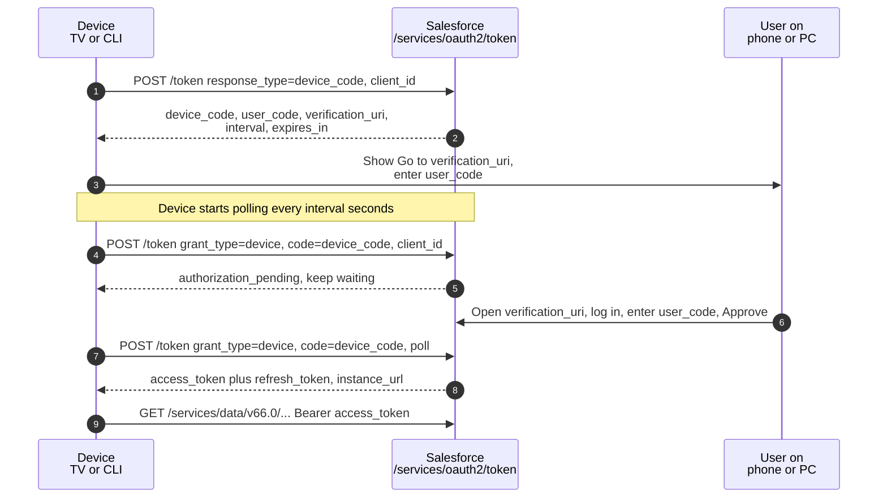

# 06 - OAuth 2.0 Device Flow

> **One-liner**: A device with **no keyboard or browser** (smart TV, CLI, IoT box) shows the user a short **code** and a URL. The user opens that URL on their phone, types the code, and the device gets a token.
> **Use when**: An app runs on hardware with **limited input or display** that cannot host a full login page.
> **Grant type**: `response_type=device_code` (start), then `grant_type=device` (poll) · **Status**: ✅ Supported, but **input-constrained devices only**. Removed from the auto-installed **Data Loader** connected app on **Sept 2, 2025**.
> **Tokens returned**: Access token (+ refresh token if `refresh_token`/`offline_access` scope requested).

New here? Read [01-authentication-fundamentals.md](01-authentication-fundamentals.md) first for tokens, scopes, and endpoints.

---

## 1. The idea in plain English

Think of **signing in to a streaming app on a new smart TV**. The TV cannot show a comfortable login form, and typing your password with a remote is painful. So the TV puts up a message: *"Go to **example.com/activate** and enter code **WDJB-MJHT**."* You pull out your phone, open that page, log in there once, type the short code, and approve. The TV, meanwhile, keeps quietly asking Salesforce *"are we approved yet?"* every few seconds until you finish. Then it gets its token.

That split is the whole flow. The **constrained device** never handles the password. All the typing and authentication happen on a **second screen** (your phone or laptop) that already has a real browser. The device just polls and waits.

---

## 2. When to use it (and when not)

| ✅ Use it when | ❌ Avoid / use something else |
|---|---|
| The device has **limited input/display**: smart TV, set-top box, appliance, IoT sensor. | The device has a normal browser and keyboard → use [02-web-server-flow.md](02-web-server-flow.md). |
| A **CLI or headless tool** wants the user to authenticate on a separate machine. | No human user at all (cron, ETL) → use [05-client-credentials-flow.md](05-client-credentials-flow.md) or [04-jwt-bearer-flow.md](04-jwt-bearer-flow.md). |
| You want a **user-context** token (acts as the approving user) on such a device. | A mobile/desktop app that can open its own browser → use Web Server flow + PKCE. |

**Real-world examples**: a Salesforce dashboard on a wall-mounted smart display in a sales bullpen; a command-line data tool that asks you to approve on your laptop; an IoT gateway that posts telemetry as a specific Salesforce user.

> **Heads up — Data Loader change**: Salesforce **removed OAuth 2.0 Device Flow support from the auto-installed Data Loader connected app on September 2, 2025**. Data Loader v53.0.1 introduced device-flow login, but newer Data Loader (e.g. v64.1.0) no longer supports Device Flow (or User-Agent Flow). The Salesforce CLI's default connected app saw a similar device-flow removal in 2025. If a tool used to log in with a device code and suddenly fails, this is a likely cause. Migrate to the Web Server flow or use a dedicated connected app.

---

## 3. How it works (sequence diagram)



**Walkthrough**

1-2. **Device requests a code.** The device POSTs to the token endpoint with `response_type=device_code` and its `client_id`. Salesforce returns a **`device_code`** (the device's secret handle), a short **`user_code`** for the human to type, a **`verification_uri`** to visit, a **`expires_in`** lifetime, and a polling **`interval`** in seconds.
3. **Device shows instructions.** It displays the `user_code` and `verification_uri` on screen (e.g. "Visit ...activate and enter WDJB-MJHT").
4-5. **Device polls.** Starting now, the device POSTs to the token endpoint with `grant_type=device` and `code=<device_code>` every `interval` seconds. Until the user approves, Salesforce replies `authorization_pending`.
6. **User approves on a second screen.** On a phone or laptop, the user opens the `verification_uri`, authenticates (password, MFA, SSO), enters the `user_code`, and grants consent.
7-8. **Device receives tokens.** The next poll succeeds: Salesforce returns the **access token**, optionally a **refresh token**, and `instance_url`. The device calls the API with the bearer token.

---

## 4. The actual requests & responses

**Step 1 — device asks for a code:**

```bash
curl https://MyDomainName.my.salesforce.com/services/oauth2/token \
  -d response_type=device_code \
  -d client_id=3MVG9...CONSUMER_KEY \
  -d scope=api%20refresh_token
```

**Step 1 response — what the device shows the user:**

```json
{
  "device_code": "GmRhmhcxhw...EUqIVDf0",
  "user_code": "WDJBMJHT",
  "verification_uri": "https://MyDomainName.my.salesforce.com/setup/connect",
  "interval": 5,
  "expires_in": 600
}
```

**Step 2 — the user goes to `verification_uri` on a phone/PC, logs in, and enters `user_code`.** (No code on the device side for this step; it is a human action in a browser.)

**Step 3 — device polls the token endpoint at the given `interval`:**

```bash
curl https://MyDomainName.my.salesforce.com/services/oauth2/token \
  -d grant_type=device \
  -d client_id=3MVG9...CONSUMER_KEY \
  -d code=GmRhmhcxhw...EUqIVDf0
```

**Step 3 response while waiting** (HTTP 400, keep polling):

```json
{ "error": "authorization_pending", "error_description": "User has not yet approved the device." }
```

**Step 3 response once approved** (HTTP 200):

```json
{
  "access_token": "00D5g000004...!AQEAQ...",
  "refresh_token": "5Aep861...l4Lo",
  "signature": "k0r...=",
  "scope": "api refresh_token",
  "instance_url": "https://MyDomainName.my.salesforce.com",
  "id": "https://login.salesforce.com/id/00D.../005...",
  "token_type": "Bearer",
  "issued_at": "1718700000000"
}
```

**Connected App / ECA setup checklist**

1. Create a Connected App (or **External Client App**). Enable **OAuth Settings**.
2. **Enable the device flow.** For a Connected App, turn on the device-flow option in **Global / OAuth settings** (the setting that lets the app issue a device code). For an **External Client App**, enable the **device flow** policy (the `isDeviceFlowEnabled` setting).
3. Select scopes (`api`, plus `refresh_token`/`offline_access` if you want a refresh token).
4. A **callback URL is not used** by the device flow itself, but the app still requires one configured.
5. Copy the **Consumer Key** (`client_id`). The device flow is for public clients; do not rely on shipping a secret to the device.

---

## 5. Security pitfalls & gotchas

| Pitfall | Why it bites | Fix |
|---|---|---|
| **Device-code phishing / illicit consent** | An attacker starts their *own* device flow, gets a real `user_code`, and tricks a victim ("enter this code to verify your account") into approving it on the genuine Salesforce page. The attacker's device then receives the victim's token. No fake site is needed. | Train users to never enter a device code they did not personally initiate; verify the **app name and requested scopes** on the consent screen; restrict who can approve; monitor for unexpected device-flow grants. |
| **Polling too fast** | Hammering the token endpoint can get you rate-limited or a `slow_down` error. | Respect the returned `interval`; back off when told to. |
| **Long-lived `user_code` window** | A code valid for the full `expires_in` gives an attacker a wider phishing window. | Approve promptly; the code expires (e.g. ~10 min) and must be re-requested after that. |
| **Over-broad scopes on a shared screen** | A wall-mounted device with `full` exposes everything if the screen is seen or the device is stolen. | Request least privilege; avoid `full`; consider a dedicated low-privilege user. |
| **Treating the device as confidential** | Devices cannot keep a client secret. | Use it as a public client; protect the refresh token at rest on the device. |

> **Interview-grade nuance**: device-flow phishing is the same class of attack that hit large numbers of Microsoft 365 tenants. The danger is that the **login page is 100% genuine** — there is no lookalike domain to flag — so the only real defense is user awareness plus scope and consent controls. Expect this as a security question.

---

## 6. Interview Q&A

**Q: When would you choose the Device Flow?**
A: When the app runs on hardware with **limited input or display** that cannot present a normal login page: smart TVs, set-top boxes, appliances, IoT devices, and headless CLI tools. The user authenticates on a **second device** with a real browser.

**Q: Walk me through the steps.**
A: The device POSTs `response_type=device_code` with its `client_id` and gets back a `device_code`, a human-friendly `user_code`, a `verification_uri`, an `interval`, and `expires_in`. It shows the user the code and URL, then **polls** the token endpoint with `grant_type=device` and `code=<device_code>` every `interval` seconds. The user opens the URL on a phone, logs in, enters the code, and approves. The next poll returns the access token (and refresh token if requested).

**Q: What is device-code phishing and how do you defend against it?**
A: An attacker starts their own device flow, obtains a legitimate `user_code`, and socially engineers a victim into entering that code and approving on the **real** Salesforce page. The attacker's device then receives the victim's token. Because the page is genuine, URL-based phishing filters do not help. Defenses: user training (never approve a code you did not start), scrutinizing the app name and scopes on the consent screen, limiting who can approve device flows, and monitoring for unexpected grants.

**Q: Does the Device Flow return a refresh token?**
A: Yes, if you request the `refresh_token` (or `offline_access`) scope and the app allows it. This differs from JWT Bearer and Client Credentials, which return an access token only.

**Q: What changed with Data Loader and the Device Flow?**
A: Salesforce **removed device-flow support from the auto-installed Data Loader connected app on September 2, 2025**, and recent Data Loader versions no longer support it. The Salesforce CLI's default connected app had a similar device-flow removal. Affected tools must move to another flow or use a dedicated connected app.

**Talking point to explain it to anyone**: "It is how you log in to Netflix on a new TV. The TV shows a short code, you type it on your phone, and the TV gets let in once you approve."

---

## 7. Key terms

`device_code` · `user_code` · `verification_uri` · `interval` · `authorization_pending` · `slow_down` · public client · polling — base definitions in [01-authentication-fundamentals.md](01-authentication-fundamentals.md#10-glossary-quick-definitions).

---

## Sources (Verified June 2026)

- [OAuth 2.0 Device Flow for IoT Integration — Salesforce Help](https://help.salesforce.com/s/articleView?id=xcloud.remoteaccess_oauth_device_flow.htm&type=5)
- [Configure an OAuth 2.0 Device Flow for External Client Apps — Salesforce Help](https://help.salesforce.com/s/articleView?id=xcloud.configure_device_flow_external_client_apps.htm&type=5)
- [Support for OAuth 2.0 Device Flow Authentication Is Being Removed in Data Loader on September 2, 2025 — Release Notes](https://help.salesforce.com/s/articleView?id=release-notes.rn_data_loader_oauth_change.htm&type=5)
- [Data Loader OAuth 2.0 Device Flow Removal — Salesforce Help](https://help.salesforce.com/s/articleView?id=005132367&type=1)
- [OAuth 2.0 Device Authorization Grant (RFC 8628)](https://datatracker.ietf.org/doc/html/rfc8628)

---

*Next: [07-username-password-flow.md](07-username-password-flow.md) — the deprecated flow that passes raw credentials, and what to use instead.*
