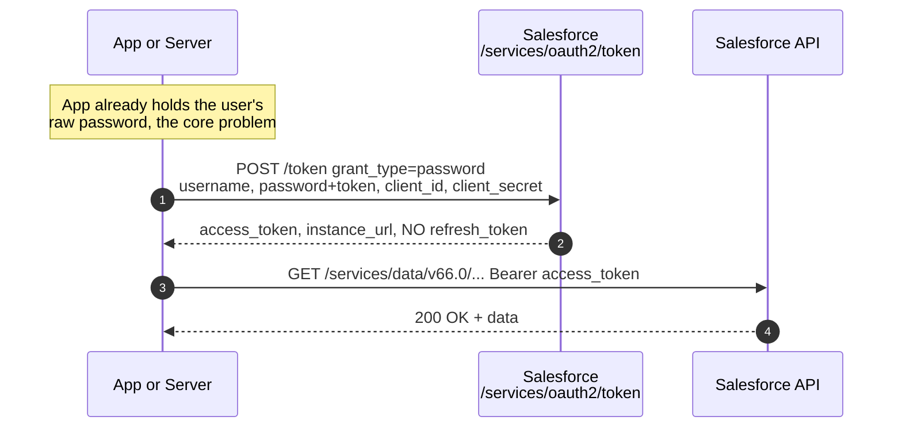

# 07 - Username-Password Flow

> **⛔ DEPRECATED / RETIRING.** This flow passes a user's **raw username and password** straight to the token endpoint. Salesforce is **retiring it** and recommends you never build new integrations on it.
> **One-liner**: The app POSTs the user's username + password (with security token) and gets back an access token.
> **Use when**: Almost never. Understand it only for **legacy systems** and interviews. For real work, use **[05-client-credentials-flow.md](05-client-credentials-flow.md)** (server-to-server) or **[02-web-server-flow.md](02-web-server-flow.md) + PKCE** (user login).
> **Grant type**: `password` · **Status**: ⛔ Deprecated. Blocked by default for orgs created **Summer '23+**; full retirement targeted for **Winter '27**. **Not supported by External Client Apps.**
> **Tokens returned**: Access token only. **No refresh token.**

New here? Read [01-authentication-fundamentals.md](01-authentication-fundamentals.md) first for tokens, scopes, and endpoints.

---

## 1. The idea in plain English

Imagine giving a delivery driver **your actual house key, your alarm code, and your name** so they can let themselves in whenever they like. That is this flow. The app holds the user's **real Salesforce password** and replays it to get a token. There is no claim ticket, no consent screen, no MFA prompt, no back-and-forth. Just credentials in, token out.

That is exactly why it is being killed. A password sitting in a config file or environment variable is a single point of catastrophic failure, and it **bypasses multi-factor authentication entirely**. Modern Salesforce wants either a **passwordless machine identity** ([Client Credentials](05-client-credentials-flow.md)) or a **proper interactive login** ([Web Server + PKCE](02-web-server-flow.md)). Learn this flow so you can **recognize it and migrate off it**, not so you can build with it.

---

## 2. When to use it (and when not)

| ✅ The only acceptable reasons | ❌ Do not use it for |
|---|---|
| Understanding a **legacy integration** you inherited so you can migrate it. | Any **new** integration. It is deprecated and retiring. |
| A short-lived internal test in a dev org where the flow is still enabled. | **Production** server-to-server jobs → use [05-client-credentials-flow.md](05-client-credentials-flow.md). |
| Interview discussion of why it is unsafe. | **User login** in an app → use [02-web-server-flow.md](02-web-server-flow.md) + PKCE. |

**Migration cheat sheet** (say this in an interview):

| If the old code used Username-Password for... | Migrate to |
|---|---|
| A **backend/batch** job running as a service identity | **[05-client-credentials-flow.md](05-client-credentials-flow.md)** (run-as user + secret, passwordless) |
| A **certificate-based** server integration | **[04-jwt-bearer-flow.md](04-jwt-bearer-flow.md)** (signed JWT, no password) |
| **Interactive user** login | **[02-web-server-flow.md](02-web-server-flow.md) + PKCE** |

> **Status details to quote**: Username-Password is **blocked by default for orgs created in Summer '23 or later**. Salesforce announced its **retirement, targeted for Winter '27**, after which connected-app integrations using this flow will break. It is **not supported by External Client Apps** at all — only legacy Connected Apps. This is the single most important "what's changing" fact in Module 03.

---

## 3. How it works (sequence diagram)



**Walkthrough**

1. The app **already has the user's password stored** somewhere. That storage is the core risk.
2. The app POSTs to the **token** endpoint with `grant_type=password`, the `username`, the `password` (with the user's **security token appended**), plus the Connected App's `client_id` and `client_secret`. There is **no browser, no consent screen, and no MFA**.
3. Salesforce validates the credentials and returns an **access token** and `instance_url`. Critically, **no refresh token is issued**, so when the token expires the app must replay the password again.
4. The app calls the API with `Authorization: Bearer <access_token>`.

> Notice the auth server is drawn in **red**. That is intentional: every step here is a security liability, and the absence of a consent/MFA step is exactly what regulators and Salesforce object to.

---

## 4. The actual requests & responses (legacy / for understanding only)

> **Do not build new code from this.** It is shown so you can read existing integrations and migrate them.

**The token request:**

```bash
curl https://MyDomainName.my.salesforce.com/services/oauth2/token \
  -d grant_type=password \
  -d client_id=3MVG9...CONSUMER_KEY \
  -d client_secret=ABCD...CONSUMER_SECRET \
  -d username=integration.user@example.com \
  --data-urlencode "password=MyPasswordSECURITYTOKEN"
```

**Key detail — the password field:** for a user logging in from an **untrusted network / IP**, you must **concatenate the password and the user's security token** into one value: `<password><securityToken>` with no space. If the calling IP is in the org's trusted IP range (or the user has no security token), the token suffix may be omitted. Always send credentials in the **POST body**, never in the URL query string.

**The token response:**

```json
{
  "access_token": "00D5g000004...!AQEAQ...",
  "instance_url": "https://MyDomainName.my.salesforce.com",
  "id": "https://login.salesforce.com/id/00D.../005...",
  "token_type": "Bearer",
  "issued_at": "1718700000000",
  "signature": "k0r...="
}
```

Note what is **missing**: there is **no `refresh_token`** and (unless you request `openid`) no `id_token`. When the access token expires the app has to send the password again, which is precisely why this pattern resists modern security controls.

**Connected App setup (legacy):**

1. The flow works only with a **Connected App** (External Client Apps do **not** support it).
2. Enable **OAuth Settings** and select scopes (e.g. `api`).
3. The org must have the **username-password flow allowed** (it is **blocked by default for orgs created Summer '23+**; an admin would have to explicitly permit it where still possible).
4. Copy the **Consumer Key** and **Consumer Secret**.
5. The integration user needs a **security token** (or the caller's IP must be trusted) and an MFA posture that this flow unfortunately bypasses.

---

## 5. Security pitfalls & gotchas

| Pitfall | Why it bites | Fix |
|---|---|---|
| **Storing a raw password** | A leaked config file or env var hands over a full user login. | Stop using this flow. Move to [Client Credentials](05-client-credentials-flow.md) (secret, not password) or [JWT Bearer](04-jwt-bearer-flow.md) (key, no password). |
| **Bypasses MFA** | The flow has no interactive step, so multi-factor and login policies do not apply. | Use a flow that honors MFA, or a passwordless machine identity. |
| **No refresh token** | The app must re-send the password on every expiry, multiplying exposure. | Use a flow with proper token lifecycle ([Web Server](02-web-server-flow.md)). |
| **Blocked / retiring** | Orgs created **Summer '23+** block it by default; **Winter '27** retirement will break it. | Migrate now; do not start new builds on it. |
| **Not supported by ECAs** | New apps should be External Client Apps, which cannot use this flow. | Build new integrations on ECAs with a supported flow. |
| **Security token confusion** | Forgetting to append the security token (untrusted IP) causes silent auth failures. | Append `securityToken` to the password, or trust the IP range; understand the org's policy. |

---

## 6. Interview Q&A

**Q: What is the Username-Password flow and why is it dangerous?**
A: The app sends the user's **raw username and password** (security token appended) with `grant_type=password` to the token endpoint and gets an access token. It is dangerous because it **stores and transmits the actual password**, **bypasses MFA**, returns **no refresh token**, and offers no consent screen. Salesforce is **retiring it**.

**Q: What is the retirement timeline?**
A: It is **blocked by default for orgs created in Summer '23 or later**, and Salesforce has announced **full retirement targeted for Winter '27**, after which connected-app integrations using it will stop working. It is also **not supported by External Client Apps**.

**Q: An old integration uses this flow. How do you migrate it?**
A: Depends on context. For a **backend/service** job, move to **[Client Credentials](05-client-credentials-flow.md)** (run-as user + secret, passwordless). For a **certificate-based** integration, **[JWT Bearer](04-jwt-bearer-flow.md)**. For **interactive user login**, **[Web Server flow + PKCE](02-web-server-flow.md)**. The goal is to eliminate the stored password.

**Q: Why does this flow not return a refresh token?**
A: There is no user session or consent to keep alive in the OAuth sense. The design assumption was that the app can just replay the password to get a new access token, which is itself the security problem.

**Q: Where do you append the security token, and when is it needed?**
A: You concatenate it to the **end of the password** (`passwordSECURITYTOKEN`, no space). It is required when the request comes from an **untrusted IP**. If the caller's IP is trusted by the org, it can be omitted.

**Talking point to explain it to anyone**: "It is like giving a contractor your actual house key instead of a temporary guest code. If they lose it, your whole house is exposed, and there is no way to tell who used it. We are replacing it with guest codes that expire and can be revoked."

---

## 7. Key terms

`grant_type=password` · security token · refresh token (absent here) · MFA bypass · confidential client — base definitions in [01-authentication-fundamentals.md](01-authentication-fundamentals.md#10-glossary-quick-definitions).

---

## Sources (Verified June 2026)

- [OAuth 2.0 Username-Password Flow for Special Scenarios — Salesforce Help](https://help.salesforce.com/s/articleView?id=xcloud.remoteaccess_oauth_username_password_flow.htm&type=5)
- [Retirement of OAuth 2.0 Username-Password Flow for Connected Apps — Release Notes](https://help.salesforce.com/s/articleView?id=release-notes.rn_security_unpw_flow_retirement.htm&type=5)
- [OAuth 2.0 Username-Password Flow Blocked by Default in New Orgs — Release Notes](https://help.salesforce.com/s/articleView?id=release-notes.rn_security_username-password_flow_blocked_by_default.htm&type=5)
- [Migrate from OAuth Username-Password to Client Credentials — Salesforce Help](https://help.salesforce.com/s/articleView?id=000886201&type=1)
- [Block Authorization Flows to Improve Security — Salesforce Help](https://help.salesforce.com/s/articleView?id=xcloud.remoteaccess_disable_username_password_flow.htm&type=5)

---

*Next: [08-refresh-token-flow.md](08-refresh-token-flow.md) — how apps silently get a fresh access token without bothering the user.*
