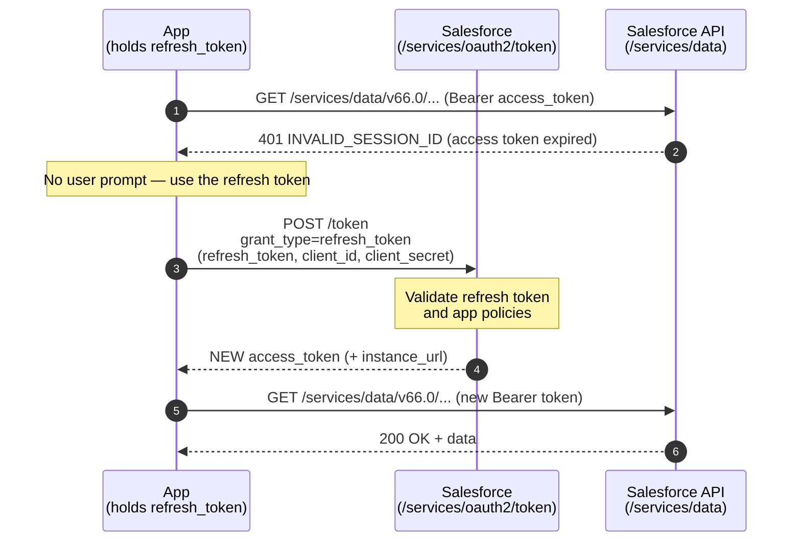

# 08 - Refresh Token Flow

> **One-liner**: After a user flow already issued a refresh token, the app silently trades that long-lived token for a **fresh access token** — no user, no re-login.
> **Use when**: An access token from a prior **Web Server** or **User-Agent** flow has expired and you need a new one without prompting the user.
> **Grant type**: `refresh_token` · **Status**: ✅ Recommended (the standard way to keep a user session alive).
> **Tokens returned**: A new access token (the **same refresh token is reused**, unless rotation is on).

New here? Read [01-authentication-fundamentals.md](01-authentication-fundamentals.md) first for tokens, scopes, and endpoints.

---

## 1. The idea in plain English

Think of a **gym membership card**. When you join, the front desk checks your ID once and gives you a **day pass** (access token) plus a **membership card** (refresh token). The day pass expires every evening. But you don't re-show your ID each morning — you just tap your membership card at the turnstile and get a new day pass. The card itself lasts months, until it's cancelled.

That's this flow. It is **not** how you first get in — a user already logged in through an interactive flow that handed back a **refresh token**. From then on, whenever the short-lived **access token** expires, your app quietly taps the refresh token against the token endpoint and receives a new access token. The user never sees a login screen again until the membership (refresh token) is revoked or expires.

---

## 2. When to use it (and when not)

| ✅ Use it when | ❌ Avoid / use something else |
|---|---|
| A user already logged in via [02-web-server-flow.md](02-web-server-flow.md) and you hold a refresh token. | This is the **first** login → use Web Server or User-Agent first; this flow can't start a session. |
| The access token expired and you need a new one **silently**. | Pure server-to-server with no user → [05-client-credentials-flow.md](05-client-credentials-flow.md) or [04-jwt-bearer-flow.md](04-jwt-bearer-flow.md) (they have no refresh token by design). |
| You want "stay logged in" without re-prompting. | The refresh token was never issued (you forgot the `refresh_token`/`offline_access` scope). |

**Real-world examples**: a customer portal keeping a user connected for weeks; a mobile app that refreshes its session at app launch; middleware that maintains a per-user Salesforce session across long-running jobs.

> **Interview framing**: this is a **continuation** flow, not an **initial-login** flow. JWT Bearer and Client Credentials never issue a refresh token — they just re-run their flow. Only user flows that requested the `refresh_token` scope can use this.

---

## 3. How it works (sequence diagram)



**Walkthrough**

1-2. The app calls the API with its current access token and gets **`401 INVALID_SESSION_ID`** because the token expired.
3. Instead of prompting the user, the app POSTs to the **token endpoint** with `grant_type=refresh_token`, the stored `refresh_token`, and its `client_id` + `client_secret`.
4. Salesforce validates the refresh token against the app's OAuth policies.
5. Salesforce returns a **new access token** (and `instance_url`). The **same refresh token** keeps working unless rotation is enabled.
6-7. The app retries the call with the new token and succeeds.

---

## 4. The actual requests & responses

**The refresh request** — credentials in the body:

```bash
curl https://MyDomainName.my.salesforce.com/services/oauth2/token \
  -d grant_type=refresh_token \
  -d refresh_token=5Aep861...l4Lo \
  -d client_id=3MVG9...CONSUMER_KEY \
  -d client_secret=ABCD...CONSUMER_SECRET
```

> You may instead send `client_id:client_secret` as an **HTTP Basic** `Authorization` header rather than in the body. The `client_secret` is omitted only for public clients that registered without one.

**The token response** — note there is **no new `refresh_token`** in the default case (you reuse the one you have):

```json
{
  "access_token": "00D5g000004...!AQEAQ...",
  "signature": "k0r...=",
  "scope": "api refresh_token openid",
  "instance_url": "https://MyDomainName.my.salesforce.com",
  "id": "https://login.salesforce.com/id/00D.../005...",
  "token_type": "Bearer",
  "issued_at": "1718700000000"
}
```

**Refresh token expiration policy** (set on the Connected App's OAuth policies — pick one):

| Policy | Behavior |
|---|---|
| **Refresh token is valid until revoked** | Default. Works indefinitely until a user or admin revokes it. |
| **Immediately expire refresh token** | Invalid right away; the current access token still works until it expires, but no new sessions can be obtained. |
| **Expire refresh token after _n_** | Valid for a fixed window (e.g. 24 hours), then dead. |
| **Expire refresh token if not used for _n_** | Stays alive only if used within the rolling window; idle tokens die. |

> **Refresh Token Rotation (RTR)**: if you enable it on the app, each refresh **also returns a brand-new refresh token** and invalidates the old one. The response then includes a fresh `refresh_token`, and your app must store it for next time. This shrinks the window a stolen token is usable.

**Revoking a token** — the kill switch (logout / compromise):

```bash
curl https://MyDomainName.my.salesforce.com/services/oauth2/revoke \
  -d token=5Aep861...l4Lo
```

Revoking the **refresh token** also invalidates the access tokens derived from it.

> **Salesforce as the client (outbound)**: when *Salesforce itself* holds the refresh token (via a Named Credential / External Credential of type "OAuth 2.0 — Authorization Code"), the platform performs this refresh for you automatically. You don't code the POST. See [14-named-credentials-and-external-credentials.md](14-named-credentials-and-external-credentials.md).

---

## 5. Security pitfalls & gotchas

| Pitfall | Why it bites | Fix |
|---|---|---|
| Treating the refresh token as low-risk | It's a **long-lived bearer secret** — whoever holds it can mint access tokens for weeks. | Encrypt at rest, store server-side, never in browser/localStorage. |
| Never expiring refresh tokens | "Valid until revoked" leaves a stolen token usable indefinitely. | Set an **expiration policy** and/or enable **Refresh Token Rotation**. |
| Ignoring rotation responses | With RTR on, the **new** refresh token replaces the old; missing it logs the user out. | Always read and persist the `refresh_token` from each response. |
| No revocation on logout / breach | Old sessions live on after a user logs out or a device is lost. | Call **`/revoke`** on logout; revocation also fires on password change/policy. |
| Assuming refresh tokens never die | Password resets, admin revocation, or policy can kill them anytime. | Handle a failed refresh by **falling back to a full interactive login**. |
| Forgetting the `refresh_token` scope at login | No refresh token was ever issued, so this flow can't run. | Request `refresh_token` / `offline_access` during the initial flow. |

---

## 6. Interview Q&A

**Q: What is the Refresh Token flow and how does it differ from the other flows?**
A: It **renews an access token** after a user flow already issued a refresh token. It is **not an initial-login flow** — you can't start a session with it. The app POSTs `grant_type=refresh_token` with the stored token and client credentials, and gets a new access token, with **no user interaction**.

**Q: Where does the refresh token come from?**
A: From an earlier **Web Server** or **User-Agent** flow that requested the `refresh_token` (a.k.a. `offline_access`) scope. Machine flows (JWT Bearer, Client Credentials) never issue one.

**Q: Does each refresh return a new refresh token?**
A: By default **no** — you reuse the same one. If **Refresh Token Rotation** is enabled on the Connected App, each refresh returns a **new** refresh token and invalidates the previous one.

**Q: What are the refresh token expiration policies?**
A: **Valid until revoked** (default), **immediately expire**, **expire after _n_**, and **expire if not used for _n_**. They're set on the Connected App's OAuth policies and control how long silent refresh keeps working.

**Q: A user changed their password — what happens to the refresh token?**
A: It can be invalidated. A failed refresh should make the app **fall back to a fresh interactive login**. Admins can also kill tokens via **`/revoke`** or by revoking OAuth access on the user/app.

**Q: How do you securely store a refresh token?**
A: It's a long-lived bearer secret — encrypt it at rest, keep it **server-side** (never in browser storage), scope it minimally, set an expiration policy, prefer rotation, and revoke on logout.

**Talking point to explain it to anyone**: "It's a gym membership card. You showed ID once at signup; after that you just tap the card each day for a new pass. The card lasts until it's cancelled — so guard it like a key."

---

## 7. Key terms

`refresh_token` · bearer token · Refresh Token Rotation (RTR) · refresh token expiration policy · `/revoke` endpoint · `INVALID_SESSION_ID` · `offline_access` scope — all defined in [01-authentication-fundamentals.md](01-authentication-fundamentals.md#10-glossary-quick-definitions).

---

## Sources (Verified June 2026)

- [OAuth 2.0 Refresh Token Flow for Renewed Sessions — Salesforce Help](https://help.salesforce.com/s/articleView?id=xcloud.remoteaccess_oauth_refresh_token_flow.htm&type=5)
- [OAuth 2.0 Refresh Token Flow — Mobile SDK Development Guide](https://developer.salesforce.com/docs/platform/mobile-sdk/guide/oauth-refresh-token-flow.html)
- [Manage OAuth Access Policies for a Connected App — Salesforce Help](https://help.salesforce.com/s/articleView?id=xcloud.connected_app_manage_oauth.htm&type=5)
- [OAuth Endpoints — Salesforce Help](https://help.salesforce.com/s/articleView?id=sf.remoteaccess_oauth_endpoints.htm&type=5)

---

*Next: [09-saml-bearer-assertion-flow.md](09-saml-bearer-assertion-flow.md) — authenticating with a signed SAML assertion instead of a JWT.*
