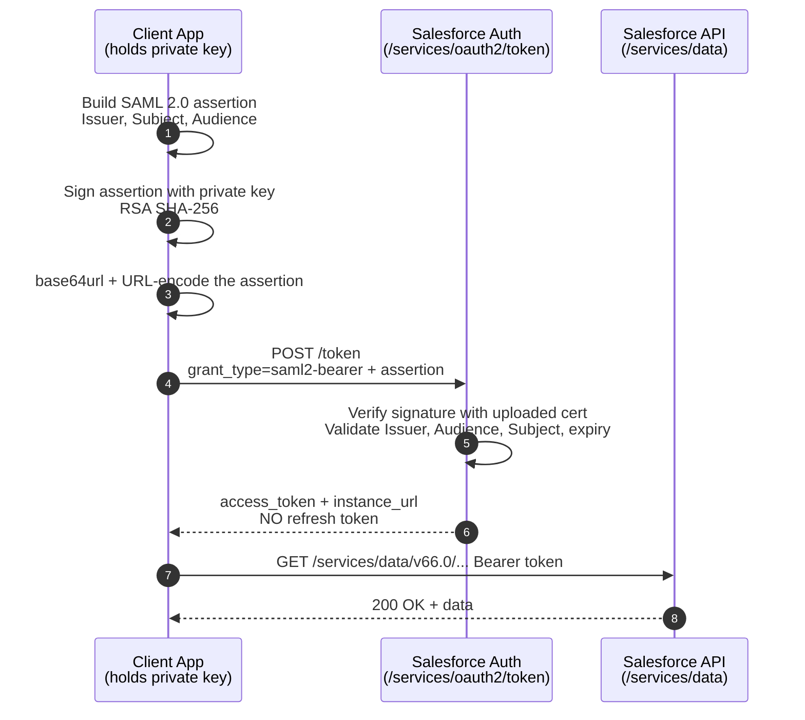

# 09 - SAML Bearer Assertion Flow

> **One-liner**: Your app builds and **digitally signs** a single SAML 2.0 assertion, POSTs it to the token endpoint, and gets back an access token. No user, no password, no refresh token.
> **Use when**: Server-to-server integration where the org already **trusts a SAML signing certificate** (common org-to-org or legacy SAML shops).
> **Grant type**: `urn:ietf:params:oauth:grant-type:saml2-bearer` · **Status**: ⚠️ Works, but **JWT Bearer is usually the better modern choice** (simpler token, same idea).
> **Tokens returned**: Access token **only**. **No refresh token. No client secret needed.**

New here? Read [01-authentication-fundamentals.md](01-authentication-fundamentals.md) first for tokens, scopes, and endpoints.

---

## 1. The idea in plain English

Imagine a **notarized letter**. Instead of showing up in person to prove who you are, you write a letter that says "I am acting for user *jdoe*," then have it **stamped by a notary** whose seal the other party already recognizes. You mail that one sealed letter and they let you in.

In this flow your app is the letter-writer, the **private key** is the notary stamp, and Salesforce already holds the matching **public certificate** (you uploaded it to the Connected App). Your app assembles a SAML assertion, signs it with the private key, and sends it once. Salesforce checks the seal against the stored certificate and, if it matches, hands back an access token. Nobody logs in interactively.

> **Mental model**: This is the **JWT Bearer flow** ([04-jwt-bearer-flow.md](04-jwt-bearer-flow.md)) with one swap — the signed credential is a **SAML 2.0 XML assertion** instead of a compact JWT. Same "sign a statement, trade it for a token" plot; different envelope.

---

## 2. When to use it (and when not)

| ✅ Use it when | ❌ Avoid / use something else |
|---|---|
| You already have **SAML infrastructure** (a SAML IdP / cert) and want to reuse it for API auth. | Greenfield server-to-server integration → use [04-jwt-bearer-flow.md](04-jwt-bearer-flow.md) (lighter, easier to debug). |
| **Org-to-org** machine integration on behalf of a known user, no human present. | No user identity needed at all → use [05-client-credentials-flow.md](05-client-credentials-flow.md) (run-as user). |
| A middleware platform that natively emits **signed SAML assertions** (some ESB/MDM tools). | A real user is logging in to a web app → use [02-web-server-flow.md](02-web-server-flow.md). |

**Real-world examples**: a legacy enterprise service bus that already mints signed SAML for every system; one Salesforce org calling another org's API as an integration user; an older partner integration standardized on SAML before JWT Bearer was common.

**The one-line decision rule**: *Pick SAML Bearer only because SAML already exists in your landscape. If you are starting fresh, pick JWT Bearer.*

---

## 3. How it works (sequence diagram)



**Walkthrough**

1-3. Your app constructs a SAML 2.0 assertion, signs the XML with the **private key**, and **base64url-encodes** it (then URL-encodes it for the POST body).
4. The app POSTs to `/services/oauth2/token` with `grant_type=urn:ietf:params:oauth:grant-type:saml2-bearer` and the encoded assertion in the `assertion` parameter. **No `client_secret` is sent.**
5. Salesforce verifies the signature against the **certificate you uploaded to the Connected App**, then checks **Issuer**, **Audience**, **Recipient**, **Subject**, and validity window.
6. If valid (and the app was previously authorized), Salesforce returns an **access token** and `instance_url`. There is **no refresh token** — when it expires you simply sign a fresh assertion and repeat.
7-8. The app calls the API with `Authorization: Bearer <access_token>`.

---

## 4. The actual requests & responses

**Token endpoint** (always your **My Domain**):

```
POST https://MyDomainName.my.salesforce.com/services/oauth2/token
Content-Type: application/x-www-form-urlencoded
```

**The assertion must satisfy these rules** (Salesforce validates each):

| Element | Required value |
|---|---|
| **Issuer** | The Connected App's **Consumer Key** (`client_id`) for which you registered the certificate. |
| **Audience** | `https://login.salesforce.com` or `https://test.salesforce.com` (sandbox). |
| **Recipient** (in `SubjectConfirmationData`) | `https://login.salesforce.com/services/oauth2/token` (prod) or the `test`/My Domain token endpoint. |
| **Subject `NameID`** | The **username** of the Salesforce user to run as (e.g. the integration user). |
| **Signature** | XML Signature spec, **RSA** with **SHA-1 or SHA-256**. |
| Encoding on the wire | **base64url**, then URL-encoded in the `assertion` parameter. |

**Sample assertion structure** (abbreviated — the signed `<ds:Signature>` block is omitted for brevity):

```xml
<saml:Assertion Version="2.0" IssueInstant="2026-06-18T19:25:14.654Z" ...>
  <saml:Issuer>3MVG9...CONSUMER_KEY</saml:Issuer>
  <ds:Signature>...RSA-SHA256 signature over the assertion...</ds:Signature>
  <saml:Subject>
    <saml:NameID Format="urn:oasis:names:tc:SAML:1.1:nameid-format:unspecified">
      integration.user@example.com
    </saml:NameID>
    <saml:SubjectConfirmation Method="urn:oasis:names:tc:SAML:2.0:cm:bearer">
      <saml:SubjectConfirmationData NotOnOrAfter="2026-06-18T19:30:14.654Z"
        Recipient="https://login.salesforce.com/services/oauth2/token"/>
    </saml:SubjectConfirmation>
  </saml:Subject>
  <saml:Conditions NotBefore="2026-06-18T19:25:14.654Z" NotOnOrAfter="2026-06-18T19:30:14.654Z">
    <saml:AudienceRestriction>
      <saml:Audience>https://login.salesforce.com</saml:Audience>
    </saml:AudienceRestriction>
  </saml:Conditions>
  <saml:AuthnStatement AuthnInstant="2026-06-18T19:25:14.655Z">...</saml:AuthnStatement>
</saml:Assertion>
```

**The token request (curl):**

```bash
curl https://MyDomainName.my.salesforce.com/services/oauth2/token \
  -d grant_type=urn:ietf:params:oauth:grant-type:saml2-bearer \
  --data-urlencode assertion=PHNhbWw6QXNzZXJ0aW9u... (base64url of the signed XML)
```

**The token response:**

```json
{
  "access_token": "00D5g000004...!AQEAQ...",
  "scope": "api",
  "instance_url": "https://MyDomainName.my.salesforce.com",
  "id": "https://login.salesforce.com/id/00D.../005...",
  "token_type": "Bearer"
}
```

> **Note the absence**: no `refresh_token`, no `id_token` by default. Certificate-based machine flows hand back an access token and nothing to keep a session alive — see the interview trap in [01-authentication-fundamentals.md](01-authentication-fundamentals.md#3-the-three-tokens-know-these-cold).

**Connected App certificate setup checklist**

1. Generate a key pair and self-signed certificate (e.g. `keytool -genkey -keyalg RSA -keysize 2048 ...`, export the `.crt`).
2. Create a **Connected App** and enable **OAuth Settings**.
3. Check **"Use digital signatures"** and upload the **certificate** (`.crt`) — Salesforce stores the **public** key; your app keeps the **private** key.
4. Add at least one OAuth scope (e.g. `api`). At least one scope beyond the default is required.
5. Save and copy the **Consumer Key** — this becomes the assertion's **Issuer**.
6. Authorize the app for the run-as user (admin pre-authorization via permitted users, or a prior interactive consent).

---

## 5. Security pitfalls & gotchas

| Pitfall | Why it bites | Fix |
|---|---|---|
| Treating the private key like config | Anyone with the key can mint assertions = full impersonation of the run-as user. | Store the key in a vault/HSM, rotate it, never commit it. |
| Long assertion validity window | A long `NotOnOrAfter` widens the replay window if an assertion leaks. | Keep the validity window **short** (minutes). |
| Wrong Audience/Recipient for sandbox | Prod values (`login.salesforce.com`) fail against a sandbox and vice versa. | Match Audience/Recipient to the target env (`test` / My Domain). |
| Expecting a refresh token | There is none in this flow; code that waits for one stalls. | Re-sign a new assertion each time the access token expires. |
| Clock skew between systems | `NotBefore`/`NotOnOrAfter` checks fail if the app's clock drifts. | Sync clocks via NTP; allow a small tolerance. |
| Confusing it with SAML **Assertion** flow | Different trust model and config (see below). | SAML **Bearer** = app self-signs via Connected App cert. SAML **Assertion** = IdP signs, uses org SSO config. See [10-saml-assertion-flow.md](10-saml-assertion-flow.md). |

---

## 6. Interview Q&A

**Q: What is the SAML Bearer Assertion flow in one sentence?**
A: A server-to-server OAuth flow where the app presents a single, previously-trusted, **digitally signed SAML 2.0 assertion** to the token endpoint and receives an access token — no interactive login and no refresh token.

**Q: How is it different from JWT Bearer?**
A: Identical pattern — sign a statement, exchange it for a token — but the signed credential is a **SAML 2.0 XML assertion** instead of a JWT. JWT Bearer is lighter and easier to implement, so SAML Bearer is mainly chosen when **existing SAML infrastructure** is already in place. Both return an access token only.

**Q: Where does Salesforce get the key to verify the signature?**
A: From the **certificate uploaded to the Connected App** under "Use digital signatures." Salesforce holds the public certificate; the app holds the matching private key and signs with it. The assertion's **Issuer** must equal the app's Consumer Key.

**Q: Does this flow return a refresh token?**
A: **No.** It is a certificate-based machine flow with no user session, so there is nothing to refresh. When the access token expires, the app signs a brand-new assertion and requests another token.

**Q: Is a client secret required?**
A: **No.** Authentication is proven by the **signature on the assertion**, not by a client secret. You also do not have to store a refresh token.

**Q: When would you pick SAML Bearer over JWT Bearer?**
A: When the organization already runs **SAML** — an existing IdP or middleware that natively emits signed SAML assertions — so reusing that machinery is cheaper than introducing JWT. Greenfield, you would pick JWT Bearer.

**Talking point to explain it to anyone**: "It's a notarized letter. The app writes a statement, stamps it with a private seal Salesforce already recognizes, and trades that one sealed letter for a temporary key — no one logs in."

---

## 7. Key terms

`urn:ietf:params:oauth:grant-type:saml2-bearer` · **Assertion** · **Bearer token** · **Consumer Key / Client ID** · **Connected App** · base64url — all defined in [01-authentication-fundamentals.md](01-authentication-fundamentals.md#10-glossary-quick-definitions).

---

## Sources (Verified June 2026)

- [OAuth 2.0 SAML Bearer Assertion Flow — Salesforce Help](https://help.salesforce.com/s/articleView?id=sf.remoteaccess_oauth_SAML_bearer_flow.htm&type=5)
- [OAuth 2.0 SAML Bearer Assertion Flow for Previously Approved Apps — Salesforce Help](https://help.salesforce.com/s/articleView?id=xcloud.remoteaccess_oauth_SAML_bearer_flow.htm&type=5)
- [Integrating Multiple Orgs using the OAuth 2.0 SAML Bearer Assertion Flow — Salesforce Developers Blog](https://developer.salesforce.com/blogs/isv/2015/04/integrating-multi-orgs-using-oauth)
- [SAML 2.0 Profile for OAuth 2.0 Client Authentication and Authorization Grants — RFC 7522](https://datatracker.ietf.org/doc/html/rfc7522)
- [SAML Bearer Flow — Cloud Sundial](https://cloudsundial.com/salesforce-identity/saml-bearer)

---

*Next: [10-saml-assertion-flow.md](10-saml-assertion-flow.md) — the related flow where an SSO'd user's IdP-signed assertion is exchanged for API access.*
