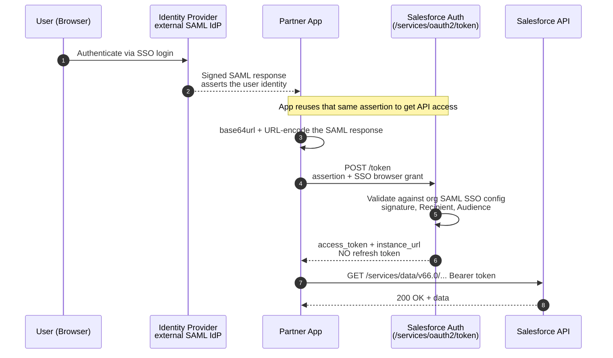

# 10 - SAML Assertion Flow (Access the API After Web SSO)

> **One-liner**: A user who already authenticated through your **SAML SSO** can exchange that **IdP-signed SAML assertion** for a Salesforce **access token**, so the same login that got them into the UI also unlocks the API.
> **Use when**: You have **SAML SSO configured** for the org and a partner app wants API access using the very assertion it already federates with.
> **Grant**: Federates the same way as web SSO, using the SSO **browser** profile (`urn:oasis:names:tc:SAML:2.0:profiles:SSO:browser`) · **Status**: ⛔ Rarely used today — **JWT or Web Server is almost always preferable**.
> **Tokens returned**: Access token **only**. **No refresh token. No connected app required.**

New here? Read [01-authentication-fundamentals.md](01-authentication-fundamentals.md) first for tokens, scopes, and endpoints.

---

## 1. The idea in plain English

You walk into an office building and badge in at the **lobby turnstile** (web SSO). Normally that badge-in only gets you through the front door. This flow says: take the **exact same badge swipe** you just used at the lobby and present it at the **parking-garage gate** (the API) to get in there too, without a second sign-in.

In Salesforce terms: a user logs in via your **SAML Identity Provider**, which issues a **signed SAML response** asserting who they are. Instead of only using that response for the web UI, the partner app **reuses the same assertion** against the OAuth token endpoint to obtain an access token for API calls. The trust comes from the org's existing **SAML Single Sign-On settings**, not from a Connected App certificate.

> **Mental model**: This is "**SSO, but for the API.**" The user already proved who they are to your IdP; this flow converts that proof into an API token.

---

## 2. When to use it (and when not)

| ✅ Use it when | ❌ Avoid / use something else |
|---|---|
| The org already has **SAML SSO** set up and you want to reuse the same assertion for API access. | Server-to-server with no interactive user → use [04-jwt-bearer-flow.md](04-jwt-bearer-flow.md) or [09-saml-bearer-assertion-flow.md](09-saml-bearer-assertion-flow.md). |
| A partner app authenticates the user via an IdP and then needs to act as that user in the API. | A normal "log in with Salesforce" web app → use [02-web-server-flow.md](02-web-server-flow.md) (far simpler, returns a refresh token). |
| You explicitly want to **avoid creating a Connected App** (this flow doesn't require one). | You need **long-lived** access → this flow gives **no refresh token**. Use Web Server flow. |

**Reality check**: The strict requirements (a single `SubjectConfirmationData` whose **Recipient** must be a Salesforce login/token URL, the correct **Audience** = your org's SAML Entity ID, IdP signature) make this **impractical for most cases**. In practice, almost everyone reaches for **JWT Bearer**, **SAML Bearer**, or the **Web Server** flow instead. Treat this as a "know it exists and can explain it" flow.

---

## 3. How it works (sequence diagram)



**Walkthrough**

1-2. The user authenticates against your **SAML IdP** (the same IdP your org trusts for web SSO). The IdP returns a **signed SAML response** asserting the user's identity.
3-4. The partner app takes that response, **base64url-encodes** it, then URL-encodes it for the POST body.
5. The app POSTs it to `/services/oauth2/token`, federating **the same way as web SSO** (the SSO browser profile assertion type).
6. Salesforce validates the assertion against the org's **SAML Single Sign-On settings** — the **IdP signature**, the **Recipient** (must be a Salesforce login/token URL), and the **Audience** (your org's SAML **Entity ID**).
7. On success Salesforce returns an **access token** and `instance_url`. **No refresh token.**
8-9. The app calls the API with `Authorization: Bearer <access_token>`.

---

## 4. The actual requests & responses

**Token endpoint** (your **My Domain**):

```
POST https://MyDomainName.my.salesforce.com/services/oauth2/token
Content-Type: application/x-www-form-urlencoded
```

**The assertion must satisfy your org's SSO rules** (Salesforce validates against SAML SSO settings):

| Element | Required value |
|---|---|
| **Signed by** | Your **Identity Provider** (not the app, not a Connected App cert). |
| **Recipient** (in `SubjectConfirmationData`) | An org-specific **Login URL** or **OAuth 2.0 Token Endpoint** shown on the SAML SSO settings page. |
| **Audience** | Your org's correct **Salesforce Entity ID** (from SSO config). |
| Encoding on the wire | **base64-encoded, then URL-encoded** assertion. |
| Connected App | **Not required** — trust comes from SAML SSO config. SSO must be **enabled** for the org. |

**The token request (curl) — illustrative:**

```bash
curl https://MyDomainName.my.salesforce.com/services/oauth2/token \
  -d grant_type=assertion \
  -d assertion_type=urn:oasis:names:tc:SAML:2.0:profiles:SSO:browser \
  --data-urlencode assertion=PHNhbWxwOlJlc3BvbnNl... (base64 of the IdP-signed SAML response)
```

> **Encoding nuance**: the assertion is **Base-64 encoded, then URL-encoded** — the same value normally used for web single sign-on. Because it is the SSO assertion itself, you don't have to hand-craft a new one for the API.

**The token response:**

```json
{
  "access_token": "00D5g000004...!AQEAQ...",
  "scope": "id api",
  "instance_url": "https://MyDomainName.my.salesforce.com",
  "id": "https://login.salesforce.com/id/00D.../005...",
  "token_type": "Bearer"
}
```

**Setup checklist (org SSO, not a Connected App)**

1. Configure **SAML Single Sign-On** in Setup: register your **Identity Provider**, its **certificate**, **Issuer**, and **Entity ID**.
2. Note the org's **Login URL** and **OAuth 2.0 Token Endpoint** from the SSO settings page — these are the valid **Recipient** values.
3. Ensure the IdP issues the SAML response with the correct **Recipient** and **Audience** for that org.
4. The partner app captures the IdP-signed assertion at login and reuses it against the token endpoint.

> **Why this is finicky**: Salesforce supports only a **single `SubjectConfirmationData`**, and its **Recipient** must be a Salesforce login URL. An assertion built for a different service provider usually won't satisfy this, which is a big reason teams skip this flow in favor of JWT/SAML Bearer or Web Server.

---

## 5. Security pitfalls & gotchas

| Pitfall | Why it bites | Fix |
|---|---|---|
| Confusing it with SAML **Bearer** | Different trust model: here the **IdP** signs and trust comes from **SSO config**, not a Connected App cert. | SAML **Assertion** = IdP-signed, org SSO. SAML **Bearer** = app self-signs via Connected App cert. See [09-saml-bearer-assertion-flow.md](09-saml-bearer-assertion-flow.md). |
| Wrong **Recipient** / **Audience** | The assertion was minted for a different SP, so Salesforce rejects it. | Mint with the org's **Login URL / token endpoint** as Recipient and the org's **Entity ID** as Audience. |
| Expecting a refresh token | None is issued; long-lived access isn't supported here. | For durable user access, use [02-web-server-flow.md](02-web-server-flow.md). |
| Replaying a captured assertion | A leaked SSO assertion could be replayed within its window. | Keep validity windows short; protect the assertion in transit (TLS). |
| Assuming it needs a Connected App | It doesn't — but it **does** require SSO to be enabled. | Configure SAML SSO; no Connected App needed. |
| Reaching for this by default | It's the most constrained option and rarely the right tool now. | Prefer JWT Bearer, SAML Bearer, or Web Server flow. |

---

## 6. Interview Q&A

**Q: What is the SAML Assertion flow for?**
A: It lets a user who authenticated through **SAML SSO** exchange that **IdP-signed SAML assertion** for a Salesforce **access token**, so an already-SSO'd user can reach the **API** — "federate with the API the same way you federate for web SSO."

**Q: How does it differ from the SAML Bearer Assertion flow?**
A: **Who signs and where trust lives.** In SAML **Assertion**, the **Identity Provider** signs and Salesforce trusts it via the org's **SAML SSO configuration** — no Connected App. In SAML **Bearer**, the **app itself** signs with a private key whose certificate is uploaded to a **Connected App**. Bearer is for a server with no user present; Assertion is tied to a user who just did SSO.

**Q: Does it need a Connected App?**
A: **No.** Trust is established through the org's **SAML Single Sign-On settings**. SSO must be enabled, and the assertion's Recipient and Audience must match the org. (SAML Bearer, by contrast, requires a Connected App with an uploaded certificate.)

**Q: Why is it considered legacy / rarely used?**
A: The constraints are strict — a single `SubjectConfirmationData` whose Recipient must be a Salesforce login URL, the right Audience/Entity ID, and an IdP-signed response. For most server integrations **JWT Bearer**, **SAML Bearer**, or **Web Server** flow are simpler and more flexible, so this one is seldom chosen today.

**Q: Does it return a refresh token?**
A: **No.** Like the certificate-based bearer flows, it returns an access token only. For long-lived user access you'd use the Web Server flow with `refresh_token` scope.

**Talking point to explain it to anyone**: "It's reusing your lobby badge-swipe at the parking gate. You proved who you are once at SSO login, and this flow turns that same proof into an API key — no second sign-in."

---

## 7. Key terms

**Assertion** · **Identity Provider (IdP)** · **SAML SSO** · **Entity ID** · **Bearer token** · `urn:oasis:names:tc:SAML:2.0:profiles:SSO:browser` — all defined in [01-authentication-fundamentals.md](01-authentication-fundamentals.md#10-glossary-quick-definitions).

---

## Sources (Verified June 2026)

- [SAML Assertion Flow for Accessing the API — Salesforce Help](https://help.salesforce.com/s/articleView?id=sf.remoteaccess_oauth_web_sso_flow.htm&type=5)
- [Configure SSO with Salesforce as a SAML Service Provider — Salesforce Help](https://help.salesforce.com/s/articleView?id=xcloud.sso_saml.htm&type=5)
- [SAML Assertion Flow — Cloud Sundial](https://cloudsundial.com/salesforce-identity/saml-assertion)
- [Salesforce Single Sign-On Flows — Cloud Sundial](https://cloudsundial.com/salesforce-sso-flows)

---

*Next: [11-asset-token-flow.md](11-asset-token-flow.md) — the token-exchange flow that issues scoped asset tokens for connected devices.*
