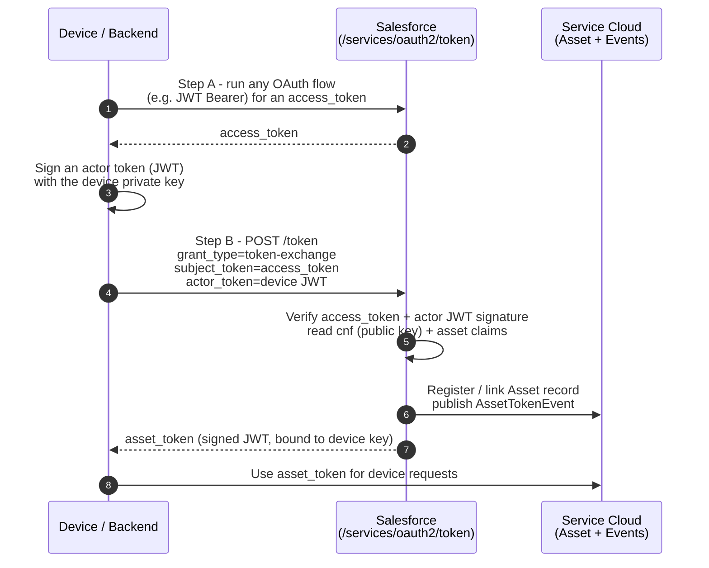

# 11 - Asset Token Flow

> **One-liner**: A connected device exchanges a Salesforce access token plus its own signed actor token for an **asset token** (a JWT) that ties the physical device to a Salesforce identity and Asset record.
> **Use when**: You build **IoT / connected-device** integrations and need each device to authenticate to Salesforce as a verifiable "asset."
> **Grant type**: `urn:ietf:params:oauth:grant-type:token-exchange` · **Status**: ⚠️ Specialized (niche, valid only for connected-device / Service Cloud for IoT scenarios).
> **Tokens returned**: A signed **asset token** (JWT). No refresh token.

New here? Read [01-authentication-fundamentals.md](01-authentication-fundamentals.md) first for tokens, scopes, and endpoints.

---

## 1. The idea in plain English

Imagine a **fleet of vending machines**. Each machine needs to prove "I am machine #4471, and I belong to this company's account" every time it phones home. You do not want to bake a human's password into the machine. Instead the machine carries its own **tamper-proof badge**.

The Asset Token Flow is **OAuth 2.0 Token Exchange** specialized for devices. The device (or a backend acting for it) first gets a normal **access token**, then trades that access token *plus a JWT it signed itself* for an **asset token**. The asset token is a JWT that says "this specific device is verified and linked to this Salesforce identity." Salesforce can also auto-create or link a **Service Cloud Asset record** during the exchange, so your CRM knows exactly which physical unit is talking.

The clever part: the device proves it holds a private key (the `cnf` claim carries its public key), so the asset token is bound to that one device. A stolen asset token is hard to reuse without the device's key.

---

## 2. When to use it (and when not)

| ✅ Use it when | ❌ Avoid / use something else |
|---|---|
| You connect **physical devices** (sensors, machines, appliances) to Salesforce and need each tied to an **Asset** record. | A normal server integration with no device identity → use [05-client-credentials-flow.md](05-client-credentials-flow.md). |
| You want a **JWT bound to a device's key** that downstream services can validate offline. | A user logging in from a browser or app → use [02-web-server-flow.md](02-web-server-flow.md). |
| You are building on **Service Cloud for IoT** and want `AssetTokenEvent` to fire on registration. | A device with a screen and keyboard but no asset concept → use [06-device-flow.md](06-device-flow.md). |
| Device data must be **linked to CRM** (customer, account, contact, asset) at registration time. | A back-office cron/ETL job → use [04-jwt-bearer-flow.md](04-jwt-bearer-flow.md). |

**Real-world examples**: a smart thermostat that registers itself against a customer's Asset and streams telemetry; connected medical or industrial equipment that must be individually identifiable in Service Cloud; a fleet-management gateway that mints a per-device token before pushing events.

> **Honesty check**: This is a **specialized, low-frequency** flow. Most integrations never touch it. Know what it is and when it applies. Do not reach for it unless "device = asset" is genuinely part of the design.

---

## 3. How it works (sequence diagram)



**Walkthrough**

1-2. The device (or a backend on its behalf) first obtains a standard **access token** using any supported OAuth flow. **JWT Bearer** is the natural partner for an unattended device.
3. The device **signs its own JWT** (the *actor token*) using a private key it holds. The matching public key travels in the token's `cnf` ("confirmation") claim.
4. The device POSTs to the **token** endpoint with `grant_type=urn:ietf:params:oauth:grant-type:token-exchange`, passing the access token as the **subject token** and the device JWT as the **actor token**.
5. Salesforce validates both tokens, reads the public key from `cnf`, and reads any **asset claims** (e.g. a serial number).
6. Salesforce **links or registers an Asset record** and publishes an **`AssetTokenEvent`** platform event so you can automate follow-up.
7. Salesforce returns the **asset token**: a signed JWT, bound to the device's key, that the device presents on subsequent calls.

---

## 4. The actual requests & responses

**The token-exchange request** (asset token issuance):

```bash
curl https://MyDomainName.my.salesforce.com/services/oauth2/token \
  -H "Content-Type: application/x-www-form-urlencoded" \
  --data-urlencode "grant_type=urn:ietf:params:oauth:grant-type:token-exchange" \
  --data-urlencode "subject_token_type=urn:ietf:params:oauth:token-type:access_token" \
  --data-urlencode "subject_token=00D5g000004...!AQEAQ..." \
  --data-urlencode "actor_token_type=urn:ietf:params:oauth:token-type:jwt" \
  --data-urlencode "actor_token=eyJraWQiOiI...DEVICE_SIGNED_JWT"
```

**The device-signed actor JWT** carries the device's identity and key. Conceptually its payload includes an `asset` claim (with a **serial number** to link an Asset) and a `cnf` claim (the device's **public key**):

```json
{
  "iss": "device-issuer",
  "sub": "device-4471",
  "asset": { "serialNumber": "VM-4471-AC" },
  "cnf": { "jwk": { "kty": "RSA", "n": "0vx7...", "e": "AQAB" } }
}
```

**The response — an asset token (JWT):**

```json
{
  "access_token": "eyJraWQiOiI...ASSET_TOKEN_JWT",
  "issued_token_type": "urn:ietf:params:oauth:token-type:jwt",
  "token_type": "Bearer",
  "expires_in": 3600
}
```

The returned `access_token` here **is the asset token**: a signed JWT whose `cnf` claim echoes the device's public key, binding the token to that device.

**Validating an asset token** (any downstream service can do this offline):

1. Split the JWT into `header.payload.signature` and base64url-decode the header.
2. Read the **`kid`** from the header and fetch the public signing key from the key endpoint: your site's My Domain URL with **`/id/keys`** appended.
3. Verify the JWS signature per **RFC 7515**, and validate the device binding using the public key in the **`cnf`** claim.
4. Use a **standard JWT library** (RFC 7519). Do not hand-roll signature checks.

**Connected App setup checklist (asset token settings)**

1. Create a Connected App (or **External Client App**) and enable **OAuth Settings**.
2. Select **Enable Asset Tokens** in the app's OAuth settings.
3. Asset tokens require the **`api`** and **`openid`** scopes. Add both.
4. Configure the **asset token signing certificate** (the cert Salesforce uses to sign the issued asset token) and the **audiences** the token is valid for.
5. Subscribe to **`AssetTokenEvent`** (a platform event) if you want Apex / Flow to react when a device registers. The event also stores the device's public key.

> **Where to dig deeper**: Salesforce documents this under "OAuth 2.0 Asset Token Flow for Securing Connected Devices" and "Using and Validating Asset Tokens." It is part of the broader **Token Exchange** family. See Sources.

---

## 5. Security pitfalls & gotchas

| Pitfall | Why it bites | Fix |
|---|---|---|
| Treating the asset token like a normal bearer token | It is **key-bound** via `cnf`; consumers that ignore the binding lose the device-proof guarantee. | Validate the `cnf` proof-of-possession, not just the signature. |
| Hardcoding a human user's credentials in firmware | Devices outlive employees; credentials leak from extracted firmware. | Use the device's **own signed actor JWT**, never a person's password. |
| Skipping the access-token (subject) step | The exchange needs a valid **subject token** plus the **actor token**; one alone fails. | Get an access token first (commonly via [04-jwt-bearer-flow.md](04-jwt-bearer-flow.md)), then exchange. |
| Writing your own JWT validator | Signature and claim bugs become auth bypasses. | Use a vetted JWT library and the **`/id/keys`** endpoint for keys. |
| Expecting a refresh token | Token-exchange flows do not return one. | Re-run the exchange to mint a fresh asset token when it expires. |
| Forgetting the required scopes | Without **`api`** + **`openid`** the app cannot issue asset tokens. | Grant both scopes on the app. |
| Reaching for this flow by default | It is niche; misuse adds device-identity machinery you do not need. | Use it **only** when the device-as-Asset model is real. |

---

## 6. Interview Q&A

**Q: What problem does the Asset Token Flow solve?**
A: It securely ties a **physical device** to a Salesforce identity. The device gets a **JWT (asset token)** bound to its own key, and Salesforce can link or register a **Service Cloud Asset record** in the same exchange so the device is identifiable in CRM.

**Q: What grant type does it use, and how is it structured?**
A: `urn:ietf:params:oauth:grant-type:token-exchange`. You pass a **subject token** (a normal access token) and an **actor token** (a JWT the device signed). Salesforce returns an asset token.

**Q: Why an actor token *and* a subject token?**
A: The **subject token** establishes the Salesforce authorization context; the **actor token** proves the device's identity and carries its public key in the `cnf` claim. The asset token is bound to that key, so possession alone is not enough to impersonate the device.

**Q: How does a downstream service trust an asset token without calling Salesforce on every request?**
A: It validates the JWT **offline** using standard RFC 7515/7519 steps, fetching the signing key from the **`/id/keys`** endpoint by `kid`, and checks the `cnf` proof-of-possession.

**Q: Is this a mainstream flow?**
A: No. It is **specialized** for IoT / Service Cloud for IoT. For ordinary server-to-server work you would use Client Credentials or JWT Bearer. Knowing it exists and when it applies is the point.

**Talking point to explain it to anyone**: "It's a tamper-proof badge for a machine. The device shows Salesforce a badge it signed itself, Salesforce stamps it and records which machine it is, and the machine carries that stamped badge from then on."

---

## 7. Key terms

`token-exchange` · `subject_token` / `actor_token` · `cnf` (proof-of-possession) · JWT · Asset record · `AssetTokenEvent` — token and JWT basics are defined in [01-authentication-fundamentals.md](01-authentication-fundamentals.md#10-glossary-quick-definitions).

---

## Sources (Verified June 2026)

- [OAuth 2.0 Asset Token Flow for Securing Connected Devices — Salesforce Help](https://help.salesforce.com/s/articleView?id=xcloud.remoteaccess_oauth_asset_token_flow.htm&type=5)
- [Using and Validating Asset Tokens — Salesforce Help](https://help.salesforce.com/s/articleView?id=platform.remoteaccess_asset_token_using_validating.htm&type=5)
- [OAuth 2.0 Token Exchange Flow — Salesforce Help](https://help.salesforce.com/s/articleView?id=xcloud.remoteaccess_token_exchange_overview.htm&type=5)
- [AssetTokenEvent — Platform Events Developer Guide](https://developer.salesforce.com/docs/atlas.en-us.platform_events.meta/platform_events/sforce_api_objects_assettokenevent.htm)
- [Enable OAuth Settings for API Integration — Salesforce Help](https://help.salesforce.com/s/articleView?id=xcloud.connected_app_create_api_integration.htm&type=5)

---

*Next: [12-authorization-code-and-credentials-flow.md](12-authorization-code-and-credentials-flow.md) — the headless identity flow for fully branded customer login.*
