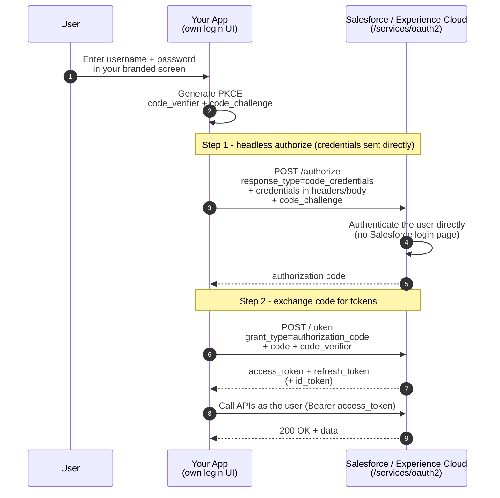

# 12 - Authorization Code and Credentials Flow (Headless Identity)

> **One-liner**: Your app shows its **own login UI** (no Salesforce-hosted page), collects the user's credentials, and exchanges them through an authorization-code request for tokens against an Experience Cloud site.
> **Use when**: You build a **fully branded customer (B2C) login** for an Experience Cloud digital experience and refuse to redirect users to a Salesforce login screen.
> **Grant type**: `authorization_code` (credentials submitted directly, headless) · **Status**: ✅ Recommended for modern headless customer identity.
> **Tokens returned**: Access token **+ refresh token** (+ ID token if `openid`).

New here? Read [01-authentication-fundamentals.md](01-authentication-fundamentals.md) first for tokens, scopes, and endpoints.

---

## 1. The idea in plain English

Think of a **bank's mobile app**. You type your username and password into the *bank's* screen, with the bank's logo, fonts, and flow. You never get bounced to a generic "log in here" page run by a third party. Behind the scenes the app still does the secure handshake, but the **front door is 100% the brand's**.

That is the Authorization Code and Credentials Flow. It is part of Salesforce **Headless Identity**. Normally the Web Server flow ([02](02-web-server-flow.md)) redirects the user to a Salesforce-hosted login page. Here, **your app owns the entire UI** and submits the collected credentials directly. Salesforce still runs a real authorization-code exchange under the hood, so you get the security of the code-then-token pattern *without* the Salesforce-hosted page. It is the **modern, fully branded way** to do customer and partner identity on Experience Cloud.

This single flow is the **foundation** for a family of headless experiences: classic password login, **passwordless** (OTP) login, **self-registration**, and **guest** access.

---

## 2. When to use it (and when not)

| ✅ Use it when | ❌ Avoid / use something else |
|---|---|
| You run an **Experience Cloud** site and want a **fully branded** login built in your own app/SPA. | You are fine with the Salesforce-hosted login page → use [02-web-server-flow.md](02-web-server-flow.md). |
| You are building **B2C / customer or partner** digital experiences (mobile, SPA, custom frontend). | Internal employee SSO → use SAML/OIDC SSO, not headless. |
| You need **headless login, passwordless, registration, or guest** under one flow. | A backend system integration with no human → use [05-client-credentials-flow.md](05-client-credentials-flow.md). |
| You can stand up an **External Client App** and enable the OAuth plugin. | You only have a legacy **Connected App** and cannot create an ECA → this flow expects an **External Client App**. |

**Real-world examples**: a retailer's branded customer portal where shoppers sign in on the retailer's own screens; a mobile app that registers new customers in-app and logs them in via OTP; a partner community front-end built in React that never shows a Salesforce URL.

> **Why "headless"?** The Salesforce identity service runs with **no UI of its own** in this flow. Your app is the head. That is the whole selling point: total control of branding and UX.

---

## 3. How it works (sequence diagram)



**Walkthrough**

1. The user types credentials into **your** branded UI. Salesforce never renders a page.
2. The app generates a **PKCE** `code_verifier` / `code_challenge` pair (PKCE is required for public clients and strongly recommended generally).
3. The app POSTs to the **authorize** endpoint of the **Experience Cloud site**, submitting the credentials **directly** (in request headers or the POST body) instead of via an interactive page.
4. Salesforce **authenticates the user headlessly** and returns an **authorization code**.
5. The app exchanges the code at the **token** endpoint with `grant_type=authorization_code` plus the PKCE `code_verifier`.
6. Salesforce returns an **access token, refresh token**, and optionally an **ID token**. From here it behaves like any user-context session.

> The two-step "code then token" structure is the same as the Web Server flow. The difference is **who collects the credentials**: your app does, headlessly, instead of a Salesforce-hosted page.

---

## 4. The actual requests & responses

These calls go to your **Experience Cloud site** host (`https://customersite.my.site.com`), not the bare org login host.

**Step 1 — headless authorization-code request (credentials submitted directly):**

```bash
curl https://customersite.my.site.com/services/oauth2/authorize \
  -H "Auth-Request-Type: Named-User" \
  -H "Content-Type: application/x-www-form-urlencoded" \
  --data-urlencode "response_type=code_credentials" \
  --data-urlencode "client_id=3MVG9...CONSUMER_KEY" \
  --data-urlencode "redirect_uri=https://app.example.com/callback" \
  --data-urlencode "scope=api refresh_token openid" \
  --data-urlencode "username=customer@example.com" \
  --data-urlencode "password=THE_USER_PASSWORD" \
  --data-urlencode "code_challenge=Psd...PKCE_CHALLENGE"
```

**Step 1 response — an authorization code:**

```json
{
  "code": "aPrx...AUTH_CODE"
}
```

**Step 2 — exchange the code for tokens:**

```bash
curl https://customersite.my.site.com/services/oauth2/token \
  -d grant_type=authorization_code \
  -d code=aPrx...AUTH_CODE \
  -d client_id=3MVG9...CONSUMER_KEY \
  -d redirect_uri=https://app.example.com/callback \
  -d code_verifier=THE_ORIGINAL_RANDOM_STRING
```

**Step 2 response — tokens:**

```json
{
  "access_token": "00D5g000004...!AQEAQ...",
  "refresh_token": "5Aep861...l4Lo",
  "id_token": "eyJraWQiOiI...",
  "instance_url": "https://customersite.my.site.com",
  "token_type": "Bearer",
  "issued_at": "1718700000000",
  "scope": "api refresh_token openid"
}
```

> Header and parameter names for credential submission vary by headless variation (login, passwordless, registration). Treat the names above as representative and confirm exact headers against the current Headless Identity Implementation Guide before coding. See Sources.

**External Client App setup checklist**

1. Create an **External Client App** (not a classic Connected App). Enable its **OAuth settings** and the **OAuth plugin**.
2. Org-level: set **`oAuthCdCrdtFlowEnable = true`** on the **`OauthOidcSettings`** metadata type (the "OAuth and OpenID Connect Settings" page in Setup). This enables the Authorization Code and Credentials Flow for the org.
3. On the app's OAuth config, set **`isCodeCredFlowEnabled = true`**. Optionally set **`isCodeCredPostOnly = true`** to force credentials into the POST body only.
4. Keep **Require Proof Key for Code Exchange (PKCE)** enabled (required for public clients; it covers the Code and Credentials flow and its headless variations).
5. Select scopes: `api`, `refresh_token` / `offline_access`, and `openid` as needed.
6. Configure the **Experience Cloud site** for Headless Identity (the login/registration handlers and settings that headless flows route through).

**Related headless flows (same family, same External Client App):**

| Variation | What it does |
|---|---|
| **Headless Login** | Username + password collected in your UI. The base case described here. |
| **Headless Passwordless Login** | User enters email or phone, verifies with a **one-time password (OTP)**. No password stored. |
| **Headless Registration** | Self-service **sign-up** entirely in your branded UI, then logs the new user in. |
| **Headless Forgot Password** | Branded **password-reset** flow without a Salesforce-hosted page. |
| **Headless Identity for Guest Users** | **Guest / unauthenticated** access for public-facing experiences. |

---

## 5. Security pitfalls & gotchas

| Pitfall | Why it bites | Fix |
|---|---|---|
| Using a classic Connected App | This flow expects an **External Client App** with the OAuth plugin. | Build it as an **ECA**. See [13-connected-apps-vs-external-client-apps.md](13-connected-apps-vs-external-client-apps.md). |
| Forgetting the org flag | Without **`oAuthCdCrdtFlowEnable = true`** on `OauthOidcSettings`, the flow is disabled org-wide. | Enable it in Setup or via Metadata API. |
| Skipping PKCE | Public clients (SPA/mobile) can have codes intercepted. | Always send `code_challenge` / `code_verifier`. |
| Storing customer passwords in your app | Your UI handles raw credentials, so any logging or caching is a breach risk. | Submit and discard. Never log or persist credentials. Prefer **passwordless** where possible. |
| Putting credentials in the URL query string | Query strings land in logs and history. | Send credentials in the **POST body or headers** (set `isCodeCredPostOnly`). |
| Confusing this with the legacy Username-Password flow | Both take credentials, but that flow is **retiring** and is not headless identity. | Use **this** flow for branded customer login. See [07-username-password-flow.md](07-username-password-flow.md). |
| Pointing at the wrong host | Headless identity runs through the **Experience Cloud site**, not the bare org. | Use the **`*.my.site.com`** site URL. |

---

## 6. Interview Q&A

**Q: What is the Authorization Code and Credentials Flow and why does it exist?**
A: It is part of **Salesforce Headless Identity**. It lets an app build its **own login UI** for Experience Cloud customers and submit credentials directly, while Salesforce still runs a real **authorization-code** exchange behind the scenes. It exists so brands get **total UX control** without a Salesforce-hosted login page.

**Q: How is it different from the standard Web Server flow?**
A: Same code-then-token security, but the Web Server flow **redirects** the user to a Salesforce-hosted page. Here the **app collects the credentials itself** (headless) and posts them. The browser never leaves your branded experience.

**Q: What do you have to configure to turn it on?**
A: An **External Client App** with the **OAuth plugin** enabled, the org-level flag **`oAuthCdCrdtFlowEnable = true`** on **`OauthOidcSettings`**, **`isCodeCredFlowEnabled`** on the app, and an Experience Cloud site set up for Headless Identity. PKCE should stay on.

**Q: Does it return a refresh token?**
A: Yes. It is a **user-context** flow, so you get an access token, a refresh token (with the right scope), and an ID token if you request `openid`. That distinguishes it from server flows like Client Credentials.

**Q: What other headless flows are in the same family?**
A: **Headless Passwordless Login** (OTP), **Headless Registration** (self sign-up), **Headless Forgot Password**, and **Headless Identity for Guest Users**. They all build on this flow and the same External Client App.

**Q: When would you NOT use it?**
A: For internal employee SSO (use SAML/OIDC), for backend system integrations (use Client Credentials), or when you are happy with the Salesforce-hosted login page (use the Web Server flow).

**Talking point to explain it to anyone**: "It's the bank-app login. You type your password on the bank's own screen, never a generic third-party page, but the secure handshake still happens behind the curtain."

---

## 7. Key terms

`authorization_code` · `code_credentials` · PKCE (`code_challenge` / `code_verifier`) · External Client App · `OauthOidcSettings` / `oAuthCdCrdtFlowEnable` · Headless Identity · Experience Cloud — token, scope, and PKCE basics are in [01-authentication-fundamentals.md](01-authentication-fundamentals.md#10-glossary-quick-definitions).

---

## Sources (Verified June 2026)

- [Authorization Code and Credentials Flow for Private Clients — Salesforce Help](https://help.salesforce.com/s/articleView?id=xcloud.remoteaccess_authorization_code_credentials_flow.htm&type=5)
- [Authorization Code and Credentials Flow for Public Clients — Salesforce Help](https://help.salesforce.com/s/articleView?id=sf.remoteaccess_authcodecreds_singlepageapp.htm&type=5)
- [Headless Identity APIs: Configure an External Client App for the Authorization Code and Credentials Flow — Salesforce Help](https://help.salesforce.com/s/articleView?id=xcloud.eca_authorization_code_credentials.htm&type=5)
- [Enable the Authorization Code and Credentials Flow — Headless Identity Implementation Guide](https://developer.salesforce.com/docs/atlas.en-us.headless_identity.meta/headless_identity/headless_identity_enable_auth_code_creds_flow.htm)
- [What Is Headless Identity? — Headless Identity Implementation Guide](https://developer.salesforce.com/docs/atlas.en-us.headless_identity.meta/headless_identity/headless_identity_what_is_it.htm)
- [Headless Passwordless Login Flow for Public Clients — Salesforce Help](https://help.salesforce.com/s/articleView?id=sf.remoteaccess_headless_passwordless_login_public_clients.htm&type=5)

---

*Next: [13-connected-apps-vs-external-client-apps.md](13-connected-apps-vs-external-client-apps.md) — the container comparison that explains why headless identity needs an External Client App.*
