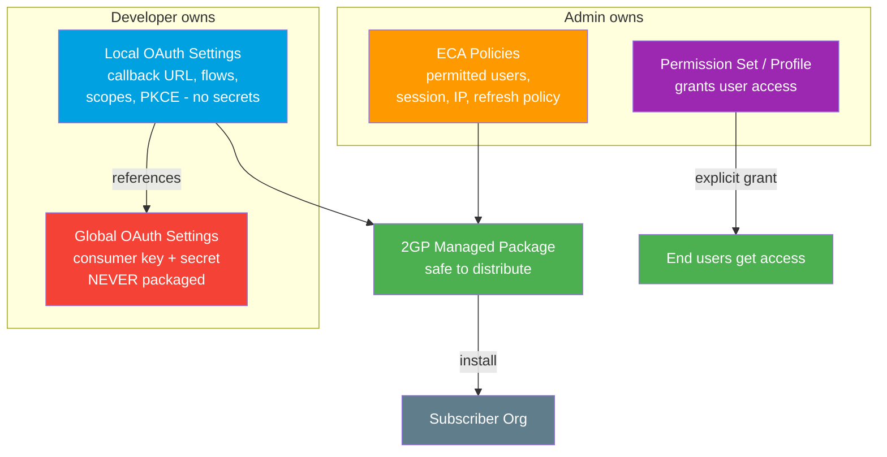

# 13 - Connected Apps vs External Client Apps (ECA)

> **One-liner**: Both are the *container* that holds your OAuth identity (consumer key, scopes, callback URL). **Connected Apps** are the original (2013); **External Client Apps** are the modern, packaging-friendly replacement (GA 2024).
> **Use when**: You need to register *any* app that talks to Salesforce over OAuth or SSO — pick the right container before you build a flow.
> **Status**: New Connected App creation is **disabled by default on new orgs starting Spring '26** (rollout began Winter '26). For new builds in 2026, use an **External Client App**.

New here? Read [01-authentication-fundamentals.md](01-authentication-fundamentals.md) first for tokens, scopes, and endpoints. The flow files ([02](02-web-server-flow.md), [04](04-jwt-bearer-flow.md), [05](05-client-credentials-flow.md)) all need one of these containers.

---

## 1. The idea in plain English

Think of an **apartment building**. The OAuth *flow* is how a person walks through the front door (key card, intercom, doorman). But before anyone can walk in, the building has to **exist and be registered** — it needs an address, a list of who's allowed in, and which doors their key opens. That registration is the **app definition**.

- A **Connected App** is the *old building*: the developer who built it and the admin who runs it edit the **same blueprint**. Convenient, but if you ship that blueprint to another building (a package), the master keys (secrets) go with it. That is the packaging headache.
- An **External Client App (ECA)** is the *new building*: the **developer's wiring** (consumer key/secret) lives in one sealed file, and the **building manager's rules** (who gets in, session limits) live in a separate file. You can hand out the manager's file safely because the secrets never leave the sealed file.

That single split — **developer settings vs admin policy** — is the whole reason ECAs exist.

---

## 2. Which should I use in 2026?

| Situation | Use this | Why |
|---|---|---|
| **Any new integration / app** | **External Client App** | New Connected App creation is off by default on new orgs (Spring '26). ECA is the go-forward container. |
| You ship a **managed package** (ISV / 2GP) | **External Client App** | Built for second-generation packaging. Secrets stay out of the package. |
| You have **CI/CD** (source-driven deploys) | **External Client App** | Metadata splits cleanly into dev vs admin files. |
| You still need **Canvas** | **ECA (Spring '26+)** or legacy Connected App | Canvas plugin for ECA arrived in **Spring '26**. Before that, Canvas was Connected-App-only. |
| You need **mobile push notifications** | **Connected App** (today) | Push notification support on ECA is still rolling out. Verify per release before relying on it. |
| You need the **Username-Password flow** | Neither cleanly | ECAs do **not** support Username-Password, and that flow is retiring anyway. Use [Client Credentials](05-client-credentials-flow.md). |
| **Existing** Connected App already in production | Keep it | Existing Connected Apps keep working. The Spring '26 change only blocks *new* creation. |

> **Interview headline**: "For anything new in 2026 I default to an **External Client App**. Connected Apps still run, but Salesforce disabled creating new ones by default on new orgs in Spring '26, and ECAs solve the packaging and CI/CD problems Connected Apps never did."

---

## 3. What each one actually is

### Connected App (the original container, 2013+)

A **Connected App** is a single metadata definition that holds:

- **Consumer Key** (client id) and **Consumer Secret** (client secret).
- **Callback URL** (redirect URI) for interactive flows.
- **OAuth scopes** the app may request (`api`, `refresh_token`, `openid`, etc.).
- **Flow enablement** (which OAuth flows are allowed — web server, JWT, device, and so on).
- **Policies**: permitted users, IP relaxation, refresh-token expiration, session policies, custom attributes.

Everything — developer config *and* admin policy — lives in **one object**. That is simple for a single org, but it is exactly what makes Connected Apps awkward to package and distribute, because the secret-bearing parts cannot be cleanly separated from the admin-controlled parts.

### External Client App / ECA (next generation, GA 2024)

An **External Client App** does the same job but **splits the definition in two**:

| File | Holds | Who owns it | Packageable? |
|---|---|---|---|
| **Global OAuth settings** | Consumer key + consumer secret (the secrets) | Developer | **Never** — too sensitive |
| **Local OAuth settings** | Callback URL, enabled flows, scope selection, PKCE toggle (references the global file, no secrets) | Developer | **Yes** |
| **ECA Policies** | Permitted users, session policy, IP relaxation, refresh-token policy | Admin | Yes |

Because the secret lives only in the **global** file (which is never packaged) and the **local** + **policy** files carry no secrets, you can distribute an ECA through a **second-generation managed package (2GP)** without leaking credentials. That is the architectural win.

ECAs are also **not available to users by default**. Even after the app exists, a user gets no access until an admin **explicitly grants it** — typically by turning on "Admin-approved users are pre-authorized" and assigning a **profile or permission set**. This is more secure by default than the old "All users may self-authorize" habit.

---

## 4. Side-by-side feature comparison

| Capability | Connected App | External Client App (ECA) |
|---|---|---|
| **First available** | 2013 | GA 2024 |
| **New creation default (new orgs)** | **Disabled by default (Spring '26)** | Enabled — the go-forward container |
| **Dev vs admin separation** | No — one combined definition | **Yes** — global secrets / local settings / policies are separate metadata |
| **Built for 2GP packaging** | No (packaging is the pain point) | **Yes** — secrets never enter the package |
| **CI/CD friendly** | Limited | **Yes** — clean source-driven metadata |
| **Available to users by default** | Often self-authorize | **No** — access must be granted via permission set / profile |
| **OAuth web server (auth code) + PKCE** | Yes | **Yes** |
| **OAuth hybrid / Code and Credentials** | Yes | **Yes** |
| **Client Credentials flow** | Yes | **Yes** |
| **JWT Bearer flow** | Yes | **Yes** |
| **Device flow** | Yes | **Yes** |
| **Headless (registration / passwordless login)** | Yes | **Yes** |
| **Username-Password flow** | Yes (legacy, retiring) | **No — not supported** |
| **Canvas apps** | Yes | **Yes, from Spring '26** (Canvas plugin for ECA) |
| **Mobile push notifications** | Yes | Rolling out — verify per release |
| **SAML SSO** | Yes | Yes |
| **Distribution** | Manual / 1GP-style, secrets travel | **2GP managed package**, secrets stay out |

> **Verify-before-you-quote note**: the support article literally titled *"New Connected Apps Can No Longer Be Created in Spring '26"* is the canonical source for the creation-default change. The **Canvas plugin for External Client App** release note is a **Spring '26** item. Treat **push notifications on ECA** as "check the current release notes" rather than a settled yes.

---

## 5. The developer-vs-admin split (architecture)



**Walkthrough**

1. The **developer** sets the consumer key/secret in the **global** file. It is sealed and never enters a package.
2. The **developer** sets callback URL, enabled flows, scopes, and PKCE in the **local** file, which only *references* the global file.
3. The **admin** sets runtime **policies** (who is permitted, session limits, IP rules).
4. Only the **local** + **policy** metadata go into the **2GP package**, so a subscriber installs the app with **no exposed secrets**.
5. In the subscriber org, the admin grants access by assigning a **permission set or profile**. Nobody gets in by default.

Contrast with a Connected App, where steps 1-3 are one blob and the secret risks riding along during distribution.

---

## 6. Setup / configuration

### Create an External Client App (UI)

1. **Setup -> App Manager -> New External Client App** (or **External Client App Manager**).
2. Enter name, contact email, and **distribution state** (Local for this org, or Packageable for 2GP).
3. **Enable OAuth** and set the **Callback URL** (your exact `redirect_uri`).
4. Select **OAuth scopes** (for example `api`, `refresh_token offline_access`, `openid`).
5. Choose the **OAuth flows** to enable (web server / PKCE, client credentials, JWT, device — note **Username-Password is not offered**).
6. Keep **Require PKCE** on for public clients.
7. Save, then open **Policies** and set **Permitted Users = Admin-approved users are pre-authorized**.
8. Assign a **permission set or profile** so real users can use the app. Without this step, access is denied by design.

### Grant access (the step people forget)

```text
Setup -> Permission Sets -> [your set] -> Assigned Connected Apps / External Client Apps
  -> Add the ECA -> Save -> Assign the permission set to users
```

Because ECAs are **not on by default**, skipping the permission set leaves every user with `OAUTH_APP_BLOCKED` / access-denied errors even though the app exists.

### Salesforce as the *client* (outbound)

If *Salesforce itself* is calling an external API, you usually do **not** hand-build a flow against an ECA. You configure a **Named Credential + External Credential** instead, which manages tokens for you. See [14-named-credentials-and-external-credentials.md](14-named-credentials-and-external-credentials.md).

---

## 7. Security pitfalls & gotchas

| Pitfall | Why it bites | Fix |
|---|---|---|
| Expecting to **create a new Connected App** on a fresh 2026 org | Blocked by default since Spring '26; UI and API creation are off (package install excepted) | Build an **External Client App** instead; request an exception from Support only if truly required |
| Forgetting ECAs are **off by default** | Users hit access-denied even though the app exists | Assign a **permission set / profile** and set "Admin-approved users are pre-authorized" |
| Trying to use **Username-Password** with an ECA | ECAs do not support it; the flow is also retiring | Use [Client Credentials](05-client-credentials-flow.md) for server-to-server |
| Packaging a **Connected App** and leaking the secret | The combined definition can carry the consumer secret into the package | Use an **ECA**: the secret-bearing global file is never packaged |
| Assuming **Canvas** works on any ECA | Canvas plugin for ECA only arrived in **Spring '26** | Confirm the org is on Spring '26+, or keep Canvas on a legacy Connected App |
| Assuming **push notifications** are ready on ECA | Still rolling out | Verify the current release notes; keep push on a Connected App if unsupported |
| `Use Any API Client` permission on users | Lets a user bypass the "Admin-approved" restriction and reach any app | Audit and remove this permission from normal users |
| Editing ECA secrets after packaging | Global secrets are intentionally non-packageable | Rotate the consumer key/secret in the **global** settings, redistribute the package metadata |

---

## 8. Interview Q&A

**Q: What is a Connected App?**
A: The original (2013) OAuth/SSO container in Salesforce. One metadata definition holding the consumer key/secret, callback URL, allowed scopes, enabled flows, and policies. Every classic OAuth flow registers as a Connected App.

**Q: What is an External Client App and why was it introduced?**
A: The next-generation container (GA 2024). It **splits developer settings from admin policy** into separate metadata — global secrets, local settings, and policies — so it packages cleanly in 2GP, works with CI/CD, and never ships secrets in a package. It is the go-forward replacement for Connected Apps.

**Q: What actually changed in Spring '26?**
A: New Connected App creation is **disabled by default on new orgs** (rollout began Winter '26). Creation is blocked through both UI and API, except via package install, unless you request an exception from Support. Existing Connected Apps keep working; new builds should be ECAs.

**Q: Name a few differences between Connected Apps and ECAs.**
A: ECAs separate dev vs admin metadata, are 2GP-packageable without leaking secrets, are **not available to users by default** (require permission set/profile), and do **not** support the Username-Password flow. Connected Apps are a single combined definition that is harder to package safely.

**Q: Which OAuth flows does an ECA support, and which does it not?**
A: Web server (auth code) with PKCE, hybrid / Code and Credentials, Client Credentials, JWT Bearer, device, and headless variants. It does **not** support Username-Password.

**Q: When would you still pick a Connected App in 2026?**
A: Mainly for a capability ECAs do not yet cover in your org's release (historically Canvas before Spring '26, and mobile push notifications while support rolls out), or to keep an existing production app running. For genuinely new work, ECA is the default.

**Q: How does an ECA avoid leaking secrets in a package?**
A: The consumer key/secret live only in the **global OAuth settings** file, which is never packageable. The **local** settings and **policies** carry no secrets and are what ship in the 2GP package, so subscribers install with no exposed credentials.

**Talking point to explain it to anyone**: "A Connected App is the old apartment building where the developer and the manager share one blueprint, so the master keys travel when you copy it. An External Client App splits that blueprint — the keys stay in a sealed file, the rules go in another — so you can safely hand out a copy and decide exactly who gets in."

---

## 9. Key terms

**Consumer Key / Client ID**, **Consumer Secret / Client Secret**, **Callback URL / Redirect URI**, **scope**, **confidential vs public client**, **PKCE** — all defined in [01-authentication-fundamentals.md](01-authentication-fundamentals.md#10-glossary-quick-definitions). For outbound (Salesforce-as-client) containers, see **Named Principal vs Per-User** in [14-named-credentials-and-external-credentials.md](14-named-credentials-and-external-credentials.md).

---

## Sources (Verified June 2026)

- [New Connected Apps Can No Longer Be Created in Spring '26 — Salesforce Help](https://help.salesforce.com/s/articleView?id=005228017&type=1)
- [Comparison of Connected Apps and External Client Apps Features — Salesforce Help](https://help.salesforce.com/s/articleView?id=xcloud.connected_apps_and_external_client_apps_features.htm&type=5)
- [External Client Apps — Salesforce Help](https://help.salesforce.com/s/articleView?id=xcloud.external_client_apps.htm&type=5)
- [External Client Apps and Connected Apps — Salesforce Help](https://help.salesforce.com/s/articleView?id=xcloud.external_integrations.htm&type=5)
- [Connected App to External Client App Migration — Salesforce Help](https://help.salesforce.com/s/articleView?id=xcloud.connected_app_to_external_client_app_migration.htm&type=5)
- [Configure the External Client App OAuth Settings — Salesforce Help](https://help.salesforce.com/s/articleView?id=xcloud.configure_external_client_app_oauth_settings.htm&type=5)
- [Configure External Client App Policies — Salesforce Help](https://help.salesforce.com/s/articleView?id=sf.configure_external_client_app_policies.htm&type=5)
- [Packageable External Client Apps — Salesforce Help](https://help.salesforce.com/s/articleView?id=sf.configure_packageable_external_client_apps.htm&type=5)
- [Configure Canvas Plugin for External Client App (Spring '26) — Release Notes](https://help.salesforce.com/s/articleView?id=release-notes.rn_security_canvas_external_client_app.htm&release=260&type=5)
- [Create an External Client App — Mobile SDK Developer Guide](https://developer.salesforce.com/docs/platform/mobile-sdk/guide/eca-create.html)

---

*Next: [14-named-credentials-and-external-credentials.md](14-named-credentials-and-external-credentials.md) — the modern, secret-free way for Salesforce to call OUT to external APIs.*
