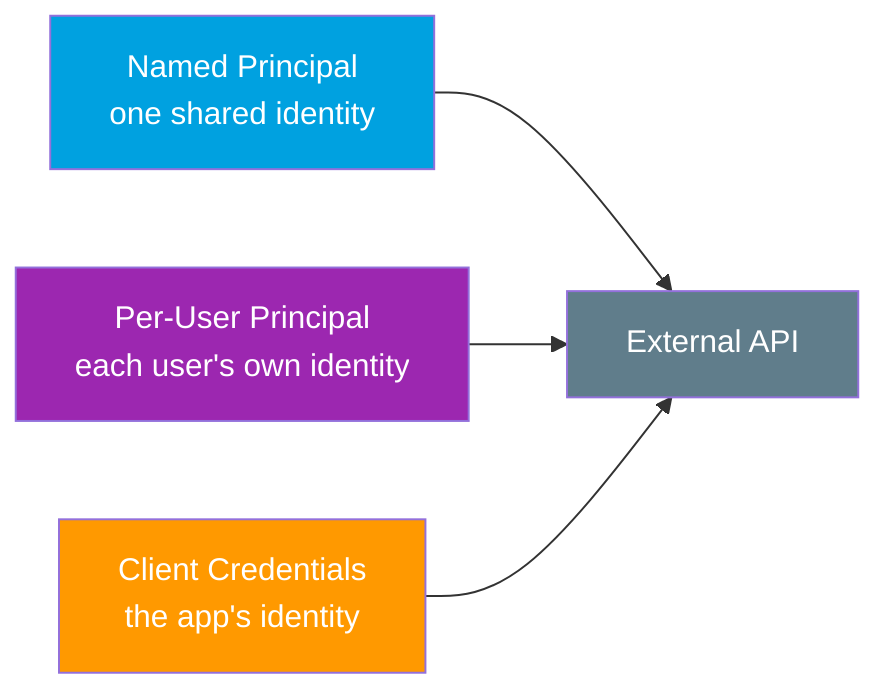
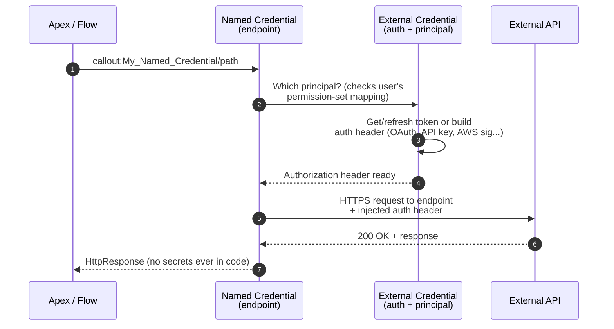

# 14 - Named Credentials + External Credentials (Outbound)

> **One-liner**: The modern, **secret-free** way for *Salesforce to call OUT* to an external API. A **Named Credential** holds the endpoint URL; an **External Credential** holds the authentication. Your Apex just calls `callout:My_Named_Credential` and Salesforce handles tokens.
> **Use when**: Any Salesforce -> external system callout (Apex, Flow, External Services). This is the recommended pattern for *all* outbound auth.
> **Status**: The **Winter '23** "split" model (Named + External Credential) is the current standard. Legacy single Named Credentials still work but are **no longer enhanced** — use the new model.

New here? Read [01-authentication-fundamentals.md](01-authentication-fundamentals.md) first. The previous files cover Salesforce as the *server*; this file is Salesforce as the *client*.

---

## 1. The idea in plain English

Imagine your office has **one mailroom** that handles all outgoing packages. You never write the recipient's address or stick on postage yourself — you just drop the package in the chute labeled with a nickname like "VendorX," and the mailroom looks up the real address and the right postage account, then sends it.

- The **Named Credential** is the *chute with the nickname*: it knows the **destination URL** and which postage account to use.
- The **External Credential** is the *postage account*: it knows **how to pay** — the auth protocol (OAuth, API key, basic, AWS) and the secrets.

Your Apex code only ever references the nickname (`callout:VendorX`). It never sees the address details or the secrets. That is the entire point: **no hardcoded credentials in code**, and you can rotate secrets centrally without touching a single line of Apex.

---

## 2. Named Credential vs External Credential

Salesforce split the old single Named Credential into **two objects** in Winter '23 so the *endpoint* and the *authentication* can be reused and secured independently.

| Object | Answers | Holds | Reusable? |
|---|---|---|---|
| **Named Credential** | *Where do I send the request?* | The endpoint URL, which **External Credential** to use, callout options (generate auth header, allow merge fields in body/header) | One External Credential can back **many** Named Credentials |
| **External Credential** | *How do I authenticate?* | The **authentication protocol**, the **principals** (identities + secrets), and the permission-set mappings | Shared across endpoints that use the same auth |

> **Interview one-liner**: "A **Named Credential** is the *endpoint*; an **External Credential** is the *authentication*. Split since Winter '23 so one auth definition can serve many endpoints, and so access is gated by permission sets."

---

## 3. External Credential authentication protocols

Pick the protocol that matches the external system. Salesforce supports a broad set:

| Protocol | How it authenticates | Typical use |
|---|---|---|
| **OAuth 2.0 — Browser Flow** (Authorization Code Grant) | User logs in via browser; callback returns tokens | Per-user access to a SaaS that requires interactive consent |
| **OAuth 2.0 — JWT** | Signed JWT (using a signing cert in the org) exchanged for a token | Server-to-server OAuth without a browser |
| **OAuth 2.0 — JWT Bearer** | JWT bearer assertion exchanged for a token | Machine-to-machine, certificate-based |
| **OAuth 2.0 — Client Credentials** | Client id + client secret exchanged for a token | Backend integration, one shared system identity |
| **Basic** | Static username + password | Legacy APIs that take Basic auth |
| **AWS Signature v4** | AWS access key + secret sign each request (also **AWS STS Roles Anywhere** variant using a certificate) | Calling AWS services (S3, API Gateway, etc.) |
| **API Key** (via **Custom** header) | A secret value placed in a custom header | APIs that authenticate with a static key |
| **Custom** | You define custom headers / parameters | Anything non-standard |
| **mTLS** (mutual TLS) | Client and server prove identity with signed certificates | High-security APIs requiring client certs |

> **Gotcha**: **API Key** is not a separate dropdown by itself — you implement it as a **Custom** external credential with a **custom header** whose value is the key secret. The same custom-header technique also covers Basic-style schemes some APIs expect.

---

## 4. Principals — whose identity makes the call?

A **principal** is the identity (and its secrets) that the External Credential uses to authenticate. The principal **type** decides whether everyone shares one identity or each user gets their own.

| Principal type | One identity or many? | When to use | Example |
|---|---|---|---|
| **Named Principal** | **One shared identity** for all Salesforce users | The external system does not care *which* Salesforce user — it just needs the org to authenticate | A nightly sync that writes to a vendor API under a single service account |
| **Per-User Principal** | **Each user authenticates individually** | The external system must know the *actual* end user (per-user data, per-user audit) | A user connects *their own* DocuSign / Google account |
| **Client Credentials principal** | The **configured client identity** (the app's own credentials) | OAuth Client Credentials flow — no user context at all | Backend service calling under the app's client id/secret |



> **Permission Set mapping is REQUIRED.** An External Credential principal is **not usable** until you map it to a **permission set** (or permission set group / profile) and assign that to the user. No mapping means no access — even for an admin. For **Per-User** principals, each user also supplies their own credentials (often via "Authenticate" on their personal settings). When a user has multiple mappings, the **sequence number** (lowest first) decides which principal is used.

---

## 5. How it works (sequence)



**Walkthrough**

1. Apex (or Flow) issues a callout to `callout:My_Named_Credential/path`.
2. The **Named Credential** resolves which **External Credential** and **principal** apply, using the running user's **permission-set mapping**.
3. The **External Credential** obtains or refreshes the token, or constructs the auth header (OAuth token, API key header, AWS v4 signature, etc.).
4. Salesforce injects the **Authorization header** automatically.
5. The request goes to the real endpoint over HTTPS.
6. The response returns to Apex. **At no point did your code hold a secret or a token.**

---

## 6. Setup / configuration

### Step-by-step (UI)

1. **Setup -> Named Credentials -> External Credentials -> New.**
2. Choose the **Authentication Protocol** (for example *OAuth 2.0 — Client Credentials* or *Custom*).
3. Add a **Principal** (Named Principal name, or enable Per-User). Enter the credential's secrets here (client id/secret, key, username/password).
4. **Map the principal to a permission set** (or PS group/profile). This is mandatory.
5. **Setup -> Named Credentials -> Named Credentials -> New.**
6. Set the **URL** (endpoint base) and select the **External Credential** from step 1.
7. Choose callout options: **Generate Authorization Header** (usually on), and whether to **Allow Formulas in HTTP Header / Body** if you need merge fields.
8. **Assign the permission set** (from step 4) to the users who will run the callout.

### Apex callout — the whole point

Reference the Named Credential by name. **No endpoint, no token, no secret in code.**

```apex
HttpRequest req = new HttpRequest();
// 'callout:' + Named Credential name, then the path
req.setEndpoint('callout:My_Named_Credential/v1/orders');
req.setMethod('GET');

Http http = new Http();
HttpResponse res = http.send(req);
System.debug(res.getStatusCode() + ' ' + res.getBody());
```

For a POST with a body that needs a per-user value, use a **merge field** (only if "Allow Formulas in HTTP Body" is enabled on the Named Credential):

```apex
HttpRequest req = new HttpRequest();
req.setEndpoint('callout:My_Named_Credential/v1/tickets');
req.setMethod('POST');
req.setHeader('Content-Type', 'application/json');
// Named-credential merge field pulls a value from the External Credential at runtime
req.setBody('{"agent":"{!$Credential.My_External_Cred.Username}"}');
Http http = new Http();
HttpResponse res = http.send(req);
```

> **Why `callout:` matters**: Salesforce swaps `callout:My_Named_Credential` for the real URL **and** injects the auth header at send time. Your code, your repo, your logs, and your packages stay **free of secrets**. Rotating a credential is a config change in one place — zero code deploys.

### Merge fields & named-credential headers

- `{!$Credential.<ExternalCredential>.<field>}` injects a stored credential value into a header or body at runtime.
- You can define **custom headers** on the Named Credential (great for **API Key** schemes) so every callout automatically carries the key.

---

## 7. Security pitfalls & gotchas

| Pitfall | Why it bites | Fix |
|---|---|---|
| **Hardcoding** tokens/keys in Apex | Secrets leak via source control, logs, and packages; rotation means redeploys | Use a Named Credential; reference `callout:` only |
| Forgetting the **permission-set mapping** | The principal is unusable; callout fails with an auth error | Map the External Credential principal to a permission set and assign it |
| Using **Named Principal** when the API needs the real user | All actions appear as one service account; per-user audit breaks | Use a **Per-User Principal** so each user authenticates individually |
| Putting the **full URL** in `setEndpoint` instead of `callout:` | Loses the auto-injected auth and the secret-free benefit | Always use `callout:Named_Credential/path` |
| Enabling **merge fields** in body/header unnecessarily | Formula injection / accidental data exposure | Only enable "Allow Formulas" when a merge field is genuinely needed |
| Mixing up which **principal** runs | Multiple mappings can collide for one user | Set the **sequence number** (lowest wins) deliberately |
| Still using **legacy** single Named Credentials | They are not enhanced and miss new protocols/features | Migrate to the **Named + External Credential** split model |
| Assuming **Per-User** works without user action | Each user must authenticate their own principal | Have users connect via "Authenticate" in their settings |

---

## 8. Interview Q&A

**Q: What is a Named Credential and why use one?**
A: A Named Credential defines the **endpoint URL** for an outbound callout and points to an **External Credential** for auth. You reference it in Apex as `callout:Name`, so Salesforce manages the URL and auth header for you. The benefit is **no hardcoded secrets** — secrets live in config, rotate centrally, and never appear in code, logs, or packages.

**Q: How is a Named Credential different from an External Credential?**
A: The **Named Credential is the endpoint**; the **External Credential is the authentication** (protocol + principals + permission-set mappings). They were split in Winter '23 so one auth definition can back multiple endpoints and access is gated by permission sets.

**Q: What authentication protocols can an External Credential use?**
A: OAuth 2.0 (Browser/Authorization Code, JWT, JWT Bearer, Client Credentials), Basic, AWS Signature v4 (including STS Roles Anywhere), API Key via a Custom header, Custom, and mTLS. You match the protocol to the external system.

**Q: Named Principal vs Per-User Principal?**
A: A **Named Principal** is one shared identity for all users — good when the external system does not care who the Salesforce user is. A **Per-User Principal** has each user authenticate individually — required when the external system needs the actual end user (per-user data or audit). Client Credentials uses the app's own configured identity.

**Q: Why is the permission-set mapping required?**
A: An External Credential principal is inert until mapped to a **permission set** (or PS group/profile) and assigned to users. The mapping is what grants a user the right to use that principal's secrets, enforcing least privilege. No mapping, no callout.

**Q: How do you call a Named Credential from Apex?**
A: Set the endpoint to `callout:My_Named_Credential/path` and send a normal `HttpRequest`. Salesforce substitutes the real URL and injects the auth header. You never write the token or secret.

**Q: A teammate hardcoded an API key in Apex. What do you recommend?**
A: Move it into an **External Credential** (Custom protocol with a custom header carrying the key), wire it to a **Named Credential**, map a **permission set**, and change the Apex to `callout:`. Then the key rotates in config with zero code change and never lands in source control.

**Talking point to explain it to anyone**: "It's the office mailroom. Your code just drops the package in a chute labeled 'VendorX' — the mailroom knows the real address and which postage account pays. The address and the postage stay locked in the mailroom, never written on your desk."

---

## 9. Key terms

**Named Principal vs Per-User**, **bearer token**, **JWT**, **client id / secret**, **confidential vs public client** — all defined in [01-authentication-fundamentals.md](01-authentication-fundamentals.md#10-glossary-quick-definitions). For the OAuth flows these protocols implement, see [02-web-server-flow.md](02-web-server-flow.md) (Browser/Auth Code), [04-jwt-bearer-flow.md](04-jwt-bearer-flow.md), and [05-client-credentials-flow.md](05-client-credentials-flow.md). For the *inbound* app container, see [13-connected-apps-vs-external-client-apps.md](13-connected-apps-vs-external-client-apps.md).

---

## Sources (Verified June 2026)

- [Authentication Protocols for Named Credentials — Salesforce Help](https://help.salesforce.com/s/articleView?id=xcloud.nc_auth_protocols.htm&type=5)
- [Create Named Credentials and External Credentials — Salesforce Help](https://help.salesforce.com/s/articleView?id=sf.nc_named_creds_and_ext_creds.htm&type=5)
- [Enable External Credential Principals — Salesforce Help](https://help.salesforce.com/s/articleView?id=xcloud.nc_enable_ext_cred_principal.htm&type=5)
- [Map External Credential Principals to Permission Sets — Release Notes](https://help.salesforce.com/s/articleView?id=release-notes.rn_security_map_principals_to_permsets.htm&type=5)
- [Use API Keys in Custom Headers with Named Credentials — Salesforce Help](https://help.salesforce.com/s/articleView?id=sf.nc_custom_headers_and_api_keys.htm&type=5)
- [Create or Edit an AWS Signature v4 External Credential — Salesforce Help](https://help.salesforce.com/s/articleView?id=sf.nc_create_edit_awssig4_ext_cred.htm&type=5)
- [Named Credentials as Callout Endpoints — Apex Developer Guide](https://developer.salesforce.com/docs/atlas.en-us.apexcode.meta/apexcode/apex_callouts_named_credentials.htm)
- [Create an OAuth Named Credential — Named Credentials Developer Guide](https://developer.salesforce.com/docs/platform/named-credentials/guide/nc-create-oauth-cred.html)
- [Populate External Credential Principals — Named Credentials Packaging Guide](https://developer.salesforce.com/docs/platform/named-credentials/guide/nc-populate-external-credentials.html)

---

*Next: [15-auth-providers.md](15-auth-providers.md) — Auth Providers, the inbound side of social/SSO sign-in that complements outbound Named Credentials.*
