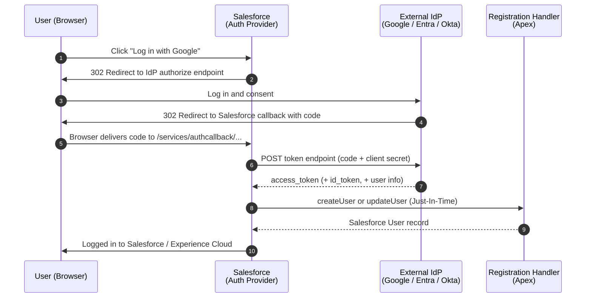

# 15 - Auth Providers

> **One-liner**: An **Auth Provider** lets *Salesforce itself* act as the **client / Service Provider** to an external identity provider. This is the "Log in with Google / Microsoft / Apple" button, and the OAuth bridge that backs an External Credential.
> **Use when**: You want social or enterprise **sign-on INTO** Salesforce or Experience Cloud, OR you need Salesforce to make **outbound OAuth callouts** to a third-party API on a per-user basis.
> **Type**: Setup object (`Auth. Providers`) · **Status**: ✅ Standard, fully supported.
> **Protocol**: OAuth 2.0 / OpenID Connect (contrast with SAML SSO in [16-sso-saml-and-openid-connect.md](16-sso-saml-and-openid-connect.md)).

New here? Read [01-authentication-fundamentals.md](01-authentication-fundamentals.md) first for tokens, scopes, and endpoints.

---

## 1. The idea in plain English

Every flow so far had Salesforce as the **bouncer** (the Authorization Server issuing tokens). An **Auth Provider flips the roles**: now Salesforce walks up to *someone else's* door and says "log me in." Salesforce becomes the **client**.

Think of a **nightclub that honors other clubs' VIP cards**. Instead of making you sign up from scratch, the club at the door says "show me your Google card." It checks with Google, Google vouches for you, and the club creates a guest pass on the spot. Salesforce is the club, Google is the trusted card issuer, and the **Registration Handler** is the doorman who decides "is this a new guest? Make them a wristband (a Salesforce user). A returning guest? Match them to the existing one."

Two completely different jobs use the same Auth Provider plumbing:

1. **Sign-on INTO Salesforce** — a user clicks "Log in with Microsoft" on your Experience Cloud login page.
2. **Outbound OAuth bridge** — Salesforce needs to call the GitHub API *as each user*, so the Auth Provider handles the OAuth dance and hands the token to a **Named Credential**.

---

## 2. When to use it (and which type)

| ✅ Use an Auth Provider when | Type to pick |
|---|---|
| Social login (consumer-facing portal) | **Google**, **Facebook**, **Apple**, **Amazon**, **LinkedIn**, **Slack**, **X (Twitter)** |
| Enterprise login from Microsoft Entra ID via OAuth/OIDC | **Microsoft** or **OpenID Connect** |
| Any standards-based OIDC provider (Okta, Auth0, PayPal, Ping) | **OpenID Connect** |
| Log users in from **another Salesforce org** | **Salesforce** |
| Third party speaks **OAuth 2.0 but not OIDC** (no discovery, custom token shape) | **Custom** (`Auth.AuthProviderPluginClass` in Apex) |
| Salesforce must call an external API **per user** (named credential outbound) | Any OAuth-capable provider, wired to an **External Credential** |

| ❌ Don't use an Auth Provider when | Use instead |
|---|---|
| The external IdP only speaks **SAML 2.0** (XML assertions) | SAML SSO — [16-sso-saml-and-openid-connect.md](16-sso-saml-and-openid-connect.md) |
| You want **Salesforce to be the IdP** that logs users into *other* apps | Salesforce as Identity Provider — [16](16-sso-saml-and-openid-connect.md) |
| A backend job calls Salesforce with no user | [05-client-credentials-flow.md](05-client-credentials-flow.md) / [04-jwt-bearer-flow.md](04-jwt-bearer-flow.md) |

> **The mental split**: Auth Provider = Salesforce is the **consumer** of an external IdP, over **OAuth/OIDC**. SAML SSO (file 16) is the **XML-assertion** alternative. Both can log users *into* Salesforce; the protocol is the difference.

---

## 3. How it works — sign-on INTO Salesforce (sequence)



**Walkthrough**

1-2. The user clicks the provider button. Salesforce (acting as **client**) redirects the browser to the **external IdP's** authorize endpoint.
3-4. The user authenticates **at the IdP** and consents. The IdP redirects back to Salesforce's **callback URL** with an authorization code.
5-7. Salesforce exchanges the code for the IdP's **access token** (and an **ID token** if OIDC), then reads the user's profile from the **User Info endpoint**.
8-9. Salesforce calls your **Registration Handler** Apex class. **Just-In-Time (JIT)**: if no matching Salesforce user exists, `createUser()` provisions one. If one exists, `updateUser()` keeps it in sync.
10. The user lands inside Salesforce with a live session. They never typed a Salesforce password.

---

## 4. Setup / config

**Callback URL** — Salesforce generates this after you save the provider. It has the form:

```
https://MyDomainName.my.salesforce.com/services/authcallback/<ProviderUrlSuffix>
```

You paste that URL into the **external IdP** as its allowed redirect URI (Google calls it "Authorized Redirect URI", PayPal calls it "Return URL").

**Steps to define an OpenID Connect provider** (verified from the docs):

1. **Register your app** with the external IdP. Get the **Client ID**, **Client Secret**, **Authorize**, **Token**, and **User Info** endpoint URLs.
2. Setup → Quick Find → **Auth. Providers** → **New** → Provider Type = **OpenID Connect** (or Google, Microsoft, etc.).
3. Enter a **Name** and a **URL Suffix** (used in the generated client URLs).
4. **Consumer Key** = the IdP's Client ID. **Consumer Secret** = the IdP's Client Secret.
5. Paste the **Authorize**, **Token**, and **User Info** endpoint URLs.
6. Check **Use Proof Key for Code Exchange (PKCE) Extension** to harden the flow.
7. Set the **Registration Handler** Apex class (or click **Automatically create a registration handler template**).
8. Set **Execute Registration As** to a running user. That user **must have the Manage Users permission**.
9. **Save**. Copy the generated **Callback URL** back into the IdP. Test with the **Test-Only Initialization URL**.

> **A Registration Handler is required** for Salesforce to generate the SSO initialization URL. No handler, no sign-on.

**The Registration Handler interface** (`Auth.RegistrationHandler`):

```apex
global class MyRegHandler implements Auth.RegistrationHandler {

    // Runs on FIRST login: provision a new Salesforce user (JIT)
    global User createUser(Id portalId, Auth.UserData data) {
        // Optional: look for an existing match first
        List<User> found = [SELECT Id FROM User WHERE Email = :data.email LIMIT 1];
        if (!found.isEmpty()) {
            return found[0]; // link instead of create
        }
        User u = new User();
        u.Username  = data.email + '.myorg';
        u.Email     = data.email;
        u.LastName  = data.lastName;
        u.FirstName = data.firstName;
        u.Alias     = data.firstName.substring(0, 1) + data.lastName.substring(0, 3);
        Profile p   = [SELECT Id FROM Profile WHERE Name = 'Standard User' LIMIT 1];
        u.ProfileId = p.Id;
        // set required locale/language/timezone fields...
        return u;
    }

    // Runs on EVERY subsequent login: keep the user in sync
    global void updateUser(Id userId, Id portalId, Auth.UserData data) {
        User u = new User(Id = userId);
        u.Email     = data.email;
        u.LastName  = data.lastName;
        u.FirstName = data.firstName;
        update u;
    }
}
```

**The Custom type** — when an external service speaks OAuth but not OIDC, you write an Apex class that **extends `Auth.AuthProviderPluginClass`** and implement:

| Method | Job |
|---|---|
| `initiate()` | Return the URL where the user goes to authenticate. |
| `handleCallback()` | Exchange the returned code for an access token (+ refresh token). |
| `getUserInfo()` | Return `Auth.UserData` for the Registration Handler. |
| `refresh()` | Return a new access token when the old one expires. |
| `getCustomMetadataType()` | Name the Custom Metadata Type that stores your config (key, secret, URLs). |

**Outbound use — the OAuth bridge for Named Credentials**: an Auth Provider doesn't only log people *in*. An **External Credential** of type *OAuth 2.0 (Browser Flow)* references an Auth Provider. When Salesforce makes a callout through the **Named Credential**, the Auth Provider performs the OAuth handshake and supplies the token. With a **Per-User principal**, each user authorizes once via their own browser, and from then on calls run in their personal context. See [14-named-credentials-and-external-credentials.md](14-named-credentials-and-external-credentials.md).

---

## 5. Security pitfalls & gotchas

| Pitfall | Why it bites | Fix |
|---|---|---|
| Callback URL not registered at the IdP | The IdP refuses to redirect back. `redirect_uri_mismatch`. | Copy Salesforce's generated callback URL into the IdP **exactly**. |
| `Execute Registration As` user lacks **Manage Users** | JIT can't create users. Login fails. | Use a dedicated **system/integration user** with Manage Users. |
| Registration Handler creates a user even when one exists | Duplicate users, login on the wrong record. | Query for an existing match (Email / FederationIdentifier) before `new User()`. |
| **ID token signature is NOT validated** for OIDC auth providers | Salesforce validates the ID token against the **Token Issuer** + User Info, not the signature. Don't assume cryptographic verification. | Trust the **Token Issuer** value and the User Info endpoint; lock both down. |
| Forgetting PKCE | Auth code interception on the redirect. | Check **Use Proof Key for Code Exchange**. |
| Consumer Secret leaking via Metadata API | Old packages exported the secret. | Since Nov 2022 the secret is replaced with a placeholder in Metadata API responses. Re-enter on deploy. |
| Treating an Auth Provider like SAML | Wrong protocol, no XML assertion. | Auth Provider = OAuth/OIDC. SAML is a different setup. See [16](16-sso-saml-and-openid-connect.md). |

---

## 6. Interview Q&A

**Q: What is an Auth Provider and how is it different from a Connected App?**
A: A **Connected App / External Client App** makes Salesforce the **Authorization Server** — an *external* app gets a token to call Salesforce. An **Auth Provider** is the mirror image: Salesforce becomes the **client / Service Provider** and gets a token from an *external* IdP. One is "apps logging into Salesforce," the other is "Salesforce logging into someone else."

**Q: Name the two big use cases for an Auth Provider.**
A: (1) **Social or enterprise sign-on INTO** Salesforce or Experience Cloud ("Log in with Google"). (2) Acting as the **OAuth bridge** behind an External Credential so Salesforce can make **outbound** per-user OAuth callouts via a Named Credential.

**Q: What does the Registration Handler do?**
A: It is the Apex class that handles **Just-In-Time provisioning**. `createUser()` runs on the first login to provision or link a Salesforce user, and `updateUser()` runs on later logins to keep it in sync. It is **required** for the SSO init URL to generate.

**Q: When would you pick the Custom (Apex) type over OpenID Connect?**
A: When the external service supports **OAuth 2.0 but not OpenID Connect** — no standard discovery document or a non-standard token/userinfo shape. You extend `Auth.AuthProviderPluginClass` and implement `initiate`, `handleCallback`, `getUserInfo`, and `refresh`.

**Q: Auth Provider vs SAML SSO — when do you use which?**
A: Both can log users into Salesforce. Use an **Auth Provider** when the IdP speaks **OAuth/OIDC**. Use **SAML SSO** when the IdP issues **XML SAML assertions**. OIDC is the more modern path; many enterprises still run SAML.

**Q: What is the callback URL and where does it go?**
A: It is the Salesforce-generated redirect endpoint, `https://MyDomain.my.salesforce.com/services/authcallback/<suffix>`. You register it at the **external IdP** as the allowed redirect URI so the IdP knows where to send the user back.

**Q: Does the Auth Provider validate the ID token's signature?**
A: For OIDC Auth Providers, **no** — Salesforce validates the ID token against the **Token Issuer** value and the User Info endpoint, but the signature itself isn't cryptographically validated. That's why pinning the issuer matters.

**Talking point to explain it to anyone**: "It's the 'Log in with Google' button, but inside Salesforce. Salesforce trusts Google to confirm who you are, then quietly makes or finds your Salesforce account for you."

---

## 7. Key terms

`Registration Handler` · Just-In-Time (JIT) provisioning · `Auth.AuthProviderPluginClass` · Service Provider · Identity Provider (IdP) · callback URL · `openid` scope · Per-User principal — base definitions in [01-authentication-fundamentals.md](01-authentication-fundamentals.md#10-glossary-quick-definitions). Outbound wiring in [14-named-credentials-and-external-credentials.md](14-named-credentials-and-external-credentials.md).

---

## Sources (Verified June 2026)

- [Authentication Provider SSO with Salesforce as the Relying Party — Salesforce Help](https://help.salesforce.com/s/articleView?id=sf.sso_authentication_providers.htm&type=5)
- [Configure an Authentication Provider Using OpenID Connect — Salesforce Developers](https://developer.salesforce.com/docs/platform/mobile-sdk/guide/sso-provider-openid-connect.html)
- [Configure a Predefined Authentication Provider — Salesforce Help](https://help.salesforce.com/s/articleView?id=sf.sso_predefined_authentication_provider_parent.htm&type=5)
- [Create a Custom External Authentication Provider — Salesforce Help](https://help.salesforce.com/s/articleView?id=sf.sso_provider_plugin_custom.htm&type=5)
- [AuthProviderPluginClass Class — Apex Reference Guide](https://developer.salesforce.com/docs/atlas.en-us.apexref.meta/apexref/apex_class_Auth_AuthProviderPluginClass.htm)
- [AuthProvider — Metadata API Developer Guide](https://developer.salesforce.com/docs/atlas.en-us.api_meta.meta/api_meta/meta_authproviders.htm)
- [OAuth 2.0 Browser Flow with a Per User Principal — Salesforce Help](https://help.salesforce.com/s/articleView?id=sf.nc_example_oauth_github_per_user.htm&type=5)

---

*Next: [16-sso-saml-and-openid-connect.md](16-sso-saml-and-openid-connect.md) — the SAML alternative, plus Salesforce as the Identity Provider.*
