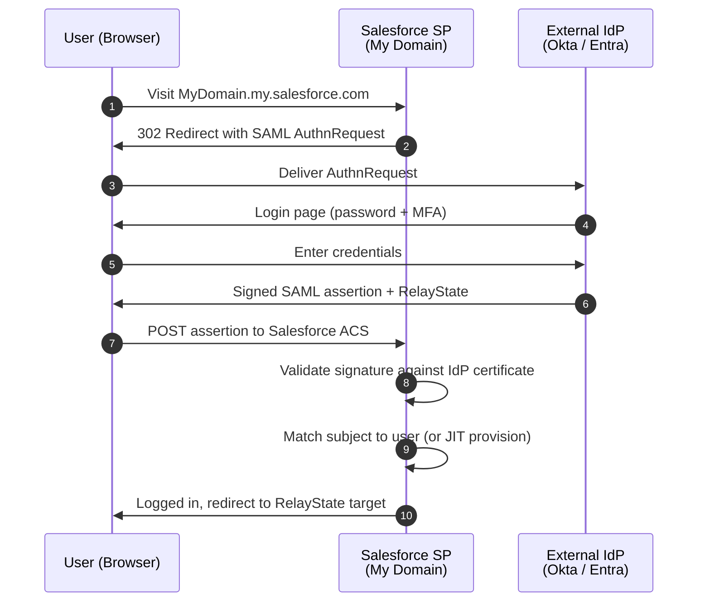
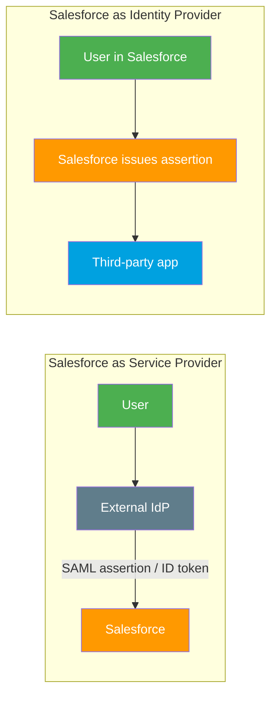

# 16 - Single Sign-On: SAML 2.0 and OpenID Connect

> **One-liner**: **SSO** lets a user authenticate once with a trusted **Identity Provider (IdP)** and get into Salesforce (and other apps) without re-entering credentials. Two protocols do this: **SAML 2.0** (XML assertions) and **OpenID Connect** (OAuth + a JWT ID token).
> **Use when**: An enterprise wants central login (one corporate identity for everything), or Salesforce must log users into downstream apps.
> **Two directions**: Salesforce as **Service Provider** (users log INTO Salesforce) vs Salesforce as **Identity Provider** (Salesforce logs users into OTHER apps).
> **Requirement**: **My Domain** is required to configure SSO.

New here? Read [01-authentication-fundamentals.md](01-authentication-fundamentals.md) first for AuthN vs AuthZ, tokens, and the `openid` scope.

---

## 1. The idea in plain English

**Single Sign-On = one login, many doors.** You badge in at the lobby once, and every office inside opens without badging again.

The lobby is the **Identity Provider (IdP)** — Okta, Microsoft Entra ID, Ping, or another Salesforce org. The offices are the **Service Providers (SPs)** — Salesforce, Slack, Workday. The IdP vouches for you with a signed note, and each SP trusts that note instead of asking for a password.

Direction matters, and interviewers test it:

- **Salesforce as Service Provider** — the user's home base is the external IdP. They log in there, and that login gets them *into* Salesforce. Most common: "Our company uses Entra ID, and Salesforce is just one of the apps it signs us into."
- **Salesforce as Identity Provider** — Salesforce is the home base. A user logged into Salesforce clicks a tile and gets logged *into* a third-party app, with Salesforce issuing the signed note.

Two note formats exist. **SAML** writes the note in **XML**. **OpenID Connect** writes it as a **JWT** carried on top of OAuth 2.0. Same goal, different envelope.

---

## 2. SAML vs OpenID Connect (the comparison interviewers want)

| Dimension | **SAML 2.0** | **OpenID Connect (OIDC)** |
|---|---|---|
| Built on | Standalone XML standard (2005) | **OAuth 2.0** + a thin identity layer |
| Token / assertion | **SAML assertion** (signed XML) | **ID token** = signed **JWT** (`header.payload.signature`) |
| Transport | Browser POST/redirect of XML | OAuth redirects + JSON over HTTPS |
| Triggered by scope | n/a (no scopes) | The **`openid`** scope |
| Trust anchor | **X.509 certificate** signing the assertion | Issuer + JWKS keys; validated against Token Issuer |
| Best for | Enterprise web SSO, legacy IdPs | Modern web + **mobile/SPA**, APIs |
| Also gives you | Authentication only | Authentication **and** an access token to call APIs |
| Modern-ness | Mature, widely deployed, heavier | Lighter, JSON-native, the **go-forward** choice |

**One-line answer**: "SAML is XML assertions with certificate trust — battle-tested for enterprise web SSO. OpenID Connect is OAuth 2.0 plus a JWT ID token, triggered by the `openid` scope — lighter, JSON-based, and better for mobile and APIs because the same flow also yields an access token."

> **The connective tissue**: OIDC SSO *is* the OAuth flows from earlier files. When you run the [Web Server (Authorization Code) flow](02-web-server-flow.md) with the **`openid`** scope, the **ID token** you get back *is the SSO assertion*. That is why OIDC needs no separate protocol — login is just OAuth with one extra scope.

---

## 3. How it works — SP-initiated SAML login (sequence)

This is Salesforce **as the Service Provider**. The user starts at Salesforce and gets bounced to the corporate IdP.

**Walkthrough**

1-3. The user hits their **My Domain** URL. Salesforce (the SP) generates a **SAML AuthnRequest** and redirects the browser to the IdP.
4-6. The IdP authenticates the user (password, MFA, whatever it enforces) and produces a **signed SAML assertion** plus a **RelayState** value (the page to land on).
7. The browser **POSTs the assertion** to Salesforce's **Assertion Consumer Service (ACS)** endpoint.
8. Salesforce **validates the signature** against the IdP's **X.509 certificate**, confirming the assertion is genuine and untampered.
9. Salesforce **matches the assertion subject** (Federation ID or username) to a user. If none exists and **JIT** is on, it provisions one.
10. The user is logged in and sent to the **RelayState** destination.

> **SP-initiated vs IdP-initiated**: **SP-initiated** starts at Salesforce (above) and is the cleaner, deep-link-friendly pattern. **IdP-initiated** starts at the IdP's app launcher — the user clicks a Salesforce tile, and the IdP POSTs an unsolicited assertion to the ACS. SP-initiated is generally preferred because it supports deep links and is less prone to replay.

---

## 4. Setup / config

**Prerequisite for everything**: turn on **My Domain** first. SSO configuration is keyed to your My Domain.

**Salesforce as SAML Service Provider** (Setup → **Single Sign-On Settings**):

1. Enable **SAML**.
2. Gather from your IdP: the **Issuer** (Entity ID), the **Identity Provider Login URL**, and the IdP's **signing certificate**.
3. Set the **SAML Identity Type** — **Federation ID** (recommended, an external-stable key on the User) or the Salesforce **Username**.
4. Set the **Entity ID** (usually your My Domain URL) and upload the IdP certificate.
5. Salesforce shows your **ACS URL** and **Entity ID** — give those to the IdP so it can target Salesforce.
6. Optionally enable **Just-in-Time provisioning** to create/update users from the assertion.
7. Add the SSO option to your **My Domain login page** (Setup → My Domain → Authentication Configuration).

**Just-in-Time (JIT) provisioning** — instead of pre-creating every user, Salesforce builds the user from attributes in the **SAML assertion** (or, for OIDC, from the Registration Handler). Required assertion fields include the **subject** (Federation ID or username), and for new users the standard required User fields (LastName, Email, Profile, etc.) supplied as SAML attributes.

**Salesforce as OpenID Connect Service Provider** — you don't configure a SAML setting; you create an **Auth Provider** of type **OpenID Connect** (see [15-auth-providers.md](15-auth-providers.md)). The `openid` scope makes the IdP return an **ID token**, and the **Registration Handler** does JIT.

**Salesforce as Identity Provider** (the reverse direction) — Setup → **Identity Provider** → Enable. Salesforce can then issue **SAML assertions** (or act as an **OIDC provider**) to log users into downstream apps. Each downstream app is registered as a **Connected App** with SAML or OIDC service-provider settings. This is how a Salesforce-centric company uses Salesforce credentials to reach Slack, Concur, etc.

---

## 5. Security pitfalls & gotchas

| Pitfall | Why it bites | Fix |
|---|---|---|
| Forgetting **My Domain** | SSO can't be configured at all. | Deploy and activate My Domain first. |
| Using **Username** as the SAML subject | Usernames change (email rebrands), breaking SSO. | Use a stable **Federation ID**. |
| Expired or wrong **IdP certificate** | Signature validation fails. All logins blocked. | Track certificate expiry; rotate before it lapses. |
| Clock skew between IdP and Salesforce | Assertion `NotBefore` / `NotOnOrAfter` window fails. | Sync NTP on the IdP; SAML is time-sensitive. |
| Confusing the two directions | Configuring "Identity Provider" when you wanted to be the SP. | SP = users come INTO Salesforce. IdP = Salesforce sends users OUT. |
| Relying on IdP-initiated only | No deep linking, replay risk. | Prefer **SP-initiated** where possible. |
| Assuming SAML returns an API token | SAML authenticates but gives no OAuth access token. | If you need API access too, use **OIDC** (ID token + access token) or pair with an OAuth flow. |

---

## 6. Interview Q&A

**Q: What is SSO and what problem does it solve?**
A: Single Sign-On lets a user authenticate once with a trusted **Identity Provider** and access many **Service Providers** without re-entering credentials. It centralizes identity, cuts password sprawl, and lets you enforce MFA and deprovisioning in one place.

**Q: SAML vs OpenID Connect — explain the difference.**
A: SAML 2.0 exchanges a **signed XML assertion**, trusted via an **X.509 certificate**, and does authentication only. OpenID Connect rides on **OAuth 2.0**, returns a **JWT ID token** triggered by the **`openid`** scope, is JSON-based, and also yields an **access token** for API calls. OIDC is lighter and better for mobile/SPA; SAML is the entrenched enterprise standard.

**Q: Salesforce as Service Provider vs as Identity Provider?**
A: As **SP**, an external IdP logs users *into* Salesforce. As **IdP**, Salesforce logs users *into other apps*. Same SAML/OIDC machinery, opposite direction of trust.

**Q: SP-initiated vs IdP-initiated SAML?**
A: **SP-initiated** starts at Salesforce, which sends a SAML AuthnRequest to the IdP — supports deep links and is preferred. **IdP-initiated** starts at the IdP's app launcher, which POSTs an unsolicited assertion to Salesforce's ACS.

**Q: What is Just-in-Time provisioning?**
A: Instead of pre-creating users, Salesforce builds or updates the user from attributes in the SAML assertion (or via the OIDC Registration Handler) on first login. New hires get a Salesforce account automatically the first time they SSO in.

**Q: How does OAuth from the earlier flows connect to SSO?**
A: OIDC SSO *is* an OAuth flow. Run the [Authorization Code flow](02-web-server-flow.md) with the `openid` scope and the **ID token** you receive is the proof-of-authentication assertion. SSO and OAuth aren't separate worlds — OIDC bolts identity onto OAuth.

**Q: Why is My Domain required for SSO?**
A: My Domain gives the org a stable, brandable login host that serves as the **issuer/entity ID** and the ACS host. External IdPs pin to it, and the SSO login page lives there.

**Talking point to explain it to anyone**: "It's badging into the lobby once and every office door opening for the rest of the day. SAML and OpenID Connect are just two formats for the signed badge."

---

## 7. Key terms

Identity Provider (IdP) · Service Provider (SP) · SAML assertion · ID token (JWT) · `openid` scope · Federation ID · Assertion Consumer Service (ACS) · RelayState · Just-in-Time (JIT) provisioning · My Domain — base definitions in [01-authentication-fundamentals.md](01-authentication-fundamentals.md#10-glossary-quick-definitions). OIDC sign-on setup in [15-auth-providers.md](15-auth-providers.md).

---

## Sources (Verified June 2026)

- [SAML SSO with Salesforce as the Service Provider — Salesforce Help](https://help.salesforce.com/s/articleView?id=sf.sso_saml_setting_up.htm&type=5)
- [Configure SSO with Salesforce as a SAML Service Provider — Salesforce Help](https://help.salesforce.com/s/articleView?id=xcloud.sso_saml.htm&type=5)
- [Salesforce as a SAML Identity Provider — Salesforce Help](https://help.salesforce.com/s/articleView?id=sf.sso_sfdc_idp_saml_parent.htm&type=5)
- [Just-in-Time Provisioning for SAML — Salesforce Help](https://help.salesforce.com/s/articleView?id=sf.sso_jit_about.htm&type=5)
- [Just-in-Time SAML Assertion Fields for Salesforce — Salesforce Help](https://help.salesforce.com/s/articleView?id=sf.sso_jit_requirements.htm&type=5)
- [Configure an Authentication Provider Using OpenID Connect — Salesforce Developers](https://developer.salesforce.com/docs/platform/mobile-sdk/guide/sso-provider-openid-connect.html)
- [Salesforce as an OpenID Connect Identity Provider — Salesforce Help](https://help.salesforce.com/s/articleView?id=sf.service_provider_define_oid.htm&type=5)

---

*Next: [17-session-security-and-token-management.md](17-session-security-and-token-management.md) — what happens to the session and tokens after you log in.*
