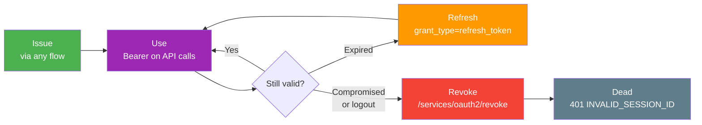
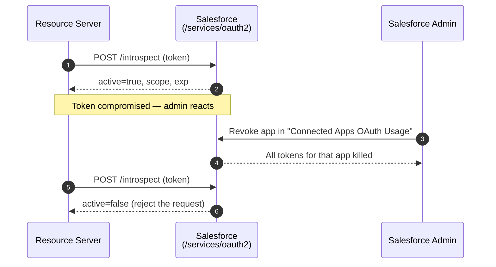

# 17 - Session Security & Token Management

> **One-liner**: Getting a token is the start, not the end. This file covers everything that happens **after**: how sessions time out, how to lock them down, and how to refresh, revoke, introspect, and monitor tokens.
> **Use when**: You've shipped any flow and now need to operate it safely — set timeouts, enforce IP and assurance policies, and have a kill switch.
> **Status**: ✅ Operational essentials for every integration. The **final flow file** in Module 03.

New here? Read [01-authentication-fundamentals.md](01-authentication-fundamentals.md) first for the three tokens and the OAuth endpoints.

---

## 1. The idea in plain English

A token is a **hotel key card** (we used this image back in [02](02-web-server-flow.md)). Issuing it was the easy part. The hotel's real security work is everything *after*: the card stops working after checkout time (**session timeout**), some doors need a second factor like a fingerprint (**High Assurance**), the card only works inside the building (**IP locking**), the front desk can **deactivate a lost card instantly** (revocation), and security can **scan a card to see if it's still valid** (introspection).

Token management is **lifecycle management**. A key is born (issued by a flow), lives (used against the API), ages out (expires), and either **renews quietly** (refresh) or is **killed on purpose** (revoke). Treat every token like a live credential, because possession alone grants access — it is a **bearer** token.

---

## 2. The token lifecycle (the mental model)



Read it as one sentence: a token is **issued**, **used** until it **expires**, then either **refreshed** to keep going or **revoked** to kill it — and a dead token returns **401 INVALID_SESSION_ID**.

---

## 3. Session timeout and security levels

**Session timeout (inactivity)** — an access token is really a **Session ID**, so it dies when the session times out. The org default is **2 hours of inactivity** (configurable in Setup → **Session Settings**). You pick a **Timeout Value** from a dropdown; for portal/community users the selectable range is **15 minutes to 24 hours** (External Identity / High-Volume licenses can extend to 7 days). Salesforce updates the "last active" timestamp roughly **every few minutes**, so the effective session is the timeout plus a few minutes of granularity.

| Setting | Where | What it does |
|---|---|---|
| **Timeout Value** | Session Settings (and per Profile) | Inactivity window before logout. Default ~**2h**. |
| **Force logout on timeout** | Session Settings | Actually end the session vs just warn. |
| **Lock sessions to the IP address from which they originated** | Session Settings | Binds the session to the login IP. Hijacked cookies from another IP are rejected. |
| **Lock sessions to the domain in which they were first used** | Session Settings | Prevents the session from being reused on another domain. |

**Session Security Levels** — every session is tagged **Standard** or **High Assurance**.

| Level | How you get it | Used for |
|---|---|---|
| **Standard** | Plain username + password login. | Normal access. |
| **High Assurance** | Login that included **MFA** (or a session raised via a login flow). | Gating **sensitive operations**. |

You can set **"Session Security Level Required at Login"** on a Profile to force High Assurance (i.e. require MFA) to log in. You can also require **High Assurance for sensitive operations** (Setup → Session Settings → policies) — e.g. viewing reports, managing IP ranges, or **connecting a Connected App** — so a Standard session is prompted to step up to MFA before continuing. Connected Apps have a matching **"High assurance session required"** option.

---

## 4. Connected App IP and refresh-token policies

On the **Connected App / External Client App**, two policy groups govern operational security after issuance.

**IP Relaxation** (the dropdown), verified options:

| Option | Effect |
|---|---|
| **Enforce IP restrictions** (default) | Honor the org's IP ranges / profile login-IP ranges. |
| **Enforce IP restrictions, but relax for refresh tokens** | Apply IP limits at login, but skip them when refreshing. |
| **Relax IP restrictions for activated devices** | Bypass org IP limits if the request comes from the app's own **Trusted IP Range** (web server flow). |
| **Relax IP restrictions** | Run the app with **no** org IP restrictions. |

> **Login IP Ranges** live in two places: on the **Profile** (hard block — outside the range you can't log in at all) and as **Trusted IP Ranges** (inside the range you skip identity verification). The Connected App's IP Relaxation decides how strictly the app obeys them.

**Refresh token policy** (OAuth access policies):

| Policy | Behavior |
|---|---|
| **Refresh token is valid until revoked** (default) | Long-lived; dies only when revoked or the user is deactivated. |
| **Expire refresh token after _n_** | Time-boxed (e.g. 24h). After that, the user must re-authenticate. |
| **Immediately expire refresh token if it's not used for _n_** | Idle refresh tokens die. |
| **Refresh Token Rotation (RTR)** | **Single-use** refresh tokens: each exchange issues a new one and invalidates the old. Reuse of a spent token revokes the whole chain. Strongest option. |

---

## 5. Revocation, introspection, and monitoring

**Revoke a token** — the kill switch. POST to the revoke endpoint:

```bash
curl https://MyDomainName.my.salesforce.com/services/oauth2/revoke \
  -d token=THE_ACCESS_OR_REFRESH_TOKEN
```

- Pass an **access token** → that token is invalidated.
- Pass a **refresh token** → it **and all access tokens issued from it** are revoked.
- Success returns **HTTP 200**. This is your logout / compromised-credential response.

**Introspect a token** — ask "is this still valid, and what's in it?" (RFC 7662). Used by a **resource server** to validate an opaque token it received:

```bash
curl https://MyDomainName.my.salesforce.com/services/oauth2/introspect \
  -d token=THE_TOKEN \
  -d token_type_hint=access_token \
  --user CLIENT_ID:CLIENT_SECRET
```

The response includes **`active` (true/false)**, plus `scope`, `client_id`, `username`, `exp`, and other metadata. `active: false` means expired or revoked — reject the request. The Connected App must have an **OAuth introspection policy** enabled.

**Monitor and block apps** — operational visibility:

- **Connected Apps OAuth Usage** (Setup) lists every connected app actually being used, with **user counts** and a **"Revoke"/block** action. Revoking here kills all of that app's tokens for the org.
- **Login History** and the **Identity Event Log / Login Forensics** show who authenticated, from where, and with which app.
- A user can revoke their own app access from their **personal settings → Connected Apps / OAuth Connected Apps**.



---

## 6. MFA, secrets, and best practices

**MFA's role** — Multi-Factor Authentication is **required** for direct Salesforce UI/login access and is the gate that produces a **High Assurance** session. For OAuth, MFA happens during the **interactive** flows (Web Server, Device); machine flows (JWT Bearer, Client Credentials) have **no user**, so MFA doesn't apply — which is exactly why those run as a tightly-scoped integration user.

**Storing and rotating secrets** — tie these back to the flows:

| Practice | Why |
|---|---|
| Store client secrets / refresh tokens **server-side** (vault, encrypted Custom Setting/Named Credential), never in a browser. | Bearer tokens = possession is access. XSS/localStorage leaks are game over. |
| Prefer **PKCE** for public clients ([02](02-web-server-flow.md)). | Removes the need to ship a secret to mobile/SPA at all. |
| **Rotate** consumer secrets and signing certificates on a schedule. | Limits the blast radius of a leak; JWT Bearer certs ([04](04-jwt-bearer-flow.md)) expire anyway. |
| Enable **Refresh Token Rotation** for long-lived clients. | Single-use refresh tokens detect and shut down theft. |
| Request **least-privilege scopes** ([01](01-authentication-fundamentals.md#4-scopes-what-the-token-is-allowed-to-touch)). | A narrow token is a smaller prize. |
| Set a **refresh token expiry** + **IP relaxation = Enforce** for sensitive integrations. | Defense in depth around the longest-lived credential. |
| Have a **revocation runbook** (`/revoke` + block in OAuth Usage). | You need a fast kill switch when a secret leaks. |

---

## 7. Interview Q&A

**Q: An access token expired mid-session. What does the app do?**
A: The API returns **401 INVALID_SESSION_ID**. A user-context app silently calls `/services/oauth2/token` with `grant_type=refresh_token` to mint a new access token — no user interaction. Machine flows (JWT Bearer, Client Credentials) just re-run the flow; they have no refresh token. See [08-refresh-token-flow.md](08-refresh-token-flow.md).

**Q: How do you revoke a token, and what's the difference between revoking an access vs a refresh token?**
A: POST the token to `/services/oauth2/revoke`. Revoking an **access** token kills that one token. Revoking a **refresh** token kills it **and every access token derived from it**. Success is HTTP 200.

**Q: What is token introspection and who uses it?**
A: A call to `/services/oauth2/introspect` (RFC 7662) that returns whether a token is **`active`** plus its metadata (scope, exp, client_id). A **resource server** uses it to validate an opaque bearer token before trusting it.

**Q: Standard vs High Assurance session — what's the difference?**
A: A **Standard** session comes from a plain password login; a **High Assurance** session required **MFA**. You can force High Assurance at login per profile, or require it only for **sensitive operations**, prompting a step-up to MFA.

**Q: What are the Connected App IP relaxation options?**
A: **Enforce IP restrictions** (default), **Enforce but relax for refresh tokens**, **Relax for activated devices** (uses the app's Trusted IP Range), and **Relax IP restrictions** (no org limits). They control how the app honors profile/org login-IP ranges.

**Q: What is Refresh Token Rotation and why use it?**
A: RTR makes refresh tokens **single-use** — each exchange returns a fresh refresh token and invalidates the previous one. If a stolen token is replayed, the whole chain is revoked. It's the strongest refresh-token policy for long-lived clients.

**Q: How do you monitor and shut down a misbehaving integration?**
A: **Connected Apps OAuth Usage** in Setup shows every app in use with user counts and a **Revoke/block** action that kills all its tokens. Pair it with **Login History** for forensics.

**Talking point to explain it to anyone**: "After the key card is issued, the hotel still controls everything: when it stops working, which doors need a fingerprint, that it only works inside the building, and a button at the front desk that instantly deactivates a lost card."

---

## 8. Key terms

Session ID · session timeout · Standard vs High Assurance · Login IP Ranges · IP Relaxation · Trusted IP Range · refresh token policy · Refresh Token Rotation (RTR) · revoke endpoint · introspect endpoint · bearer token · MFA — base definitions in [01-authentication-fundamentals.md](01-authentication-fundamentals.md#10-glossary-quick-definitions). Endpoints listed in [01 §5](01-authentication-fundamentals.md#5-the-oauth-20-endpoints-one-base-five-doors).

---

## Sources (Verified June 2026)

- [Modify Session Security Settings — Salesforce Help](https://help.salesforce.com/s/articleView?id=xcloud.admin_sessions.htm&type=5)
- [Session Security — Salesforce Help](https://help.salesforce.com/s/articleView?id=sf.security_overview_sessions.htm&type=5)
- [Require High-Assurance Session Security for Sensitive Operations — Salesforce Help](https://help.salesforce.com/s/articleView?id=xcloud.security_auth_require_ha_session.htm&type=5)
- [Connected App IP Relaxation and Continuous IP Enforcement — Salesforce Help](https://help.salesforce.com/s/articleView?id=xcloud.connected_app_continuous_ip.htm&type=5)
- [Manage OAuth Access Policies for a Connected App — Salesforce Help](https://help.salesforce.com/s/articleView?id=xcloud.connected_app_manage_oauth.htm&type=5)
- [Revoke OAuth Tokens Programmatically — Salesforce Help](https://help.salesforce.com/s/articleView?id=xcloud.remoteaccess_revoke_token.htm&type=5)
- [OpenID Connect Token Introspection Endpoint — Salesforce Help](https://help.salesforce.com/s/articleView?id=xcloud.remoteaccess_oidc_token_introspection_endpoint.htm&type=5)
- [OAuth 2.0 Refresh Token Flow for Renewed Sessions — Salesforce Help](https://help.salesforce.com/s/articleView?id=xcloud.remoteaccess_oauth_refresh_token_flow.htm&type=5)

---

*Next: head to the [OAuth Flows cheat sheet](../12-Cheatsheets/oauth-flows.md) to drill the grant types one more time, or back to the [Module 03 README](README.md). This completes the Authentication flow files.*
