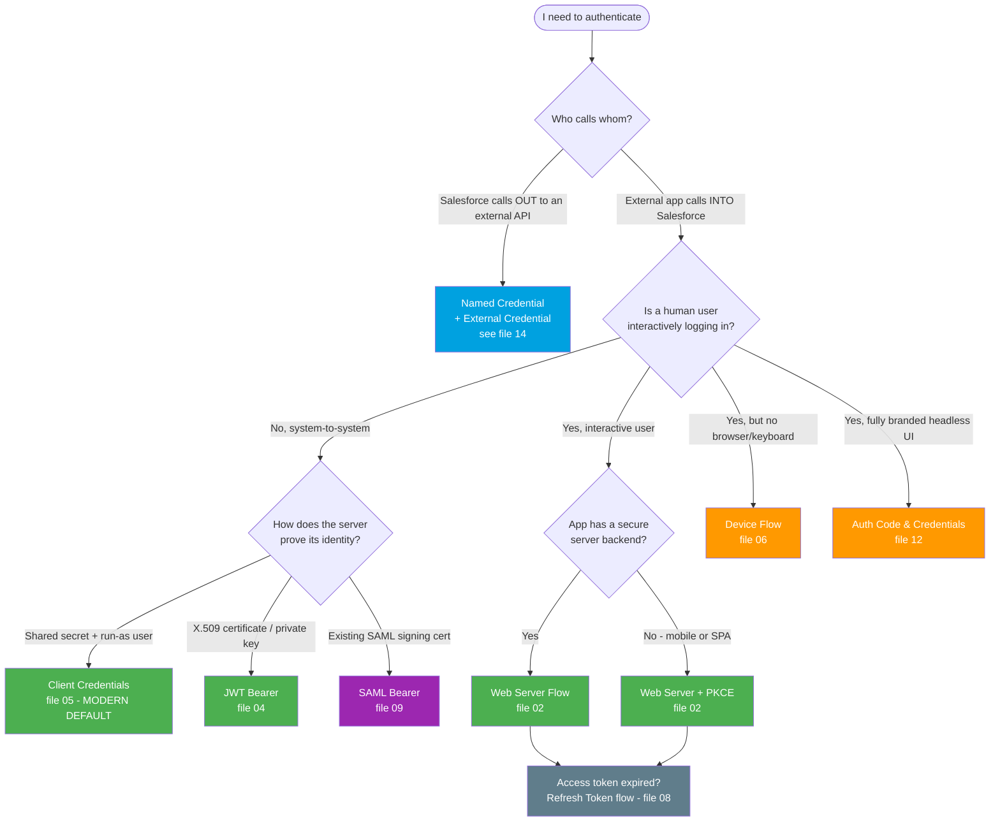

# Module 03 - Authentication (Slow Down Here)

> **Goal**: Stop being confused by OAuth. Pick the right flow without thinking, and be able to explain any of them to anyone.
> **API version**: v66.0 (Spring '26). **Login host**: always your **My Domain**.

This module is a complete, interview-ready reference for **Salesforce authentication**. Every OAuth flow gets its own file with a plain-English explanation, a Mermaid sequence diagram, real requests/responses, security pitfalls, and interview Q&A. Start with **[01-authentication-fundamentals.md](01-authentication-fundamentals.md)** — it defines the tokens, scopes, and endpoints that every other file builds on.

---

## How to use this module

1. Read **[01-authentication-fundamentals.md](01-authentication-fundamentals.md)** once. It is the spine.
2. Walk the flows in order (02 → 12), or jump to the one you need via the table below.
3. Read the four ecosystem files (13 → 17) — these are the *containers and surrounding plumbing* interviewers love to probe.
4. Use the **comparison table** and **decision tree** below as your pre-interview cram sheet, plus the one-pager in [../12-Cheatsheets/oauth-flows.md](../12-Cheatsheets/oauth-flows.md).

---

## Map of this module

| # | File | What it covers |
|---|---|---|
| 01 | [authentication-fundamentals](01-authentication-fundamentals.md) | AuthN vs AuthZ, the 5 roles, the 3 tokens, scopes, endpoints, My Domain, glossary |
| 02 | [web-server-flow](02-web-server-flow.md) | **Authorization Code + PKCE** — the gold standard for user login |
| 03 | [user-agent-flow](03-user-agent-flow.md) | Implicit-style browser flow (⚠️ legacy) |
| 04 | [jwt-bearer-flow](04-jwt-bearer-flow.md) | Certificate-signed JWT, server-to-server, CI/CD |
| 05 | [client-credentials-flow](05-client-credentials-flow.md) | **Modern server-to-server default** (run-as user + secret) |
| 06 | [device-flow](06-device-flow.md) | TVs, CLI, IoT — limited-input devices |
| 07 | [username-password-flow](07-username-password-flow.md) | ⛔ Deprecated/retiring — know it to migrate off it |
| 08 | [refresh-token-flow](08-refresh-token-flow.md) | Renew an expired access token silently |
| 09 | [saml-bearer-assertion-flow](09-saml-bearer-assertion-flow.md) | App self-signs a SAML assertion for a token |
| 10 | [saml-assertion-flow](10-saml-assertion-flow.md) | Reuse a web-SSO SAML response for API access |
| 11 | [asset-token-flow](11-asset-token-flow.md) | Bind an IoT device/asset to an identity (token exchange) |
| 12 | [authorization-code-and-credentials-flow](12-authorization-code-and-credentials-flow.md) | **Headless Identity** — fully branded customer login |
| 13 | [connected-apps-vs-external-client-apps](13-connected-apps-vs-external-client-apps.md) | The OAuth *container* — old vs next-gen |
| 14 | [named-credentials-and-external-credentials](14-named-credentials-and-external-credentials.md) | **Outbound** auth from Salesforce (never hardcode secrets) |
| 15 | [auth-providers](15-auth-providers.md) | Log in with Google/Microsoft/etc. into Salesforce |
| 16 | [sso-saml-and-openid-connect](16-sso-saml-and-openid-connect.md) | Single Sign-On: SAML 2.0 vs OpenID Connect |
| 17 | [session-security-and-token-management](17-session-security-and-token-management.md) | What happens after you get the token |

---

## The master comparison table (memorize this)

If you only revise one thing before the interview, revise this. **Direction** = who hosts the flow. **User?** = is a human interactively present. **Refresh?** = does it issue a refresh token.

| Flow | `grant_type` / `response_type` | Client type | User? | Refresh? | Use it when |
|---|---|---|:--:|:--:|---|
| **Web Server** (02) | `authorization_code` | Confidential (or public + PKCE) | ✅ | ✅ | Web app logs a user in. The default. |
| **User-Agent** (03) | `response_type=token` | Public | ✅ | optional | ⚠️ Legacy browser apps. Avoid — use Web Server + PKCE. |
| **JWT Bearer** (04) | `urn:...:jwt-bearer` | Confidential (cert) | ❌ | ❌ | Server-to-server with a certificate. CI/CD (`sf` CLI). |
| **Client Credentials** (05) | `client_credentials` | Confidential (secret) | ❌ | ❌ | ✅ Modern server-to-server default. Run-as integration user. |
| **Device** (06) | `device` (after `device_code`) | Public | ✅ (2nd screen) | ✅ | Smart TV, CLI, IoT — no browser/keyboard. |
| **Username-Password** (07) | `password` | Confidential | ✅ (raw creds) | ❌ | ⛔ Deprecated/retiring. Don't build on it. |
| **Refresh Token** (08) | `refresh_token` | Confidential/public | ❌ (renews) | reuses | Get a new access token when the old one expires. |
| **SAML Bearer** (09) | `urn:...:saml2-bearer` | Confidential (cert) | ❌ | ❌ | Server-to-server when you already run SAML. |
| **SAML Assertion** (10) | `assertion` (SSO browser) | n/a | ✅ (via SSO) | ❌ | API access right after a federated web SSO login. |
| **Asset Token** (11) | `urn:...:token-exchange` | Device | ❌ | n/a | Bind an IoT device/asset to a Salesforce identity. |
| **Auth Code & Credentials** (12) | `authorization_code` (headless) | Public + PKCE | ✅ | ✅ | Fully branded, headless customer login (Experience Cloud). |

**Outbound (Salesforce → external)** is a different question entirely: don't hand-code a flow, configure a **[Named Credential + External Credential](14-named-credentials-and-external-credentials.md)**.

---

## The decision tree — "which flow do I use?"

> **Two flows are missing on purpose.** **User-Agent** (03) and **Username-Password** (07) are legacy/retiring. If a question pushes you toward them, the correct answer is "use Web Server + PKCE or Client Credentials instead, here's why."

---

## What changed in 2025-2026 (sound current)

- **Username-Password flow is retiring** (blocked by default for orgs created Summer '23+, full retirement targeted **Winter '27**). Migrate to **Client Credentials** or **Web Server + PKCE**.
- **External Client Apps replace Connected Apps** — new Connected App creation is disabled by default starting **Spring '26** (rollout from Winter '26). Build new integrations on **ECAs**.
- **Client Credentials is the recommended server-to-server flow**, and **PKCE is recommended for all interactive flows**.
- **Device Flow was removed** from the auto-installed Data Loader connected app (**Sept 2, 2025**).

---

## Rapid-fire cross-flow interview questions

**Q: A backend job needs to sync data nightly, no user. Which flow?**
→ **Client Credentials** (05) if secret-based, or **JWT Bearer** (04) if certificate-based. Never Username-Password.

**Q: Which flows return a refresh token?**
→ User-context flows: **Web Server**, **Device**, **Auth Code & Credentials** (and User-Agent optionally). Machine flows (**JWT Bearer**, **Client Credentials**, **SAML Bearer**) do not — you just re-run them.

**Q: Salesforce needs to call an external REST API. What's the right pattern?**
→ **Named Credential + External Credential** (14). Never hardcode tokens in Apex.

**Q: What makes PKCE necessary?**
→ Public clients can't keep a secret, so an intercepted auth code could be redeemed by an attacker. PKCE binds the code to a one-time verifier. See [02](02-web-server-flow.md).

**Q: Connected App or External Client App for a new build in 2026?**
→ **External Client App** — Connected App creation is being disabled by default. See [13](13-connected-apps-vs-external-client-apps.md).

---

## Sources (Verified June 2026)

- [Authorize Apps with OAuth — Salesforce Help](https://help.salesforce.com/s/articleView?id=xcloud.remoteaccess_authenticate.htm&type=5)
- [OAuth Authorization Flows — Salesforce Help](https://help.salesforce.com/s/articleView?id=sf.remoteaccess_oauth_flows.htm&type=5)
- [External Client Apps and Connected Apps — Salesforce Help](https://help.salesforce.com/s/articleView?id=xcloud.external_integrations.htm&type=5)
- [Retirement of OAuth 2.0 Username-Password Flow — Release Notes](https://help.salesforce.com/s/articleView?id=release-notes.rn_security_unpw_flow_retirement.htm&type=5)

*Every per-file Sources section links the specific official doc for that flow.*
