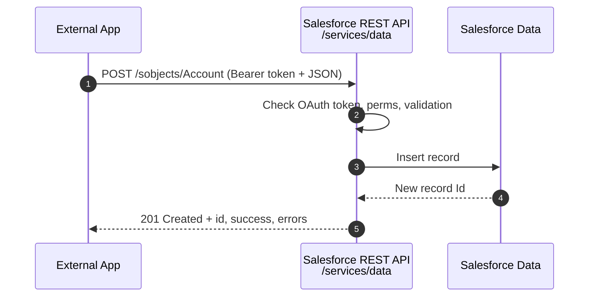

# 01 - Standard REST API

> **One-liner**: A ready-made HTTP API that lets an external system **create, read, update, delete, and query** Salesforce records, no Apex required.
> **Direction**: External → Salesforce (inbound). **Format**: JSON (XML optional). **Auth**: OAuth 2.0 Bearer token.
> **Use when**: An outside app needs standard **CRUD or SOQL** on existing objects. The default inbound API.

This is Module 04, inbound APIs (external systems calling into Salesforce). New to the vocabulary? See [Module 01](../01-Fundamentals/README.md). For how the caller authenticates, see [Module 03](../03-Authentication/README.md).

---

## 1. The idea in plain English

The Standard REST API is a **vending machine for your data**. Salesforce automatically exposes every object (standard and custom) through predictable HTTP URLs. An external app inserts the right "coins" (an OAuth token and a JSON body) and pulls out exactly what it asked for. You did not build the machine. Salesforce generated it for you the moment the object existed.

Because it is **auto-generated and resource-based**, you do not write or deploy anything. You point HTTP verbs (`GET`, `POST`, `PATCH`, `DELETE`) at object URLs and Salesforce does the rest, enforcing the calling user's permissions, validation rules, and sharing along the way.

---

## 2. When to use it (and when not)

| ✅ Use it when | ❌ Avoid / use something else |
|---|---|
| Standard **CRUD** or **SOQL** on existing objects. | You need **custom logic / a custom contract** → [03-apex-rest.md](03-apex-rest.md). |
| The caller is a **modern app** that speaks JSON. | Legacy partner that requires a **WSDL** → [02-standard-soap-api.md](02-standard-soap-api.md). |
| You want **zero code** on the Salesforce side. | **Many operations in one round-trip** → [05-composite-api.md](05-composite-api.md). |
| Single or small batches of records. | **Millions** of records → Bulk API 2.0 (Module 07). |

**Real-world examples**: a website posts a new Lead, a billing app patches an Account's status, a mobile app queries Contacts.

---

## 3. How it works (sequence diagram)



**Walkthrough**

1. The external app sends an HTTP request to a versioned endpoint with an **OAuth Bearer token**.
2. Salesforce validates the token, then the **running user's** permissions, FLS, and validation rules.
3. The operation hits the database.
4-5. Salesforce returns a status code and a JSON body (the new `id` on create, the record on read).

---

## 4. The actual requests

Base: `https://MyDomainName.my.salesforce.com/services/data/v66.0/`

| Action | Method + path |
|---|---|
| Create | `POST /sobjects/Account` |
| Read | `GET /sobjects/Account/{id}` |
| Update | `PATCH /sobjects/Account/{id}` |
| Delete | `DELETE /sobjects/Account/{id}` |
| Upsert by external id | `PATCH /sobjects/Account/External_Id__c/{value}` |
| Query (SOQL) | `GET /query/?q=SELECT+Id,Name+FROM+Account` |

**Create request**

```
POST /services/data/v66.0/sobjects/Account
Authorization: Bearer 00D...!AQ...
Content-Type: application/json

{ "Name": "Acme Corp", "Industry": "Technology" }
```

**Response**

```json
{ "id": "001bn00000ABCDeAAH", "success": true, "errors": [] }
```

> **Upsert is your friend**: `PATCH` on an **External Id** field creates or updates in one idempotent call, so retries do not create duplicates. This is the backbone of safe inbound integrations.

---

## 5. Design considerations and gotchas

| Consideration | Why it matters | What to do |
|---|---|---|
| **Authentication** | Every call needs a valid OAuth token. | Use a flow from [Module 03](../03-Authentication/README.md) (JWT Bearer or Client Credentials for server-to-server). |
| **API allocations** | Calls count against the org's 24-hour API limit. | Batch with [Composite](05-composite-api.md); avoid chatty per-record loops. |
| **Always version the URL** | `v66.0` pins behavior; omitting it breaks later. | Hardcode the version your client was tested on. |
| **Runs as the user** | The token's user governs permissions, FLS, sharing. | Give the integration user least-privilege access. |
| **Idempotency** | Network retries can double-insert. | Prefer **upsert by External Id**. |
| **No custom logic** | The API only does CRUD/query. | Need branching or orchestration? Use [Apex REST](03-apex-rest.md). |

---

## 6. Interview Q&A

**Q: What is the Standard REST API?**
A: An auto-generated, resource-based HTTP API for CRUD and SOQL on Salesforce objects, using standard verbs and JSON, authenticated with OAuth. No code to deploy.

**Q: REST API vs Apex REST?**
A: Standard REST is built-in CRUD/query on objects. Apex REST is a **custom endpoint** you write with `@RestResource` when you need business logic or a tailored request/response shape.

**Q: How do you avoid duplicates on inbound creates?**
A: Use **upsert by External Id** (`PATCH /sobjects/Object/ExtId__c/value`). It is idempotent, so a retried call updates instead of inserting a duplicate.

**Q: How do you reduce API call counts?**
A: Bundle operations with the **Composite API** (or sObject Collections), and use Bulk API 2.0 for very large volumes.

**Q: Whose permissions apply on an inbound call?**
A: The user tied to the OAuth token. Salesforce enforces that user's profile, permission sets, FLS, sharing, and validation rules.

**Talking point to explain it to anyone**: "Salesforce hands every object a standard set of web URLs. Apps read and write records through those URLs with a token, and Salesforce checks the rules each time."

---

## 7. Key terms

REST, endpoint, OAuth Bearer token, SOQL, upsert, External Id, API allocation - defined in [Module 01 vocabulary](../01-Fundamentals/02-core-vocabulary.md) and the [README](README.md).

---

## Sources (Verified June 2026)

- [REST API Developer Guide (v66.0) — Salesforce Developers](https://developer.salesforce.com/docs/atlas.en-us.api_rest.meta/api_rest/intro_what_is_rest_api.htm)
- [Work with Records — REST API Developer Guide](https://developer.salesforce.com/docs/atlas.en-us.api_rest.meta/api_rest/dome_sobject_rows.htm)
- [Execute a SOQL Query — REST API Developer Guide](https://developer.salesforce.com/docs/atlas.en-us.api_rest.meta/api_rest/dome_query.htm)

---

*Next: [02-standard-soap-api.md](02-standard-soap-api.md) - the older WSDL-based API and the login() retirement.*
