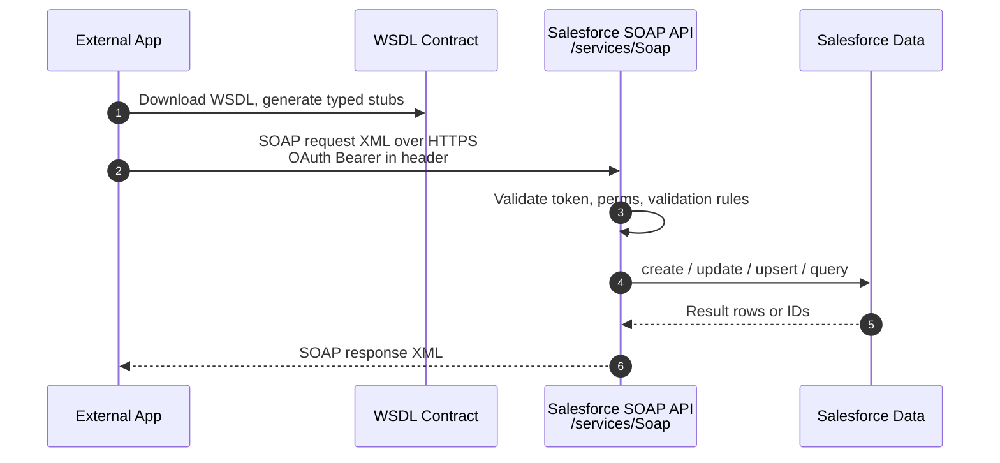

# 02 - Standard SOAP API

> **One-liner**: The original **WSDL-based, XML-over-HTTPS** API that lets an external system do CRUD and SOQL against Salesforce with a strongly-typed contract.
> **Direction**: External → Salesforce (inbound). **Format**: XML (SOAP envelope). **Auth**: OAuth 2.0 Bearer token (legacy `login()` is retiring).
> **Use when**: A legacy partner or tool **requires a WSDL** or a strongly-typed contract. Otherwise prefer [01-standard-rest-api.md](01-standard-rest-api.md).

This is Module 04, inbound APIs (external systems calling into Salesforce). New to the vocabulary? See [Module 01](../01-Fundamentals/README.md). For how the caller authenticates, see [Module 03](../03-Authentication/README.md).

---

## 1. The idea in plain English

If the REST API is a vending machine, the SOAP API is a **formal contract with a notary**. Before you can talk to Salesforce, you download a **WSDL** (a machine-readable rulebook). Your tooling reads it and generates strongly-typed classes, so every field, type, and operation is fixed and validated up front. You then exchange **XML envelopes** over HTTPS instead of light JSON.

This formality is the point. Older enterprise platforms, integration middleware, and partner tools were built around WSDLs and strict typing. SOAP API gives them a stable, predictable, **typed** door into Salesforce. It is **mature and fully supported**, but it is no longer the modern default. New integrations should reach for REST first.

There are two flavors of WSDL, and choosing the right one is the first real decision.

| WSDL | Typing | Scope | Best for |
|---|---|---|---|
| **Enterprise WSDL** | **Strongly typed** | **Org-specific** (mirrors your exact objects and fields) | A tool integrating with **one** org that wants compile-time type safety. |
| **Partner WSDL** | **Loosely typed** (generic name/value) | **Generic** (works across any org) | A tool (ISV, middleware) integrating with **many** orgs with different schemas. |

The Enterprise WSDL changes whenever your schema changes, so you re-download it after metadata edits. The Partner WSDL stays generic, so a multi-org product consumes it **once per version**.

---

## 2. When to use it (and when not)

| ✅ Use it when | ❌ Avoid / use something else |
|---|---|
| A **legacy partner or middleware requires a WSDL**. | A modern app that speaks JSON → [01-standard-rest-api.md](01-standard-rest-api.md). |
| You want a **strongly-typed, contract-first** integration. | You need **custom logic or a tailored contract** → [03-apex-rest.md](03-apex-rest.md). |
| The tool already has **generated SOAP stubs** you must reuse. | **Many operations in one round-trip** → [05-composite-api.md](05-composite-api.md). |
| An ISV product must run **generically across many orgs** (Partner WSDL). | **Millions** of records → Bulk API 2.0 (Module 07). |

**Real-world examples**: an on-prem ERP that only speaks SOAP upserting Accounts, a legacy MDM tool syncing Contacts via the Enterprise WSDL, an ISV data-quality product using the Partner WSDL across its customer base.

---

## 3. How it works (sequence diagram)



**Walkthrough**

1. The external tool downloads the **WSDL** (Enterprise or Partner) and generates typed client code from it once.
2. It sends a **SOAP XML envelope** over HTTPS to the org endpoint, carrying an **OAuth access token** for authentication.
3. Salesforce validates the token, then the **running user's** permissions, FLS, sharing, and validation rules.
4. The core operation runs against the database.
5. Salesforce returns a **SOAP XML response** with result rows, IDs, success flags, and any errors.

---

## 4. The actual requests

**Endpoints** (My Domain host, versioned). The path segment encodes the WSDL type:

| WSDL | Endpoint path | Example |
|---|---|---|
| **Enterprise** | `/services/Soap/c/` | `https://MyDomainName.my.salesforce.com/services/Soap/c/66.0` |
| **Partner** | `/services/Soap/u/` | `https://MyDomainName.my.salesforce.com/services/Soap/u/66.0` |

Memory hook: **c** = **c**ustomer/enterprise (your schema), **u** = **u**niversal/partner (generic).

**Core operations** (the typed equivalents of CRUD + SOQL):

| Operation | What it does |
|---|---|
| `create()` | Insert one or more records. |
| `retrieve()` | Fetch records by ID for given fields. |
| `update()` | Update existing records. |
| `upsert()` | Create or update by **External Id** (idempotent). |
| `delete()` | Delete records by ID. |
| `query()` | Run a SOQL query, returns the first batch. |
| `queryMore()` | Page through the **next batch** using the `queryLocator` cursor. |

**Sample SOAP request** (modern auth: OAuth access token in the `SessionHeader`, no `login()` call):

```xml
POST /services/Soap/c/66.0 HTTP/1.1
Host: MyDomainName.my.salesforce.com
Content-Type: text/xml; charset=UTF-8
SOAPAction: ""

<soapenv:Envelope xmlns:soapenv="http://schemas.xmlsoap.org/soap/envelope/"
                  xmlns:urn="urn:enterprise.soap.sforce.com">
  <soapenv:Header>
    <urn:SessionHeader><urn:sessionId>00D...!AQ...</urn:sessionId></urn:SessionHeader>
  </soapenv:Header>
  <soapenv:Body>
    <urn:create>
      <urn:sObjects xsi:type="urn:Account" xmlns:xsi="http://www.w3.org/2001/XMLSchema-instance">
        <Name>Acme Corp</Name>
        <Industry>Technology</Industry>
      </urn:sObjects>
    </urn:create>
  </soapenv:Body>
</soapenv:Envelope>
```

**Response (trimmed)**: a `createResponse` with a `result` containing `id`, `success`, and any `errors`. Same data as REST, wrapped in XML.

> **The `sessionId` is just your OAuth access token.** Get it from a modern OAuth flow (see section 5), then place it in `SessionHeader`. You do **not** need the old `login()` call.

---

## 5. Design considerations and gotchas

The single most important current fact lives in the first row. Read it carefully.

| Consideration | Why it matters | What to do |
|---|---|---|
| **`login()` is retiring** | SOAP API **`login()`** in versions **31.0-64.0** is being **retired in Summer '27**. It is **not available in API v65.0+**, and it is **disabled by default in newly created orgs**. From **Summer '26**, in new orgs a user needs the new **"Use Any API Auth"** permission to authenticate via `login()`. | **Migrate API authentication to OAuth** via **External Client Apps**: Web Server, **JWT Bearer**, or **Client Credentials** flow. Pass the OAuth access token as the `sessionId`. Do not build new integrations on `login()`. |
| **Enterprise WSDL drifts** | It mirrors your exact schema, so adding a field changes the contract. | Re-download the WSDL and regenerate stubs after metadata changes. |
| **Partner WSDL is generic** | No object/field types, so you handle name/value pairs yourself. | Use it for multi-org tools. Accept the extra mapping code as the cost of portability. |
| **Verbose XML payloads** | SOAP envelopes are larger and slower to parse than JSON. | Prefer REST for new, chatty, or mobile clients. Reserve SOAP for legacy contracts. |
| **API allocations** | Calls count against the org's 24-hour API limit, like REST. | Batch records per call. Use `queryMore()` to page instead of huge single pulls. |
| **Runs as the user** | The token's user governs permissions, FLS, and sharing. | Give the integration user least-privilege access. |
| **Idempotency** | A retried `create()` double-inserts. | Prefer **`upsert()` by External Id**. |

---

## 6. Interview Q&A

**Q: What is the SOAP API and how does it differ from REST?**
A: The SOAP API is the original **WSDL-based, strongly-typed, XML-over-HTTPS** API for CRUD and SOQL. REST is lighter, resource-based, and uses JSON. Both do the same core work, but REST is the modern default. SOAP is for legacy or contract-first integrations.

**Q: Enterprise WSDL vs Partner WSDL?**
A: **Enterprise** is **strongly typed and org-specific**. It mirrors your exact objects and fields, ideal for a single-org integration that wants type safety. **Partner** is **loosely typed and generic**, ideal for ISV or middleware tools that must work across many orgs with different schemas.

**Q: What is happening to SOAP API `login()`?**
A: It is **retiring in Summer '27** for versions 31.0-64.0, is **gone in v65.0+**, and is **off by default in new orgs**. From **Summer '26**, new orgs require the **"Use Any API Auth"** permission to use it. The fix is to authenticate with **OAuth** through **External Client Apps** (Web Server, JWT Bearer, or Client Credentials) and pass that token as the session ID.

**Q: How do you authenticate a SOAP call without `login()`?**
A: Obtain an **OAuth access token** from a server-to-server flow (JWT Bearer or Client Credentials), then put it in the SOAP `SessionHeader` as the `sessionId`. The SOAP operations work unchanged.

**Q: What are `query()` and `queryMore()`?**
A: `query()` runs a SOQL statement and returns the **first batch** of rows plus a `queryLocator` cursor. `queryMore()` uses that cursor to fetch **subsequent batches**, which is how you page through large result sets in SOAP.

**Talking point to explain it to anyone**: "SOAP is the old, formal way in. You download a rulebook called a WSDL, your code learns the exact shapes, and you exchange strict XML. It still works, but the modern door is REST, and the old password-style login is being switched off."

---

## 7. Key terms

WSDL, SOAP, Enterprise WSDL, Partner WSDL, XML envelope, `queryLocator`, upsert, External Id, OAuth Bearer token, External Client App - defined in [Module 01 vocabulary](../01-Fundamentals/02-core-vocabulary.md) and the [README](README.md). For OAuth flows, see [Module 03](../03-Authentication/README.md).

---

## Sources (Verified June 2026)

- [SOAP API Developer Guide (v66.0) - Salesforce Developers](https://developer.salesforce.com/docs/atlas.en-us.api.meta/api/sforce_api_quickstart_intro.htm)
- [Using the Partner WSDL - SOAP API Developer Guide](https://developer.salesforce.com/docs/atlas.en-us.api.meta/api/sforce_api_partner.htm)
- [SOAP API login() Call in Versions 31.0 Through 64.0 Is Being Retired (Release Update)](https://help.salesforce.com/s/articleView?id=release-notes.rn_api_upcoming_retirement_258rn.htm&language=en_US&type=5)
- [Platform SOAP API login() Retirement - Salesforce Help](https://help.salesforce.com/s/articleView?language=en_US&id=005132110&type=1)
- [SOAP API End-of-Life Policy - SOAP API Developer Guide](https://developer.salesforce.com/docs/atlas.en-us.api.meta/api/api_eol_soap.htm)

---

*Next: [03-apex-rest.md](03-apex-rest.md) - building your own custom REST endpoints in Apex.*
