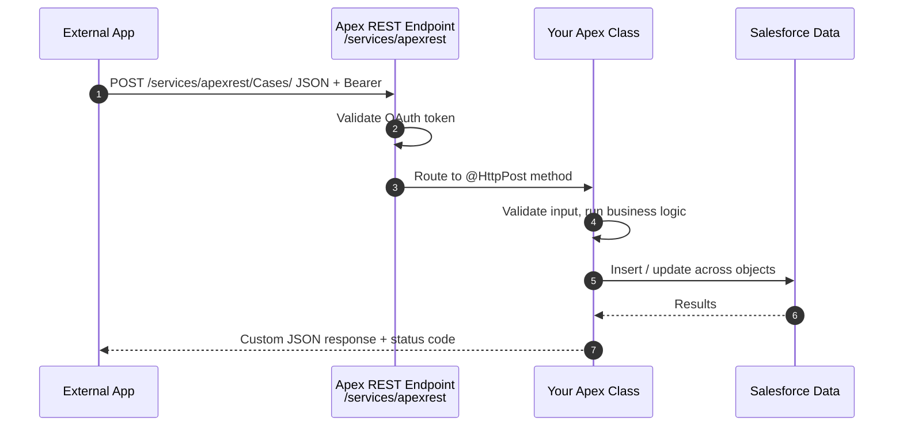

# 03 - Apex REST

> **One-liner**: A **custom REST endpoint you write in Apex** when the standard API can't give you the business logic, validation, or contract you need.
> **Direction**: External → Salesforce (inbound). **Format**: JSON (you control the shape). **Auth**: OAuth 2.0 Bearer token.
> **Use when**: You need **custom logic, orchestration, validation, or a tailored request/response** that the [Standard REST API](01-standard-rest-api.md) cannot express.

This is Module 04, inbound APIs (external systems calling into Salesforce). New to the vocabulary? See [Module 01](../01-Fundamentals/README.md). For how the caller authenticates, see [Module 03](../03-Authentication/README.md).

---

## 1. The idea in plain English

The Standard REST API is a vending machine: predictable, but it only dispenses standard CRUD. **Apex REST is your own custom counter** where you decide exactly what goes in and what comes out. You write an Apex class, label it as a REST resource, and Salesforce publishes it at a URL you choose.

Behind that URL you can do anything Apex can do: validate the payload, touch several objects in one call, run business rules, shape a clean response that hides your internal data model. The caller still sends plain JSON with an OAuth token. They never see the Apex. They just see a tidy API that does precisely the job you designed.

In short: reach for Apex REST when the answer to "can the standard API do this?" is no, because you need **logic or a contract** the generic API can't provide.

---

## 2. When to use it (and when not)

| ✅ Use it when | ❌ Avoid / use something else |
|---|---|
| You need **custom business logic or validation** on inbound calls. | Plain CRUD or SOQL on objects → [01-standard-rest-api.md](01-standard-rest-api.md). |
| You want a **tailored request/response contract** that hides internals. | A legacy SOAP consumer needs a WSDL → [04-apex-soap-web-services.md](04-apex-soap-web-services.md). |
| One call must **orchestrate several objects or steps**. | Generic bundling of standard calls → [05-composite-api.md](05-composite-api.md). |
| You want to expose **only a narrow, purpose-built surface**. | **Millions** of records → Bulk API 2.0 (Module 07). |

**Real-world examples**: a partner posts an order that creates an Account, Contact, and Opportunity in one validated call; a "submit application" endpoint that runs eligibility logic; a mobile app fetching a custom-shaped dashboard payload that a single SOQL can't build.

---

## 3. How it works (sequence diagram)



**Walkthrough**

1. The external app sends an HTTP request with a JSON body and an **OAuth Bearer token** to your `/services/apexrest/...` URL.
2. Salesforce validates the token, then routes the request based on the **HTTP verb** to the matching annotated method.
3. Your Apex method reads the request via `RestContext.request`, **validates and applies business logic**.
4. It performs DML, possibly across several objects, as one transaction.
5. It returns an Apex object (auto-serialized to JSON) or writes a custom body and status code to `RestContext.response`.

---

## 4. The actual code

**Base path**: `https://MyDomainName.my.salesforce.com/services/apexrest/` + your `urlMapping`.

A class becomes an Apex REST resource when it is **global** and annotated with **`@RestResource`** carrying a `urlMapping`. Methods are mapped to HTTP verbs with annotations:

| Annotation | HTTP verb | Typical use |
|---|---|---|
| `@HttpGet` | GET | Read / fetch a custom payload. |
| `@HttpPost` | POST | Create, or run an action. |
| `@HttpPatch` | PATCH | Partial update / upsert. |
| `@HttpPut` | PUT | Full update / replace. |
| `@HttpDelete` | DELETE | Delete. |

**Sample class** (custom contract over Case, with sharing enforced for the running user):

```apex
@RestResource(urlMapping='/Cases/*')
global with sharing class CaseResource {

    // GET /services/apexrest/Cases/{caseId}
    @HttpGet
    global static Case getCase() {
        RestRequest req = RestContext.request;
        String caseId = req.requestURI.substringAfterLast('/');
        return [SELECT Id, Subject, Status, Priority
                FROM Case WHERE Id = :caseId];
    }

    // POST /services/apexrest/Cases/  with JSON body
    @HttpPost
    global static String createCase(String subject, String priority) {
        if (String.isBlank(subject)) {
            RestContext.response.statusCode = 400;       // custom status
            return 'Subject is required';
        }
        Case c = new Case(Subject = subject, Priority = priority, Origin = 'API');
        insert c;                                         // business logic + DML
        RestContext.response.statusCode = 201;
        return c.Id;                                      // auto-serialized to JSON
    }
}
```

**Request**

```
POST /services/apexrest/Cases/
Authorization: Bearer 00D...!AQ...
Content-Type: application/json

{ "subject": "Login broken", "priority": "High" }
```

**Response**: `201` with the new Case Id as a JSON string. Notice the caller never sees a raw `Case` insert. They see your contract.

> **Auto-serialization**: return an Apex object (sObject, custom class, or list) and Salesforce serializes it to JSON for you. Method parameters are auto-deserialized from the JSON body by name. For full control over headers, body, and status, write to `RestContext.response` directly.

---

## 5. Design considerations and gotchas

| Consideration | Why it matters | What to do |
|---|---|---|
| **Runs in system context** | An Apex REST method executes in **system context**: object permissions, **FLS, and sharing are NOT enforced automatically**, regardless of the calling user. This is a real security trap. | Add **`with sharing`** and **enforce FLS/CRUD explicitly** (e.g. `WITH USER_MODE`, `Security.stripInaccessible`, or `Schema` checks). Put business logic in a `with sharing` class and call it from the resource. |
| **One method per verb** | A class can have **only one** method per HTTP verb (one `@HttpGet`, one `@HttpPost`, etc.). | Branch inside the method on the URI or body. Split distinct resources into separate classes with their own `urlMapping`. |
| **Must be `global`** | The class and its annotated methods must be `global` and `static` to be reachable. | Declare the class `global`; declare each annotated method `global static`. |
| **Counts against API limits** | Every call consumes the org's 24-hour API allocation, like the standard API. | Design coarse-grained endpoints. Avoid making clients call in tight loops. |
| **Governor limits apply** | Your Apex runs under normal **governor limits** (SOQL, DML, CPU). | Bulkify. One call should not do per-record DML in a loop. |
| **Expose only what you need** | A custom endpoint is attack surface. | Return the minimum fields. Validate every input. Keep the contract narrow. |
| **Authentication** | Every call needs a valid OAuth token. | Use a flow from [Module 03](../03-Authentication/README.md) (JWT Bearer or Client Credentials for server-to-server). |

---

## 6. Interview Q&A

**Q: What is Apex REST and when do you use it over the Standard REST API?**
A: Apex REST is a **custom REST endpoint** you build with `@RestResource` on a global class. Use it when you need **business logic, validation, multi-object orchestration, or a tailored contract**. The Standard REST API only does generic CRUD and SOQL.

**Q: How do you define an Apex REST resource?**
A: Create a **global** class annotated with `@RestResource(urlMapping='/path/*')`, then add `global static` methods annotated with `@HttpGet`, `@HttpPost`, `@HttpPatch`, `@HttpPut`, or `@HttpDelete`. It is published under `/services/apexrest/`.

**Q: In what context does an Apex REST method run? Why does that matter?**
A: It runs in **system context**, so object permissions, FLS, and sharing are **not enforced by default**, even though the request is authenticated as a specific user. You must add `with sharing` and enforce FLS/CRUD explicitly (user mode, `stripInaccessible`, or `Schema` checks) to avoid exposing data the user shouldn't see.

**Q: How many methods per HTTP verb can a class have?**
A: Exactly **one** per verb. If you need multiple behaviors for the same verb, branch on the URI or payload inside that method, or split into separate resource classes.

**Q: How do request and response bodies work?**
A: Read the incoming request via `RestContext.request` (or let parameters auto-deserialize from JSON). Return an Apex object and Salesforce auto-serializes it to JSON, or write to `RestContext.response` for full control over status code, headers, and body.

**Talking point to explain it to anyone**: "It's a door I build myself. The standard API only does generic CRUD, so when I need real logic or a clean custom shape, I write a little Apex class, give it a web address, and outsiders call it with a token."

---

## 7. Key terms

`@RestResource`, `urlMapping`, `@HttpGet`/`@HttpPost`/`@HttpPatch`/`@HttpPut`/`@HttpDelete`, `RestContext`, system context, `with sharing`, FLS, OAuth Bearer token - defined in [Module 01 vocabulary](../01-Fundamentals/02-core-vocabulary.md) and the [README](README.md). For OAuth flows, see [Module 03](../03-Authentication/README.md).

---

## Sources (Verified June 2026)

- [Apex REST Methods - Apex Developer Guide (v66.0)](https://developer.salesforce.com/docs/atlas.en-us.apexcode.meta/apexcode/apex_rest_methods.htm)
- [RestResource Annotation - Apex Developer Guide](https://developer.salesforce.com/docs/atlas.en-us.apexcode.meta/apexcode/apex_classes_annotation_rest_resource.htm)
- [Apex REST Basic Code Sample - Apex Developer Guide](https://developer.salesforce.com/docs/atlas.en-us.apexcode.meta/apexcode/apex_rest_code_sample_basic.htm)
- [RestContext Class - Apex Reference Guide](https://developer.salesforce.com/docs/atlas.en-us.apexref.meta/apexref/apex_methods_system_restcontext.htm)
- [Writing Apex REST Services and When Not To - Salesforce Developers Blog](https://developer.salesforce.com/blogs/2022/08/writing-apex-rest-services-and-when-not-to)

---

*Next: [04-apex-soap-web-services.md](04-apex-soap-web-services.md) - custom SOAP endpoints in Apex for legacy consumers.*
