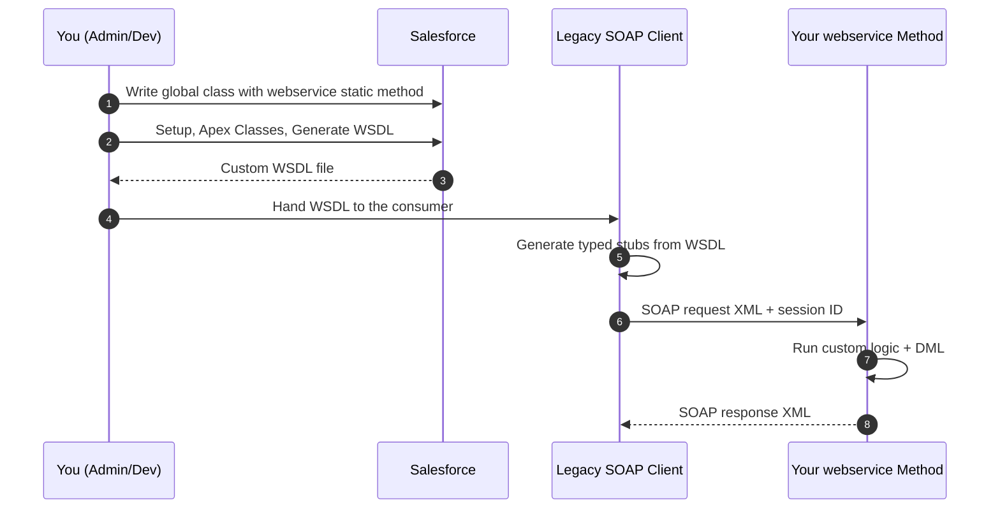

# 04 - Apex SOAP Web Services

> **One-liner**: A **custom SOAP endpoint you write in Apex** by adding the `webservice` keyword. Salesforce generates a WSDL for it so legacy SOAP clients can call your logic.
> **Direction**: External → Salesforce (inbound). **Format**: XML (SOAP). **Auth**: OAuth 2.0 Bearer token (session ID).
> **Use when**: A **legacy SOAP consumer** needs to call **custom Apex logic** and must have a WSDL. For new custom services, prefer [03-apex-rest.md](03-apex-rest.md).

This is Module 04, inbound APIs (external systems calling into Salesforce). New to the vocabulary? See [Module 01](../01-Fundamentals/README.md). For how the caller authenticates, see [Module 03](../03-Authentication/README.md).

---

## 1. The idea in plain English

This is the SOAP cousin of [Apex REST](03-apex-rest.md). You still write a custom Apex method that does whatever you need, but instead of exposing it as a JSON REST endpoint, you expose it as a **SOAP service**. You mark a method with the **`webservice`** keyword, and Salesforce **generates a WSDL** from your class. A legacy SOAP client downloads that WSDL, generates typed stubs, and calls your method with XML envelopes.

Think of it as **publishing a custom function in the formal, contract-first language** that older enterprise systems already speak. The standard SOAP API ([02-standard-soap-api.md](02-standard-soap-api.md)) only gives them generic CRUD. This lets them call **your** business logic the same WSDL way.

It works and is fully supported, but it is the **older approach for custom services**. For anything new, **Apex REST is preferred** because it is lighter, simpler to consume, and easier to evolve. Reach for Apex SOAP only when a consumer genuinely requires SOAP.

---

## 2. When to use it (and when not)

| ✅ Use it when | ❌ Avoid / use something else |
|---|---|
| A **legacy SOAP client** must call **custom Apex logic** and needs a WSDL. | Building a **new** custom service → [03-apex-rest.md](03-apex-rest.md) (preferred). |
| The consumer's tooling is **contract-first / strongly typed** and SOAP-only. | The consumer only needs **standard CRUD** over SOAP → [02-standard-soap-api.md](02-standard-soap-api.md). |
| You must match an **existing SOAP integration contract**. | A modern JSON client → [01-standard-rest-api.md](01-standard-rest-api.md). |
| | **Bulk** or **many operations** → Bulk API 2.0 / [Composite](05-composite-api.md). |

**Real-world examples**: an on-prem billing platform that only generates SOAP stubs calling a custom `chargeAccount()` method; a legacy middleware flow that must invoke a multi-step Apex routine through a WSDL it already manages.

---

## 3. How it works (sequence diagram)



**Walkthrough**

1. You write a **global** Apex class with one or more **`webservice static`** methods containing your logic.
2. In Setup you open the class and click **Generate WSDL**. Salesforce produces a WSDL describing your method.
3. You hand the WSDL to the external consumer, who generates typed client stubs from it.
4. The client sends a **SOAP XML request** with an **OAuth access token** as the session ID.
5. Your method runs (custom logic plus DML) and returns a **SOAP XML response**.

---

## 4. The actual code

**Endpoint**: custom Apex SOAP services are published under `/services/Soap/class/{ClassName}`, e.g. `https://MyDomainName.my.salesforce.com/services/Soap/class/AccountManager`.

**The `webservice` keyword rules** (this is the exam-favorite part):

- The method must use **`webservice`** and must be **`static`**.
- Methods with `webservice` are **inherently global**, so the **enclosing class must be `global`**.
- You **cannot** apply `webservice` to a **class** itself, only to **methods** and **member variables**.
- It is valid on **top-level (outer) class** methods and variables, and on **inner class** member variables.

**Sample class**:

```apex
global class AccountManager {

    // Inner class members exposed in the generated WSDL
    global class AccountResult {
        webservice String accountId;
        webservice String message;
    }

    // Becomes a SOAP operation in the generated WSDL
    webservice static AccountResult createAccount(String name, String industry) {
        AccountResult r = new AccountResult();
        Account a = new Account(Name = name, Industry = industry);
        insert a;                       // your custom logic + DML
        r.accountId = a.Id;
        r.message = 'Created';
        return r;
    }
}
```

After saving, go to **Setup, Apex Classes, open `AccountManager`, Generate WSDL**. Salesforce builds a WSDL exposing `createAccount` as a typed SOAP operation, with `AccountResult` as a complex type. The consumer imports it and calls the operation with a SOAP envelope, passing the **OAuth access token** as the `sessionId` in the SOAP header (same auth model as the [Standard SOAP API](02-standard-soap-api.md)).

> **Two WSDLs, do not confuse them.** The **Enterprise/Partner WSDL** (Module 04-02) describes the **standard** API. The WSDL you generate here describes **only your custom class**. A consumer of your method needs *your* WSDL.

---

## 5. Design considerations and gotchas

| Consideration | Why it matters | What to do |
|---|---|---|
| **Apex REST is preferred** | Apex SOAP is the **older** model for custom services. SOAP is heavier and harder to evolve. | Default to [Apex REST](03-apex-rest.md) for new work. Use Apex SOAP only for SOAP-only consumers. |
| **Generate the WSDL in Setup** | Consumers need the WSDL, and it changes when your method signatures change. | After signature changes, **regenerate** the WSDL and re-share it so stubs stay in sync. |
| **Type restrictions on `webservice` methods** | Not every Apex type is allowed as a `webservice` parameter or return (e.g. maps, certain collections and types are restricted). | Use supported types (primitives, sObjects, and lists of them, simple custom classes). Keep signatures simple. |
| **`webservice` keyword placement** | Must be on a **static method in a global class**, or a member variable. It cannot decorate a class. | Make the class `global`, methods `webservice static`. Expose fields with `webservice` on members. |
| **Runs as the user** | The session ID's user governs permissions, FLS, and sharing for the request. | Use a least-privilege integration user. Still enforce sharing/FLS in your logic where needed. |
| **Authentication** | The session ID is an **OAuth access token**. Legacy `login()` is retiring (see 04-02). | Authenticate with **OAuth** (JWT Bearer or Client Credentials) via External Client Apps. See [Module 03](../03-Authentication/README.md). |
| **Counts against API limits + governor limits** | Calls consume the org's API allocation and run under Apex governor limits. | Design coarse, bulk-safe operations. |

---

## 6. Interview Q&A

**Q: What is an Apex SOAP web service?**
A: A custom Apex method exposed as a **SOAP operation** by adding the **`webservice`** keyword. Salesforce **generates a WSDL** for the class so legacy SOAP clients can call your custom logic with XML, under `/services/Soap/class/`.

**Q: What are the rules for the `webservice` keyword?**
A: The method must be **`static`** and marked **`webservice`**, which makes it inherently **global**, so the **class must be `global`**. You **cannot** put `webservice` on a class, only on methods and member variables. It works on outer-class methods/variables and inner-class members.

**Q: How is this different from the standard SOAP API?**
A: The **standard** SOAP API gives generic CRUD/SOQL via the **Enterprise/Partner WSDL**. An **Apex SOAP web service** exposes **your custom logic** via a **WSDL you generate** from your own class.

**Q: Apex SOAP or Apex REST for a new custom service?**
A: **Apex REST**, almost always. It is lighter, JSON-based, and easier to consume and evolve. Use Apex SOAP only when the consumer is **SOAP-only** or must match an existing SOAP contract.

**Q: How does a consumer get and use the service?**
A: You click **Generate WSDL** on the class in Setup, hand them the WSDL, they generate typed stubs, then call the operation with a SOAP envelope, passing an **OAuth access token** as the session ID.

**Talking point to explain it to anyone**: "Same idea as a custom REST endpoint, but in the older, formal SOAP language. I tag a method with one keyword, Salesforce writes a rulebook (a WSDL) for it, and a legacy system uses that rulebook to call my code."

---

## 7. Key terms

`webservice` keyword, global class, Generate WSDL, SOAP, session ID, complex type, inner class members, OAuth Bearer token - defined in [Module 01 vocabulary](../01-Fundamentals/02-core-vocabulary.md) and the [README](README.md). For OAuth flows, see [Module 03](../03-Authentication/README.md).

---

## Sources (Verified June 2026)

- [Exposing Apex Methods as SOAP Web Services - Apex Developer Guide (v66.0)](https://developer.salesforce.com/docs/atlas.en-us.apexcode.meta/apexcode/apex_web_services.htm)
- [Webservice Methods - Apex Developer Guide](https://developer.salesforce.com/docs/atlas.en-us.apexcode.meta/apexcode/apex_web_services_methods.htm)
- [Considerations for Using the webservice Keyword - Apex Developer Guide](https://developer.salesforce.com/docs/atlas.en-us.apexcode.meta/apexcode/apex_web_services_methods_considerations.htm)
- [SOAP API End-of-Life Policy - SOAP API Developer Guide](https://developer.salesforce.com/docs/atlas.en-us.api.meta/api/api_eol_soap.htm)

---

*Next: [05-composite-api.md](05-composite-api.md) - bundling many operations into one round-trip.*
