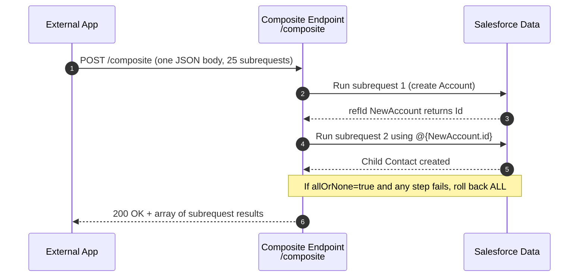

# 05 - Composite API

> **One-liner**: Bundle **many** Salesforce operations into **one** HTTP round-trip, optionally chaining and rolling them back as a single transaction.
> **Direction**: External → Salesforce (inbound). **Format**: JSON. **Auth**: OAuth 2.0 Bearer token.
> **Use when**: You would otherwise make several Standard REST calls that are related, dependent, or should succeed or fail together.

This is Module 04, inbound APIs (external systems calling into Salesforce). New to the vocabulary? See [Module 01](../01-Fundamentals/README.md). For how the caller authenticates, see [Module 03](../03-Authentication/README.md). This builds on [01-standard-rest-api.md](01-standard-rest-api.md).

---

## 1. The idea in plain English

The Standard REST API is a vending machine: one coin, one snack. The Composite API is a **food court order on a single tray**. You write down everything you want, hand it over once, and the kitchen prepares it all in one trip. You can even say "use the table number from my first order for my second order" (chaining), or "if any one dish is out of stock, cancel the whole tray" (all-or-none).

In Salesforce terms: instead of firing five separate HTTP requests (each costing a network round-trip and an API call), you send **one** request whose body contains a list of **subrequests**. Salesforce runs them in order and returns one combined response. The headline win is fewer round-trips, fewer API calls, and the option to treat the whole bundle as a single transaction.

---

## 2. When to use it (and when not)

| ✅ Use it when | ❌ Avoid / use something else |
|---|---|
| Several related calls that should be **one network trip**. | A single CRUD or SOQL call → [01-standard-rest-api.md](01-standard-rest-api.md). |
| One call **depends on** the result of another (chaining). | Operations are unrelated and order does not matter → Composite **Batch**. |
| You want **all-or-none** transactional behavior. | **Millions** of records → Bulk API 2.0 (Module 07). |
| Create a parent **and its children** in one shot. | You need custom orchestration logic → [03-apex-rest.md](03-apex-rest.md). |

**Real-world examples**: create an **Account plus its Contacts and an Opportunity** atomically, look up a record then update a related one using the returned Id, or insert 200 order lines in a single nested payload.

---

## 3. The family at a glance

Four resources live under `/services/data/v66.0/composite/`. Pick by **chaining** and **volume**.

| Resource | Max work per call | Chaining? | Transaction | Best for |
|---|---|---|---|---|
| **Composite** | **Up to 25 subrequests** | ✅ Yes, `@{refId.field}` | Optional `allOrNone` | Dependent, mixed operations in order |
| **Composite Batch** | **Up to 25 subrequests** | ❌ No | Each independent | Unrelated calls, one round-trip |
| **sObject Tree** | **Up to 200 records** total | Implicit by nesting | Always all-or-none | One parent with nested children |
| **Composite Graph** | **Up to 500 records** per request | ✅ Yes, across graphs | Each **graph** is atomic | Large, related, multi-graph loads |

---

## 4. How it works (the Composite resource)



**Walkthrough**

1. One `POST` carries a body with a `compositeRequest` array of up to **25** subrequests, each tagged with a `referenceId`.
2-3. Subrequest 1 creates an Account. Its result is stored under its `referenceId`.
4. Subrequest 2 references the new Id with `@{NewAccount.id}`, so the child links to the parent without a second round-trip.
5. If `allOrNone` is `true`, any failure rolls back **every** completed subrequest.
6. Salesforce returns one response: an array of results, each with its own HTTP status code and body.

> **Chaining is the superpower.** Only the **Composite** resource (and Composite Graph) can reference earlier results. **Composite Batch** runs its 25 subrequests independently with no chaining.

---

## 5. The actual requests

Base: `https://MyDomainName.my.salesforce.com/services/data/v66.0/`

| Resource | Method + path |
|---|---|
| Composite | `POST /composite` |
| Composite Batch | `POST /composite/batch` |
| sObject Tree | `POST /composite/tree/{SObjectName}` |
| Composite Graph | `POST /composite/graph` |

**Composite: create an Account, then a Contact linked to it**

```
POST /services/data/v66.0/composite
Authorization: Bearer 00D...!AQ...
Content-Type: application/json

{
  "allOrNone": true,
  "compositeRequest": [
    {
      "method": "POST",
      "url": "/services/data/v66.0/sobjects/Account",
      "referenceId": "NewAccount",
      "body": { "Name": "Acme Corp", "Industry": "Technology" }
    },
    {
      "method": "POST",
      "url": "/services/data/v66.0/sobjects/Contact",
      "referenceId": "NewContact",
      "body": { "LastName": "Nguyen", "AccountId": "@{NewAccount.id}" }
    }
  ]
}
```

**sObject Tree: one Account with nested Contacts (max 200 records)**

```
POST /services/data/v66.0/composite/tree/Account

{
  "records": [{
    "attributes": { "type": "Account", "referenceId": "ref1" },
    "Name": "Acme Corp",
    "Contacts": { "records": [
      { "attributes": { "type": "Contact", "referenceId": "c1" }, "LastName": "Nguyen" },
      { "attributes": { "type": "Contact", "referenceId": "c2" }, "LastName": "Okafor" }
    ]}
  }]
}
```

A successful Composite response is an array of per-subrequest results, each with its own status and body, so you can tell exactly which step did what.

---

## 6. Design considerations and gotchas

| Consideration | Why it matters | What to do |
|---|---|---|
| **Subrequest cap** | Composite and Batch allow **25** subrequests; only a subset may be queries. | Split larger workloads, or use Composite Graph. |
| **Record caps** | sObject Tree is **200** records; Composite Graph is **500** records per request. | Choose the resource that fits the volume. |
| **All-or-none** | Composite is partial-success **unless** `allOrNone:true`. sObject Tree is **always** atomic. | Set `allOrNone` deliberately when you need a clean rollback. |
| **Graph atomicity** | In Composite Graph, each **graph** is transactional, not the whole request. | Group records that must succeed together into one graph. |
| **Query result cap** | Across subrequests, fetching **2,000** records triggers query locators for the rest. | Page through locators for large result sets. |
| **One API call counts as one** | The whole bundle is **one** API request against your allocation. | Use Composite to cut chatty per-record loops. |
| **Chaining syntax** | `@{refId.field}` only works in Composite and Graph, not Batch. | Use Batch only when subrequests are independent. |

---

## 7. Interview Q&A

**Q: What problem does the Composite API solve?**
A: It collapses several related REST calls into **one** round-trip, cutting network latency and API call consumption, and it can run them as a single transaction. The Standard REST API is one operation per call.

**Q: Composite vs Composite Batch?**
A: Both bundle up to **25** subrequests. **Composite** runs them in order and lets later subrequests reference earlier results with `@{refId.field}`, and supports `allOrNone`. **Composite Batch** runs them **independently** with no chaining.

**Q: How do you create an Account and its child Contacts in one call?**
A: Use **sObject Tree** for a nested parent-child payload (up to **200** records, always all-or-none), or **Composite** with chaining, referencing the new Account Id via `@{NewAccount.id}`.

**Q: When would you reach for Composite Graph?**
A: For **larger** related loads, up to **500** records per request, where you want each graph rolled back independently. It scales beyond the 25-subrequest Composite resource while keeping per-graph atomicity.

**Q: Does a Composite call count as one API request or many?**
A: **One** request against the org's API allocation, even though it contains many subrequests. That is a key reason to batch chatty integrations.

**Talking point to explain it to anyone**: "Instead of five separate trips to the counter, you hand over one tray of orders. You can chain them, and you can say cancel everything if any single item fails."

---

## 8. Key terms

Composite, subrequest, referenceId, `@{refId.field}` chaining, allOrNone, sObject Tree, Composite Graph, query locator, API allocation - defined in [Module 01 vocabulary](../01-Fundamentals/02-core-vocabulary.md) and the [README](README.md).

---

## Sources (Verified June 2026)

- [Send Multiple Requests Using Composite (v66.0) — REST API Developer Guide](https://developer.salesforce.com/docs/atlas.en-us.api_rest.meta/api_rest/resources_composite_composite_post.htm)
- [Composite Batch — REST API Developer Guide](https://developer.salesforce.com/docs/atlas.en-us.api_rest.meta/api_rest/resources_composite_batch.htm)
- [Create Nested Records (sObject Tree) — REST API Developer Guide](https://developer.salesforce.com/docs/atlas.en-us.api_rest.meta/api_rest/dome_composite_sobject_tree_create.htm)
- [Composite Graph Limits — REST API Developer Guide](https://developer.salesforce.com/docs/atlas.en-us.api_rest.meta/api_rest/resources_composite_graph_limits.htm)
- [allOrNone Parameters in Composite and Collections Requests — REST API Developer Guide](https://developer.salesforce.com/docs/atlas.en-us.api_rest.meta/api_rest/resources_composite_allornone.htm)

---

*Next: [06-connect-rest-api.md](06-connect-rest-api.md) - the API for Chatter, Experience Cloud, and Files.*
