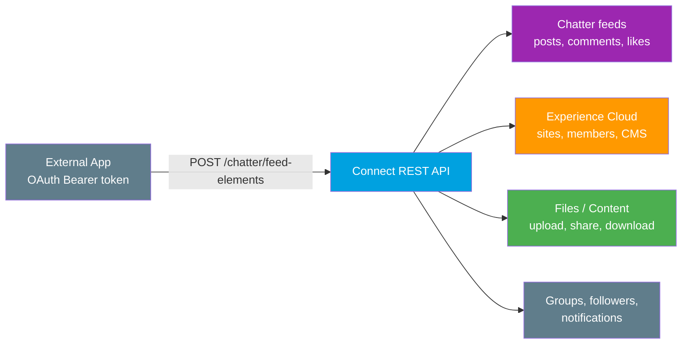

# 06 - Connect REST API

> **One-liner**: The HTTP API for Salesforce's **social and collaboration layer** - Chatter feeds, Experience Cloud sites, and Files - features the sObject APIs do not model well.
> **Direction**: External → Salesforce (inbound). **Format**: JSON (binary for file uploads). **Auth**: OAuth 2.0 Bearer token.
> **Use when**: You need to post to a feed, manage community content, or work with files programmatically rather than read and write plain records.

This is Module 04, inbound APIs (external systems calling into Salesforce). New to the vocabulary? See [Module 01](../01-Fundamentals/README.md). For how the caller authenticates, see [Module 03](../03-Authentication/README.md). Compare with [01-standard-rest-api.md](01-standard-rest-api.md) and [05-composite-api.md](05-composite-api.md).

---

## 1. The idea in plain English

The Standard REST API gives you the **filing cabinet**: rows, fields, records. But Salesforce is also a **social network and a website builder**, and a feed post or a community page is not a tidy row you can `PATCH`. The Connect REST API is the **app's own interface** for that world. It is the same API the Salesforce mobile app and Lightning use to render a Chatter feed, complete with avatars, mentions, attachments, likes, and comments already assembled for you.

Think of it this way: if you asked the sObject API for a feed, you would get raw `FeedItem` rows and have to stitch the photos, mentions, and comment threads together yourself. Connect REST hands you the **finished, display-ready** feed - the way a human would see it. It is **structured around features** (feeds, groups, files, sites), not around database tables.

---

## 2. When to use it (and when not)

| ✅ Use it when | ❌ Avoid / use something else |
|---|---|
| Post or read a **Chatter feed**, comment, like, or @mention. | Plain CRUD or SOQL on records → [01-standard-rest-api.md](01-standard-rest-api.md). |
| Manage **Experience Cloud** (Communities) content or membership. | Bundling many record operations → [05-composite-api.md](05-composite-api.md). |
| Upload, share, or download **Files / ContentDocuments**. | Building a record detail UI with layouts → [07-ui-api.md](07-ui-api.md). |
| Work with **groups, followers, notifications**, or some CMS. | Bulk record loads → Bulk API 2.0 (Module 07). |

**Real-world examples**: an external app **posts a status update** to a record's Chatter feed, an integration **uploads a contract PDF** and shares it, or a portal back-end **manages Experience Cloud site** membership and content.

---

## 3. Connect REST vs Standard REST

| Aspect | Standard REST (sObjects) | Connect REST |
|---|---|---|
| **Models** | Database rows and fields | Collaboration **features** |
| **Shape** | Generic record JSON | Feature-specific, display-ready JSON |
| **You assemble** | Relationships yourself | Pre-assembled feeds, mentions, attachments |
| **Typical verbs** | `GET`/`POST`/`PATCH`/`DELETE` | Same verbs, feature-oriented resources |
| **Best for** | Data | Chatter, Experience Cloud, Files |

Both are inbound, both use OAuth, both run as the calling user. The difference is **what they expose**: data versus the social and content layer on top of it.

---

## 4. How it works



**Walkthrough**

1. The external app authenticates with an **OAuth Bearer token**, exactly like the Standard REST API.
2. It calls a **feature-oriented** resource under `/connect/` or `/chatter/`, for example posting a feed element.
3. Connect REST enforces the running user's permissions, sharing, and visibility, then performs the action.
4. The response is **display-ready** JSON: a feed element already populated with body, actor, mentions, and capabilities.

---

## 5. The actual requests

Base: `https://MyDomainName.my.salesforce.com/services/data/v66.0/`

Connect REST resources live under **`/chatter/`** (the Chatter feature set) and **`/connect/`** (Experience Cloud, CMS, and newer features).

| Action | Method + path |
|---|---|
| Read a user's news feed | `GET /chatter/feeds/news/me/feed-elements` |
| Post a feed item | `POST /chatter/feed-elements` |
| Comment on a feed element | `POST /chatter/feed-elements/{feedElementId}/capabilities/comments/items` |
| List Experience Cloud sites | `GET /connect/communities` |
| Managed Content (CMS) | `GET /connect/cms/contents` |

**Post a text update to a record's feed**

```
POST /services/data/v66.0/chatter/feed-elements
Authorization: Bearer 00D...!AQ...
Content-Type: application/json

{
  "feedElementType": "FeedItem",
  "subjectId": "001bn00000ABCDeAAH",
  "body": {
    "messageSegments": [
      { "type": "Text", "text": "Contract signed and uploaded. Great work team!" }
    ]
  }
}
```

The response returns the created feed element with its Id, actor, body, and the **capabilities** (comments, likes, files) available on it, ready to render in a UI.

---

## 6. Design considerations and gotchas

| Consideration | Why it matters | What to do |
|---|---|---|
| **Feature-oriented, not record-oriented** | Resources map to Chatter, sites, files, not tables. | Browse by feature in the Connect REST guide, not the object reference. |
| **Apex twin exists** | The `ConnectApi` namespace mirrors these resources in Apex. | Use `ConnectApi` for in-org logic, Connect REST for external callers. |
| **Per-user context** | Actions run as the OAuth user and respect Chatter and site visibility. | Give the integration user the right community and feed access. |
| **Experience Cloud URLs** | Community resources may need the site Id in the path. | Build the URL with the correct site context. |
| **Files are binary** | Uploads use multipart, not plain JSON. | Send file content as a multipart request part. |
| **Versioned like all REST** | Behavior is pinned to the API version. | Hardcode `v66.0` that your client tested against. |
| **Rate limits** | Some Connect resources have their own per-app rate limits. | Read the rate-limit notes in the Connect REST guide. |

---

## 7. Interview Q&A

**Q: What is the Connect REST API for?**
A: It exposes Salesforce's **collaboration layer** - Chatter feeds, Experience Cloud sites, Files, groups, followers, notifications, and some CMS - as display-ready JSON. It covers what the plain sObject APIs do not model well.

**Q: How is it different from the Standard REST API?**
A: Standard REST is **record-centric** (rows and fields). Connect REST is **feature-centric** and returns pre-assembled structures like a full feed with mentions and attachments, so you do not stitch related records together yourself.

**Q: I need to post to a record's Chatter feed from an external system. Which API?**
A: **Connect REST**, posting a feed element to `/chatter/feed-elements` with the record Id as `subjectId`. The Apex equivalent is the `ConnectApi` namespace.

**Q: Where does Experience Cloud fit?**
A: Connect REST manages Experience Cloud (Communities) - sites, membership, content, and CMS - under the `/connect/` resources, so external systems can drive community experiences.

**Q: Same auth and user model as Standard REST?**
A: Yes. OAuth Bearer token, and every action runs as the **calling user**, honoring their Chatter and community visibility, sharing, and permissions.

**Talking point to explain it to anyone**: "The record API gives you the database rows. The Connect API gives you the Facebook-style feed and the community site, already put together the way a person would see them."

---

## 8. Key terms

Connect REST API, Chatter, feed element, capability, Experience Cloud, ContentDocument, CMS, `ConnectApi` namespace - defined in [Module 01 vocabulary](../01-Fundamentals/02-core-vocabulary.md) and the [README](README.md).

---

## Sources (Verified June 2026)

- [Connect REST API Introduction (v66.0) — Connect REST API Developer Guide](https://developer.salesforce.com/docs/atlas.en-us.chatterapi.meta/chatterapi/intro_what_is_chatter_connect.htm)
- [Build the Resource URL — Connect REST API Developer Guide](https://developer.salesforce.com/docs/atlas.en-us.chatterapi.meta/chatterapi/intro_building_url.htm)
- [Feeds Resources — Connect REST API Developer Guide](https://developer.salesforce.com/docs/atlas.en-us.chatterapi.meta/chatterapi/connect_resources_feeds.htm)
- [Experience Cloud Sites — Connect REST API Developer Guide](https://developer.salesforce.com/docs/atlas.en-us.chatterapi.meta/chatterapi/features_communities.htm)

---

*Next: [07-ui-api.md](07-ui-api.md) - the API that returns records plus their layouts and metadata to build Salesforce-like UIs.*
