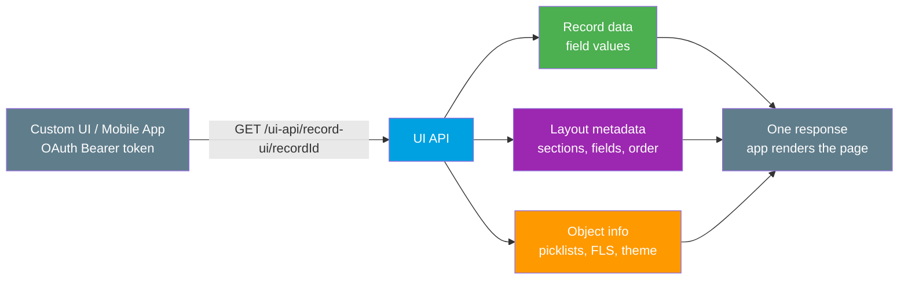

# 07 - User Interface API

> **One-liner**: Returns records **plus** their layouts, metadata, and theming in **one** response, so external or custom apps can render Salesforce-style pages without hardcoding metadata.
> **Direction**: External → Salesforce (inbound). **Format**: JSON. **Auth**: OAuth 2.0 Bearer token.
> **Use when**: You are building a custom front-end or mobile app that must mirror Salesforce layouts, picklists, and permissions **dynamically**.

This is Module 04, inbound APIs (external systems calling into Salesforce). New to the vocabulary? See [Module 01](../01-Fundamentals/README.md). For how the caller authenticates, see [Module 03](../03-Authentication/README.md). Compare with [01-standard-rest-api.md](01-standard-rest-api.md) and [06-connect-rest-api.md](06-connect-rest-api.md).

---

## 1. The idea in plain English

The Standard REST API gives you the **ingredients**: the field values of a record. But if you want to **build a screen** that looks like Salesforce, you also need the recipe: which fields go on the layout, in what order, which are required, what the picklist options are, what the record type theme color is, and what this user is allowed to see. Fetching all of that piecemeal is slow and brittle.

The UI API hands you the **finished meal photo with the recipe card attached**. In a single response you get the record data **and** the metadata describing how to display it. It is the **same API Salesforce uses internally** to build Lightning Experience and the mobile app. Best of all, it already respects the user's **field-level security, page layouts, sharing, and picklist values**, so you do not reimplement those rules. When an admin changes a layout, your custom UI updates automatically because the metadata comes from the org, not from your code.

---

## 2. When to use it (and when not)

| ✅ Use it when | ❌ Avoid / use something else |
|---|---|
| Building a **custom UI or mobile app** that mirrors Salesforce layouts. | Plain server-to-server **data sync** → [01-standard-rest-api.md](01-standard-rest-api.md). |
| You want **picklists, layouts, theming** delivered dynamically. | Posting to feeds or managing communities → [06-connect-rest-api.md](06-connect-rest-api.md). |
| You must respect the user's **FLS and permissions** automatically. | Bundling many writes atomically → [05-composite-api.md](05-composite-api.md). |
| You do **not** want to hardcode metadata in your client. | **Bulk** record processing → Bulk API 2.0 (Module 07). |

**Real-world examples**: a **custom mobile app** that shows record pages identical to Salesforce, an **embedded record viewer** in an external portal, or a low-code tool that renders any object's create form by reading its layout at runtime.

---

## 3. What makes it different

| Aspect | Standard REST (sObjects) | UI API |
|---|---|---|
| **Returns** | Field values only | Data **plus** layouts, metadata, theming |
| **Metadata-aware** | No, you hardcode it | Yes, layouts and picklists come from the org |
| **Respects FLS / layouts** | Enforces FLS on data | Enforces FLS, layouts, sharing, **and** shapes the response to them |
| **Built for** | Integration and data | **Rendering Salesforce-like UIs** |
| **Used internally by** | General API clients | Lightning Experience and Salesforce mobile |

The point of the UI API is to make it simple to **replicate Salesforce's own UI** in a custom app, according to the rules and permissions of the running user.

---

## 4. How it works



**Walkthrough**

1. The custom app authenticates with an **OAuth Bearer token** and requests a record-ui resource for a record Id.
2. The UI API gathers the **record data**, the **layout** that applies to this user and record type, and the **object info** (picklists, field-level security, theme).
3. All of it is filtered by the running user's **permissions and FLS**, so the response only contains what they may see.
4. The app receives **one** combined response and renders a page that matches Salesforce, no hardcoded metadata required.

---

## 5. The actual requests

Base: `https://MyDomainName.my.salesforce.com/services/data/v66.0/ui-api/`

| Resource | Method + path |
|---|---|
| Record data + object metadata | `GET /ui-api/record-ui/{recordIds}` |
| Just the record (with layout-aware fields) | `GET /ui-api/records/{recordId}` |
| Object metadata only | `GET /ui-api/object-info/{apiName}` |
| Picklist values for a field | `GET /ui-api/object-info/{apiName}/picklist-values/{recordTypeId}/{fieldApiName}` |
| Create a record | `POST /ui-api/records` |
| Update a record | `PATCH /ui-api/records/{recordId}` |

**Get a record with its display metadata in one call**

```
GET /services/data/v66.0/ui-api/record-ui/001bn00000ABCDeAAH
Authorization: Bearer 00D...!AQ...
```

The response bundles three things: `records` (the field values), `layouts` (sections, columns, field order, required flags), and `objectInfos` (picklists, field-level security, theme color). That is everything a client needs to draw the page exactly as Salesforce would.

> **CRUD is supported**, not just reads. You can create and update records through `/ui-api/records`, and the responses stay metadata-aware so your forms reflect the org's layouts and picklists.

---

## 6. Design considerations and gotchas

| Consideration | Why it matters | What to do |
|---|---|---|
| **Metadata-aware by design** | The response reshapes to the user's layouts and FLS. | Let the org drive your UI, do not hardcode field lists. |
| **Read and CRUD scope** | Supports get, create, update, delete, but not the full breadth of the data APIs. | For bulk or pure data sync, use Standard REST or Bulk. |
| **Per-user response** | Two users can get different layouts and fields for the same record. | Test with the actual integration user's permissions. |
| **Auto-updates with admin changes** | Layout and picklist changes flow through without a client release. | Rely on this instead of shipping metadata in your app. |
| **Lightning Data Service uses it** | LWC `@wire` adapters sit on top of the UI API. | In-org components should prefer LDS over raw calls. |
| **Versioned** | Behavior pinned to the API version. | Hardcode `v66.0` your client tested against. |
| **Not for high volume** | It is a UI-rendering API, not a bulk pipe. | Move large jobs to Bulk API 2.0 (Module 07). |

---

## 7. Interview Q&A

**Q: What does the UI API give you that the Standard REST API does not?**
A: **Metadata alongside data.** One response returns the record values **plus** the layout, picklists, theming, and object info, all filtered by the user's FLS and permissions, so you can render a Salesforce-style page without hardcoding metadata.

**Q: Why would I use it instead of just reading sObjects?**
A: To build a **custom or mobile UI** that mirrors Salesforce. Reading sObjects gives you values but no layout, no picklist options, and no theme. The UI API delivers all of that dynamically, and it updates when admins change layouts.

**Q: Does it respect field-level security and sharing?**
A: Yes. It runs as the calling user and shapes the response to their **FLS, page layouts, and sharing**, so the client never sees fields the user cannot access.

**Q: Can you create and update records with it, or is it read-only?**
A: It supports **CRUD** through `/ui-api/records`, with metadata-aware responses, though it is not meant for the full breadth or volume that the data APIs and Bulk API handle.

**Q: How does it relate to Lightning Web Components?**
A: **Lightning Data Service** and the LWC `@wire` adapters are built on the UI API. Salesforce uses the same API for its own Lightning Experience and mobile app, which is why custom apps can match its behavior.

**Talking point to explain it to anyone**: "It gives you the record **and** the instructions for drawing its page, already filtered to what you are allowed to see, so your app looks just like Salesforce without you copying any of Salesforce's setup."

---

## 8. Key terms

UI API, record-ui, object-info, layout metadata, picklist values, field-level security, theming, Lightning Data Service - defined in [Module 01 vocabulary](../01-Fundamentals/02-core-vocabulary.md) and the [README](README.md).

---

## Sources (Verified June 2026)

- [Get Started with User Interface API (v66.0) — UI API Developer Guide](https://developer.salesforce.com/docs/atlas.en-us.uiapi.meta/uiapi/ui_api_get_started.htm)
- [Get Record Data and Object Metadata — UI API Developer Guide](https://developer.salesforce.com/docs/atlas.en-us.uiapi.meta/uiapi/ui_api_resources_record_ui.htm)
- [Get Record Layout Metadata — UI API Developer Guide](https://developer.salesforce.com/docs/atlas.en-us.uiapi.meta/uiapi/ui_api_resources_record_layout.htm)
- [Lightning Data Service — Lightning Web Components Developer Guide](https://developer.salesforce.com/docs/platform/lwc/guide/data-ui-api)

---

*Next: back to the [Module 04 README](README.md). Related: [Module 03](../03-Authentication/README.md) for the OAuth these APIs require, and the Outbound module ([Module 05](../05-Outbound-Callouts/README.md)) for when Salesforce calls **out** instead.*
