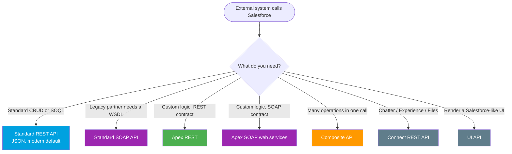

# Module 04 - Inbound APIs (External → Salesforce)

> **Goal**: Make Salesforce listen. Know every way an external system can push or pull data **into** Salesforce, and which to pick.
> **API version**: v66.0 (Spring '26). **Auth**: every inbound call authenticates via OAuth, see [Module 03](../03-Authentication/README.md).

Inbound means the **external system initiates** and Salesforce responds. This is the [Remote Call-In pattern](../02-Integration-Patterns/04-remote-call-in.md) in practice. This module covers the built-in APIs (no code) and the custom ones you write in Apex.

---

## How to use this module

1. Start with **[01-standard-rest-api.md](01-standard-rest-api.md)**, the default for most integrations.
2. Learn the custom options ([Apex REST](03-apex-rest.md)) for when built-in CRUD isn't enough.
3. Use the **decision tree** and **comparison table** below to choose fast.
4. For how callers log in, see [Module 03 - Authentication](../03-Authentication/README.md).

---

## Map of this module

| # | File | What it covers |
|---|---|---|
| 01 | [standard-rest-api](01-standard-rest-api.md) | Auto-generated CRUD + SOQL over JSON. The default. |
| 02 | [standard-soap-api](02-standard-soap-api.md) | WSDL-based (Enterprise/Partner) + the `login()` retirement |
| 03 | [apex-rest](03-apex-rest.md) | Your own REST endpoint (`@RestResource`) |
| 04 | [apex-soap-web-services](04-apex-soap-web-services.md) | Your own SOAP endpoint (`webservice` keyword) |
| 05 | [composite-api](05-composite-api.md) | Many operations in one round-trip |
| 06 | [connect-rest-api](06-connect-rest-api.md) | Chatter, Experience Cloud, Files |
| 07 | [ui-api](07-ui-api.md) | Records + layouts + metadata for building UIs |

---

## Which inbound API? (decision tree)

---

## Comparison table

| API | What it's for | Format | Custom logic? | When to use |
|---|---|---|:--:|---|
| **Standard REST** (01) | CRUD + SOQL on objects | JSON | No | The default for modern clients. |
| **Standard SOAP** (02) | CRUD on objects via WSDL | XML | No | Legacy partners needing a contract. |
| **Apex REST** (03) | Custom REST endpoint | JSON | **Yes** | Tailored logic/contract over REST. |
| **Apex SOAP** (04) | Custom SOAP endpoint | XML | **Yes** | Legacy SOAP consumer + custom logic. |
| **Composite** (05) | Bundle many calls | JSON | No | Cut round-trips and API calls. |
| **Connect REST** (06) | Chatter / Experience / Files | JSON | No | The social/collaboration layer. |
| **UI API** (07) | Records + layout + metadata | JSON | No | Build a UI that mirrors Salesforce. |

---

## What changed worth knowing (2025-2026)

- **SOAP API `login()` is retiring in Summer '27** (gone from API v65.0+, disabled by default in new orgs, gated by the new **Use Any API Auth** permission from Summer '26). Authenticate inbound calls with **OAuth** via External Client Apps. See [02-standard-soap-api.md](02-standard-soap-api.md) and [Module 03](../03-Authentication/README.md).
- **REST + JSON** is the default for new inbound builds; SOAP is legacy-but-supported.

---

## Interview rapid-fire

**Q: Standard REST vs Apex REST?**
→ Standard REST is built-in CRUD/SOQL, no code. Apex REST (`@RestResource`) is a **custom** endpoint for business logic or a tailored contract.

**Q: How do you avoid duplicate inbound records?**
→ **Upsert by External Id**, which is idempotent against retries.

**Q: Create an Account and its Contacts in one inbound call?**
→ **Composite API** (sObject Tree or Composite Graph), fewer round-trips and transactional.

**Q: Security gotcha with Apex REST?**
→ It runs in **system context**, so it does not auto-enforce FLS/sharing. Use `with sharing` and check CRUD/FLS explicitly. (The Standard REST API enforces the calling user's permissions.)

---

## Sources (Verified June 2026)

- [REST API Developer Guide (v66.0) — Salesforce Developers](https://developer.salesforce.com/docs/atlas.en-us.api_rest.meta/api_rest/intro_what_is_rest_api.htm)
- [Apex REST — Apex Developer Guide](https://developer.salesforce.com/docs/atlas.en-us.apexcode.meta/apexcode/apex_rest_intro.htm)
- [Composite Resources — REST API Developer Guide](https://developer.salesforce.com/docs/atlas.en-us.api_rest.meta/api_rest/resources_composite.htm)
- [SOAP API login() Retirement — Salesforce Help](https://help.salesforce.com/s/articleView?id=005132110&type=1)

*Each file has its own Sources section with the specific official doc.*
