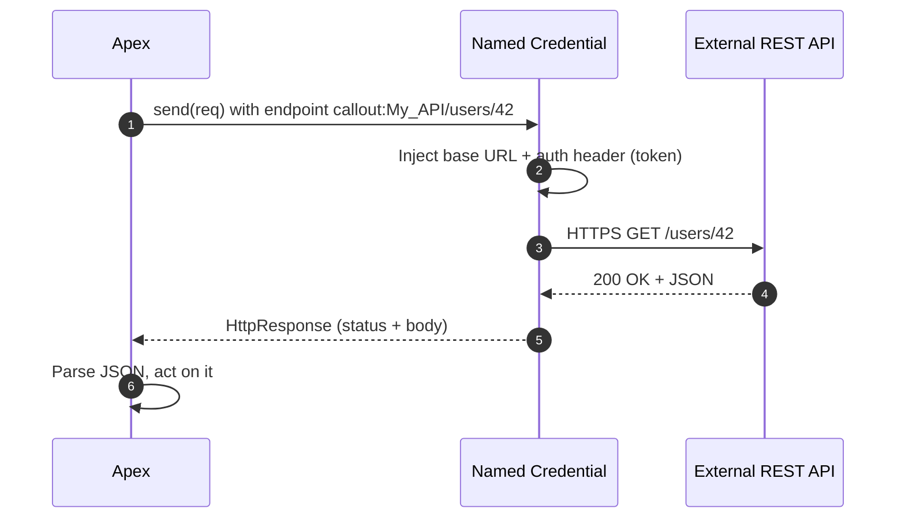

# 01 - HTTP Callouts (Apex)

> **One-liner**: Apex sends an HTTP request **out** to an external REST service and reads the response, using the `Http`, `HttpRequest`, and `HttpResponse` classes.
> **Direction**: Salesforce → External (outbound). **Auth**: a **Named Credential** (never a hardcoded URL or secret).
> **Use when**: Salesforce code needs to call an external REST API.

This is Module 05, outbound callouts (Salesforce calling external systems). For the auth object behind every callout, see [Module 03 - Named Credentials](../03-Authentication/14-named-credentials-and-external-credentials.md). For the design pattern, see [Module 02 - Request and Reply](../02-Integration-Patterns/01-request-and-reply.md).

---

## 1. The idea in plain English

A callout is Salesforce **placing the phone call** instead of answering one. Your Apex builds a request (method, URL path, headers, body), hands it to the `Http` class, and gets back an `HttpResponse` with a status code and body. The golden rule: the **address and credentials live in a Named Credential**, so your code says `callout:My_API/users/42`, never a raw URL with a token glued on.

That one habit, using `callout:`, is what separates a clean integration from a security incident. Secrets stay in Salesforce's encrypted store and rotate centrally. Your code stays portable across sandboxes and production.

---

## 2. When to use it (and when not)

| ✅ Use it when | ❌ Avoid / use something else |
|---|---|
| Apex needs to call an external **REST** endpoint. | Low-code team wants it in Flow → [03-external-services.md](03-external-services.md). |
| You want **full control** over request/response. | External service is **SOAP/WSDL** → [04-soap-callouts-wsdl2apex.md](04-soap-callouts-wsdl2apex.md). |
| The call is **fast** and fits a transaction. | Long-running from a screen → [06-continuation-pattern.md](06-continuation-pattern.md). |
| Triggered synchronously and quickly. | Fired from a trigger / after DML → [05-asynchronous-callouts.md](05-asynchronous-callouts.md). |

**Real-world examples**: fetch a credit score, validate an address, push an order to an ERP, call a shipping rate API.

---

## 3. How it works (sequence diagram)



**Walkthrough**

1. Apex builds an `HttpRequest` whose endpoint starts with `callout:NamedCredentialName`.
2-3. At send time Salesforce swaps in the real **base URL** and adds the **auth header** from the Named Credential.
4. The external API responds.
5-6. Apex receives the `HttpResponse` and parses the body (usually JSON).

---

## 4. The actual code

```apex
Http http = new Http();
HttpRequest req = new HttpRequest();
req.setEndpoint('callout:My_API/users/42'); // base URL + auth from Named Credential
req.setMethod('GET');
req.setHeader('Content-Type', 'application/json');
req.setTimeout(120000); // ms, max 120000 (120s)

HttpResponse res = http.send(req);
if (res.getStatusCode() == 200) {
    Map<String, Object> body =
        (Map<String, Object>) JSON.deserializeUntyped(res.getBody());
    // use body
} else {
    // handle 4xx/5xx, log, retry as appropriate
}
```

**POST with a body**

```apex
req.setEndpoint('callout:My_API/orders');
req.setMethod('POST');
req.setHeader('Content-Type', 'application/json');
req.setBody(JSON.serialize(new Map<String,Object>{ 'sku' => 'A-100', 'qty' => 2 }));
```

> **Named Credential vs Remote Site Setting**: a **Named Credential** supplies the URL *and* authentication, and is the recommended approach. If you ever call a raw hardcoded URL (not recommended), that host must be whitelisted as a **Remote Site Setting** or the callout is blocked. Using `callout:` avoids that entirely.

---

## 5. Design considerations and gotchas

| Consideration | Why it matters | What to do |
|---|---|---|
| **No callout after DML** | An uncommitted DML in the same transaction blocks the callout (`You have uncommitted work pending`). | Call out **before** DML, or move the callout to async. |
| **Callout limits** | Max **100** callouts per transaction; request/response max **6 MB sync, 12 MB async**. | Don't loop callouts per record; bulkify. |
| **Timeout** | Default 10s, max **120s** per callout; total **120s** per transaction. | Set `setTimeout`; if slow, go async/Continuation. |
| **Synchronous blocks the user** | A slow API freezes the UI. | Use [Continuation](06-continuation-pattern.md) or [async](05-asynchronous-callouts.md). |
| **Secrets in code** | Hardcoded tokens leak and don't rotate. | Always use `callout:NamedCredential`. |
| **Testing** | Real callouts aren't allowed in tests. | Implement `HttpCalloutMock`. See [07-callout-limits-and-testing.md](07-callout-limits-and-testing.md). |

---

## 6. Interview Q&A

**Q: How do you make an HTTP callout in Apex?**
A: Build an `HttpRequest` (method, endpoint, headers, body), send it with `Http.send()`, and read the `HttpResponse`. The endpoint should be `callout:NamedCredential/path` so the URL and auth come from a Named Credential.

**Q: Why use a Named Credential instead of a raw URL?**
A: It stores the endpoint and credentials in Salesforce's encrypted store, injects the auth header automatically, keeps secrets out of code, and rotates centrally. A raw URL would also require a Remote Site Setting.

**Q: "You have uncommitted work pending" — what causes it?**
A: Making a callout after a DML statement in the same transaction. Fix by calling out before any DML, or by moving the callout to an asynchronous context.

**Q: What are the key callout limits?**
A: 100 callouts per transaction, 6 MB request/response synchronously (12 MB async), and a 120-second max per callout and per transaction.

**Q: How do you test callouts?**
A: You can't hit a live endpoint in a test. Implement `HttpCalloutMock` (or `Test.setMock`) to return a canned response, then assert on the parsed result.

**Talking point to explain it to anyone**: "It's Salesforce making the phone call out. The phone number and password are stored safely in a Named Credential, so the code just says 'call My_API' and never holds the secret."

---

## 7. Key terms

Callout, Named Credential, Remote Site Setting, HttpRequest/HttpResponse, governor limit, HttpCalloutMock - defined in [Module 01 vocabulary](../01-Fundamentals/02-core-vocabulary.md) and the [README](README.md).

---

## Sources (Verified June 2026)

- [Invoking Callouts Using Apex — Apex Developer Guide](https://developer.salesforce.com/docs/atlas.en-us.apexcode.meta/apexcode/apex_callouts.htm)
- [Callout Limits and Limitations — Apex Developer Guide](https://developer.salesforce.com/docs/atlas.en-us.apexcode.meta/apexcode/apex_callouts_timeouts.htm)
- [Named Credentials as Callout Endpoints — Apex Developer Guide](https://developer.salesforce.com/docs/atlas.en-us.apexcode.meta/apexcode/apex_callouts_named_credentials.htm)

---

*Next: [02-named-credentials-for-callouts.md](02-named-credentials-for-callouts.md) - the secure, no-hardcoding way to authenticate every callout.*
