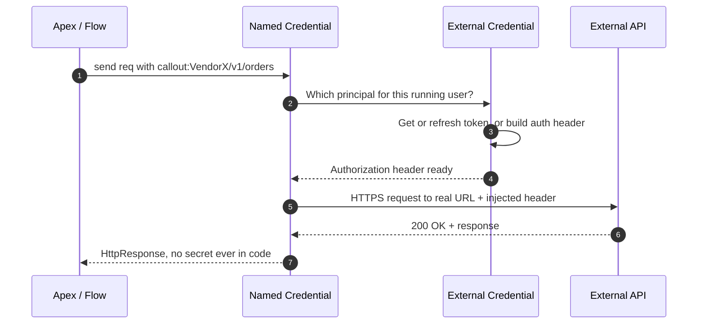

# 02 - Named Credentials for Callouts

> **One-liner**: The secure, secret-free way to authenticate **every** outbound callout. Your code references `callout:Name/path`, and Salesforce injects the real URL and the auth header at send time.
> **Direction**: Salesforce → External (outbound). **Auth**: a **Named Credential** (endpoint) backed by an **External Credential** (auth). Never a hardcoded URL or token.
> **Use when**: Any Apex, Flow, or External Services callout needs authentication. This is the recommended pattern for **all** outbound auth.

This is Module 05, outbound callouts. This file is about **using** Named Credentials in a callout. The full configuration, every auth protocol, principals, and permission-set mapping live in the deep file: [Module 03 - Named Credentials + External Credentials](../03-Authentication/14-named-credentials-and-external-credentials.md). Read that for the **why and how to configure**. This file is the **how to call** view. For the raw HTTP mechanics, see [01-http-callouts.md](01-http-callouts.md).

---

## 1. The idea in plain English

Think of a **speed-dial** on an office phone. You press **"VendorX"** and the phone dials the real number and logs in with the right account. You never type the number or the password. If the vendor changes their number or rotates the password, the admin updates the speed-dial entry once. Every phone keeps working. No one re-learns a number.

A **Named Credential** is that speed-dial. In Apex you write `callout:VendorX/v1/orders`. At send time Salesforce swaps `callout:VendorX` for the real base URL **and** attaches the authentication header from the linked **External Credential**. Your code, your repo, your debug logs, and your packaged metadata never hold a secret.

That single habit, always using `callout:`, is the line between a clean integration and a security incident waiting to happen.

---

## 2. When to use it (and when not)

| ✅ Use a Named Credential when | ❌ Avoid / different approach |
|---|---|
| **Any** authenticated outbound callout from Apex, Flow, or External Services. | A truly public, no-auth, hardcoded URL test (still discouraged) → needs a **Remote Site Setting** instead. |
| You want secrets out of code and **central rotation**. | You need the *inbound* social login / SSO side → [Auth Providers](../03-Authentication/15-auth-providers.md). |
| You want **portability** across sandbox and production. | You only need the protocol theory → [Module 03 deep file](../03-Authentication/14-named-credentials-and-external-credentials.md). |
| The API uses OAuth, API key, Basic, AWS Sig v4, or mTLS. | n/a |

**Real-world examples**: call a payment gateway with OAuth Client Credentials, push to an ERP with an API key in a custom header, sign requests to AWS S3, hit a partner API with a per-user OAuth token.

---

## 3. How it works (sequence diagram)



**Walkthrough**

1. Apex sets the endpoint to `callout:VendorX/v1/orders`.
2. The **Named Credential** resolves the linked **External Credential** and which **principal** applies, using the running user's permission-set mapping.
3-4. The **External Credential** obtains or refreshes the token, or constructs the header (OAuth token, API key, AWS v4 signature, etc.).
5. Salesforce injects the **Authorization header** and sends to the real URL over HTTPS.
6-7. The response returns to Apex. **Your code never touched a secret.**

---

## 4. The actual code and config

### The split, in one line

A **Named Credential** holds the **endpoint URL** and points to an **External Credential**, which holds the **auth protocol + principals + permission-set mappings**. Salesforce split them in **Winter '23** so one auth definition can serve many endpoints. Full setup steps are in the [Module 03 deep file](../03-Authentication/14-named-credentials-and-external-credentials.md#6-setup--configuration). Summary: create the External Credential, add a principal, **map it to a permission set** (mandatory), create the Named Credential pointing at it, then assign the permission set to users.

### The `callout:` syntax

```apex
HttpRequest req = new HttpRequest();
// 'callout:' + Named Credential API name + path
req.setEndpoint('callout:VendorX/v1/orders');
req.setMethod('GET');

Http http = new Http();
HttpResponse res = http.send(req);
System.debug(res.getStatusCode() + ' ' + res.getBody());
```

Salesforce substitutes the base URL **and** adds the auth header (when **Generate Authorization Header** is on, the default). No endpoint string, no token, no secret in code.

### Principals: Named vs Per-User (quick contrast)

| Principal | One identity or many? | Pick when |
|---|---|---|
| **Named Principal** | One shared service identity for all users | The external system does not care which Salesforce user called. |
| **Per-User Principal** | Each user authenticates individually | The external system needs the real end user for data or audit. |

Details and the Client Credentials principal: see [Module 03, section 4](../03-Authentication/14-named-credentials-and-external-credentials.md#4-principals--whose-identity-makes-the-call).

### Merge fields in custom headers and body

A Named Credential can carry **custom headers**, and you can inject stored values with a merge field. This is the clean way to do an **API key** scheme: define a custom header on the Named Credential so every callout carries the key automatically.

```apex
HttpRequest req = new HttpRequest();
req.setEndpoint('callout:VendorX/v1/tickets');
req.setMethod('POST');
req.setHeader('Content-Type', 'application/json');
// Merge field pulls a stored value at runtime.
// Requires "Allow Formulas in HTTP Body" on the Named Credential.
req.setBody('{"agent":"{!$Credential.VendorX_Cred.Username}"}');
Http http = new Http();
HttpResponse res = http.send(req);
```

The merge syntax is `{!$Credential.<ExternalCredential>.<field>}`. Only enable **Allow Formulas in HTTP Header / Body** when you genuinely need a merge field, to avoid formula-injection risk.

### Named Credential vs Remote Site Setting (the key contrast)

| | **Named Credential** | **Remote Site Setting** |
|---|---|---|
| Supplies the URL? | **Yes** | No, it only **allowlists** a host |
| Supplies authentication? | **Yes**, injects the header | **No** |
| Used in code as | `callout:Name/path` | The full hardcoded URL |
| Needed when you use `callout:`? | This **is** the thing you use | **Not needed at all** |
| Needed for a raw hardcoded URL? | n/a | **Required**, or the callout is blocked |

> **Plainly**: a **Named Credential** is the recommended approach and removes the need for a Remote Site Setting. A **Remote Site Setting** is only the host allowlist you fall back to if you ever hardcode a raw URL (not recommended). Using `callout:` gives you the URL **and** the auth, so you never touch Remote Site Settings.

---

## 5. Design considerations and gotchas

| Consideration | Why it matters | What to do |
|---|---|---|
| **Hardcoding secrets** | Tokens leak via source control, logs, and packages; rotation means redeploys. | Always use `callout:Name`; store secrets in the External Credential. |
| **Missing permission-set mapping** | The principal is inert; the callout fails with an auth error even for an admin. | Map the External Credential principal to a permission set and assign it. |
| **Full URL in setEndpoint** | You lose the auto-injected auth and the secret-free benefit. | Always `callout:Name/path`, never the raw URL. |
| **Wrong principal type** | A Named Principal hides who acted; per-user audit breaks. | Use **Per-User** when the API needs the real user. |
| **Merge fields enabled needlessly** | Formula injection or accidental data exposure. | Only enable **Allow Formulas** when a merge field is required. |
| **Legacy single Named Credential** | Not enhanced; misses new protocols and features. | Use the **Named + External Credential** split (Winter '23+). |
| **Relying on Remote Site Settings** | Means a raw URL with hardcoded auth somewhere. | Replace with a Named Credential; drop the Remote Site Setting. |

---

## 6. Interview Q&A

**Q: How do you authenticate an outbound callout without putting secrets in code?**
A: Use a **Named Credential** for the endpoint, backed by an **External Credential** for the auth. In Apex set the endpoint to `callout:Name/path`. Salesforce injects the real URL and the auth header at send time, so no secret appears in code, logs, or packages.

**Q: What is the `callout:` prefix doing exactly?**
A: It tells Salesforce to resolve the Named Credential by API name, substitute its base URL, look up the linked External Credential and the running user's principal, build or refresh the auth header, and attach it. The substitution happens at send time, not in your code.

**Q: Do you still need a Remote Site Setting when using a Named Credential?**
A: No. A Named Credential supplies the URL and the auth, so it removes the need for a Remote Site Setting. A Remote Site Setting is only a host allowlist required when you call a raw hardcoded URL, which is discouraged.

**Q: Named Principal vs Per-User Principal?**
A: A **Named Principal** is one shared identity for all users, fine when the external system does not care who called. A **Per-User Principal** has each user authenticate individually, required when the API needs the actual end user for data access or audit.

**Q: How would you implement an API-key API cleanly?**
A: Create a **Custom** External Credential, store the key, and define a **custom header** on the Named Credential carrying the key (optionally via a `{!$Credential...}` merge field). Every callout then sends the key automatically, and the key rotates in config with zero code change.

**Talking point to explain it to anyone**: "It's a speed-dial button. The code presses 'VendorX' and the phone dials the real number and logs in. The number and password stay locked in the phone, never written on a sticky note on the desk."

---

## 7. Key terms

Named Credential, External Credential, principal (Named vs Per-User), Remote Site Setting, merge field, `callout:` syntax - defined in [Module 01 vocabulary](../01-Fundamentals/02-core-vocabulary.md) and the [README](README.md). For the full protocol and config reference, see the [Module 03 deep file](../03-Authentication/14-named-credentials-and-external-credentials.md).

---

## Sources (Verified June 2026)

- [Named Credentials as Callout Endpoints — Apex Developer Guide](https://developer.salesforce.com/docs/atlas.en-us.apexcode.meta/apexcode/apex_callouts_named_credentials.htm)
- [Create Named Credentials and External Credentials — Salesforce Help](https://help.salesforce.com/s/articleView?id=sf.nc_named_creds_and_ext_creds.htm&type=5)
- [Authentication Protocols for Named Credentials — Salesforce Help](https://help.salesforce.com/s/articleView?id=xcloud.nc_auth_protocols.htm&type=5)
- [Use API Keys in Custom Headers with Named Credentials — Salesforce Help](https://help.salesforce.com/s/articleView?id=sf.nc_custom_headers_and_api_keys.htm&type=5)
- [Map External Credential Principals to Permission Sets — Release Notes](https://help.salesforce.com/s/articleView?id=release-notes.rn_security_map_principals_to_permsets.htm&type=5)

---

*Next: [03-external-services.md](03-external-services.md) - call a REST API from Flow with no handwritten Apex.*
