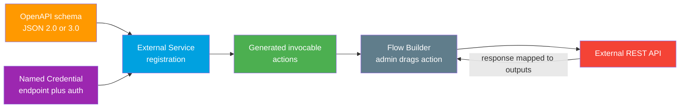

# 03 - External Services (Low-Code Callouts from Flow)

> **One-liner**: Register an external REST API from its **OpenAPI schema**, and Salesforce auto-generates **invocable actions** that admins drop into **Flow** with no handwritten Apex.
> **Direction**: Salesforce → External (outbound). **Auth**: a **Named Credential** supplies the endpoint and auth.
> **Use when**: A low-code or admin team needs to call a REST API from Flow without writing Apex callout code.

This is Module 05, outbound callouts. External Services is the **declarative** sibling of [01-http-callouts.md](01-http-callouts.md) (handwritten Apex) and [04-soap-callouts-wsdl2apex.md](04-soap-callouts-wsdl2apex.md) (SOAP). The endpoint and auth still come from a Named Credential, see [02-named-credentials-for-callouts.md](02-named-credentials-for-callouts.md) and the [Module 03 deep file](../03-Authentication/14-named-credentials-and-external-credentials.md).

---

## 1. The idea in plain English

Imagine an external API hands you a **printed menu** of exactly what it can do: every dish (operation), its ingredients (inputs), and what comes out (outputs). That menu is the **OpenAPI schema** (formerly called Swagger). You hand the menu to Salesforce once. Salesforce reads it and builds a row of **ready-made buttons**, one per dish. An admin then drags a button into a **Flow** and fills in the inputs. No cook (developer) writes a recipe by hand.

So **External Services** is "register the menu, get the buttons." The buttons are **invocable actions**. The kitchen's address and the way you pay (auth) live in a **Named Credential**. The admin never sees a URL or a token, and never writes a single line of Apex.

---

## 2. When to use it (and when not)

| ✅ Use External Services when | ❌ Avoid / use something else |
|---|---|
| Admins or low-code teams must call a **REST** API from **Flow**. | The endpoint is **SOAP/WSDL** → [04-soap-callouts-wsdl2apex.md](04-soap-callouts-wsdl2apex.md). |
| The API ships a clean **OpenAPI 2.0 or 3.0** schema. | No OpenAPI schema exists or it is huge / very complex → handwritten [HTTP callout](01-http-callouts.md). |
| You want **no handwritten Apex** for the callout. | You need fine-grained control of retries, chunking, or custom parsing → [Apex callout](01-http-callouts.md). |
| The operations map cleanly to inputs and outputs. | Deeply nested or polymorphic payloads the generator cannot model → custom Apex. |

**Real-world examples**: an admin Flow that validates an address, fetches a shipping quote, looks up a tax rate, or creates a ticket in a partner system, all from a screen or record-triggered Flow.

---

## 3. How it works (flow diagram)

**Walkthrough**

1. You provide the API's **OpenAPI schema** (JSON, version 2.0 or 3.0) by URL or paste.
2. You point the registration at a **Named Credential** that holds the base URL and auth.
3. Salesforce parses each **operation** into an **invocable action**, mapping parameters to **inputs** and the response to **outputs**.
4. An admin drags the action into a **Flow** and binds the inputs to record fields or variables.
5. At runtime the Flow calls the external API through the Named Credential and reads the mapped outputs.

---

## 4. The setup (point and click)

There is **no Apex to write**. The steps:

1. **Create the Named Credential** (and External Credential) for the API's base URL and auth. See [02-named-credentials-for-callouts.md](02-named-credentials-for-callouts.md).
2. **Setup → External Services → Add an External Service.**
3. Choose **From API Specification**, select the **Named Credential**, and supply the **OpenAPI schema** (by URL or by pasting the JSON).
4. Salesforce validates the schema, then shows the **operations** it found. Select the ones to import.
5. **Finish.** Salesforce generates one **invocable action** per selected operation.
6. In **Flow Builder**, add an **Action** element, search for your External Service, pick the operation, and map inputs and outputs.

The generated actions are also invocable from **Apex**, **Einstein Bots / Agentforce**, **Orchestrator**, and **OmniStudio**, not only Flow.

> **Schema basics to verify before you start**: External Services targets **RESTful** APIs described in **OpenAPI 2.0 or 3.0**. OpenAPI **3.0 JSON** support arrived in **Spring '22**. The schema must satisfy the **External Services Considerations** (see Sources), and Salesforce derives action and type names from the schema, so clear `operationId` values produce clean action names.

---

## 5. Design considerations and gotchas

| Consideration | Why it matters | What to do |
|---|---|---|
| **Schema size limit** | A schema over **100,000 characters** fails registration. | Trim the spec to the operations you actually need, or split it. |
| **Derived name length** | Salesforce derives type and action names; each derived name must be **fewer than 255 characters**. | Use short, clear `operationId` and schema names. |
| **Complexity limits** | Deeply nested, polymorphic, or unusual constructs may not import cleanly. | Simplify the schema, or fall back to a handwritten [Apex callout](01-http-callouts.md). |
| **Regeneration on API change** | If the external API changes its contract, the generated actions go stale. | Re-edit the External Service to re-import; re-test affected Flows. |
| **Auth lives in the Named Credential** | The action has no URL or secret of its own. | Configure auth once in the Named/External Credential; rotate there. |
| **Governor limits still apply** | These are real callouts under the hood. | Respect the **100 callouts per transaction** limit; do not loop actions per record. |
| **Operations must map cleanly** | Inputs/outputs are auto-generated from the schema. | Confirm the generated inputs/outputs match expectations before shipping. |

---

## 6. Interview Q&A

**Q: What is an External Service and what problem does it solve?**
A: It lets you register an external REST API from its **OpenAPI schema** so Salesforce generates **invocable actions**. Admins then call the API from **Flow** with no handwritten Apex. It brings third-party REST calls into low-code automation.

**Q: What schema formats and versions does it support?**
A: RESTful APIs described in **OpenAPI 2.0 or 3.0**. OpenAPI **3.0 JSON** support was added in Spring '22. The schema must meet the External Services Considerations, including a **100,000-character** size limit.

**Q: How does an External Service authenticate?**
A: It uses a **Named Credential** for the base URL and a backing **External Credential** for the auth. The generated action carries no URL or secret; everything resolves through the Named Credential at runtime.

**Q: What happens when the external API changes?**
A: The generated actions can go stale. You **re-edit the External Service to re-import** the updated schema, then re-test any Flows that use the affected actions. It is not automatic.

**Q: When would you choose a handwritten Apex callout instead?**
A: When there is no usable OpenAPI schema, the schema is too large or complex to import, or you need fine control over retries, payload shaping, or custom parsing. External Services trades control for speed of delivery.

**Talking point to explain it to anyone**: "The API hands Salesforce a printed menu of what it can do. Salesforce turns each menu item into a button. An admin drags the button into a Flow. Nobody writes code, and the address and password stay locked in a Named Credential."

---

## 7. Key terms

External Service, OpenAPI / Swagger schema, invocable action, Flow Builder, Named Credential, operation - defined in [Module 01 vocabulary](../01-Fundamentals/02-core-vocabulary.md) and the [README](README.md). For the auth object behind the endpoint, see [02-named-credentials-for-callouts.md](02-named-credentials-for-callouts.md) and the [Module 03 deep file](../03-Authentication/14-named-credentials-and-external-credentials.md).

---

## Sources (Verified June 2026)

- [Invoke External Service Callouts — Salesforce Help](https://help.salesforce.com/s/articleView?id=platform.external_services.htm&type=5)
- [External Services Considerations — Salesforce Help](https://help.salesforce.com/s/articleView?id=platform.enhanced_external_services_considerations.htm&type=5)
- [OpenAPI 2.0 and 3.0 Support — Salesforce Help](https://help.salesforce.com/s/articleView?id=sf.external_services_intro_openapi_2_3_support.htm&type=5)
- [External Services OpenAPI 3.0 Schema — Salesforce Help](https://help.salesforce.com/s/articleView?id=platform.external_services_examples_openapi_3_0.htm&type=5)
- [Learn MOAR in Spring '22: OpenAPI 3.0 Support for External Services — Salesforce Developers Blog](https://developer.salesforce.com/blogs/2022/02/learn-moar-in-spring-22-with-openapi-3-0-support-for-external-services)

---

*Next: [04-soap-callouts-wsdl2apex.md](04-soap-callouts-wsdl2apex.md) - calling an external SOAP service from Apex.*
