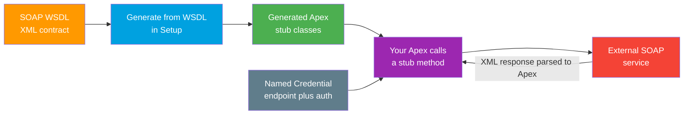

# 04 - SOAP Callouts (WSDL2Apex)

> **One-liner**: Point Salesforce at a SOAP service's **WSDL**, let it generate **Apex stub classes**, then call the generated methods to invoke the external SOAP operations.
> **Direction**: Salesforce → External (outbound). **Auth**: a **Named Credential** supplies the endpoint and auth.
> **Use when**: The external system only offers **SOAP**. For new work, REST/HTTP callouts are preferred.

This is Module 05, outbound callouts. WSDL2Apex is the **SOAP** counterpart to handwritten [01-http-callouts.md](01-http-callouts.md) (REST) and low-code [03-external-services.md](03-external-services.md) (REST from Flow). The endpoint and auth still belong in a Named Credential, see [02-named-credentials-for-callouts.md](02-named-credentials-for-callouts.md) and the [Module 03 deep file](../03-Authentication/14-named-credentials-and-external-credentials.md).

---

## 1. The idea in plain English

A **WSDL** is a SOAP service's **instruction manual** written in XML. It lists every operation, the exact shape of each request and response, and where to send them. Reading that manual and hand-coding the XML by hand would be slow and error-prone.

**WSDL2Apex** is a **code generator** that reads the manual for you. You upload the WSDL in Setup, and Salesforce writes **Apex stub classes**: typed methods and objects that mirror the SOAP operations. You then call a generated method like an ordinary Apex method. Under the hood the stub builds the SOAP envelope, sends it, and parses the XML reply back into Apex objects.

So the workflow is: **upload WSDL → get generated Apex → call the stub method.** Think of it as auto-generating a typed client from a contract.

---

## 2. When to use it (and when not)

| ✅ Use WSDL2Apex when | ❌ Avoid / use something else |
|---|---|
| The external system **only** speaks **SOAP** and ships a WSDL. | The system offers **REST** → [01-http-callouts.md](01-http-callouts.md) or [03-external-services.md](03-external-services.md). |
| You want **typed** Apex stubs instead of hand-building XML. | The WSDL uses **unsupported constructs** (see gotchas) → fix the WSDL or build the envelope manually. |
| The SOAP contract is **stable** SOAP 1.1 document/literal. | A low-code team needs it in Flow → External Services (REST only; SOAP not supported there). |
| You are integrating a legacy enterprise partner. | Brand-new greenfield integration → prefer REST. |

**Real-world examples**: a legacy ERP, a bank's payment SOAP API, an older shipping or tax provider, a government web service that predates REST.

---

## 3. How it works (flow diagram)



**Walkthrough**

1. You obtain the external service's **WSDL** (the XML contract).
2. In Setup you run **Generate from WSDL**. Salesforce parses it.
3. Salesforce writes **Apex stub classes** that mirror the operations and types.
4. Your Apex calls a generated **stub method**, passing typed inputs.
5. The stub uses the **Named Credential** for the endpoint and auth, builds the SOAP envelope, and sends it.
6. The SOAP reply XML is parsed back into Apex objects you read directly.

---

## 4. The setup and code

### Generate the stubs

1. Create the **Named Credential** (and External Credential) for the SOAP endpoint and auth. See [02-named-credentials-for-callouts.md](02-named-credentials-for-callouts.md).
2. **Setup → Apex Classes → Generate from WSDL.**
3. Upload the **WSDL file** and click **Parse WSDL**.
4. Salesforce proposes one or more **Apex class names** (one per namespace in the WSDL). Adjust the names, then **Generate Apex**.
5. The generated **stub classes** appear in Apex Classes, ready to call.

### Call a generated stub method

The exact class and method names come from your WSDL. The shape is always the same: instantiate the generated service stub, point it at the Named Credential, and call the operation.

```apex
// Class and method names are generated from the WSDL.
exampleSoap.OrdersPort stub = new exampleSoap.OrdersPort();
// Endpoint and auth come from a Named Credential, never a hardcoded URL.
stub.endpoint_x = 'callout:Vendor_Soap';

try {
    // 'createOrder' is a generated method mirroring the SOAP operation.
    exampleSoap.OrderResult result = stub.createOrder('A-100', 2);
    System.debug(result.orderId);
} catch (CalloutException e) {
    // Handle SOAP faults and transport errors.
    System.debug('SOAP callout failed: ' + e.getMessage());
}
```

> **Auth note**: set `endpoint_x` to `callout:Named_Credential` so the URL and auth header are injected, exactly like a REST callout. Never hardcode the SOAP endpoint URL or credentials in the stub.

### Test coverage

The **generated stub classes need test coverage** like any Apex. Use `WebServiceMock` (the SOAP analogue of `HttpCalloutMock`) with `Test.setMock` to return a canned response, since real callouts are not allowed in tests. See [07-callout-limits-and-testing.md](07-callout-limits-and-testing.md).

---

## 5. Design considerations and gotchas

| Consideration | Why it matters | What to do |
|---|---|---|
| **Unsupported WSDL constructs** | WSDL2Apex supports **document/literal SOAP 1.1** only. **SOAP 1.2**, RPC/encoded, multiple `portType`s, multiple bindings, multiple services, and external schema imports fail to import. | Edit the WSDL to a single binding/portType, or hand-build the SOAP envelope with [HTTP callouts](01-http-callouts.md). |
| **1 million character limit** | Generation fails if the resulting classes exceed the **1,000,000-character** Apex class limit. | Trim the WSDL to needed operations, or split into multiple classes. |
| **Whole-WSDL import** | You import the entire WSDL even if you need one operation. | Prune the WSDL before generating if it is large. |
| **Regenerate on contract change** | If the SOAP contract changes, the stubs go stale. | Re-run Generate from WSDL and re-test. |
| **SOAP faults** | Errors arrive as SOAP fault XML, surfaced as exceptions. | Wrap calls in try/catch on `CalloutException`; inspect the fault. |
| **Hardcoded endpoint/secret** | Putting the URL or credentials in the stub leaks secrets and breaks portability. | Set `endpoint_x = 'callout:Name'`; keep auth in the Named Credential. |
| **Same callout limits as REST** | SOAP callouts count against the same governor limits. | Respect **100 callouts per transaction**; no DML before the callout. |
| **Status: legacy-leaning** | SOAP is maintained, but REST is preferred for new work. | Default to REST/HTTP; use WSDL2Apex only when the partner is SOAP-only. |

---

## 6. Interview Q&A

**Q: How do you call an external SOAP service from Apex?**
A: Use **WSDL2Apex**: in Setup, **Apex Classes → Generate from WSDL**, upload the WSDL, and Salesforce generates **Apex stub classes**. You then call a generated method, setting `endpoint_x` to `callout:Named_Credential` so the URL and auth come from a Named Credential.

**Q: What WSDL constructs does WSDL2Apex not support?**
A: It supports **document/literal SOAP 1.1** only. It cannot import **SOAP 1.2**, RPC/encoded services, WSDLs with **multiple portTypes, bindings, or services**, or WSDLs that import **external schemas**. You either edit the WSDL to a single binding/portType or build the SOAP envelope manually.

**Q: Is there a size limit on generated classes?**
A: Yes. Generation fails if the resulting Apex exceeds the **1,000,000-character** per-class limit. Trim the WSDL to the operations you need or split into multiple classes.

**Q: How do you handle authentication for a SOAP callout?**
A: The same way as REST. Set the stub's `endpoint_x` to `callout:Named_Credential` so Salesforce injects the endpoint and auth header. Secrets stay in the External Credential, never in the stub.

**Q: REST or SOAP for a new integration, and why?**
A: **REST/HTTP** for new work: it is lighter, JSON-based, and supported by External Services for low-code. Use **WSDL2Apex/SOAP** only when the external system offers nothing but SOAP, typically a legacy enterprise partner.

**Talking point to explain it to anyone**: "A WSDL is the SOAP service's instruction manual. Salesforce reads the manual and writes the client code for you. You just call the generated method, and the address and password stay locked in a Named Credential."

---

## 7. Key terms

WSDL, WSDL2Apex, SOAP, stub class, SOAP fault, `WebServiceMock`, Named Credential - defined in [Module 01 vocabulary](../01-Fundamentals/02-core-vocabulary.md) and the [README](README.md). For the auth object behind the endpoint, see [02-named-credentials-for-callouts.md](02-named-credentials-for-callouts.md) and the [Module 03 deep file](../03-Authentication/14-named-credentials-and-external-credentials.md).

---

## Sources (Verified June 2026)

- [SOAP Services: Defining a Class from a WSDL Document — Apex Developer Guide](https://developer.salesforce.com/docs/atlas.en-us.apexcode.meta/apexcode/apex_callouts_wsdl2apex.htm)
- [Understanding the Generated Code (WSDL2Apex) — Apex Developer Guide](https://developer.salesforce.com/docs/atlas.en-us.apexcode.meta/apexcode/apex_callouts_wsdl2apex_gen_code.htm)
- [Create an Apex Class from a WSDL — Salesforce Help](https://help.salesforce.com/s/articleView?id=sf.code_wsdl_to_package.htm&type=5)
- [Testing Web Service Callouts (WebServiceMock) — Apex Developer Guide](https://developer.salesforce.com/docs/atlas.en-us.apexcode.meta/apexcode/apex_callouts_wsdl2apex_testing.htm)

---

*Next: [05-asynchronous-callouts.md](05-asynchronous-callouts.md) - making callouts from triggers and async contexts without hitting the DML-then-callout wall.*
