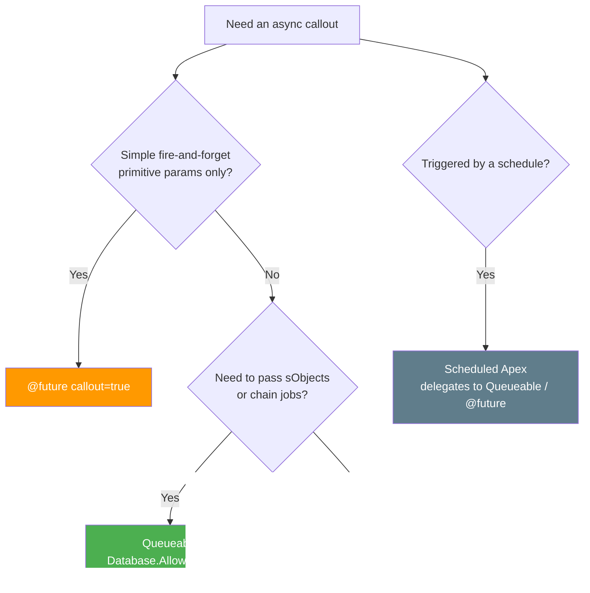

# 05 - Asynchronous Callouts

> **One-liner**: Run the callout **off the main thread** so it does not block the user, can fire from a trigger, and can run **after** DML.
> **Direction**: Salesforce → External (outbound). **Timing**: Asynchronous (later, separate transaction).
> **Use when**: You need a callout but cannot make it synchronously, or the work is too slow to make the user wait.

This is Module 05, outbound callouts. The callout mechanics are in [01-http-callouts.md](01-http-callouts.md). The auth object is [Module 03 - Named Credentials](../03-Authentication/14-named-credentials-and-external-credentials.md). For a slow callout from a Lightning screen, see [06-continuation-pattern.md](06-continuation-pattern.md).

---

## 1. The idea in plain English

A synchronous callout is making a phone call **while the customer waits at your desk**. An asynchronous callout is taking their number and **calling them back later**, after they have walked away. The customer is not stuck watching you dial.

There are three reasons you are forced to call back later instead of calling now:

1. **You cannot call out after uncommitted DML.** Once your transaction has changed data but not committed, Salesforce blocks the callout with `You have uncommitted work pending`. Save now, call later.
2. **Triggers cannot call out directly.** A trigger runs inside the DML transaction, so any callout from a trigger **must** be handed to an async context.
3. **Long work should not block a user or a transaction.** A 60-second callout freezing a save is bad UX and risks the [concurrent long-running request limit](07-callout-limits-and-testing.md).

So you move the callout to its own transaction that runs in the background.

---

## 2. When to use it (and when not)

| ✅ Use it when | ❌ Avoid / use something else |
|---|---|
| You must call out **from a trigger**. | A fast call with no DML before it → sync [01-http-callouts.md](01-http-callouts.md). |
| You need a callout **after DML** in the same flow. | A user is at a screen waiting on a slow API → [06-continuation-pattern.md](06-continuation-pattern.md). |
| The work is **slow** and the user should not wait. | You need the result **immediately** to continue. |
| You are processing **many records** that each call out. | The external system cannot handle background bursts. |

**Real-world examples**: a trigger on Order syncs to an ERP after insert, a Lead trigger enriches data via a third-party API, a nightly batch pushes thousands of records to a warehouse.

---

## 3. The options and how to choose

Salesforce gives you four async entry points. Three can call out directly. One cannot.



| Option | Mark it for callouts | Can pass | Chainable | Monitorable | Best for |
|---|---|---|---|---|---|
| **`@future(callout=true)`** | annotation param | **primitives only** | No | No (just an Id) | Simple, single, fire-and-forget callout |
| **Queueable** | implement `Database.AllowsCallouts` | sObjects, objects | **Yes** | **Yes** (AsyncApexJob) | The modern default. Most callouts |
| **Batch Apex** | implement `Database.AllowsCallouts` | a scope of records | Via Finish | **Yes** | Bulk: callout per batch of records |
| **Scheduled Apex** | **cannot call out directly** | n/a | n/a | Yes | Delegate to Queueable/`@future` to call out |

**The short rule**: reach for **Queueable** first. Salesforce officially recommends Queueable over `@future` because it can take rich types, be chained, and be tracked through the `AsyncApexJob` object. Use `@future` only for the simplest case. Use **Batch** when you are calling out across a large data volume. Never try to call out straight from a `Schedulable` - schedule a job that **enqueues** a Queueable.

---

## 4. The actual code

**Queueable with a callout (the preferred pattern)**

```apex
public class OrderSyncQueueable implements Queueable, Database.AllowsCallouts {
    private List<Order> orders; // Queueable can carry sObjects

    public OrderSyncQueueable(List<Order> orders) {
        this.orders = orders;
    }

    public void execute(QueueableContext ctx) {
        for (Order o : orders) {
            HttpRequest req = new HttpRequest();
            req.setEndpoint('callout:ERP_System/orders'); // URL + auth from Named Credential
            req.setMethod('POST');
            req.setHeader('Content-Type', 'application/json');
            req.setBody(JSON.serialize(o));
            req.setTimeout(120000); // ms, max 120s

            HttpResponse res = new Http().send(req);
            if (res.getStatusCode() != 200) {
                // log, flag the record, or chain a retry job
            }
        }
    }
}
```

**Enqueue it from a trigger handler (callout after the trigger, not inside it)**

```apex
// In an after-insert trigger handler:
System.enqueueJob(new OrderSyncQueueable(Trigger.new));
```

**The `@future` shape (primitives only, no return)**

```apex
public class LeadEnricher {
    @future(callout=true)
    public static void enrich(Set<Id> leadIds) { // primitive/collection of primitives only
        // build and send the HttpRequest here
    }
}
```

> **Auth**: every async callout still authenticates with a **Named Credential**. Never hardcode a secret. See [Module 03](../03-Authentication/14-named-credentials-and-external-credentials.md).

---

## 5. Design considerations and gotchas

| Consideration | Why it matters | What to do |
|---|---|---|
| **`@future` is limited** | No sObjects, no return value, hard to monitor, cannot chain. | Prefer **Queueable** for anything beyond the trivial. |
| **Callout chain depth** | A Queueable that calls out can only chain to a limited depth of jobs that also call out. | Do not build deep retry chains of calling-out jobs. Use a finite backoff. |
| **Scheduled Apex cannot call out** | Calling out from `execute(SchedulableContext)` throws. | Have the scheduled job **enqueue** a Queueable that does the callout. |
| **`@future` limit per transaction** | A cap on future invocations per transaction. | Bulkify: pass a `Set<Id>`, do not call `@future` per record in a loop. |
| **No ordering guarantee** | Async jobs run when the platform schedules them. | Do not assume order across separate enqueues. Chain if order matters. |
| **Still bound by callout limits** | Async raises **size** limits but the **100 callouts/transaction** cap still applies. | Bulkify inside the job. See [07-callout-limits-and-testing.md](07-callout-limits-and-testing.md). |
| **Testing async callouts** | Real callouts are blocked in tests; async runs at `stopTest`. | Mock with `HttpCalloutMock` and wrap in `Test.startTest()/stopTest()`. |

---

## 6. Interview Q&A

**Q: Why can't you make a callout after DML in the same transaction?**
A: An uncommitted DML opens a database transaction, and Salesforce will not let you hold that open across a callout. You get `You have uncommitted work pending`. Either call out before any DML, or move the callout to an asynchronous context that runs in its own transaction.

**Q: How do you call out from a trigger?**
A: You cannot call out directly inside a trigger. Hand the work to an async context - enqueue a **Queueable** (implementing `Database.AllowsCallouts`) or call a `@future(callout=true)` method from the trigger handler.

**Q: Queueable vs @future for callouts - which and why?**
A: Queueable. It accepts sObjects and complex types, is chainable, and is monitorable through `AsyncApexJob`. `@future` only takes primitives, returns nothing, and cannot be tracked or chained. Salesforce officially recommends Queueable over future methods.

**Q: Can Scheduled Apex make a callout?**
A: Not directly. The `Schedulable.execute` method cannot perform a callout. The pattern is to have the scheduled class enqueue a Queueable (or call a `@future(callout=true)` method) that performs the actual callout.

**Q: What do you implement to allow callouts in a Queueable or Batch class?**
A: The marker interface **`Database.AllowsCallouts`**. It has no methods - it just signals to the platform that callouts are permitted in that async job.

**Talking point to explain it to anyone**: "Instead of making the customer wait while I dial, I take their number and call them back. That is async - the callout runs in the background, so the save finishes fast and a trigger can still reach the outside world."

---

## 7. Key terms

Asynchronous, `@future`, Queueable, `Database.AllowsCallouts`, Batch Apex, Scheduled Apex, `AsyncApexJob`, uncommitted DML - defined in [Module 01 vocabulary](../01-Fundamentals/02-core-vocabulary.md) and the [README](README.md).

---

## Sources (Verified June 2026)

- [Asynchronous Apex - Apex Developer Guide (v66.0)](https://developer.salesforce.com/docs/atlas.en-us.apexcode.meta/apexcode/apex_async_overview.htm)
- [Queueable Apex - Apex Developer Guide](https://developer.salesforce.com/docs/atlas.en-us.apexcode.meta/apexcode/apex_queueing_jobs.htm)
- [Invoking Callouts Using Apex - Apex Developer Guide](https://developer.salesforce.com/docs/atlas.en-us.apexcode.meta/apexcode/apex_callouts.htm)
- [Queueable Apex: More Than an @future - Salesforce Developers Blog](https://developer.salesforce.com/blogs/developer-relations/2015/05/queueable-apex-future)

---

*Next: [06-continuation-pattern.md](06-continuation-pattern.md) - making a long-running callout from a Lightning screen without blocking the user.*
